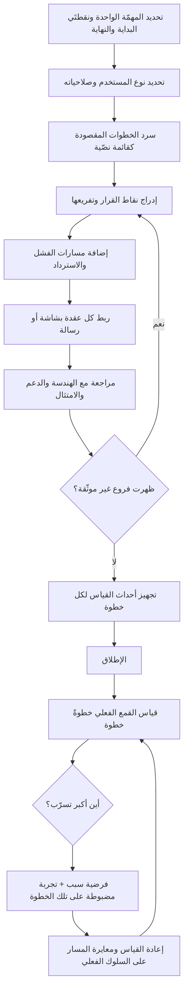

# مسار المستخدم (User Flow)

> [!info] تعريف مختصر
> تمثيل مخطَّط لتسلسل الخطوات والشاشات وقرارات التفرّع التي يمرّ بها المستخدم **داخل النظام** لإنجاز مهمّة واحدة محدَّدة، من نقطة الدخول إلى نقطة الاكتمال أو الفشل. يجيب عن سؤال دقيق: ما الشاشات المطلوبة؟ وبأي ترتيب؟ وأين تتفرّع الحالات؟ وماذا يحدث عند كل تفرّع؟ ونطاقه محدود عمدًا — يبدأ عند حدود المنتج وينتهي عندها، ولا يتناول مشاعر المستخدم ولا ما جرى له قبل الدخول ولا في قنوات أخرى. وهذا الحدّ بالذات هو ما يميّزه عن [[User Journey Map|خريطة رحلة المستخدم]] ويجعل الخلط بينهما خطأً شائعًا ومكلفًا.

## الشرح العلمي والاحترافي
- **الفرق الجوهري عن [[User Journey Map|خريطة رحلة المستخدم]] — التمييز الأهم في هذا المصطلح**: مسار المستخدم **يصف النظام**، وخريطة الرحلة **تصف التجربة الإنسانية الكاملة**. المسار وحدته الشاشة والخطوة والشرط المنطقي، ونطاقه جلسة واحدة داخل منتج واحد، ومخرجه مخطّط تنفيذي يبني عليه المصمّم والمطوّر مباشرة، ومالكه عمليًّا فريق المنتج والتصميم. أمّا الرحلة فوحدتها المرحلة ونقطة التماس، ونطاقها يمتدّ عبر أيام أو أشهر وعبر قنوات متعدّدة (إعلان، مكالمة، فرع، تطبيق، فاتورة، دعم)، وتتضمّن أبعادًا لا وجود لها في المسار إطلاقًا: المشاعر، والتوقّعات، ونقاط الألم، والأطراف غير الرقمية. الرحلة تكشف **أين المشكلة في التجربة الكلّية**، والمسار يحلّ **كيف تُنفَّذ خطوة بعينها داخل المنتج**. من يرسم مسارًا وهو يظنّه رحلة يفقد رؤية أن سبب فشل الخدمة قد يكون مكالمة مركز الاتصال أو رسالة نصّية مربكة، لا الشاشة. ومن يرسم رحلة وهو يظنّها مسارًا يخرج بوثيقة استراتيجية جميلة لا يستطيع المطوّر أن يبني منها شاشة واحدة.
- **ثلاث درجات متمايزة داخل عائلة المسارات**: **مسار المهمّة (Task Flow)** يفترض مستخدمًا واحدًا نمطيًّا يؤدّي مهمّة واحدة بلا تفرّعات — خطّي وبسيط. **مسار المستخدم (User Flow)** يضيف نقاط القرار والتفرّعات والحالات المختلفة بحسب سياق المستخدم وصلاحياته. **مسار الشاشات (Wireflow)** يدمج المخطّط بصور [[Wireframe|الأطر السلكية]] الفعلية فيصير كل صندوق شاشة مرئية. الترقّي بينها تدريجي، والخلط في التسمية يسبّب توقّعات خاطئة عن مستوى التفصيل المطلوب.
- **قيمته الحقيقية في كشف التفرّعات لا في رسم الخطّ المستقيم**: الخطّ المستقيم من الدخول إلى النجاح معروف للجميع مسبقًا، ولا يحتاج مخطّطًا. القيمة كلها في **نقاط القرار**: هل المستخدم مسجّل الدخول؟ هل لديه صلاحية؟ هل البيانات مكتملة؟ هل الدفع نجح؟ هل الاتصال انقطع في المنتصف؟ كل معيّن قرار في المخطّط يولّد فرعًا يحتاج شاشة أو رسالة أو إجراء استرداد. عدّ هذه التفرّعات هو أسرع وسيلة لتقدير حجم العمل الحقيقي، وغيابها هو السبب المتكرّر لانفجار النطاق في منتصف التطوير.
- **يجب أن يشمل مسارات الفشل والاسترداد**: [[Happy Path|المسار السعيد]] عادةً أقلّ من نصف العمل. المسار المهني يوثّق: ماذا يحدث عند رفض الدفع؟ عند انتهاء الجلسة؟ عند إغلاق التطبيق في منتصف الخطوة؟ عند رجوع المستخدم بزرّ الرجوع؟ عند إعادة المحاولة؟ وهذه ليست [[Edge Cases|حالات حديّة]] نادرة في كثير من المنتجات، بل نسبة معتبرة من حركة الاستخدام الفعلية.
- **المسار المقصود مقابل المسار الفعلي**: المخطّط الذي يرسمه الفريق هو المسار **المقصود**، أما ما يفعله المستخدمون فعلًا فيُستخرج من بيانات [[Product Analytics|تحليلات المنتج]] (تحليل القمع والمسارات). والفجوة بين الاثنين هي المعلومة الأثمن: خطوات يتخطّاها الناس، ودورات رجوع متكرّرة، ونقاط تسرّب لم تكن متوقّعة. الفريق الناضج يرسم المسار المقصود ثم **يعاير المخطّط على السلوك المرصود** بدل التمسّك بالتصميم الأصلي.
- **أداة قياس مباشرة للتسرّب**: تحويل كل خطوة في المسار إلى مرحلة في قمع قابل للقياس يجعل النزيف مرئيًّا رقميًّا. وهنا يتقاطع المسار مع [[Retention|الاحتفاظ]] و[[Churn|الفقدان]]: كثير من الفقدان المبكّر لا سببه المنتج نفسه بل خطوة واحدة عالقة في مسار التهيئة الأولى، ولا تُكتشف إلّا حين يُقاس المسار خطوةً خطوة.
- **أصله وسياقه**: المخطّط مستعار من تقاليد مخطّطات التدفّق (Flowcharts) في هندسة النظم وتحليل العمليات، بأعرافها المستقرّة: مستطيل للخطوة، ومعيّن للقرار، وسهم للانتقال. ما أضافته ممارسة تصميم تجربة المستخدم هو تحويل زاوية النظر من «ما تفعله الآلة» إلى «ما يفعله الإنسان وما يراه»، مع الالتزام بالمنطق الشرطي نفسه.
- **المسار وثيقة تفاوضية بين المنتج والهندسة**: كثير من الخلافات حول التقدير والنطاق تُحسم أمام مخطّط المسار لأنه يجعل الاتفاق والاختلاف مرئيَّين. حذف فرع واحد قرار نطاق واضح يمكن تسجيله في [[Out of Scope|خارج النطاق]]، بينما حذف السطر نفسه من وثيقة نصّية يمرّ دون أن ينتبه أحد.

## أين ومتى يُستخدم
- **قبل رسم [[Wireframe|الأطر السلكية]] مباشرة**: المسار يحدّد عدد الشاشات المطلوبة ووظيفة كلٍّ منها، فلا تُرسم شاشات زائدة ولا تُنسى شاشات لازمة.
- **في تقدير الجهد وتحديد النطاق**: عدّ التفرّعات والشاشات يعطي تقديرًا أدقّ بكثير من الوصف النصّي، ويقلّص [[Estimation Variance|تباين التقديرات]].
- **في تحويل [[PRD|وثيقة المتطلّبات]] إلى بنود قابلة للتنفيذ**: كل فرع في المخطّط يصير قصّة أو مهمّة قابلة للتقدير والاختبار.
- **في كتابة حالات الاختبار**: كل مسار في المخطّط حالة اختبار محتملة، ويتقاطع مباشرة مع صياغة [[Given When Then|السيناريوهات]] وتغطية [[Regression Testing|اختبار الانحدار]].
- **في تشخيص التسرّب بعد الإطلاق**: مقارنة المسار المقصود بقمع الاستخدام الفعلي تحدّد الخطوة التي تُفقَد عندها النسبة الأكبر.
- **في تصميم تجارب [[AB Testing|اختبار A/B]]**: أفضل مواضع التجريب هي الخطوات ذات التسرّب الأعلى في المسار، لا أي شاشة عشوائية.
- **في التوثيق التشغيلي والدعم**: فريق الدعم يحتاج المسار ليعرف أين يقف العميل بالضبط حين يصف مشكلته.
- **في مراجعة الامتثال والحوكمة**: مسارات الموافقات والصلاحيات و[[KYC|التحقّق من الهوية]] تحتاج توثيقًا صريحًا لنقاط القرار.

## مثال وسيناريو تطبيقي
> [!example] تطبيق سعودي لتوصيل الطلبات. الشكوى المتكرّرة: «كثير من المستخدمين يسجّلون ولا يُتمّون أول طلب». الوثيقة الأصلية وصفت المسار في ثلاث خطوات: تسجيل → اختيار مطعم → دفع.
> **عند رسم المسار الفعلي بتفرّعاته ظهرت 11 خطوة و7 نقاط قرار**: تسجيل برقم الجوال → إدخال رمز التحقّق → **قرار: هل وصل الرمز؟** (فرع إعادة الإرسال بعد 60 ثانية) → طلب إذن الموقع → **قرار: هل مُنح الإذن؟** (فرع إدخال العنوان يدويًّا) → **قرار: هل يوجد مطاعم تخدم هذا الحيّ؟** (فرع الحالة الفارغة) → اختيار مطعم → السلّة → **قرار: هل بلغت السلّة الحدّ الأدنى للطلب؟** (فرع رسالة النقص) → اختيار طريقة الدفع → **قرار: هل نجح الدفع؟** (فرع الفشل وإعادة المحاولة) → تأكيد.
> **قياس القمع على البيانات الفعلية لمدّة أسبوعين (10,000 مسجّل جديد)** أعطى: 10,000 بدأوا → 8,900 أدخلوا الرمز → 8,700 وصلوا لطلب إذن الموقع → **5,200 فقط تجاوزوا خطوة الموقع** → 4,950 رأوا قائمة مطاعم → 3,100 أضافوا للسلّة → 2,050 وصلوا للدفع → 1,780 أتمّوا الطلب.
> **الاكتشاف**: أكبر تسرّب مفرد — **3,500 مستخدم (40% من الواصلين)** — تبخّر عند خطوة واحدة: طلب إذن الموقع، الذي كان يُطلب **قبل** أن يرى المستخدم أي مطعم أو أي قيمة، وبرسالة نظام جافّة بلا تفسير. ومن رفض الإذن كان يُدفع إلى شاشة عنوان يدوية تطلب الحيّ والشارع ورقم المبنى — وهي بيانات لا يعرفها كثيرون عن ظهر قلب.
> **لم تكن هذه الخطوة في الوثيقة الأصلية إطلاقًا**، لأن الوصف النصّي «تسجيل → اختيار مطعم» ابتلعها بصمت.
> **التغييرات**: تأجيل طلب الإذن إلى ما بعد عرض قائمة مطاعم افتراضية للمدينة، وإضافة شاشة تمهيدية تشرح سبب الطلب في سطر واحد، وتبسيط الإدخال اليدوي إلى اختيار من خريطة بدل الحقول النصّية.
> **النتيجة بعد مجموعتين زمنيتين**: عبور خطوة الموقع ارتفع من 60% إلى **82%**، وإتمام الطلب الأول من 17.8% إلى **26.4%** من المسجّلين. لم تُضَف ميزة واحدة؛ أُعيد ترتيب مسار فقط — وهو ما لم يكن ممكنًا رؤيته قبل أن يُرسم المسار بتفرّعاته ويُقاس خطوةً خطوة.

## خطوات أو مخطّط
1. تحديد **المهمّة الواحدة** التي يصفها المسار بدقّة، ونقطة البداية ونقطة النهاية (نجاحًا وفشلًا).
2. تحديد نوع المستخدم وصلاحياته وسياقه — فالمسار يختلف بين مستخدم جديد وعائد، وبين مالك حساب وموظّف فيه.
3. سرد الخطوات بالتسلسل المقصود أولًا كقائمة نصّية بسيطة قبل أي رسم.
4. إدراج **نقاط القرار** بصيغة سؤال ثنائي أو متعدّد الإجابات، وتحديد ما يحدث في كل فرع بلا استثناء.
5. إضافة مسارات الفشل والاسترداد: الرجوع، انتهاء الجلسة، انقطاع الاتصال، فشل الدفع، رفض الصلاحية.
6. تحديد الشاشة أو الرسالة المطلوبة لكل عقدة، وربطها بـ[[Wireframe|الإطار السلكي]] المقابل حين يُرسم.
7. مراجعة المخطّط مع الهندسة والدعم والامتثال لاكتشاف الفروع غير المرئية من زاوية المنتج وحدها.
8. تحويل كل خطوة إلى حدث قابل للقياس في [[Product Analytics|تحليلات المنتج]] قبل الإطلاق لا بعده.
9. بعد الإطلاق: مقارنة المسار المقصود بالسلوك الفعلي، وتحديد أكبر خطوة تسرّب.
10. توجيه التحسين والتجريب إلى تلك الخطوة تحديدًا، ثم إعادة القياس.

## ⚠️ مفاهيم خاطئة شائعة
> [!warning]
> - **الخلط بينه وبين [[User Journey Map|خريطة رحلة المستخدم]]**: المسار محصور **داخل النظام** ووحدته الشاشة والقرار المنطقي، والرحلة تمتدّ عبر الزمن والقنوات وتتضمّن المشاعر والتوقّعات ونقاط التماس غير الرقمية. **التصحيح**: استخدم الرحلة لاكتشاف **أين** تقع المشكلة في التجربة الكلّية، ثم استخدم المسار لتصميم **كيف** تُحلّ داخل المنتج. وجودهما معًا مكمّل لا مكرّر.
> - **«المسار هو الخطّ المستقيم للمسار السعيد»**: هذه أقلّ أجزائه فائدة وأكثرها بداهة. **التصحيح**: اجعل معيار جودة المخطّط هو عدد نقاط القرار وفروع الفشل المغطّاة، لا أناقة الخطّ الرئيسي.
> - **«يكفي وصف المسار نصًّا في وثيقة المتطلّبات»**: النصّ يبتلع التفرّعات بصمت — عبارة «ثم يختار المطعم» قد تخفي ثلاث شاشات وقرارين. **التصحيح**: ارسمه؛ الرسم يفرض الإجابة عن كل فرع لأنه لا يحتمل السهم المعلَّق.
> - **«المسار المرسوم هو ما يفعله المستخدمون»**: المخطّط يمثّل النيّة لا الواقع، والفجوة بينهما غالبًا كبيرة. **التصحيح**: عاير المخطّط على بيانات القمع الفعلية دوريًّا، وعدّل المقصود حين يخالفه المرصود بإصرار.
> - **«مسار واحد يكفي للمنتج»**: لكل مهمّة رئيسية مسارها، ولكل نوع مستخدم فروقه. **التصحيح**: ارسم مسارات المهامّ عالية القيمة أو عالية التسرّب فقط، ولا تحاول تغطية المنتج كله.
> - **«رسم المسار مسؤولية المصمّم وحده»**: الفروع المتعلّقة بالصلاحيات والدفع والامتثال والحالات التقنية لا تُرى إلّا من زوايا أخرى. **التصحيح**: أدرْه كجلسة قصيرة مشتركة، فالكشف المبكّر لفرع منسيّ أرخص من اكتشافه في الاختبار.
> - **«المسار يوثَّق مرّة واحدة عند البناء»**: كل ميزة جديدة تضيف فرعًا، والمخطّط القديم يصير مضلّلًا سريعًا. **التصحيح**: اربط تحديث المسار بـ[[Definition of Done|تعريف الاكتمال]] لأي تغيير يمسّه، أو أعلن انتهاء صلاحيته صراحةً.

## ❌ ممارسات خاطئة في المشاريع
> [!failure]
> - **الخطأ: رسم المسار السعيد فقط وترك الفروع للمطوّر أثناء البرمجة** → **لماذا يضرّ**: تُتّخذ عشرات القرارات التجريبية بلا اتّساق، فتتناقض رسائل الخطأ وسلوك الرجوع بين الشاشات، ويتضخّم النطاق فجأة في منتصف السبرنت → **الحل**: اشترط في [[Definition of Ready|تعريف الجاهزية]] تغطية فروع الفشل والاسترداد قبل دخول البند إلى التطوير.
> - **الخطأ: تسمية خريطة رحلة العميل «مسار مستخدم» وتسليمها للهندسة** → **لماذا يضرّ**: الهندسة لا تجد فيها شاشات ولا شروطًا فتضطرّ إلى تأليف المسار بنفسها، وتضيع الرؤية الاستراتيجية للرحلة في الوقت نفسه → **الحل**: افصل المخرَجين بوضوح: رحلة لاكتشاف المشكلة عبر القنوات، ومسار لتنفيذ الحلّ داخل المنتج، ولكلٍّ منهما مالك وجمهور مختلفان.
> - **الخطأ: عدم تجهيز أحداث القياس لخطوات المسار قبل الإطلاق** → **لماذا يضرّ**: يُطلق المنتج ثم يُكتشف أن تحديد خطوة التسرّب مستحيل بلا إصدار جديد، فيُهدر شهر كامل في انتظار البيانات → **الحل**: اجعل خطّة القياس جزءًا من بند العمل نفسه، بحيث لا يُعتبر مكتملًا ما لم تكن كل خطوة قابلة للقياس.
> - **الخطأ: تعقيد المخطّط حتى يصير غير مقروء (عشرات العقد في صفحة واحدة)** → **لماذا يضرّ**: يفقد وظيفته كأداة تواصل، فلا يقرؤه أحد ويعود الفريق إلى الوصف الشفهي → **الحل**: قسّمه إلى مسارات فرعية بمستويات، وأبقِ المستوى الأعلى في حدود ما يُقرأ في دقيقة.
> - **الخطأ: إهمال مسار المستخدم العائد والاكتفاء بالجديد** → **لماذا يضرّ**: يُصمَّم المنتج لأول تجربة فقط، فتُثقل خطوات التهيئة تجربة من يستعمله يوميًّا وتتراكم كلفة صغيرة متكرّرة تدفع نحو [[Churn|الفقدان]] → **الحل**: ارسم مسارًا منفصلًا للمستخدم العائد وقِس تكلفته الزمنية بعدد النقرات والثواني.
> - **الخطأ: تجاهل مسار الخروج والإلغاء عمدًا** → **لماذا يضرّ**: يُترك المستخدم في طريق مسدود فيتحوّل الإحباط إلى تقييم سلبي علني، وتضيع فرصة جمع سبب الانسحاب → **الحل**: صمّم مسار الخروج بعناية مساوية للدخول، واجعله نقطة جمع بيانات وعرض بدائل حقيقية.
> - **الخطأ: افتراض اتجاه القراءة اللاتيني عند رسم المسار للواجهات العربية** → **لماذا يضرّ**: تتناقض مواضع أزرار التقدّم والرجوع مع توقّع المستخدم فترتفع الأخطاء، ويصعب تصحيح ذلك بعد ترسّخه عبر الشاشات → **الحل**: اعتمد اتجاه [[RTL]] منذ رسم المسار نفسه لا عند التنفيذ، وتعامل معه كقرار بنيوي.
> - **الخطأ: التمسّك بالمسار المقصود رغم مخالفة البيانات له** → **لماذا يضرّ**: يُصرف الجهد في «تعليم المستخدم الطريقة الصحيحة» بدل تبنّي الطريقة التي يسلكها فعلًا، وهي معركة خاسرة غالبًا → **الحل**: اعتبر السلوك المرصود بيانات لا انحرافًا، وأعد تصميم المسار حوله ما لم يكن هناك سبب امتثالي أو أمني يمنع.

## 🔗 مصطلحات ومفاهيم ذات صلة
[[User Journey Map]] | [[Wireframe]] | [[AB Testing]] | [[Retention]] | [[Churn]] | [[Product Analytics]] | [[Happy Path]] | [[Edge Cases]] | [[Given When Then]] | [[PRD]] | [[Prototype]] | [[RTL]] | [[Definition of Ready]] | [[Out of Scope]] | [[UX vs CX]]
