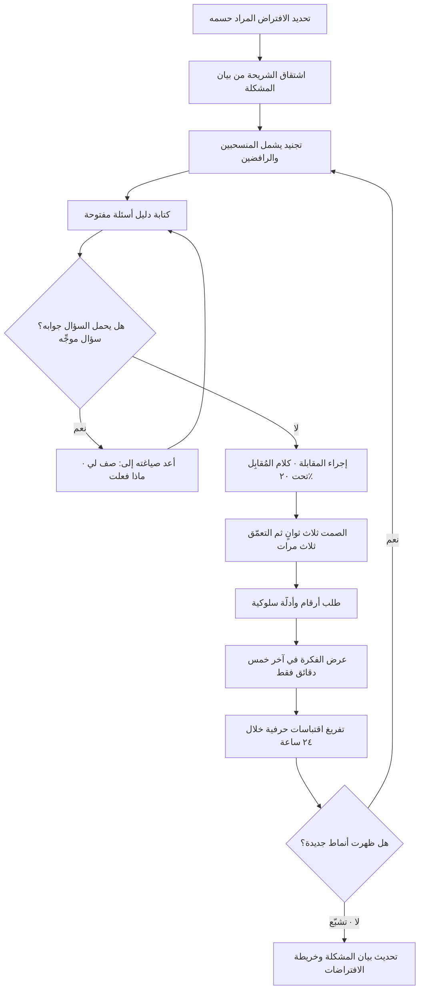

# مقابلة المستخدم (User Interview)

> [!info] تعريف مختصر
> جلسة استماع منظَّمة، فردية غالبًا، هدفها استخراج **سلوك وقع فعلًا** في ماضي المستخدم — ما فعله، متى، وكم كلّفه، وبمَ استعان — لا استطلاع رأيه في فكرة ولا عرض منتج عليه. المقابلة ليست جلسة بيع، ولا اختبار قابلية استخدام، ولا مجلس اقتراحات. ما يميّز المقابلة الجيّدة عن الرديئة ليس عدد الأسئلة بل نوعها: الجيّدة تسأل عن الماضي المحدّد والملموس، والرديئة تسأل عن المستقبل والافتراض والرأي — فتُنتج إجابات مهذّبة لا تتنبّأ بشيء.

## الشرح العلمي والاحترافي
- **قاعدة الماضي لا المستقبل**: الإنسان راوٍ ضعيف لنواياه المستقبلية وراوٍ أفضل بكثير لسلوكه الماضي. سؤال «هل ستستخدم ميزة كهذه؟» يستدعي تخيّلًا مجاملًا؛ وسؤال «متى آخر مرة واجهت هذا الموقف؟ ماذا فعلت حينها بالضبط؟» يستدعي ذاكرة. لذلك تُبنى المقابلة على استرجاع وقائع مؤرّخة قريبة، ويُفضَّل أن يكون الحدث خلال أسابيع قليلة ماضية ليكون السرد قابلًا للاسترجاع بتفاصيله.
- **السؤال الموجِّه (Leading Question) — أخطر أخطاء المقابلة**: هو السؤال الذي يحمل الجواب المرغوب في صياغته، فيقود المجيب إليه دون أن يشعر أحد الطرفين. أمثلته: «ألا ترى أن العملية الحالية مرهقة؟»، «كم سيوفّر عليك حل يفعل كذا؟»، «هل تعتقد أن السرعة مهمّة هنا؟». وخطورته من ثلاثة وجوه: **أولًا** أنه يُفسد البيانات دون أن يترك أثرًا مرئيًّا — الإجابة تبدو تمامًا كأي إجابة صادقة، فلا يمكن تصحيحها لاحقًا في التحليل. **ثانيًا** أنه يتضاعف مع تحيّز المُقابِل: من يذهب مقتنعًا بفكرته يصوغ أسئلته دون قصد بحيث تؤكّدها، فتعود بأدلّة كاذبة تُقرأ بوصفها تحقّقًا ([[Confirmation Bias]]). **ثالثًا** أن أثره يمتد إلى ما بعد السؤال نفسه: بمجرّد أن يفهم المجيب ما تريد سماعه، تصبح كل إجاباته اللاحقة في الجلسة متأثّرة بذلك. وله صور خفيّة أشدّ من الصريحة: **الإيماء بالرأس** عند الإجابة المرغوبة، وشرح الفكرة قبل السؤال عنها، وتقديم خيارات مغلقة تحصر الإجابة، ونبرة الحماس التي تعلن الجواب الصحيح. العلاج العملي: صِغ الأسئلة مفتوحة تبدأ بـ«صف لي…»، «ماذا حدث بعد ذلك؟»، «كيف تعاملت مع…؟»، وامنع نفسك من ذكر فكرتك حتى نهاية الجلسة، واقرأ أسئلتك قبل المقابلة سائلًا: هل يمكن استنتاج ما أتمنّى سماعه من صيغة السؤال؟
- **الصمت أداة، لا حرج**: الفجوة بعد إجابة المستخدم هي حيث يظهر أثمن ما في المقابلة. المُقابِل عديم الخبرة يملأ الصمت بسؤال جديد أو بتفسير، فيقطع الشريط في لحظته الحاسمة. القاعدة العملية: بعد كل إجابة، عدّ ثلاث ثوانٍ صامتًا قبل أن تتكلّم.
- **قاعدة التعمّق ثلاث مرات**: أول إجابة عادةً عامة ومصقولة، والثانية أكثر تحديدًا، والثالثة هي السلوك الحقيقي. سلسلة «ولماذا؟ ثم ماذا فعلت؟ ثم ماذا حدث بعدها؟» تنتقل بالحديث من الرأي إلى الواقعة. هذه السلسلة قريبة في روحها من منطق التعمّق في [[Root Cause Analysis]].
- **نسبة الكلام**: المؤشّر الأسرع لجودة المقابلة هو **من تكلّم أكثر**. القاعدة المتداولة أن يتكلّم المُقابِل أقل من 20% من الوقت. إذا شرحتَ منتجك أكثر مما استمعت، فقد أجريت عرضًا تقديميًّا وسمّيته بحثًا.
- **العدد والتشبّع**: في الأبحاث النوعية الاستكشافية، يبدأ التكرار في الأنماط عادةً بعد عدد صغير نسبيًّا من المقابلات ضمن الشريحة الواحدة، ويتوقّف الجمع عند **التشبّع** — حين تتوقّف المقابلات الجديدة عن إضافة أنماط جديدة. المهم أن التشبّع يخصّ **شريحة واحدة متجانسة**؛ فخلط ثلاث شرائح مختلفة في عشر مقابلات يعني عمليًّا ثلاث عيّنات ناقصة لا عيّنة واحدة كافية.
- **اختيار من تُقابل أهم من كيف تسأل**: مقابلة ممتازة مع الشخص الخطأ عديمة القيمة. الشريحة تُشتقّ من [[Problem Statement]]، ويُفضَّل دائمًا استهداف من مرّ بالموقف فعلًا خلال مدة قريبة. ومن أغنى المصادر: من جرّب المنتج ثم انصرف عنه، ومن اختار حلًّا منافسًا، ومن قرّر ألّا يفعل شيئًا.
- **التسجيل والتدوين والتحليل**: يُفضَّل حضور مدوِّن مع المُقابِل لتفريغه للاستماع، وتُدوَّن **الاقتباسات الحرفية** لا الخلاصات المفسَّرة، لأن التفسير المبكّر أثناء الكتابة هو أول مدخل للتحيّز. ثم تُشفَّر الملاحظات وتُجمَّع في أنماط تُغذّي [[Opportunity Solution Tree]] وتُنقّح [[Problem Statement]].
- **الجذور المنهجية**: تستند الممارسة إلى تقاليد المقابلة النوعية في العلوم الاجتماعية والإثنوغرافيا (الملاحظة في السياق الطبيعي)، وقد دخلت تطوير المنتجات عبر بحوث تجربة المستخدم ومنهجيات [[Jobs to be Done]] والاكتشاف المستمر. وقد شاع في هذا السياق كتاب **The Mom Test** لـ**Rob Fitzpatrick** كقاعدة عملية لصياغة الأسئلة (انظر [[The Mom Test]]).

## أين ومتى يُستخدم
- **قبل كتابة أي متطلّب**: للتحقّق من وجود المشكلة أصلًا وصياغتها في [[Problem Statement]] دقيق قبل الانتقال إلى [[PRD]] أو [[BRD]].
- **في اختبار افتراضات الرغبة**: بوصفها أرخص وسيلة كافية لحسم الافتراضات الواقعة في ربع الخطر من [[Assumption Mapping]] وقبل الالتزام بأي بناء.
- **في الاكتشاف المستمر**: عبر إيقاع أسبوعي ثابت من المقابلات ضمن [[Continuous Discovery]] و[[Product Discovery]]، بحيث لا يكون البحث حدثًا موسميًّا يسبق المشاريع الكبرى فقط.
- **مع المنسحبين ومع من لم يشترِ**: لفهم أسباب الانصراف الحقيقية، وهي بيانات لا تظهر في مؤشّرات الرضا ولا في [[NPS]] الذي يقيس الاتجاه العام ولا يفسّره.
- **في بناء خرائط الرحلة**: مادّةً خامًا لـ[[User Journey Map]] ولتحديد نقاط الألم ([[Pain Point]]) في مواضعها الفعلية من الرحلة لا في مواضعها المفترضة.
- **بعد الإطلاق**: لتفسير ما ترصده البيانات الكمّية؛ فالأرقام تخبرك **ماذا** يحدث، والمقابلات وحدها تخبرك **لماذا** — والاثنان معًا شرط لأي قرار سليم.

## مثال وسيناريو تطبيقي
> [!example] شركة تقنية في الرياض تبني نظام حجز مواعيد للعيادات الصغيرة. ذهب مدير المنتج إلى أول ست مقابلات ومعه عرض تقديمي من 14 شريحة. كان يبدأ كل جلسة بشرح النظام عشر دقائق ثم يسأل: «هل يبدو هذا مفيدًا لعيادتكم؟». حصل على ستّ إجابات إيجابية، وثلاثة وعود بـ«تواصل معنا الشهر القادم»، فسجّل في تقريره أن الطلب مؤكّد. بعد أربعة أشهر من البناء: صفر اشتراكات مدفوعة.
> أعاد الفريق البحث بقواعد مختلفة: لا عرض تقديمي، ولا ذكر للمنتج قبل الدقيقة الأخيرة، ونسبة كلام المُقابِل تحت 20%، والأسئلة كلها عن الماضي. السؤال الافتتاحي صار: «خذني في جولة على يوم أمس في العيادة من لحظة فتح الباب — من كان يردّ على المكالمات؟».
> ظهر في 8 من 11 مقابلة نمط لم يتوقّعه أحد: مشكلة العيادة لم تكن **تنظيم** المواعيد، بل **عدم حضور** من حجز. إحدى العيادات كانت تحجز 32 موعدًا يوميًّا ويحضر منها 19 إلى 22. وكانت الموظّفة قد ابتكرت حلًّا يدويًّا: تتّصل مساءً بمواعيد الغد وتؤكّدها واحدًا واحدًا، وتستغرق نحو 40 دقيقة يوميًّا. وحين سُئلت عن كلفة عدم الحضور، حسبها الطبيب أمامهم: كل موعد ضائع بين 150 و300 ريال.
> والأهم: سُئل ثلاثة من أصحاب العيادات عن الأنظمة التي جرّبوها سابقًا، فتبيّن أن اثنين دفعا فعلًا اشتراكًا لنظام حجز وتوقّفا بعد شهرين — لأن الموظّفة كانت تُدخل البيانات مرتين، في النظام وفي دفترها. هذه واقعة سلوكية بأثر مالي مثبت، ولا يمكن الحصول عليها من سؤال عن الرأي إطلاقًا.
> أعاد الفريق تعريف المنتج حول تأكيد الحضور الآلي وقياس نسبة عدم الحضور، وجعل الحجز ميزة مساندة لا محورًا. لاحظ أن الاكتشاف كله جاء من إزالة السؤال الموجِّه واستبداله بطلب سرد يوم فعلي.

## خطوات أو مخطّط
1. حدّد الافتراض أو السؤال البحثي الذي تريد حسمه بهذه الجولة تحديدًا — لا تدخل بلا هدف معرفي مكتوب.
2. اشتقّ الشريحة من [[Problem Statement]]، واشترط أن يكون المشارك قد مرّ بالموقف فعلًا خلال مدّة قريبة.
3. جنّد المشاركين من مصادر متنوّعة، وتعمّد إدراج المنسحبين والرافضين لا الراضين وحدهم.
4. اكتب دليل مقابلة من 6–8 أسئلة مفتوحة، ثم راجعه واحذف كل سؤال يحمل جوابه في صياغته.
5. ابدأ بسؤال سردي واسع يستدعي واقعة: «صف لي آخر مرة…».
6. اصمت بعد كل إجابة ثلاث ثوانٍ على الأقل قبل أن تتكلّم.
7. تعمّق ثلاث مرات في كل خيط مهم: لماذا؟ ثم ماذا فعلت؟ ثم ماذا حدث بعدها؟
8. اطلب أرقامًا وأدلّة سلوكية: كم مرة؟ كم استغرق؟ كم دفعت؟ أرني كيف تفعلها الآن.
9. لا تعرض فكرتك ولا منتجك إلا في آخر خمس دقائق، وبعد أن تكون قد سجّلت كل شيء.
10. اختم بطلب التزام صغير حقيقي (موعد تجربة، مقدّمة لزميل، وقت مخصّص) بدل السؤال عن النيّة.
11. فرّغ الملاحظات خلال 24 ساعة بالاقتباسات الحرفية، مع فصل الملاحظة عن تفسيرك لها.
12. جمّع الأنماط عبر المقابلات، وحدّث [[Problem Statement]] و[[Assumption Mapping]] بناءً على ما نقضته المقابلات لا ما أكّدته فقط.

## ⚠️ مفاهيم خاطئة شائعة
> [!warning]
> - **«المقابلة فرصة لعرض المنتج وجمع الانطباعات»**: خطأ. لحظة عرض المنتج تنتهي المقابلة الاستكشافية ويبدأ البيع؛ فمن تلك اللحظة تصبح كل إجابة مجاملة أو مفاوضة. إن أردت اختبار الواجهة فتلك جلسة أخرى بمنهج مختلف تمامًا.
> - **«المستخدم يعرف ما يريد فيكفي أن نسأله»**: خطأ. المستخدم خبير في **مشكلته** لا في **حلّها**؛ ولذلك تُستخرج منه الوقائع والقيود، وتبقى مسؤولية تصميم الحل على الفريق.
> - **«خمس أو عشر مقابلات عدد غير علمي»**: خطأ في تطبيق معايير البحث الكمّي على النوعي. الهدف هنا ليس تقدير نسبة في مجتمع، بل اكتشاف أنماط وآليات سببية؛ والمعيار هو التشبّع داخل شريحة متجانسة، لا حجم عيّنة إحصائي.
> - **«السؤال الموجِّه خطأ في الصياغة يمكن تصحيحه أثناء التحليل»**: خطأ. البيانات الملوّثة بالتوجيه لا تُنقّى لاحقًا، لأن الإجابة الناتجة عنها تبدو مطابقة تمامًا لإجابة صادقة. الوقاية قبل الجلسة هي العلاج الوحيد.
> - **«الإجابات الإيجابية دليل طلب»**: خطأ. المجاملة سلوك اجتماعي طبيعي، ويشتدّ في الثقافات التي تُعلي الكرم واللطف مع الضيف. الدليل الوحيد المعتبر هو ما بذله الشخص فعلًا: وقتًا، أو مالًا، أو سمعة.
> - **«المقابلات تُغني عن البيانات الكمّية»**: خطأ. المقابلات تفسّر الآلية ولا تقدّر الحجم؛ والاعتماد عليها وحدها في تقدير حجم سوق أو أولوية عامة استخدام خاطئ للأداة.

## ❌ ممارسات خاطئة في المشاريع
> [!failure]
> - **إجراء المقابلة بأسئلة موجِّهة تؤكّد الفكرة المسبقة**: الخطأ أن يُصاغ السؤال بحيث يحمل الجواب («ألا يزعجك أن العملية الحالية تأخذ وقتًا طويلًا؟»). لماذا يضرّ: يُنتج أدلّة كاذبة تبدو موضوعية، وتُستخدم لاحقًا في تبرير ميزانيات كاملة. الحل: راجعة أقران لدليل الأسئلة قبل الجولة، وقاعدة صريحة بأن كل سؤال يجب أن يبدأ باستدعاء واقعة لا باقتراح رأي.
> - **مقابلة من يسهل الوصول إليهم فقط**: الخطأ أن يُقابَل الزملاء والأصدقاء والعملاء المتحمّسون. لماذا يضرّ: عيّنة منحازة بنيويًّا تُعطي تأكيدًا لا معرفة، وتخفي تحديدًا أسباب الرفض التي تحتاجها أكثر. الحل: حصّة إلزامية في كل جولة لمن رفض أو انسحب أو اختار منافسًا.
> - **حضور مدير متحمّس للفكرة داخل الجلسة**: الخطأ أن يتدخّل مسؤول لتصحيح انطباع المستخدم أو الدفاع عن المنتج. لماذا يضرّ: تتحوّل الجلسة إلى نقاش، وينسحب المستخدم إلى المجاملة، وتُهدر المقابلة بالكامل. الحل: دور واحد للمُقابِل ودور واحد للمدوِّن، والمراقبون يستمعون فقط أو يتابعون تسجيلًا لاحقًا.
> - **تدوين الخلاصات بدل الاقتباسات**: الخطأ أن يكتب المدوِّن «العميل يريد تقارير أفضل» بدل ما قيل حرفيًّا. لماذا يضرّ: يُدرج التفسير في مرحلة الجمع فلا يمكن مراجعته أو نقضه لاحقًا، وتضيع الفروق الدقيقة التي تحمل المعنى. الحل: عمود للاقتباس الحرفي وعمود منفصل للتفسير، ومراجعة الفريق للاقتباس قبل الاستنتاج.
> - **إجراء موجة مقابلات ثم أرشفة التقرير**: الخطأ أن ينتهي البحث بمستند لا يغيّر بندًا واحدًا في الأولويات. لماذا يضرّ: يهدر الجهد ويُقنع المؤسسة بأن البحث كلفة بلا عائد، فتُلغى دورته لاحقًا. الحل: اشترط أن يُنتج كل تقرير قائمة محدّدة بما تغيّر: بيان مشكلة نُقّح، أو افتراض بطل، أو بند أُسقط من الـ Backlog.
> - **الاكتفاء بمقابلة واحدة لكل شريحة وتعميم نتيجتها**: الخطأ أن تُبنى قرارات على حالة واحدة معبّرة. لماذا يضرّ: الحالة الفردية قد تكون شاذّة تمامًا، والتعميم منها أخطر من عدم البحث لأنه يمنح ثقة زائفة. الحل: لا تُعتمد نتيجة نمطًا قبل تكرارها في عدد كافٍ من المقابلات المستقلّة داخل الشريحة نفسها.
> - **إهمال توثيق سياق المشارك**: الخطأ أن تُسجّل الإجابات دون تسجيل من قالها وفي أي ظرف وحجم منشأة ودور وظيفي. لماذا يضرّ: يستحيل لاحقًا معرفة أي الأنماط تخصّ شريحة بعينها، فتُخلط احتياجات متعارضة في منتج واحد مشوّش. الحل: بطاقة سياق موحّدة لكل مقابلة تُملأ قبل الجلسة لا بعدها.

## 🔗 مصطلحات ومفاهيم ذات صلة
[[The Mom Test]] | [[Problem Statement]] | [[Hypothesis]] | [[Assumption Mapping]] | [[Confirmation Bias]] | [[Jobs to be Done]] | [[Active Listening]] | [[Pain Point]] | [[User Journey Map]] | [[Continuous Discovery]] | [[Product Discovery]] | [[Customer and Market Validation]]
