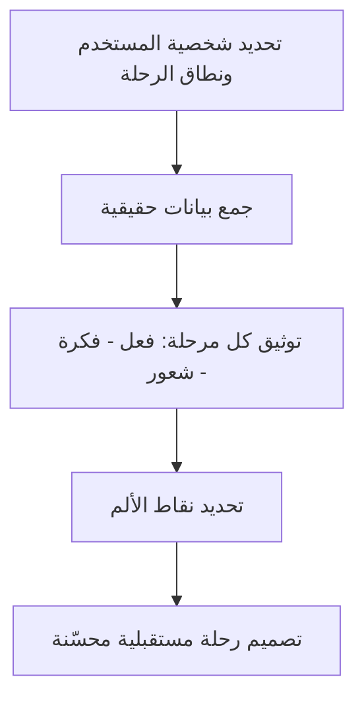

# خريطة رحلة المستخدم (User Journey Map)

> [!info] تعريف مختصر
> خريطة رحلة المستخدم (User Journey Map) هي تمثيل بصري لجميع الخطوات والتفاعلات التي يمر بها المستخدم أثناء تعامله مع منتج أو خدمة، من أول تواصل مع العلامة التجارية حتى تحقيق هدفه، مع توضيح مشاعره ونقاط الألم في كل مرحلة.

## الشرح العلمي والاحترافي
- تُبنى خريطة رحلة المستخدم عادة على شكل جدول أو مخطط أفقي، حيث يمثّل كل عمود مرحلة من رحلة المستخدم (مثل: الاكتشاف، التسجيل، الاستخدام الأول، الاستخدام المتكرر، الدعم)، وتحته صفوف توضح: ماذا يفعل المستخدم، ماذا يفكر، وماذا يشعر في كل مرحلة.
- الفائدة الأساسية هي كشف "نقاط الاحتكاك" (Friction Points) التي تسبب [[Pain Point]] للمستخدم، والتي غالباً لا يلاحظها فريق المنتج لأنه يرى النظام من الداخل بينما المستخدم يراه من الخارج بلا معرفة تقنية مسبقة.
- تفرّق خريطة الرحلة بين تجربة "الرحلة الحالية" (As-Is Journey)، التي توثّق الوضع الفعلي اليوم بمشاكله، و"الرحلة المستقبلية" (To-Be Journey)، التي تصمّم التجربة المرغوبة بعد الحل المقترح.
- تُستخدم غالباً بيانات كمية (كأوقات الاستجابة ومعدلات التسرب Drop-off Rate) وبيانات نوعية (اقتباسات حقيقية من مقابلات المستخدمين) معاً لبناء خريطة دقيقة وليست مجرد تخمين داخلي.
- ترتبط الخريطة ارتباطاً وثيقاً بالفرق بين [[UX vs CX]]؛ فبينما تركّز رحلة المستخدم غالباً على تفاعله مع المنتج الرقمي تحديداً، يمكن توسيعها لتشمل كامل رحلة العميل مع العلامة التجارية، من الإعلان وحتى خدمة ما بعد البيع.

## أين ومتى يُستخدم
- يُستخدم في مرحلة اكتشاف المنتج وتصميم تجربة المستخدم، قبل تحديد متطلبات النظام أو كتابة [[Software Requirements Specification]].
- يلجأ إليه مصممو تجربة المستخدم (UX) ومالكو المنتج عند إعادة تصميم منتج قائم يعاني من مشاكل استخدام، أو عند تصميم منتج جديد من الصفر.
- يُستخدم أيضاً في مشاريع تحسين خدمة العملاء وفرق الدعم الفني لفهم أين تحدث معظم الشكاوى والتصعيدات ضمن رحلة العميل الكاملة.

## مثال وسيناريو تطبيقي
> [!example] سيناريو ملموس في مشروع برمجي حقيقي
> فريق منتج في منصة تعليم إلكتروني يلاحظ أن 45% من الطلاب الجدد يتوقفون عن استخدام المنصة خلال أول أسبوع. يبني الفريق خريطة رحلة تغطي المراحل: التسجيل، اختيار الدورة، أول درس، أول اختبار، والمتابعة الأسبوعية.
> عبر مقابلات مع 20 طالباً، يكتشف الفريق أن أكبر [[Pain Point]] يحدث في مرحلة "اختيار الدورة"، حيث يشعر الطلاب بالإرهاق من كثرة الخيارات (أكثر من 200 دورة) دون أي توصية مخصصة، فيغادرون المنصة قبل حتى بدء أي درس.
> بناءً على هذا الاكتشاف، يصمّم الفريق ميزة "توصية دورة مخصصة" تظهر بعد استبيان قصير من ثلاثة أسئلة عند التسجيل، فترتفع نسبة إكمال أول درس من 55% إلى 78% خلال شهرين من الإطلاق.

## خطوات أو مخطّط
1. تحديد شخصية المستخدم المستهدف (Persona) ونطاق الرحلة المراد رسمها (البداية والنهاية).
2. جمع بيانات حقيقية عبر مقابلات، استبيانات، وتحليل سلوك المستخدم الفعلي.
3. تقسيم الرحلة إلى مراحل متسلسلة، وتوثيق أفعال المستخدم وأفكاره ومشاعره في كل مرحلة.
4. تحديد نقاط الألم ونقاط السعادة (Delight Points) على طول الرحلة.
5. تصميم "رحلة مستقبلية" محسّنة تعالج نقاط الألم الأهم، وتحويلها إلى [[11 - User Stories]] قابلة للتنفيذ.

## ⚠️ مفاهيم خاطئة شائعة
> [!warning]
> - الاعتقاد أن خريطة الرحلة يمكن بناؤها بالكامل من افتراضات فريق العمل الداخلي دون التحقق من المستخدمين الحقيقيين؛ هذا يُنتج خريطة تعكس تصور الفريق لا واقع المستخدم.
> - الخلط بين خريطة الرحلة ومخطط التدفق التقني (Flowchart) للنظام؛ خريطة الرحلة تركّز على مشاعر وتجربة المستخدم، لا على منطق النظام الداخلي فقط.
> - الظن أن الخريطة تُبنى مرة واحدة وتبقى صالحة للأبد؛ سلوك المستخدمين والمنتج يتغيران، فيجب تحديث الخريطة دورياً.

## ❌ ممارسات خاطئة في المشاريع
> [!failure]
> - بناء خريطة الرحلة في اجتماع داخلي واحد بدون أي بيانات ميدانية حقيقية من المستخدمين. التجنب: تخصيص وقت لمقابلات فعلية أو تحليل بيانات استخدام حقيقية قبل رسم الخريطة.
> - التركيز فقط على المراحل "الجميلة" من الرحلة وتجاهل مراحل الدعم الفني أو الإلغاء، رغم أنها غالباً مصدر أكبر الشكاوى. التجنب: تغطية الرحلة كاملة من الاكتشاف حتى الإنهاء أو الإلغاء، وليس فقط الاستخدام الأساسي.
> - رسم الخريطة ثم وضعها في أرشيف دون تحويل نتائجها إلى إجراءات فعلية في [[13 - Backlog]]. التجنب: ربط كل نقطة ألم مكتشفة بقصة مستخدم أو مهمة محددة ذات أولوية واضحة.

## 🔗 مصطلحات ومفاهيم ذات صلة
[[Pain Point]] | [[UX vs CX]] | [[Customer and Market Validation]] | [[11 - User Stories]] | [[MVP]] | [[NPS]] | [[Feedback Loop]] | [[Software Requirements Specification]]
