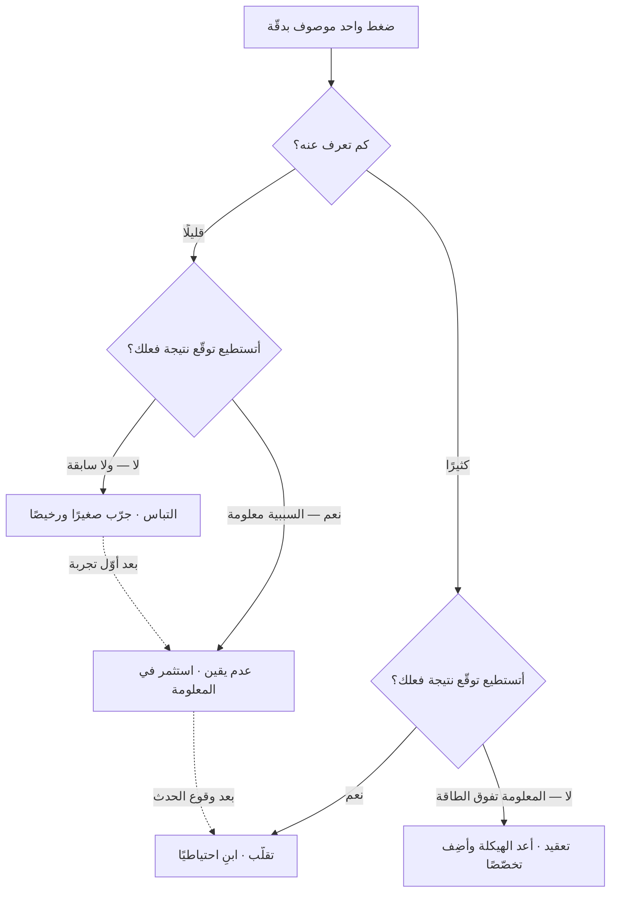

# VUCA — التقلّب وعدم اليقين والتعقيد والالتباس

> [!info] تعريف مختصر
> **VUCA** مختصرٌ لأربع سمات تصف **بيئة القرار** لا المشكلة نفسها: **التقلّب (Volatility)** · **عدم اليقين (Uncertainty)** · **التعقيد (Complexity)** · **الالتباس (Ambiguity)**. تُنسب صياغته إلى **كلّية الحرب الأمريكية** أواخر الثمانينيات، مستعيرةً مفرداتٍ من كتاب **وارِن بِنِس وبِرت نانوس** *Leaders* (1985)، ثم شاع بعد الحرب الباردة حين لم يعد للخصم شكلٌ واحد يُخطَّط له.
> **وقيمته كلّها في التفريق بين الأربع.** فمن استعمله كلمةً واحدة تعني «الدنيا صعبة» لم يستفد منه شيئًا؛ لأن **لكل سمّة استجابةً مختلفة**، بل متعارضة أحيانًا. ولهذا أُلحق به **VUCA Prime** — أربعة أضداد عملية صاغها **بوب جوهانسن** من معهد المستقبل في *Leaders Make the Future*.

## الشرح العلمي والاحترافي

**والفصل بين الأربع** هو إسهام **ناثان بينِت وجيمس لومْوان** في *Harvard Business Review* سنة 2014، إذ ردّوا السمات الأربع إلى سؤالين اثنين: **كم تعرف عن الموقف؟** و**إلى أيّ حدّ تستطيع أن تتوقّع نتيجة فعلك؟** فاختلاف الجواب هو الذي يصنع السمّة، وهو الذي يحدّد العلاج:

| السمّة | ما تعرفه عن الموقف | توقّع نتيجة فعلك | مثالها | الاستجابة المناسبة |
|---|---|---|---|---|
| **التقلّب** | كثير — الأمر مفهوم | ممكن | سعر مورد يتذبذب لحدث معلوم، لا تدري متى ولا كم | **بناء الاحتياطي**: مخزون، وسعة فائضة، ومورّد بديل |
| **التعقيد** | كثير — والمعلومة متاحة لكن حجمها يفوق الطاقة | صعب | دخول سوق فيه عشرات الأنظمة الضريبية والجمركية المتشابكة | **إعادة الهيكلة**: تخصّصات جديدة وتفكيك المشكلة إلى نطاقات |
| **عدم اليقين** | قليل — والسببية نفسها معلومة | ممكن | منافس على وشك الإطلاق: تعرف أثره إن وقع، ولا تدري أيقع | **الاستثمار في المعلومة**: جمعها وتفسيرها وتوزيعها |
| **الالتباس** | قليل — ولا سابقة تُقاس عليها | صعب | منتج في سوق لم يوجد بعد | **التجريب**: فرضيات صغيرة رخيصة تُنتج المعرفة بالفعل لا بالتحليل |

**وأثر هذا الفصل عمليّ لا تصنيفيّ:** فمن عالج **التقلّب** بجمع مزيد من المعلومات أنفق على ما يعرفه أصلًا. ومن عالج **عدم اليقين** ببناء الاحتياطي حمل كلفةً دائمة لحدثٍ سؤاله «أيقع أم لا» لا «كم مقداره». ومن عالج **الالتباس** بالتحليل انتظر معلومةً **لم تُخلق بعد**، لأنها لا تنشأ إلا بعد الفعل.

### VUCA Prime — ما يقابل كلًّا منها في القيادة

| البيئة | يقابلها عند جوهانسن | مؤدّاها العملي |
|---|---|---|
| التقلّب | **الرؤية (Vision)** | ما يثبت حين يتحرّك كل شيء: الوجهة، لا الخطّة |
| عدم اليقين | **الفهم (Understanding)** | الإنصات خارج الدائرة المألوفة، ورفع دقّة الصورة قبل الحركة |
| التعقيد | **الوضوح (Clarity)** | التبسيط الصريح: من يقرّر ماذا، وما الأولوية إن تعارضت |
| الالتباس | **الرشاقة (Agility)** | القدرة على التحوّل السريع بعد أن ينكشف الواقع |

**وهذه المقابلات إرشادية لا معادلات**، فليست مبنيّة على قياس؛ ونفعها أنها تحوّل الوصف إلى سؤال قيادي: أي هذه الأربع أضعفُ عندنا؟

> [!info] إضافة مرجعية — «التعقيد» هنا ليس «المركّب» في كونيفين
> الكلمة الإنجليزية `Complexity` واحدة، والمقصود بها في الإطارين مختلف — وهذا موضع لبسٍ حقيقيّ يستحقّ التنبيه:
> - **في VUCA**: كثرة الأجزاء والمتغيّرات المتشابكة، **والمعلومة متاحة** لكنّ حجمها يفوق طاقة المعالجة. وهذا أقرب إلى ما يسمّيه [[Cynefin|كونيفين]] **«المعقّد» (Complicated)** — ما يحلّه الخبير بالتحليل.
> - **وفي كونيفين**: `Complex` = **«المركّب»**، وهو ما **لا** تُعرف فيه علاقة السبب بالنتيجة إلا بأثر رجعي، ويتغيّر النظام بتدخّلك فيه. وأقرب سمّات VUCA إليه هو **الالتباس** لا التعقيد.
>
> فاعتُمد هنا **«التعقيد»** مقابلًا لـ`Complexity` في VUCA، وبقي **«المركّب»** محجوزًا لـ`Complex` في كونيفين كما استقرّ في هذه الموسوعة. **ولا يُقال إن أحد الإطارين أخطأ**: كلٌّ منهما عرّف كلمته لغرضه، وإنما يلزمنا ألّا نخلط بينهما حين نجمعهما في صفحة واحدة.

### جدول التمييز: VUCA مقابل كونيفين

| ما يفعله الفريق | **VUCA** | **[[Cynefin|كونيفين]]** |
|---|---|---|
| يصف… | **البيئة** المحيطة بالقرار | **طبيعة السببية** في المشكلة نفسها |
| يسأل أوّلًا | ما الذي يجعل هذا الموقف صعبًا؟ | أيّ نوع من المشكلات هذه؟ |
| يخرج بـ… | سمّة واحدة أو أكثر تصف الضغط | مجال واحد يحدّد أسلوب القرار |
| يقرّر بناءً عليه | أين يستثمر: احتياطًا · معلومةً · هيكلةً · تجربة | أسلوب العمل: صنّف · حلّل · جرّب · تصرّف |
| يستعمله متى؟ | في التخطيط الاستراتيجي وتهيئة القيادة | عند مواجهة مشكلة بعينها وقت اتّخاذ القرار |
| حدّه | وصفيّ — لا يعطي أسلوب عمل | تشخيصيّ — لا يصف الضغط الخارجي |

> **السؤال الفارق:** VUCA يسأل: **ما طبيعة الضغط الذي أعمل تحته؟** وكونيفين يسأل: **ما طبيعة المشكلة التي بين يدي؟** — والأوّل يهيّئ للثاني ولا يغني عنه. ولهذا يجتمعان ولا يتنافسان: تشخّص البيئة مرّةً كل ربع، وتشخّص المشكلة عند كل قرار.

**ونقدٌ يُذكر بإنصاف:** أكثر ما يؤخذ على VUCA أنه **يوصف به الواقع فيُستعمل عذرًا**: «بيئتنا VUCA» تُقال فتُبرّر غياب الخطّة وتأخّر القرار. والعيب ليس في الإطار بل في استعماله وصفًا يقف عنده صاحبه. وقد اقترح **جيمي كاسيو** سنة 2020 مختصرًا بديلًا هو **BANI** — هشّ (Brittle) · قَلِق (Anxious) · لا خطّيّ (Nonlinear) · عصيّ على الفهم (Incomprehensible) — بحجّة أن العالم لم يعد «متقلّبًا» فحسب بل **قابلًا للانهيار المفاجئ**. وهو اقتراحٌ متداوَل لم يبلغ استقرار VUCA، ويُذكر ليعرف القارئ موضعه إن لقيه.

## أين ومتى يُستخدم

- **في التخطيط الاستراتيجي السنوي أو الربعي**: أيّ السمّات الأربع تحكم سوقنا هذه السنة؟ فالجواب يحدّد أين يذهب المال — إلى الاحتياطي، أم إلى المعلومة، أم إلى إعادة الهيكلة، أم إلى التجارب.
- **في تبرير بند ميزانية يصعب تبريره**: بناء سعة فائضة يبدو هدرًا حتى يُقال إنه علاج **تقلّب** مقيس.
- **في تهيئة القيادة** عبر VUCA Prime: أيّ الأربع أضعف عندنا — الرؤية أم الفهم أم الوضوح أم الرشاقة؟
- **في تشخيص خلافٍ داخل فريق القيادة**: كثيرًا ما يكون الخلاف على الحلّ في حقيقته خلافًا على **تشخيص البيئة** — أحدهم يراها عدم يقين فيطلب دراسة، والآخر يراها التباسًا فيطلب تجربة.

> [!warning] متى لا يُستخدَم؟
> - **بديلًا عن تشخيص المشكلة.** VUCA يصف الجوّ ولا يقول لك كيف تعمل؛ فإن كنت أمام قرار بعينه فمكانك [[Cynefin|كونيفين]].
> - **بديلًا عن [[Risk Register|سجلّ المخاطر]].** السمّات وصف عامّ، والمخاطر بنود مسمّاة لها أصحاب وإجراءات. ومن اكتفى بالأوّل ترك المخاطر بلا مالك.
> - **في بيئة مستقرّة فعلًا.** لا كل سياق يستحقّ هذه اللغة، وإسقاطها على عمل تشغيليّ منضبط يشوّش أكثر ممّا يفيد.
> - **حجّةً على التخلّي عن التقدير والالتزام.** عدم اليقين يغيّر **شكل** الالتزام (سقف إنفاق ونافذة مراجعة) ولا يلغيه.

## مثال وسيناريو تطبيقي

> [!example] «شركة رِفد» للتجارة الإلكترونية — أربع مشكلات وُصفت بكلمة واحدة
> **الوضع:** فريق القيادة يصف السنة بأنها «سنة VUCA»، والخطّة المقترحة: تأجيل الالتزامات، وزيادة الدراسات، والانتظار حتى تتّضح الصورة.
> **ما ظهر عند الفصل:** أن الضغوط أربعة مختلفة، ومعالجتها بعلاج واحد هي المشكلة:
> 1. **تذبذب كلفة الشحن** بحسب موسم وحدثٍ معلومَين — **تقلّب**. فالمعلومة كاملة والتحليل لا يزيدها. **العلاج:** عقد مع مزوّد بديل وسعة محجوزة مسبقًا.
> 2. **نظام ضريبي جديد** في ثلاثة أسواق، نصوصه منشورة وتفاصيله كثيرة — **تعقيد**. **العلاج:** استقدام تخصّص ضريبي وتفكيك الامتثال إلى نطاقات لكلٍّ مالك.
> 3. **منافس يُشاع أنه سيطلق خدمة اشتراك** — **عدم يقين**. الأثر معلوم إن وقع، والمجهول وقوعه. **العلاج:** رصد منظّم وإشارات مبكرة، لا إعادة هيكلة.
> 4. **فئة منتجات جديدة كليًّا** لم تُجرَّب في السوق المحلّي — **التباس**. **العلاج:** ثلاث تجارب صغيرة بمعيار توقّف مكتوب، لا دراسة سوق رابعة.
> **النتيجة:** لم يعد في الخطّة بندٌ اسمه «الانتظار حتى تتّضح الصورة». وثلاثة من الأربعة لم يكن التحليل علاجًا لها أصلًا.
> **الدرس:** الكلمة الواحدة أنتجت خطّةً واحدة خاطئة؛ والفصل بين الأربع أنتج أربعة قرارات، كلٌّ منها رخيص في موضعه.

## خطوات أو مخطّط

1. **اكتب الضغوط مفردةً لا مجملة:** لا «السوق مضطرب»، بل بندًا بندًا.
2. **اسأل عن كلٍّ سؤالين:** كم أعرف عنه؟ وهل أستطيع توقّع نتيجة فعلي فيه؟
3. **سمِّ السمّة** بحسب الجوابين، وواحدةً فقط لكل بند — فالبند الذي يحتمل سمّتين لم يُفكَّك بعد.
4. **اختر العلاج المطابق:** احتياطًا · معلومةً · هيكلةً · تجربة.
5. **افحص الإنفاق:** أين يذهب المال فعلًا اليوم؟ فكثيرًا ما ينفق على المعلومة والغالب على البنود التباسٌ لا يُحلّ بها.
6. **راجع كل ربع**، فالبند ينتقل: الالتباس يصير عدم يقين بعد أوّل تجربة، وعدم اليقين يصير تقلّبًا بعد أن يقع الحدث.

## ⚠️ مفاهيم خاطئة شائعة

> [!warning]
> - **استعماله كلمةً واحدة تعني «الدنيا صعبة».** فتذهب فائدته كلّها، إذ فائدته في التفريق لا في التسمية.
> - **الخلط بين التقلّب وعدم اليقين.** التقلّب في **المقدار والتوقيت** لأمرٍ تعرفه، وعدم اليقين في **الوقوع** لأمرٍ تعرف أثره. والعلاجان مختلفان تمامًا.
> - **مساواة `Complexity` فيه بـ«المركّب» عند كونيفين.** انظر صندوق الإضافة المرجعية أعلاه؛ وهو أشيع لبسٍ عند من يجمع الإطارين.
> - **حسبانه إطار عمل.** ليس له عملية ولا أدوار ولا مخرجات؛ هو **مفردات وصف** لا أسلوب عمل، وهذا حدّه لا نقصه.
> - **الظنّ بأن VUCA Prime مقابلاتٌ مثبتة بالقياس.** هي اقتراح قيادي نافع، لا نتيجة بحث تجريبي.
> - **قراءته حكمًا على العصر.** فكل جيل رأى زمنه أشدّ اضطرابًا ممّا قبله؛ والنافع منه أداة الفصل، لا الدعوى التاريخية.

## ❌ ممارسات خاطئة في المشاريع

> [!failure]
> - **الاستشهاد به لتأجيل القرار** — «البيئة VUCA فلننتظر». **الحلّ:** الانتظار علاجٌ لسمّة واحدة (عدم اليقين) وقد لا يكون علاجها؛ وثلاثٌ منها تسوء بالانتظار.
> - **إنفاق ميزانية الدراسات على ما هو التباس** — فتُشترى تقارير عن سوق لم يوجد. **الحلّ:** حوّل ثمن الدراسة إلى ثلاث تجارب.
> - **إسناد سمّة واحدة إلى المؤسّسة كلّها** — فيُطبَّق علاج واحد على أعمال متباينة. **الحلّ:** التشخيص على مستوى البند لا الشركة.
> - **جمع الأربع في شريحة عرض بلا قرار يتغيّر** — فتصير مفرداتٍ تُزيّن الخطّة القديمة. **الحلّ:** لكل سمّة بند إنفاق أو قرار مسمّى، وإلّا فلم تُستعمل.
> - **إهمال إعادة التصنيف** — فيبقى بندٌ مصنَّفًا التباسًا وقد صار معلومًا بعد تجربتين، فيُنفق عليه تجريبٌ لا يحتاجه. **الحلّ:** مراجعة ربعية للتصنيف نفسه.

## 🔗 مصطلحات ومفاهيم ذات صلة

[[Cynefin]] | [[Knightian Uncertainty]] | [[OODA Loop]] | [[Adaptability]] | [[Risk Register]] | [[Pre-mortem]] | [[Cost of Experimentation]] | [[Reversible vs Irreversible Decisions]] | [[Systems Thinking]] | [[Wardley Mapping]] | [[Intelligent Failure]] | [[01 - Agile]]
