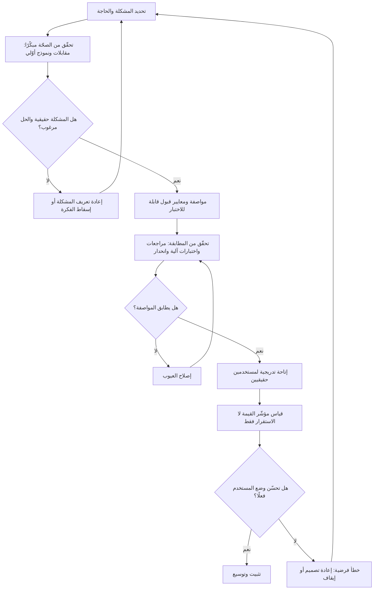

# التحقّق من الصحّة مقابل التحقّق من المطابقة (Validation vs Verification)

> [!info] تعريف مختصر
> سؤالان مختلفان تمامًا يُطرحان على أي مخرَج، ويُخلط بينهما باستمرار لأن الترجمة العربية الشائعة تستخدم كلمة «تحقّق» لكليهما. **التحقّق من المطابقة (Verification)** يسأل: **هل بنيناه بطريقة صحيحة؟** — أي هل يطابق المنتج مواصفاته ومتطلّباته ومعاييره المعلنة. و**التحقّق من الصحّة (Validation)** يسأل: **هل نبني الشيء الصحيح أصلًا؟** — أي هل يحلّ المنتج مشكلة حقيقية لمستخدم حقيقي ويحقّق الغرض التجاري الذي بُرِّر به. المطابقة تُقاس **مقابل الوثيقة**، والصحّة تُقاس **مقابل الواقع**؛ ومن الممكن تمامًا أن يُبنى منتج مطابق للمواصفة بنسبة 100% وهو في الوقت نفسه بلا قيمة، لأن المواصفة نفسها كانت خاطئة.

## الشرح العلمي والاحترافي
- **الصياغة الكلاسيكية وأصلها**: التمييز راسخ في هندسة النظم وهندسة البرمجيات وفي معايير الجودة (وهو جزء أصيل من ممارسات ضمان الجودة ومن أدبيات إدارة المشاريع)، ويُلخَّص تقليديًّا بجملتين: *Verification: Are we building the product right?* و*Validation: Are we building the right product?* — والصياغة تُنسب في الأدبيات إلى بيري بوهم (Barry Boehm)، وقد صارت منذ ذلك الحين المرجع المتداول للتفريق.
- **المرجع المقارَن به هو الفرق الحقيقي**: في المطابقة، المرجع **داخلي ومكتوب**: [[Software Requirements Specification]]، [[PRD]]، [[BRD]]، [[Definition of Done]]، معايير القبول. وفي الصحّة، المرجع **خارجي وحيّ**: المستخدم، والسوق، ونتيجة العمل. ولهذا يمكن أتمتة المطابقة إلى حدّ بعيد، بينما تحتاج الصحّة إلى ملاحظة سلوك بشر ولا تُختصر في اختبار آلي.
- **توقيت كل منهما**: المطابقة تُمارَس **باستمرار وفي كل طبقة** — مراجعة متطلّبات، مراجعة تصميم، اختبار وحدة، اختبار تكامل، [[Regression Testing]]، مراجعة كود. والصحّة تُمارَس **في الطرفين**: مبكّرًا جدًّا قبل البناء (بحث، [[The Mom Test]]، [[Prototype]]، [[Fake Door Test]])، ومتأخّرًا بعد الوصول إلى مستخدم حقيقي ([[Pilot Launch]]، بيتا، [[Post-Launch Review]]). والفجوة الشائعة في المؤسسات أنها تتقن الوسط (المطابقة) وتهمل الطرفين.
- **علاقتهما بنموذج V**: يُصوَّر التمييز غالبًا عبر نموذج V: نزولًا على الساق اليسرى تُفكَّك المتطلّبات إلى تصميم فتفاصيل، وصعودًا على الساق اليمنى تُختبر كل طبقة **مقابل الطبقة المقابلة لها**. اختبار الوحدة يقابل التصميم التفصيلي (مطابقة)، بينما اختبار القبول في أعلى اليمين يقابل احتياج المستخدم في أعلى اليسار (صحّة). والدرس البنيوي من النموذج: **خطأ في أعلى الساق اليسرى — أي في فهم الحاجة — لا يمكن لأي اختبار في الأسفل أن يكتشفه**، لأن كل ما تحته يقيس المطابقة لمواصفة خاطئة.
- **لماذا يكلّف الخلط كثيرًا؟** لأنه يجعل المؤسسة تستثمر كل ميزانية الجودة في نصف السؤال. الفشل الناتج عن ضعف المطابقة **مرئي وصاخب** (عطل، خطأ، حادثة) فيُموَّل علاجه فورًا؛ أما الفشل الناتج عن ضعف الصحّة فهو **صامت ومكلف**: مشروع يُسلَّم في وقته وميزانيته، وتُوقَّع وثيقة [[Sign-off]]، وتُغلق كل بنود [[RTM]]، ثم لا يستخدمه أحد. ولأنه لا يُصنَّف "عطلًا"، لا يفتح أحد تذكرة، ولا يُجرى [[Root Cause Analysis]] — فتتكرّر الدورة نفسها في المشروع التالي. وتضاعف [[Cost-of-Change Curve]] هذه الكلفة: خطأ في فهم الحاجة يُكتشف بعد الإطلاق أغلى بمراتب من اكتشافه في مرحلة الاستكشاف.
- **[[UAT]] ليس دائمًا تحقّقًا من الصحّة**: هذه نقطة عملية بالغة الأهمية. حين يُدار اختبار قبول المستخدم كقائمة سيناريوهات مستمدّة حرفيًّا من وثيقة المتطلّبات ويُطلَب من المستخدم التوقيع على «هل يطابق ما طلبتَه؟» فهو **تحقّق من مطابقة** يؤدّيه بشر. ولا يصير تحقّقًا من صحّة إلا إذا وُضع المستخدم في مهمّته الحقيقية دون سيناريو مكتوب، وقيس هل أنجزها وهل تحسّن وضعه — وهو ما لا يحدث في أغلب المشاريع.
- **العلاقة بضمان الجودة ومراقبتها**: التمييز بين [[QA vs QC]] عمودي (عملية مقابل مخرَج)، وتمييز الصحّة عن المطابقة **أفقي**: أي مرجع نقيس عليه. يمكن أن يكون لديك ضمان جودة ممتاز ومراقبة جودة صارمة، وتبقى تبني الشيء الخطأ بإتقان بالغ.
- **من يملك كلًّا منهما**: المطابقة عادةً ملك الهندسة والجودة، والصحّة ملك مشترك بين المنتج والأعمال وأصحاب المصلحة و[[Sponsor]]. حين لا يُسمَّى مالك للصحّة صراحةً، يفترض الجميع أن غيرهم يتولّاها — فلا يتولّاها أحد، ويصبح غيابها مكتشَفًا بعد الإطلاق فقط.

## أين ومتى يُستخدم
- **في تصميم استراتيجية الاختبار**: لتخصيص جهد لكل سؤال بدل صبّ كل الميزانية في اختبارات المطابقة وحدها، وربط ذلك بمنهج [[Risk-Based Testing]].
- **عند وضع معايير القبول وبوّابات الجودة**: [[Definition of Done]] يخدم المطابقة أساسًا، فيلزم إضافة معيار قيمة صريح إن أُريد للبوّابة أن تحمي من بناء الشيء الخطأ.
- **في مرحلة الاستكشاف قبل البناء**: [[Product Discovery]] و[[Prototype]] و[[Proof of Concept]] و[[Fake Door Test]] كلها أدوات تحقّق من الصحّة قبل إنفاق كلفة البناء.
- **في المشاريع الحكومية والتعاقدية**: حيث يُقاس التسليم عادةً بمطابقة كرّاسة الشروط، ويلزم إدخال قياس قيمة صريح كي لا ينتهي المشروع «ناجحًا تعاقديًّا وفاشلًا واقعيًّا».
- **عند تحليل سبب ضعف التبنّي بعد الإطلاق**: السؤال الأول هو تحديد نوع الفشل — مطابقة (النظام معطوب) أم صحّة (النظام سليم ولا يحلّ المشكلة) — لأن العلاجين مختلفان تمامًا.
- **في الأنظمة المنظَّمة والحسّاسة**: الجهات التنظيمية تطلب عادةً الاثنين معًا مع أدلّة موثّقة، وتربطهما بالتتبّع عبر [[RTM]].
- **في مشاريع الذكاء الاصطناعي تحديدًا**: قد يجتاز النموذج مقاييسه التقنية في [[Evals]] (مطابقة) بينما لا يثق به المستخدم ولا يغيّر قراره (صحّة) — وهو أحد أكثر مواضع الخلط تكلفةً حاليًّا.

## مثال وسيناريو تطبيقي
> [!example] وزارة خليجية تعاقدت على نظام لإدارة طلبات التراخيص للمنشآت الصغيرة، بميزانية 4.2 مليون ريال ومدّة 14 شهرًا. كرّاسة الشروط تضمّنت 312 متطلّبًا وظيفيًّا مفصّلًا كتبتها لجنة داخلية.
> **جانب المطابقة — أداء ممتاز**: سُلّم النظام متأخّرًا ثلاثة أسابيع فقط. أُغلقت 312 متطلّبًا في [[RTM]] بنسبة 100%. اجتاز اختبار الأداء (2,000 مستخدم متزامن) واختبار الاختراق. أُجري [[UAT]] على 180 سيناريو مكتوبًا مع 12 موظفًا من الوزارة، ونجحت 174 حالة، وأُصلحت الستّ الباقية، ووُقّعت وثيقة [[Sign-off]]. بكل معيار تعاقدي: نجاح.
> **الواقع بعد 60 يومًا من الإطلاق**: عدد الطلبات المقدَّمة إلكترونيًّا 11% فقط من الإجمالي. أمّا 89% فما زالت تُقدَّم عبر مراجعة المكتب. وارتفعت مكالمات مركز الاتصال 34% لا انخفضت.
> **التشخيص**: أُجريت 22 مقابلة مع أصحاب منشآت. ظهر أن النظام يطابق المواصفة تمامًا، لكن المواصفة كُتبت من **زاوية الموظف الداخلي** لا من زاوية المتقدّم: النموذج يطلب رفع سبع وثائق دفعة واحدة قبل حفظ أي شيء (فمن ينقصه مستند واحد يبدأ من الصفر)، ويستخدم مصطلحات إدارية داخلية لا يفهمها صاحب المنشأة، ولا يعرض حالة الطلب بعد التقديم فيتّصل المتقدّم ليسأل — وهذا تفسير ارتفاع المكالمات.
> **جوهر الفشل**: لا يوجد في المشروع أي نشاط تحقّق من صحّة. لم يُقابَل صاحب منشأة واحد قبل كتابة الكرّاسة، ولم يُختبر [[Prototype]] مع مستخدم خارجي، و[[UAT]] أُجري مع موظفين يقرأون سيناريوهات مكتوبة سلفًا — أي أنه كان **تحقّق مطابقة يؤدّيه بشر**، لا تحقّقًا من الصحّة.
> **التصحيح**: أُدخلت 3 تغييرات فقط بعد بحث ميداني: حفظ تلقائي للمسودّة، ولغة النموذج بمصطلحات المستخدم، وشاشة تتبّع حالة الطلب. تكلفتها لم تتجاوز 4% من ميزانية المشروع الأصلية. بعد 90 يومًا ارتفعت نسبة التقديم الإلكتروني من 11% إلى 47%، وانخفضت المكالمات 26%.
> **الدرس المؤسّسي**: أُضيف إلى نموذج كرّاسات الشروط في الجهة بندان إلزاميان: اختبار قابلية استخدام مع **خمسة مستخدمين خارجيين على الأقل** قبل تجميد المتطلّبات، ومؤشّر قيمة (نسبة التقديم الإلكتروني) يُقاس بعد 60 يومًا بوصفه شرطًا لإقفال المشروع في [[Post-Launch Review]] — أي أن الجهة أضافت الجهة الغائبة من السؤال، ولم تزد شيئًا على جهة المطابقة التي كانت متقنة أصلًا.

## خطوات أو مخطّط
1. اكتب الحاجة والمشكلة قبل المواصفة، وميّز صراحةً بين «ما نصدّقه عن المستخدم» و«ما نلتزم ببنائه» — راجع [[Problem Statement]] و[[Hypothesis]].
2. تحقّق من صحّة الحاجة **قبل البناء** بأرخص وسيلة ممكنة: مقابلات بمنهج [[The Mom Test]]، نموذج أوّلي، اختبار باب وهمي.
3. حوّل الحاجة المُثبتة إلى مواصفة ومعايير قبول قابلة للاختبار، وابنِ عليها تتبّعًا في [[RTM]].
4. مارس المطابقة في كل طبقة: مراجعة متطلّبات وتصميم، اختبارات آلية، تكامل، انحدار.
5. صمّم اختبار قبول ذا شقّين: شقّ مطابقة بسيناريوهات محدّدة، وشقّ صحّة يضع المستخدم في مهمّته الحقيقية بلا نصّ.
6. عرّف **مؤشّر صحّة واحدًا على الأقل** يُقاس بعد الوصول إلى مستخدم حقيقي، ولا تكتفِ بمعدّل نجاح الاختبارات.
7. أطلق تدريجيًّا عبر [[Progressive Delivery]] بحيث تقيس المطابقة (استقرار) والصحّة (إتمام المهمّة) في الحلقات نفسها.
8. في [[Post-Launch Review]] افصل الحكم: هل ما بُني مطابق؟ وهل حقّق النتيجة؟ ولا تدع نجاح الأول يغطّي فشل الثاني.
9. عند الفشل، صنّف نوعه أولًا: خلل تنفيذ يُعالَج بالإصلاح، أم خطأ فرضية يُعالَج بإعادة التصميم أو الإيقاف عبر [[Sunset and Deprecation]].
10. أعد التغذية إلى قوالب المؤسسة: أضف بنود تحقّق الصحّة إلى قوائم الجاهزية وكرّاسات الشروط لا إلى وثيقة المشروع الواحد.

## ⚠️ مفاهيم خاطئة شائعة
> [!warning]
> - **«كلاهما يعني الاختبار»**: الاختبار وسيلة من وسائل كثيرة. المطابقة تشمل المراجعات والتفتيش والتحليل الساكن، والصحّة تشمل البحث والمقابلات والملاحظة الميدانية وقياس السلوك بعد الإطلاق — وأغلبها ليس اختبارًا بالمعنى التقني إطلاقًا.
> - **«توقيع المستخدم على [[Sign-off]] دليل على أن ما بُني هو الصحيح»**: التوقيع يثبت قبول المطابقة للمواصفة، ولا يثبت أن المواصفة كانت تحلّ المشكلة الصحيحة. كثير من المشاريع الموقَّعة بالكامل لم يستخدمها أحد.
> - **«[[UAT]] هو التحقّق من الصحّة»**: يكون كذلك فقط إن وُضع المستخدم في مهمّته الواقعية دون سيناريو مكتوب. أمّا تنفيذ خطوات مملاة عليه فهو مطابقة يدوية مهما سُمّي.
> - **«التغطية الاختبارية العالية تعني منتجًا جيّدًا»**: التغطية تقيس المطابقة للكود المكتوب، ويمكن أن تبلغ 95% في منتج لا أحد يريده. مؤشّرات الجودة الداخلية لا تنوب أبدًا عن مؤشّرات القيمة ([[Outcome vs Output]]).
> - **«التحقّق من الصحّة مرحلة تسبق البناء وتنتهي»**: هو نشاط مستمرّ؛ الحاجة تتغيّر، والسوق يتغيّر، وافتراض صحيح قبل عام قد يصبح خاطئًا اليوم — ولهذا وُجد [[Continuous Discovery]].
> - **«الفريق الرشيق لا يحتاج هذا التمييز لأنه يسلّم كل أسبوعين»**: تكرار التسليم يقصّر حلقة التغذية الراجعة لكنه لا يضمن استخدامها؛ من الممكن تسليم شيء خاطئ كل أسبوعين بكفاءة عالية — وهذا وصف دقيق لـ[[Feature Factory]].
> - **«فشل الصحّة يعني أن الفريق أخطأ»**: كثير من فرضيات المنتج تُدحض، وهذا ناتج بحث مشروع لا إخفاق شخصي. المشكلة الحقيقية هي **عدم الاختبار مبكّرًا وبتكلفة زهيدة**، لا الدحض ذاته.

## ❌ ممارسات خاطئة في المشاريع
> [!failure]
> - **استثمار كل ميزانية الجودة في المطابقة وحدها** → تصير المؤسسة بارعة في بناء الأشياء بإتقان ورديئة في اختيار ما تبنيه، فتتكرّر مشاريع مكتملة بلا أثر → **الحل**: خصّص نسبة معلنة من جهد كل مبادرة لأنشطة تحقّق الصحّة قبل تجميد المتطلّبات، واجعلها بندًا في الخطة لا نيّة.
> - **كتابة المتطلّبات من زاوية الموظف الداخلي دون مقابلة المستفيد النهائي** → تخرج مواصفة متماسكة داخليًّا وغريبة على من سيستخدمها، ويُبنى النظام مطابقًا لها بدقّة → **الحل**: اشترط عددًا أدنى من المقابلات أو اختبارات الاستخدام مع مستخدمين خارجيين قبل تجميد النطاق.
> - **إجراء [[UAT]] بسيناريوهات مكتوبة فقط** → يُثبت أن النظام يطابق ما كُتب، ولا يُكتشف أن ما كُتب لا يناسب واقع العمل → **الحل**: أضف جلسات مهمّة مفتوحة يُقاس فيها الإتمام والزمن ونقاط التعثّر دون توجيه.
> - **قياس نجاح المشروع بالنطاق والوقت والكلفة فقط** → يُعلَن النجاح عند التسليم ولا يسأل أحد عن النتيجة، فينقطع التعلّم عند أهمّ نقطة → **الحل**: أضف مؤشّر نتيجة واحدًا على الأقل إلى تعريف النجاح، وأخّر إقفال المشروع حتى قياسه في [[Post-Launch Review]].
> - **الخلط بين نوعي الفشل عند تحليل ضعف التبنّي** → يُصرف جهد على تحسين الأداء والاستقرار بينما المشكلة أن المنتج لا يحلّ مشكلة أحد → **الحل**: ابدأ التشخيص بسؤال الفصل: هل يعمل النظام كما وُصف؟ فإن كانت الإجابة نعم فالمشكلة في الصحّة لا في التنفيذ.
> - **تأجيل كل تحقّق من الصحّة إلى ما بعد الإطلاق** → يُكتشف خطأ الفرضية بعد إنفاق الميزانية كاملة، حين تكون كلفة التغيير في أعلى نقاط [[Cost-of-Change Curve]] → **الحل**: اطلب دليلًا رخيصًا مبكّرًا: نموذج أوّلي، أو باب وهمي، أو تجربة يدوية قبل الأتمتة.
> - **عدم تسمية مالك صريح لتحقّق الصحّة** → تفترض الهندسة أن المنتج يتولّاها، ويفترض المنتج أن العميل يتولّاها، فلا يتولّاها أحد → **الحل**: عيّن مالكًا مسمّى لسؤال «هل هذا هو الشيء الصحيح؟» وأدرج إجابته المدعومة بالبيّنة شرطًا في [[Go or No-Go Decision]].
> - **اعتبار مقاييس النموذج التقنية في مشاريع الذكاء الاصطناعي كافية** → تُبنى قرارات على درجات [[Evals]] بينما لا يثق المستخدم بالمخرَج ولا يغيّر سلوكه، فيُنشر نظام مثالي الأرقام عديم الأثر → **الحل**: أضف قياسًا سلوكيًّا لمستخدمين حقيقيين (قبول المخرَج، ونسبة التعديل عليه، وأثره في القرار) إلى جانب المقاييس التقنية.

## 🔗 مصطلحات ومفاهيم ذات صلة
[[Post-Launch Review]] | [[Progressive Delivery]] | [[Feature Flags]] | [[Sunset and Deprecation]] | [[Pilot Launch]] | [[Go or No-Go Decision]] | [[UAT]] | [[QA vs QC]] | [[Quality Assurance]] | [[Definition of Done]] | [[RTM]] | [[Sign-off]] | [[Prototype]] | [[Proof of Concept]] | [[Fake Door Test]] | [[The Mom Test]] | [[Product Discovery]] | [[Continuous Discovery]] | [[Outcome vs Output]] | [[Feature Factory]] | [[Cost-of-Change Curve]] | [[Risk-Based Testing]] | [[Evals]] | [[Problem Statement]] | [[Hypothesis]]
