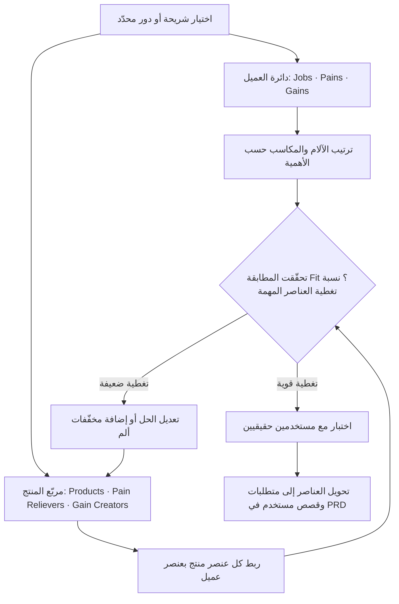

# لوحة القيمة المقترحة (Value Proposition Canvas)

> [!info] تعريف مختصر
> لوحة القيمة المقترحة أداة تصميم طوّرها Alexander Osterwalder تربط بدقة بين ما يحتاجه العميل فعلًا وما يقدّمه المنتج. تتكوّن من نصفين: **دائرة العميل** (Customer Profile) التي تصف مهامه وآلامه ومكاسبه المرجوّة، و**مربّع المنتج** (Value Map) الذي يصف المنتجات والخدمات ومخفِّفات الألم وصانعات المكسب. الهدف النهائي هو تحقيق **المطابقة (Fit)** بين النصفين، أي أن يقابل كل عنصر في المنتج عنصرًا حقيقيًا في حياة العميل، لا افتراضًا داخليًا من الفريق.

## الشرح العلمي والاحترافي
- اللوحة امتداد تفصيلي لخانة "Value Propositions" في [[Business Model Canvas]]؛ فبينما يرسم نموذج العمل الصورة الكلية، تُكبِّر لوحة القيمة المقترحة العدسة على العلاقة الأدق: **لماذا يشتري هذا العميل تحديدًا هذا الحل تحديدًا؟**
- **النصف الأول — دائرة العميل (Customer Profile)** وتُرسم دائرة لأنها تصف واقعًا قائمًا لا نتحكّم فيه، بل نكتشفه:
  - `Customer Jobs` (وظائف/مهام العميل): ما يحاول العميل إنجازه. وتنقسم إلى: **وظيفية** (Functional) مثل "إصدار تقرير مصاريف شهري"، و**اجتماعية** (Social) مثل "أن أبدو منظّمًا أمام مديري"، و**عاطفية** (Emotional) مثل "أن أشعر بالاطمئنان أن الأرقام صحيحة". إغفال البُعدين الاجتماعي والعاطفي هو أكثر أسباب ضعف اللوحات المكتوبة عمليًا.
  - `Pains` (الآلام): كل ما يعيق إنجاز المهمة أو يجعله مكلفًا — عوائق، مخاطر، نتائج سلبية، هدر وقت، إحباطات. تُنظر إليها بوصفها [[Pain Point]] قابلة للترتيب حسب الشدة (شديد ↔ خفيف).
  - `Gains` (المكاسب): النتائج والفوائد التي يرغب فيها العميل، وتتدرّج من **مكاسب مطلوبة** (Required) إلى **متوقّعة** (Expected) إلى **مرغوبة** (Desired) إلى **غير متوقّعة** (Unexpected)، وهذه الأخيرة هي مصدر التميّز التنافسي غالبًا.
- **النصف الثاني — مربّع المنتج (Value Map)** ويُرسم مربّعًا لأنه من صنع الفريق وقابل للتعديل:
  - `Products & Services` (المنتجات والخدمات): قائمة ما نقدّمه فعليًا — ميزات، خدمات، محتوى، دعم.
  - `Pain Relievers` (مخفِّفات الألم): كيف يزيل الحل أو يقلّل ألمًا محدّدًا مذكورًا في `Pains`.
  - `Gain Creators` (صانعات المكسب): كيف ينتج الحل مكسبًا محدّدًا مذكورًا في `Gains`.
- **مبدأ البروفايل لكل شريحة**: لا تُرسم لوحة واحدة عامة لكل المستخدمين. يُبنى **بروفايل مستقل لكل شريحة عملاء أو دور وظيفي** (مثال: المستخدم النهائي، المدير المعتمِد، المسؤول التقني، المشتري المالي)، لأن مهام كل دور وآلامه مختلفة تمامًا وقد تكون متعارضة. عندئذٍ تكشف المقارنة بين البروفايلات أين تتنازع المصالح وأين تجب المفاضلة.
- **المطابقة (Fit)**: تتحقّق عندما تعالج مخفِّفات الألم وصانعات المكسب عناصر حقيقية ومهمة في دائرة العميل. تُقرأ **نسبة التغطية** بعدّ الآلام والمكاسب **عالية الأهمية** التي يقابلها عنصر صريح في مربّع المنتج، ونسبتها إلى إجمالي العناصر عالية الأهمية. تغطية 100% لعناصر تافهة لا تساوي شيئًا؛ الحكم يكون على تغطية العناصر المرتّبة في القمة. عمليًا تُميَّز ثلاث مراحل: **Problem–Solution Fit** (على الورق)، ثم **Product–Market Fit** (بدليل سوقي فعلي، انظر [[Customer and Market Validation]])، ثم **Business Model Fit** (نموذج مربح ومستدام).
- **الصلة بجمع المتطلبات و PRD**: اللوحة ليست تمرينًا تسويقيًا فحسب، بل مصدر تغذية مباشر لدورة المتطلبات. كل `Pain Reliever` أو `Gain Creator` يتحوّل إلى بند متطلب أو قصة مستخدم ([[11 - User Stories]]) مربوطة بمبرّرها الأصلي في دائرة العميل، فتتحوّل خانة "الخلفية والمشكلة" في [[PRD]] من كلام إنشائي إلى عناصر موثّقة، ويصبح ترتيب أولويات [[13 - Backlog]] مبنيًا على شدّة الألم لا على صوت أعلى صاحب رأي في الاجتماع.

## أين ومتى يُستخدم
- في مرحلة **الاكتشاف (Discovery)** قبل كتابة أي متطلب، لتحويل المقابلات والملاحظات الميدانية إلى بنية قابلة للتحليل بدل ملاحظات مبعثرة.
- عند **تحديد نطاق [[MVP]]**: يُختار للنسخة الأولى فقط ما يعالج الآلام الأشدّ في البروفايل الأهم، ويُؤجَّل ما يخدم مكاسب مرغوبة ثانوية.
- في **جمع المتطلبات وكتابة [[PRD]]**، بوصفها الجسر بين بحث المستخدم والمواصفة المكتوبة، ولتبرير كل ميزة بمرجع في حياة العميل.
- عند **إعادة تموضع منتج قائم** أو تراجع مؤشراته: يُعاد رسم اللوحة لكشف الفجوة بين ما نظنّه قيمة وما يراه المستخدم قيمة فعلًا.
- في **صياغة الرسائل التسويقية وصفحات المنتج**: لغة `Pains` و`Gains` المستخرجة من العملاء هي أفضل مادة خام لنصوص تُقنع.
- في **ورش أصحاب المصلحة** كأداة محايدة تُنهي الجدل: أي ميزة مقترحة يجب أن تُنسب إلى عنصر في دائرة العميل، وإلا سقطت.

## مثال وسيناريو تطبيقي
> [!example] شركة تبني منصّة لإدارة العيادات الصغيرة. بدأ الفريق بميزات افترضها مهمة: تقارير تحليلية متقدّمة، وتكامل مع أجهزة ذكية. بعد ثلاثة أشهر ظلّ معدّل التفعيل منخفضًا، فأُقيمت ورشة لرسم لوحة القيمة المقترحة ببروفايلين منفصلين.
> **بروفايل الطبيب**: `Jobs` — فحص المريض وتوثيق الزيارة بسرعة (وظيفية)، والظهور بمظهر احترافي أمام المريض (اجتماعية)، والاطمئنان إلى عدم ضياع تاريخ المريض (عاطفية). `Pains` — إدخال البيانات يقطع التواصل مع المريض، والبحث عن ملف قديم يستغرق دقائق. `Gains` — إنهاء التوثيق قبل خروج المريض من الغرفة.
> **بروفايل موظّف الاستقبال**: `Jobs` — جدولة المواعيد وتقليل عدم الحضور. `Pains` — مكالمات تأكيد يدوية مرهقة، وتضارب المواعيد. `Gains` — يوم عمل بلا مكالمات تذكير.
> عند المقارنة، تبيّن أن التقارير المتقدّمة لم تُقابل أي ألم عالي الأهمية في أي من البروفايلين، بينما ألم "إدخال البيانات البطيء" وألم "مكالمات التأكيد" لم يكن لهما أي `Pain Reliever` على الإطلاق — أي أن **تغطية العناصر عالية الأهمية كانت 2 من 7 تقريبًا (≈29%)**.
> أعاد الفريق ترتيب أولوياته: قوالب توثيق بنقرة واحدة (Pain Reliever)، ورسائل تذكير آلية للمرضى (Pain Reliever)، وملخّص زيارة يُطبع للمريض (Gain Creator يخدم البُعد الاجتماعي). تُرجمت هذه العناصر مباشرة إلى ثلاث قصص مستخدم في [[PRD]]، فارتفعت التغطية إلى ≈71%، وتحسّن معدّل الاستخدام اليومي خلال دورتين.

## خطوات أو مخطّط
1. تحديد الشريحة أو الدور المستهدف بدقة، ورسم **بروفايل مستقل** له (لوحة لكل شريحة، لا لوحة جامعة).
2. تعبئة `Customer Jobs` أولًا: الوظيفية ثم الاجتماعية ثم العاطفية، بلغة العميل لا بلغة الفريق.
3. استخراج `Pains` و`Gains` من مصادر حقيقية: مقابلات، تذاكر دعم، تسجيلات جلسات، بيانات استخدام.
4. **ترتيب** عناصر الآلام والمكاسب حسب الأهمية والشدّة، وتحديد أعلى 3–5 عناصر بوصفها معيار الحكم.
5. تعبئة `Products & Services` ثم اشتقاق `Pain Relievers` و`Gain Creators` مربوطة صراحةً بعناصر مرقّمة في دائرة العميل.
6. حساب **نسبة التغطية**: كم عنصرًا من العناصر عالية الأهمية له مقابل صريح في مربّع المنتج، وتحديد الفجوات والعناصر الزائدة التي لا تخدم أحدًا.
7. اختبار الافتراضات مع مستخدمين حقيقيين ([[Customer and Market Validation]])، وتصحيح اللوحة بناءً على الأدلة لا على النقاش.
8. تحويل العناصر المُثبتة إلى متطلبات وقصص مستخدم ([[11 - User Stories]]) وإدراجها في [[PRD]] و[[13 - Backlog]] مرتّبةً حسب شدّة الألم.

## ⚠️ مفاهيم خاطئة شائعة
> [!warning]
> - الظن بأن اللوحة "شعار تسويقي" يُكتب في جملة واحدة: هي في الحقيقة أداة تحليل تفصيلية، والجملة التسويقية نتيجة لها لا بديل عنها.
> - الاعتقاد بأن لوحة واحدة تكفي كل المستخدمين: الخلط بين المستخدم النهائي والمشتري والمعتمِد في بروفايل واحد يُنتج منتجًا لا يُرضي أحدًا.
> - اعتبار الـ `Jobs` مجرد قائمة ميزات مطلوبة: المهمة هي ما يحاول العميل إنجازه في حياته، وقد يُنجَز بوسائل لا علاقة لها بمنتجنا (حتى ورقة وقلم منافس شرعي).
> - الاكتفاء بالبُعد الوظيفي وإهمال الاجتماعي والعاطفي، رغم أن كثيرًا من قرارات التبنّي والاحتفاظ تُحسم عاطفيًا.
> - قراءة نسبة التغطية كنسبة مطلقة: تغطية 90% لعناصر هامشية أسوأ من تغطية 50% للعناصر الثلاثة الأشد أهمية.
> - الخلط بين المطابقة على الورق (Problem–Solution Fit) والمطابقة السوقية المُثبتة ([[Product-Market Fit]]): الأولى فرضية، والثانية دليل.

## ❌ ممارسات خاطئة في المشاريع
> [!failure]
> - **تعبئة اللوحة من داخل غرفة الاجتماعات دون التحدّث إلى عميل واحد**: تتحوّل إلى توثيق منظّم لافتراضات الفريق، فيبدو المشروع مدروسًا وهو مبني على وهم. الحل: عدم اعتماد أي عنصر دون مصدر (مقابلة، تذكرة دعم، بيانات استخدام) مُدوَّن بجانبه.
> - **البدء بمربّع المنتج قبل دائرة العميل**: يقود إلى تبرير الحل الموجود مسبقًا وتلفيق آلام تناسبه. الحل: فرض ترتيب صارم — تُقفل دائرة العميل وتُراجَع قبل فتح مربّع المنتج.
> - **عدم ترتيب الآلام والمكاسب حسب الأهمية**: يجعل كل العناصر متساوية، فيُبدَّد جهد التطوير على مشاكل هامشية. الحل: ترتيب إلزامي وتحديد أعلى 3–5 عناصر كمعيار وحيد لقياس التغطية.
> - **رسم اللوحة مرة واحدة في بداية المشروع ثم نسيانها**: تصبح وثيقة ميتة بينما يتغيّر السوق وسلوك المستخدم. الحل: مراجعة دورية للّوحة عند كل مرحلة كبرى أو بعد كل جولة بحث مستخدم.
> - **كتابة ميزات في خانة `Pain Relievers` دون ربطها بألم مرقّم**: يفتح الباب لتهريب ميزات مفضّلة داخليًا تحت غطاء اللوحة. الحل: قاعدة "لا مخفِّف ألم بلا رقم ألم مقابل"، وحذف كل عنصر لا يجد مرجعًا.
> - **إغفال البروفايل الخاص بالمشتري أو المعتمِد في المنتجات المؤسسية (B2B)**: يُنتج منتجًا يحبّه المستخدم ولا يشتريه أحد. الحل: بروفايل مستقل لصاحب القرار المالي، وربط `Gain Creators` بمبرّرات العائد على الاستثمار.

## 🔗 مصطلحات ومفاهيم ذات صلة
[[Pain Point]] | [[Outcome vs Output]] | [[MVP]] | [[Customer and Market Validation]] | [[User Journey Map]] | [[Value Stream]] | [[Business Model Canvas]] | [[Product-Market Fit]] | [[PRD]] | [[11 - User Stories]] | [[13 - Backlog]]
