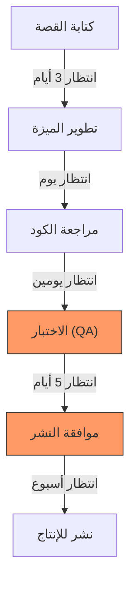

# خريطة تدفّق القيمة (Value Stream Mapping)
> [!info] تعريف مختصر
> خريطة تدفّق القيمة (Value Stream Mapping أو VSM) أداة تحليلية من فلسفة "لين" (Lean) تُصوِّر بصريًا كل خطوة يمرّ بها العمل من لحظة طلب العميل حتى تسليم القيمة له، مع قياس الوقت والموارد في كل خطوة. الهدف كشف الهدر (Waste) وتقليص الوقت الكلي.

## الشرح العلمي والاحترافي
خريطة تدفّق القيمة هي رسم بياني يوضّح "تدفّق العمل" (Value Stream) بأكمله: بدءًا من الفكرة أو الطلب، مرورًا بكل مرحلة معالجة (تحليل، تطوير، اختبار، مراجعة، نشر)، وصولًا إلى تسليم المنتج أو الخدمة للعميل.
- لكل خطوة في الخريطة تُسجَّل قيمتان أساسيتان: **وقت المعالجة الفعلي** (Process Time) أي الوقت الذي يُصرف فعليًا في العمل على المهمة، و**وقت الانتظار** (Wait Time / [[Lead Time]]) أي الوقت الذي تنتظر فيه المهمة دون أن يعمل عليها أحد (بين الفرق، في قائمة انتظار، بانتظار موافقة).
- تُجمع هذه الأوقات لحساب **كفاءة التدفّق** (Flow Efficiency = وقت المعالجة الفعلي ÷ الوقت الإجمالي × 100). في أغلب المؤسسات البرمجية تكون هذه النسبة أقل من 15-20٪، أي أن معظم الوقت يُهدر في الانتظار لا في العمل الفعلي.
- تُستخدم الخريطة لتمييز الأنشطة إلى ثلاث فئات (انظر [[Value-Added vs Non-Value-Added vs Pure Waste]]): أنشطة مضيفة للقيمة، أنشطة غير مضيفة لكنها ضرورية، وأنشطة هدر خالص يجب إزالتها.
- تكشف الخريطة أيضًا [[Bottleneck]] (الاختناقات) و[[Muda, Mura, Muri]] (أنواع الهدر) بوضوح لأنها تُظهر أين تتراكم المهام وأين تطول الانتظارات.
- جذور الأداة من [[Toyota Production System]] (نظام إنتاج تويوتا)، ثم انتقلت إلى تطوير البرمجيات ضمن حركة Lean Software Development وLean-Kanban.

## أين ومتى يُستخدم
- في بدايات تبنّي منهجيات Lean أو [[03 - Kanban]] لفهم الوضع الحالي (Current State Map) قبل أي تحسين.
- عند وجود شكوى متكررة من بطء التسليم أو طول [[Cycle Time]] رغم أن الفريق "يعمل بجد".
- في ورش [[Kaizen]] وجلسات [[Gemba Walk]] كأداة تشخيص أولية.
- عند إعادة تصميم عملية كاملة (مثل عملية نشر الإصدارات أو معالجة تذاكر الدعم) لرسم الحالة المستقبلية المرغوبة (Future State Map).
- كمكمّل لـ [[Root Cause Analysis]] عندما يكون السبب الجذري للتأخير موزّعًا عبر عدة مراحل وليس في خطوة واحدة.

## مثال وسيناريو تطبيقي
> [!example] فريق في شركة "دلتا سوفت" يشتكي من أن ميزات العملاء تستغرق شهرًا كاملًا للوصول إلى الإنتاج رغم أن كتابة الكود لا تستغرق أكثر من يومين. تُشكَّل جلسة VSM لرسم رحلة "طلب ميزة جديدة" من لحظة كتابتها في [[13 - Backlog]] وحتى نشرها:
> 1. كتابة القصة وتحليلها: يوم عمل فعلي، لكنها تنتظر 3 أيام دور المراجعة الأسبوعية لمالك المنتج.
> 2. التطوير الفعلي: يومان عمل فعلي، لكنها تنتظر يومًا كاملًا لتوفر مطور مراجعة الكود (Code Review).
> 3. مراجعة الكود: ساعتان فعليتان، لكنها تنتظر يومين حتى دورة [[CI and CD]] القادمة المُجدولة يدويًا.
> 4. الاختبار: يوم عمل فعلي من فريق الجودة، لكنها تنتظر 5 أيام لأن فريق QA لديه قائمة انتظار طويلة (اختناق واضح).
> 5. النشر للإنتاج: ساعة واحدة فعلية، لكنها تنتظر موافقة مدير التغيير التي تُعقد أسبوعيًا فقط.
> المجموع: وقت العمل الفعلي 4 أيام و5 ساعات تقريبًا، لكن الوقت الكلي 30 يومًا. كفاءة التدفّق أقل من 15٪. الخريطة تكشف أن الاختناق الحقيقي هو طابور فريق QA وتكرار جلسات الموافقة الأسبوعية، فتقرر الشركة أتمتة الاختبارات وتفويض قرار النشر لمدير الفريق بدل انتظار اجتماع أسبوعي.

## خطوات أو مخطّط
1. حدّد بداية ونهاية تدفّق القيمة المراد دراسته (مثلًا: من "فكرة الميزة" إلى "نشرها للعميل").
2. اجمع فريقًا متعدد التخصصات ([[Cross-functional Team]]) ممن يشاركون فعليًا في كل خطوة.
3. ارسم كل خطوة بالترتيب الفعلي (وليس المثالي) مع قياس وقت المعالجة ووقت الانتظار لكل خطوة (استخدم بيانات حقيقية لا تقديرات فقط).
4. احسب الوقت الإجمالي وكفاءة التدفّق.
5. صنّف كل خطوة: مضيفة للقيمة، ضرورية غير مضيفة، أم هدر خالص.
6. حدّد الاختناقات ومواضع الهدر الأكبر.
7. ارسم "الحالة المستقبلية" (Future State) بعد إزالة الهدر واقتراح تحسينات.
8. نفّذ التحسينات تدريجيًا وأعد القياس لاحقًا (خريطة حيّة وليست مرة واحدة).

## ⚠️ مفاهيم خاطئة شائعة
> [!warning]
> - الاعتقاد بأن الخريطة تقيس فقط "سرعة الأفراد"؛ في الحقيقة أغلب البطء ناتج عن انتظار بين الخطوات وليس بطء العمل نفسه.
> - الاعتقاد بأن VSM أداة تُستخدم مرة واحدة فقط؛ الصحيح أنها ممارسة دورية تُعاد كلما تغيّرت العملية لقياس التحسّن.
> - الخلط بين خريطة تدفّق القيمة وخريطة [[User Journey Map]]؛ الأولى تُحلّل عملية العمل الداخلية والوقت والهدر، بينما الثانية تُركّز على تجربة المستخدم وشعوره.

## ❌ ممارسات خاطئة في المشاريع
> [!failure]
> - رسم الخريطة بناءً على "كيف يُفترض أن تسير العملية" بدل رصد الواقع الفعلي بالمشي مع العمل خطوة بخطوة (Gemba)؛ الحل: قياس بيانات حقيقية من أدوات التتبع مثل تذاكر [[16 - Task Boards]].
> - التوقف عند رسم الحالة الحالية دون وضع خطة تحسين وحالة مستقبلية؛ فتتحول الخريطة لتمرين نظري لا قيمة عملية له.
> - إشراك المدراء فقط دون الفريق التنفيذي في الجلسة، مما يُنتج خريطة غير دقيقة تفتقر لتفاصيل الانتظار الحقيقية؛ الحل: إشراك من يقوم بالعمل فعليًا في كل خطوة.

## 🔗 مصطلحات ومفاهيم ذات صلة
[[Value-Added vs Non-Value-Added vs Pure Waste]] · [[Muda, Mura, Muri]] · [[Toyota Production System]] · [[Lead Time]] · [[Cycle Time]] · [[Bottleneck]] · [[Theory of Constraints]] · [[Kaizen]] · [[Gemba Walk]] · [[03 - Kanban]] · [[Little's Law]] · [[Throughput]]
