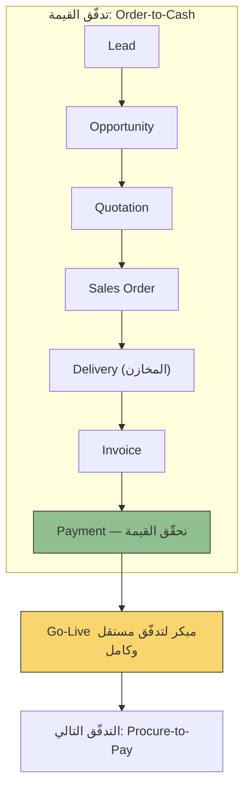

# تدفّق القيمة (Value Stream)

> [!info] تعريف مختصر
> تدفّق القيمة (Value Stream) هو التسلسل الكامل للخطوات التي تحوّل طلبًا أو حاجة لدى العميل إلى قيمة مُحقَّقة فعليًا بين يديه، من لحظة الانطلاق (Trigger) وحتى تحقّق القيمة (Realised Value). هو "الكيان" نفسه: مسار العمل الحقيقي عبر الأقسام والأنظمة والأشخاص، بغضّ النظر عن الهيكل التنظيمي الذي يمرّ خلاله. وتمييزه مهم: `Value Stream` هو التدفّق ذاته، بينما [[Value Stream Mapping]] هي الأداة التي ترسم هذا التدفّق وتقيسه.

## الشرح العلمي والاحترافي
- **التعريف الجوهري**: تدفّق القيمة سلسلة مترابطة من الأنشطة (يدوية وآلية) تبدأ بحدث مُطلِق (Trigger) — طلب عميل، حاجة داخلية، إشارة سوق — وتنتهي بقيمة ملموسة يستلمها ويستفيد منها العميل (نهائيًا كان أو داخليًا). التدفّق يعبر الأقسام أفقيًا (End-to-End)، بينما المؤسسة مُنظَّمة رأسيًا (أقسام، إدارات، وحدات).
- **الفارق الحاسم عن الأداة**: كثيرون يخلطون بين المفهومين. `Value Stream` = التدفّق نفسه، الكيان الموجود في المؤسسة سواء رسمناه أم لم نرسمه. أما [[Value Stream Mapping]] = الممارسة/الأداة التحليلية التي تُصوّر ذلك التدفّق بصريًا وتقيس **زمن العمل الفعلي مقابل زمن الانتظار** لكل خطوة، فتحسب [[Flow Efficiency]] وتكشف [[Bottleneck]] والهدر. باختصار: التدفّق هو "الشيء"، والخريطة هي "العدسة" التي ننظر بها إليه.
- **تدفّقات القيمة المؤسسية القياسية (Canonical Enterprise Value Streams)**: في المؤسسات وأنظمة `ERP` تتكرر مجموعة من التدفّقات المعيارية تقريبًا في كل شركة:
  - `Order-to-Cash` (من الطلب إلى التحصيل): من اهتمام العميل حتى دخول النقد.
  - `Procure-to-Pay` (من الشراء إلى السداد): من طلب الشراء حتى دفع المورّد.
  - `Plan-to-Produce` (من التخطيط إلى الإنتاج): من خطة الإنتاج حتى المنتج الجاهز.
  - `Hire-to-Retire` (من التوظيف إلى نهاية الخدمة): دورة حياة الموظف كاملة.
  - `Record-to-Report` (من القيد إلى التقرير): من القيد المحاسبي حتى القوائم المالية.
- **تدفّق القيمة ≠ القسم ≠ الوحدة (Module)**: الوحدة البرمجية (مثل وحدة المخازن) ليست تدفّقًا؛ هي مكوّن يشارك في عدة تدفّقات. فالمخازن تظهر في `Order-to-Cash` (عند التسليم وخصم المخزون)، وفي `Procure-to-Pay` (عند الاستلام وإضافة المخزون)، وفي `Plan-to-Produce` (عند صرف المواد الخام). لذلك تحليل "الوحدة" منفصلة لا يكشف كيف تتصرّف فعليًا داخل السياق.
- **التنظيم حول التدفّق بدل التنظيم حول الأقسام**: هذا هو الانتقال الجوهري في التفكير اللين (Lean) وفي `Flow-based Organisations`: بدل فرق مُنظَّمة حسب التخصص الوظيفي، تُنظَّم الفرق حول تدفّق قيمة كامل، بحيث يمتلك الفريق القدرة على تسليم قيمة من البداية إلى النهاية دون تسليمات مُتقطّعة (Hand-offs) عبر صوامع تنظيمية.
- **الاستقلالية والقيمة الكاملة**: التدفّق المُصمَّم جيدًا قابل للتشغيل مستقلًا: عند تسليمه يعمل من طرفه إلى طرفه ويُنتج قيمة كاملة قابلة للاستخدام، لا "نصف عملية" تنتظر بقية النظام. هذه الخاصية هي ما يجعل التسليم المبكر ممكنًا أصلًا (بروح [[MVP]]: أصغر تدفّق كامل يعمل ويعطي قيمة حقيقية).

## أين ومتى يُستخدم
- **في تخطيط مشاريع `ERP` والأنظمة المؤسسية الكبيرة**: لتقسيم المشروع إلى تدفّقات قيمة قابلة للتسليم بدل تقسيمه إلى وحدات (Modules) أو أقسام. هذا هو الاستخدام الأهم عمليًا.
- عند تصميم الهيكل التنظيمي للفرق (Team Topologies / Value Stream Aligned Teams) لتقليل التسليمات بين الفرق وتسريع التدفّق.
- عند تحديد أولويات التسليم في مشروع طويل: أي تدفّق يُسلَّم أولًا ولماذا (انظر ترتيب الأولويات أدناه).
- كخطوة سابقة لأي جلسة [[Value Stream Mapping]]: لا يمكن رسم خريطة قبل تحديد حدود التدفّق (أين يبدأ وأين ينتهي).
- في تحليل الأعمال (Business Analysis) وورش المتطلبات: صياغة المتطلبات على شكل مسارات كاملة تعبر الأقسام، لا قوائم وظائف مبعثرة.
- في أطر التوسّع الرشيق مثل `SAFe` حيث تُبنى "قطارات إطلاق رشيقة" (Agile Release Trains) حول تدفّقات القيمة لا حول الأقسام.

## مثال وسيناريو تطبيقي
> [!example] شركة صناعية تُطبّق نظام `ERP` جديدًا. الخطة الأولى (التقليدية) قسّمت المشروع إلى وحدات: المبيعات، المشتريات، المخازن، الحسابات، الموارد البشرية — وخُصِّص لكل وحدة فريق تحليل منفصل يجتمع مع القسم صاحب العلاقة فقط.
> بعد أربعة أشهر ظهرت المشكلة: كل وحدة "مكتملة" على الورق، لكن لا شيء يعمل فعليًا. قسم المبيعات صمّم أمر البيع بحقول لا يعرفها المخزن، وقسم المخازن صمّم إذن التسليم دون ربط بأمر البيع، والحسابات تنتظر بيانات فوترة لا تُنتجها الوحدتان بالشكل المطلوب. مشاكل التكامل بين الأقسام كانت مختبئة تمامًا لأن التحليل تمّ وحدةً وحدة، وتأجّل `Go-Live` إلى نهاية المشروع بالكامل — أي أن العميل لن يرى قيمة قبل 12 شهرًا، وكل المخاطر مُكدَّسة في الشهر الأخير.
> أُعيدت هيكلة المشروع حول **تدفّقات القيمة**. اختير `Order-to-Cash` كأول تدفّق لأنه يمسّ التدفّق النقدي مباشرة، وفُكِّك إلى:
> `Lead` → `Opportunity` → `Quotation` → `Sales Order` → `Delivery` → `Invoice` → `Payment`.
> الفريق الواحد ضمّ ممثلين عن المبيعات والمخازن والحسابات معًا، فظهرت مشاكل التكامل في الأسبوع الأول لا في الشهر الثاني عشر. بعد عشرة أسابيع أُطلق هذا التدفّق وحده في الإنتاج: الشركة صارت تبيع وتُسلّم وتُفوتر وتُحصّل من النظام الجديد فعليًا — قيمة كاملة ومستقلة، رغم أن `Procure-to-Pay` و`Hire-to-Retire` لم يُبدأ بهما بعد.
> لاحظ أن **وحدة المخازن** ظهرت هنا في خطوة `Delivery`، وستظهر مجددًا في `Procure-to-Pay` عند الاستلام، وفي `Plan-to-Produce` عند صرف المواد — الوحدة نفسها بأدوار مختلفة في ثلاثة تدفّقات.

## خطوات أو مخطّط
1. **حدّد الحدث المُطلِق ونقطة تحقّق القيمة** لكل تدفّق: من أين يبدأ (Trigger) وأين تُعتبر القيمة مُتحقّقة فعليًا (Realised Value) — لا تكتفِ بـ"نهاية العملية الداخلية".
2. **اكتشف تدفّقات المؤسسة** بالاستناد إلى التدفّقات المعيارية: `Order-to-Cash` · `Procure-to-Pay` · `Plan-to-Produce` · `Hire-to-Retire` · `Record-to-Report`، ثم أضف ما تختصّ به المؤسسة.
3. **فكّك كل تدفّق إلى خطواته الفعلية** عبر الأقسام. مثال `Order-to-Cash`: `Lead` → `Opportunity` → `Quotation` → `Sales Order` → `Delivery` → `Invoice` → `Payment`.
4. **اربط الوحدات والأقسام بالخطوات** لا العكس، مع تقبّل أن الوحدة الواحدة (المخازن مثلًا) تتكرّر عبر عدة تدفّقات بأدوار مختلفة.
5. **رتّب التدفّقات حسب القيمة**: ابدأ بما يؤثر في **التدفّق النقدي** أولًا (`Order-to-Cash` ثم `Procure-to-Pay`)، ثم التدفّقات التشغيلية (`Plan-to-Produce`)، ثم المساندة (`Hire-to-Retire`, `Record-to-Report`).
6. **تحقّق من شرط الاستقلالية**: هل يعمل هذا التدفّق وحده ويعطي قيمة كاملة عند تسليمه؟ إن كان يحتاج تدفّقًا آخر لينتج قيمة، فحدوده مرسومة خطأ.
7. **شكّل فريقًا متعدد التخصصات لكل تدفّق** ([[Cross-functional Team]]) يضمّ كل الأقسام التي يمرّ بها المسار، لا قسمًا واحدًا.
8. **سلّم التدفّق الأول إلى الإنتاج مبكرًا** (Go-Live تدريجي)، وتعلّم منه قبل الانتقال إلى التدفّق التالي.
9. **حسّن التدفّق بعد تشغيله** عبر [[Value Stream Mapping]]: قِس زمن العمل مقابل الانتظار، واحسب [[Flow Efficiency]]، وعالج [[Bottleneck]].

## ⚠️ مفاهيم خاطئة شائعة
> [!warning]
> - **الخلط بين `Value Stream` و[[Value Stream Mapping]]**: الأول هو التدفّق ذاته (الكيان الموجود في المؤسسة)، والثاني هو الأداة/الممارسة التي ترسمه وتقيس زمن العمل مقابل الانتظار. يمكن أن يوجد تدفّق دون خريطة، لكن لا توجد خريطة دون تدفّق.
> - **اعتبار القسم أو الوحدة (Module) تدفّقًا للقيمة**: "وحدة المخازن" ليست تدفّقًا؛ هي مكوّن يشارك في `Order-to-Cash` و`Procure-to-Pay` و`Plan-to-Produce` معًا. التدفّق أفقي يعبر الأقسام، والوحدة رأسية داخلها.
> - **الظن بأن التدفّق ينتهي بانتهاء عمل الشركة الداخلي**: `Order-to-Cash` لا ينتهي عند إصدار الفاتورة بل عند `Payment` وتحقّق القيمة فعليًا؛ إنهاء التدفّق مبكرًا يُخفي أسوأ مراحل التأخير.
> - **الاعتقاد بأن التدفّقات تُنفَّذ بالتوازي دائمًا لتوفير الوقت**: التوازي الكامل يبدّد الفرق ويؤخّر كل تسليم؛ الأفضل ترتيبها بالقيمة وتسليمها تباعًا.
> - **الخلط بين تدفّق القيمة و[[Business Process]] العادي**: العملية قد تكون جزءًا داخل قسم واحد، بينما التدفّق مسار كامل ينتهي بقيمة يستلمها العميل.

## ❌ ممارسات خاطئة في المشاريع
> [!failure]
> - **تنظيم المشروع حول الوحدات/الأقسام بدل تدفّقات القيمة**: التحليل وحدةً وحدة يُخفي مشاكل التكامل بين الأقسام حتى مرحلة الاختبار الشامل، ويدفع `Go-Live` إلى نهاية المشروع بالكامل — أي تراكم كل المخاطر وكل خيبات الأمل في الشهر الأخير. **الحل**: تقسيم النطاق إلى تدفّقات قيمة كاملة، وتشكيل فريق متعدد التخصصات لكل تدفّق.
> - **تأجيل `Go-Live` حتى اكتمال كل الوحدات**: يحرم المؤسسة من أي قيمة مبكرة ومن أي تعلّم حقيقي من الاستخدام الفعلي. **الحل**: إطلاق تدريجي لكل تدفّق مستقل بمجرد جاهزيته.
> - **تحديد حدود التدفّق بحيث لا يعطي قيمة مستقلة** (مثل تسليم `Quotation` وحدها دون `Sales Order` و`Delivery`): يُنتج "نصف عملية" لا يستطيع العميل استخدامها. **الحل**: اشتراط أن يعمل كل تدفّق مُسلَّم من طرفه إلى طرفه ويعطي قيمة كاملة.
> - **ترتيب التدفّقات حسب سهولة التنفيذ التقني بدل القيمة**: يبدأ الفريق بأسهل تدفّق (وغالبًا الأقل أثرًا) فتفقد الإدارة الثقة في المشروع. **الحل**: أولوية للتدفّق النقدي (`Order-to-Cash`) ثم التشغيلي ثم المساند.
> - **إشراك قسم واحد فقط في تحليل تدفّق يعبر عدة أقسام**: ينتج تصميمًا لا يتقاطع مع واقع الأقسام الأخرى. **الحل**: ورش تحليل مشتركة تضمّ كل الأقسام على طول المسار.
> - **رسم التدفّق ثم عدم قياسه أبدًا**: تحديد التدفّقات وحده لا يُحسّن الأداء. **الحل**: إتباعه بـ[[Value Stream Mapping]] دوريًا لقياس زمن الانتظار ومعالجة الاختناقات.

## 🔗 مصطلحات ومفاهيم ذات صلة
[[Value Stream Mapping]] | [[Flow Efficiency]] | [[Value-Added vs Non-Value-Added vs Pure Waste]] | [[Bottleneck]] | [[Lead Time]] | [[MVP]] | [[Value Proposition Canvas]] | [[Cross-functional Team]] | [[Outcome vs Output]] | [[Kaizen]]

> [!tip] 💡 إثراء عملي — كورس الإنتاجية
> تدفّق القيمة بوصفه وحدة قياس تنظيمية — من عقل العميل إلى جيبه — مع طريقة رسمه خطوة بخطوة: [[01 - من المشروع إلى المنتج]].
