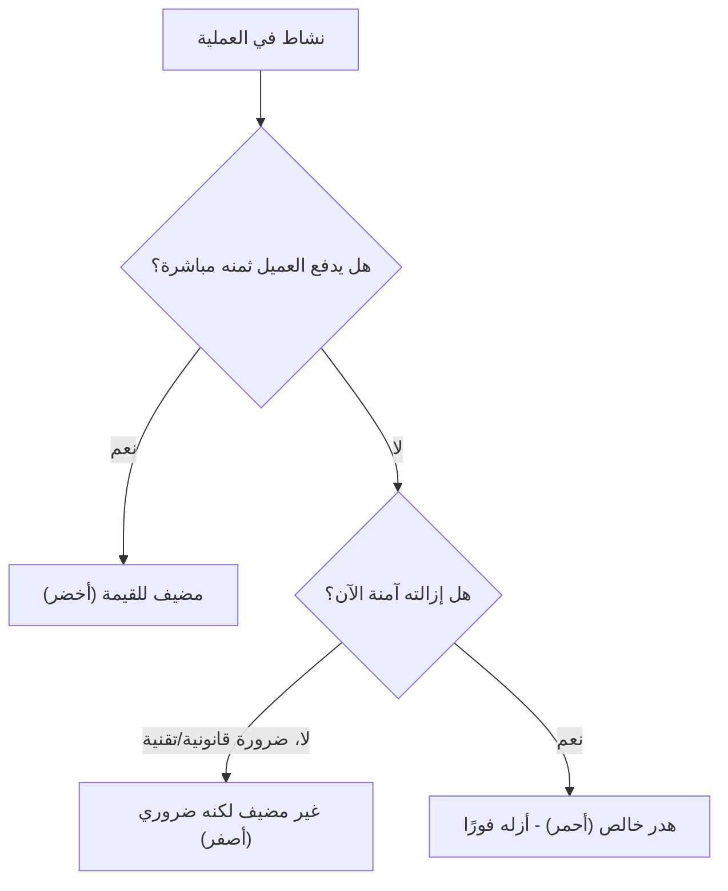

# مضيف للقيمة مقابل غير مضيف لكنه ضروري مقابل هدر خالص (Value-Added vs Non-Value-Added vs Pure Waste)
> [!info] تعريف مختصر
> إطار تصنيف من فلسفة "لين" (Lean) يُقسّم كل نشاط في عملية العمل إلى ثلاث فئات: نشاط **مضيف للقيمة** (Value-Added) يريده العميل ويدفع ثمنه، نشاط **غير مضيف للقيمة لكنه ضروري** (Non-Value-Added but Necessary) لا يريده العميل لكن لا يمكن الاستغناء عنه حاليًا، ونشاط **هدر خالص** (Pure Waste) لا يريده أحد ويجب إزالته فورًا.

## الشرح العلمي والاحترافي
هذا التصنيف هو حجر الأساس في تحليل أي [[Value Stream Mapping]]. لتصنيف نشاط ما، يُطرح سؤال بسيط: "هل سيوافق العميل على الدفع مقابل هذا النشاط لو رآه؟"
- **مضيف للقيمة (VA):** نشاط يُحوّل المنتج أو الخدمة بشكل يريده العميل فعلًا، مثل كتابة الكود الذي ينفّذ الميزة المطلوبة، أو تصميم واجهة يستخدمها المستخدم مباشرة. هذه الأنشطة هي جوهر العمل.
- **غير مضيف للقيمة لكنه ضروري (NVA-Necessary):** نشاط لا يضيف قيمة مباشرة للعميل، لكن إزالته حاليًا مستحيلة أو خطيرة بسبب قيود تنظيمية أو تقنية أو تعاقدية. أمثلة: التوثيق المطلوب قانونيًا، مراجعات الأمان الإلزامية، إعداد بيئة الاختبار، الاجتماعات التنسيقية الضرورية بين فرق متعددة. الهدف هنا ليس الإلغاء بل **التقليص** (Minimize) قدر الإمكان بمرور الوقت.
- **هدر خالص (Pure Waste):** نشاط لا يضيف أي قيمة ولا هو ضروري؛ يجب استهدافه بالإزالة الفورية. أمثلة: انتظار الموافقات غير الضرورية، إعادة العمل بسبب أخطاء (انظر [[Rework Percentage]])، الاجتماعات غير الفعالة، النقل المتكرر للمهام بين فرق دون داعٍ، الميزات المبنية دون استخدام فعلي.
- يرتبط هذا التصنيف مباشرة بمفهوم [[Muda, Mura, Muri]] الياباني، حيث "Muda" تعني الهدر بأنواعه الثمانية الموصوفة في [[DOWNTIME]].
- الفائدة العملية: عند رسم أي [[Value Stream Mapping]]، تُلوَّن كل خطوة بأحد الألوان الثلاثة (أخضر VA، أصفر NVA-ضروري، أحمر هدر خالص)، مما يجعل أولويات التحسين واضحة بصريًا فورًا — ابدأ دائمًا بإزالة الأحمر، ثم قلّص الأصفر، واحمِ الأخضر وطوّره.
- من الناحية الإحصائية، في معظم بيئات تطوير البرمجيات لا تتجاوز نسبة الوقت "المضيف للقيمة" من الوقت الإجمالي 15-25٪، والباقي موزّع بين ضروري وهدر خالص — وهذا ما يجعل هذا التصنيف أداة تشخيصية قوية جدًا.

## أين ومتى يُستخدم
- أثناء بناء أو تحليل [[Value Stream Mapping]] لتصنيف كل خطوة في العملية.
- في ورش [[Kaizen]] لتحديد أولويات التحسين المستمر.
- عند مراجعة [[SOP]] (إجراءات العمل القياسية) لتقليص الخطوات الزائدة.
- في تحليل [[5S]] وتنظيم مساحة العمل الرقمية أو المادية.
- عند مناقشة [[Technical Debt]] وتحديد أي الأعمال إعادة الهيكلة تُعتبر "ضرورية غير مضيفة" مقابل هدر ناتج عن سوء تخطيط سابق.
- في مراجعات [[10 - Sprint Retrospective]] عند تحليل أين ذهب وقت الفريق فعليًا خلال السبرنت.

## مثال وسيناريو تطبيقي
> [!example] فريق تطوير في تطبيق "سوق فوري" يحلّل عملية "معالجة طلب إرجاع منتج" التي تستغرق حاليًا 6 ساعات عمل موزّعة:
> - **مضيف للقيمة (VA):** فحص حالة المنتج المُرجَع وتحديث حالة الطلب في النظام (45 دقيقة) — هذا ما يريده العميل فعلًا: معرفة نتيجة إرجاعه.
> - **غير مضيف لكنه ضروري (NVA-Necessary):** تسجيل الإرجاع في نظام المحاسبة للامتثال الضريبي، وأخذ توقيع إلكتروني على استلام المنتج (ساعة واحدة) — لا يريدها العميل لكنها مطلوبة قانونيًا حاليًا.
> - **هدر خالص (Pure Waste):** انتظار موظف المستودع لتوقيع ورقي يدوي بدل التوقيع الرقمي المتاح فعلًا (ساعتان)، وإعادة إدخال نفس بيانات الطلب في 3 أنظمة مختلفة غير مترابطة بسبب عدم وجود تكامل تقني (ساعتان وربع).
> بعد التحليل، يقرر الفريق دمج الأنظمة الثلاثة عبر واجهة برمجية واحدة (يزيل الهدر الخالص بالكامل تقريبًا: 4 ساعات و15 دقيقة)، ويُبقي على التوثيق القانوني الضروري لكن يؤتمته ليصبح 15 دقيقة بدل ساعة. النتيجة: خفض زمن معالجة الإرجاع من 6 ساعات إلى ساعة واحدة تقريبًا، مع الحفاظ الكامل على الأنشطة المضيفة للقيمة.

## خطوات أو مخطّط
1. اختر عملية محددة لتحليلها (سبرنت كامل، أو مهمة متكررة، أو تدفّق عمل).
2. فكّك العملية إلى خطوات صغيرة قابلة للقياس.
3. لكل خطوة، اسأل: "هل يدفع العميل ثمن هذا مباشرة؟" فإن كانت الإجابة نعم فهي مضيفة للقيمة.
4. إن كانت الإجابة لا، اسأل: "هل يمكن إزالتها الآن دون مخاطرة تنظيمية أو تقنية أو قانونية؟" إن كانت الإجابة لا فهي ضرورية غير مضيفة، وإن كانت نعم فهي هدر خالص.
5. رتّب الأنشطة حسب حجم الوقت المُستهلك في كل فئة.
6. ابدأ بإزالة الهدر الخالص أولًا (أكبر عائد بأقل جهد).
7. ضع خطة لتقليص الأنشطة الضرورية غير المضيفة تدريجيًا (أتمتة، دمج أنظمة، تبسيط إجراءات).
8. أعد القياس دوريًا كجزء من [[Kaizen]] المستمر.

## ⚠️ مفاهيم خاطئة شائعة
> [!warning]
> - الاعتقاد بأن كل نشاط "غير مضيف للقيمة" يجب حذفه فورًا؛ الصحيح أن الأنشطة الضرورية (كالامتثال القانوني والأمان) يجب تقليصها لا حذفها.
> - الخلط بين "الهدر الخالص" و"الأخطاء البشرية" فقط؛ الهدر يشمل أيضًا انتظارًا وتكرارًا ونقلًا غير ضروري حتى لو لم يرتكب أحد خطأ.
> - الاعتقاد أن النشاط المضيف للقيمة من منظور الفريق (مثل "كتابة توثيق تقني داخلي مفصّل") هو دائمًا مضيف للقيمة من منظور العميل؛ التصنيف يجب أن يكون دائمًا من زاوية العميل النهائي.

## ❌ ممارسات خاطئة في المشاريع
> [!failure]
> - تصنيف الاجتماعات التنسيقية دائمًا كـ "ضرورية" دون مراجعة نقدية؛ كثير منها في الواقع هدر خالص يمكن استبداله بتحديث كتابي مختصر. الحل: مراجعة كل اجتماع دوري كل بضعة أشهر واسأل "هل ما زال ضروريًا؟".
> - التركيز فقط على تسريع الأنشطة المضيفة للقيمة (مثل الضغط على المطورين لكتابة كود أسرع) بينما الهدر الحقيقي في الانتظار بين الخطوات؛ الحل: استخدم [[Value Stream Mapping]] لتحديد أين يذهب الوقت فعلًا قبل التركيز على "العمل" نفسه.
> - إهمال قياس هذا التصنيف بشكل دوري واعتباره تمرينًا لمرة واحدة؛ فتعود ممارسات الهدر بمرور الوقت دون رصد. الحل: اجعله جزءًا ثابتًا من [[10 - Sprint Retrospective]] أو مراجعات [[Kaizen]].

## 🔗 مصطلحات ومفاهيم ذات صلة
[[Value Stream Mapping]] · [[Muda, Mura, Muri]] · [[DOWNTIME]] · [[Toyota Production System]] · [[Theory of Constraints]] · [[Kaizen]] · [[5S]] · [[Rework Percentage]] · [[Technical Debt]] · [[Cycle Time]] · [[Lead Time]]
