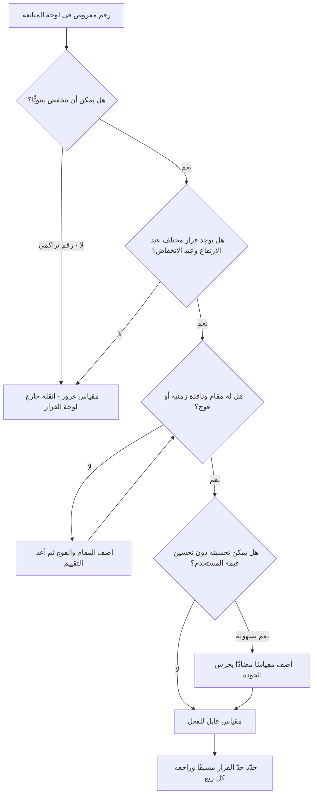

# مقاييس الغرور (Vanity Metrics)

> [!info] تعريف مختصر
> أرقام تبدو مبهرة في العروض التقديمية لكنها لا تُغيّر قرارًا. سمتها البنيوية أنها **تراكمية أو أحادية الاتّجاه**: تكبر مع مرور الوقت بحكم التعريف مهما كان أداء المنتج الحقيقي (إجمالي التسجيلات، إجمالي التحميلات، عدد المتابعين، مجموع مرّات الظهور). المقياس ليس «مقياس غرور» بذاته دائمًا؛ الغرور صفة في **طريقة استخدامه**: حين يُعرض بلا مقام (Denominator)، وبلا تقسيم إلى شرائح، وبلا فرضية مرتبطة به، وبلا أي احتمال أن ينخفض فيدفعنا إلى فعل شيء. الضدّ منه هو المقياس **القابل للفعل** (Actionable) الذي يُميّز بين مسارين ويحدّد أيّهما نُكمل.

## الشرح العلمي والاحترافي
- **السمة الحاسمة: انعدام القابلية للتكذيب.** المقياس الذي لا يمكن أن يعطي إشارة سلبية لا يحمل معلومة. «إجمالي المستخدمين المسجَّلين منذ الإطلاق» لا يمكن أن ينخفض أبدًا — حتى لو غادر كل مستخدم فعليّ اليوم. أي رقم تراكمي (Cumulative) يقيس التاريخ لا الحاضر، ويستمرّ في الصعود بينما المنتج يموت. المحكّ الأول إذن: **هل يمكن لهذا الرقم أن ينخفض؟** إن كان الجواب لا، فهو مقياس غرور بالتعريف.
- **المحكّ العملي الثلاثي للتمييز.** أمام أي رقم في لوحة المتابعة اسأل ثلاثة أسئلة متتابعة، ويكفي فشل واحد منها لتصنيفه غرورًا:
  1. **سؤال القرار**: لو ارتفع هذا الرقم 20% غدًا، ما القرار الذي سأتّخذه؟ ولو انخفض 20%، ما القرار المضادّ؟ إن كان الجوابان متطابقين أو غير موجودين — فالرقم زينة.
  2. **سؤال المقام**: هل للرقم مقام يجعله نسبة؟ «1,200 تسجيل» بلا «من كم زائرًا؟» و«كم منهم أُتمّ الإعداد؟» رقم بلا معنى. المقاييس القابلة للفعل نِسَب ومعدّلات، لا مجاميع.
  3. **سؤال التكرار والزمن**: هل الرقم مربوط بنافذة زمنية وبفوج محدّد؟ «مستخدمون نشطون هذا الأسبوع» معلومة، «مستخدمون منذ البداية» أرشيف.
- **مصدر الشيوع في أدبيات المنتج.** انتشر التمييز بين «مقاييس الغرور» و«المقاييس القابلة للفعل» على نطاق واسع مع موجة [[Lean Startup]]، حيث صار الفصل بينهما ركنًا في منهج التعلّم المُثبَت (Validated Learning): كل رقم يُنشر يجب أن يكون مرتبطًا بفرضية يمكن أن تُكذَّب. كما تكرّر في أدبيات تحليلات المنتج التمييز بين الرقم الذي «يُشعرك بالرضا» والرقم الذي «يُخبرك بما تفعله بعده». الفكرة نفسها أقدم من التسمية: هي في جوهرها تطبيق لمبدأ أن المعلومة هي ما يقلّل عدم اليقين.
- **آلية الضرر: التمويه لا الكذب.** مقاييس الغرور نادرًا ما تكون أرقامًا خاطئة؛ هي أرقام صحيحة تُخفي أرقامًا أهم. حملة تسويقية مدفوعة تُضاعف التسجيلات وتُخفي انهيار الاحتفاظ، لأن المتوسّط الكلّي يمتصّ الأفواج السيّئة داخل الأفواج القديمة الجيّدة — وهو ما يكشفه [[Cohort Analysis]] فورًا. فالخطر ليس في الرقم بل في استبداله للسؤال.
- **العلاقة بـ[[Goodhart's Law]].** حين يُكافأ فريق على مقياس غرور، يصير تحسينه سهلًا وبلا قيمة: يمكن مضاعفة «التسجيلات» بإزالة تأكيد البريد، ومضاعفة «الجلسات» بتقصير مهلة انتهاء الجلسة، ومضاعفة «مرّات الظهور» بشراء مرور رخيص. سهولة التلاعب علامة تشخيصية: **كلما كان تحسين المقياس ممكنًا دون تحسين قيمة المستخدم، اقترب المقياس من الغرور.**
- **ليست كل الأرقام الكبيرة غرورًا، وليس كل مقياس غرور بلا استعمال.** مقاييس الغرور مشروعة في سياقين محدودين: **التمويل والعلاقات العامة** (حيث الحجم إشارة سوقية بحدّ ذاتها)، و**حدّ الاستدامة التشغيلية** (هل نملك قاعدة كافية أصلًا لتُعطي إشارة إحصائية). الخطأ هو تسريبها إلى **لوحة قيادة الفريق** حيث تُتّخذ القرارات الأسبوعية.
- **البديل البنيوي: زوج مقياس + مقام + شريحة.** الصيغة العملية لتحويل أي مقياس غرور إلى مقياس قابل للفعل هي إضافة ثلاثة عناصر: مقام (نسبة بدل عدد)، ونافذة زمنية أو فوج، وحدّ قرار مُعلَن مسبقًا (Threshold) يقول ماذا نفعل فوقه وتحته. «10,000 تحميل» تصير «38% من المُحمِّلين أتمّوا أول مهمّة قيمة خلال 24 ساعة، والحدّ الذي نتوقّف عنده للمراجعة هو 30%».
- **الفرق عن مقياس سيّئ.** المقياس الغروري ليس مرادفًا للمقياس الخاطئ. المقياس الخاطئ يقيس الشيء غلطًا (خلل في التتبّع أو التعريف)، أما الغروري فيقيس شيئًا صحيحًا لكنه غير مرتبط بقرار. كما يختلف عن **مقياس المخرجات** ([[Outcome vs Output]]): «أنجزنا 42 نقطة قصة» ليست غرورًا فحسب بل مقياس مخرَج أيضًا — والاثنان يجتمعان كثيرًا في فرق [[Feature Factory]].

## أين ومتى يُستخدم
- **عند تصميم لوحة قيادة المنتج أو [[Project Health Report]]**: لتنقية اللوحة، فتُحذف الأرقام التراكمية أو تُنقل إلى قسم «سياق» منفصل عن قسم «قرارات».
- **عند اختيار [[North Star Metric]]**: أشهر خطأ في اختيار النجم القطبي هو انتقاء مقياس غروري لأنه يصعد دائمًا فيُشعر الجميع بالنجاح؛ محكّ الغرور هو الفلتر الأول قبل تثبيت النجم.
- **في صياغة [[OKR]] والنتائج الرئيسية**: النتيجة الرئيسية المصاغة كعدد تراكمي («الوصول إلى 50 ألف مسجَّل») تُشجّع على شراء الحجم؛ صياغتها كنسبة أو كمعدّل تُشجّع على تحسين المنتج.
- **عند مراجعة نتائج تجربة أو [[Pilot Launch]]**: للتمييز بين ارتفاع ناتج عن الجِدّة (Novelty) وارتفاع في السلوك المتكرّر، وهو ما يستلزم قراءة الأفواج لا الإجمالي.
- **في تقارير الجهات الراعية ([[Sponsor]]) واللجان التوجيهية ([[Steering Committee]])**: حيث الضغط أكبر لعرض أرقام مطمئنة؛ القاعدة أن يُرافق كل رقم كبير مقياسٌ مضادّ ([[Counter Metric]]) ونسبة تحويل.
- **عند تقييم [[Product-Market Fit]]**: الحجم لا يثبت الملاءمة؛ ما يثبتها هو الاحتفاظ الذي يستقرّ عند مستوى ثابت بدل أن ينزل إلى الصفر، وهذا لا يُقرأ إلا في منحنيات الأفواج.
- **في قياس التبنّي ([[Adoption]]) بعد إطلاق داخلي**: «كل الموظفين أنشأوا حسابًا» رقم غرور إجباري؛ السؤال الحقيقي هو نسبة من يستخدمه أسبوعيًّا بعد ستّة أسابيع.

## مثال وسيناريو تطبيقي
> [!example] منصّة توصيل بقالة في السوق الخليجي. لوحة القيادة التي تُعرض في اللجنة التوجيهية الشهرية تضمّ ثلاثة أرقام: «إجمالي التحميلات: 480,000»، «إجمالي الحسابات: 310,000»، «إجمالي الطلبات منذ الإطلاق: 1.9 مليون». الأرقام الثلاثة ترتفع كل شهر منذ 22 شهرًا، ولم تنخفض قطّ. الانطباع العام: المنتج ينمو.
> في الربع الرابع أوقفت الإدارة صرف حملات التنزيل لمدّة ستّة أسابيع بسبب مراجعة الميزانية. لم يهبط أي رقم من الثلاثة (فهي تراكمية)، لكن **الطلبات الأسبوعية هبطت من 41 ألف إلى 17 ألفًا**. تبيّن أن النمو الظاهر كان يُشترى شراءً: كلفة اكتساب المستخدم 34 ريالًا، ومتوسّط هامش الطلب 6 ريالات، والمستخدم الوسيط يطلب مرّة واحدة ولا يعود.
> أعاد الفريق بناء اللوحة على قاعدة «رقم + مقام + فوج + حدّ قرار»:
> - من التحميل إلى أول طلب خلال 7 أيام: **12%** (الحدّ المُعلَن: 25%).
> - نسبة العائدين للطلب الثاني خلال 30 يومًا: **19%** (الحدّ: 35%).
> - الطلبات الأسبوعية لكل مستخدم نشط: **1.3**.
> - المقياس المضادّ: نسبة الطلبات المتأخّرة عن الوقت الموعود: **8.4%**.
> النتيجة العملية: بدل مطاردة التحميلات، تحوّل الاستثمار إلى تقليص زمن أول طلب (تبسيط الإعداد وحذف خطوتَي تحقّق) ومعالجة التأخير في منطقتين جغرافيّتين كانتا تنتجان أعلى نسبة عدم عودة. بعد ربع كامل: التحميلات الشهرية انخفضت (لأن الإنفاق انخفض)، بينما ارتفعت نسبة العودة للطلب الثاني إلى 31% والطلبات الأسبوعية إلى 26 ألفًا. اللوحة صارت **أقلّ إبهارًا وأكثر صدقًا** — وهذا بالضبط هو الاختبار.

## خطوات أو مخطّط
1. اجرد كل رقم يُعرض حاليًّا في لوحات المتابعة والتقارير، ودوّن مصدره وتعريفه بدقّة.
2. طبّق **محكّ القابلية للانخفاض**: أي رقم لا يمكن أن ينخفض بنيويًّا يُصنّف فورًا خارج لوحة القرار.
3. طبّق **محكّ القرار**: اكتب أمام كل رقم القرار عند الارتفاع والقرار عند الانخفاض؛ الخانة الفارغة تعني الحذف أو النقل إلى قسم السياق.
4. أضف **مقامًا** لكل عدد مطلق فحوّله إلى نسبة، وحدّد **النافذة الزمنية** أو الفوج المرجعي.
5. أعلن **حدّ قرار (Threshold)** لكل مقياس باقٍ، مكتوبًا قبل رؤية النتيجة لا بعدها.
6. أرفق بكل مقياس هدف **مقياسًا مضادًّا** ([[Counter Metric]]) يمنع تحسينه على حساب شيء آخر.
7. افصل اللوحة إلى ثلاث طبقات: مقاييس القرار الأسبوعية، مقاييس السياق، ومقاييس العرض الخارجي — مع منع انتقال الطبقة الثالثة إلى الأولى.
8. راجع اللوحة كل ربع: احذف كل مقياس لم يُغيّر قرارًا واحدًا خلال الربع، فبقاؤه بلا أثر دليل كافٍ على غروره.

## ⚠️ مفاهيم خاطئة شائعة
> [!warning]
> - **«مقياس الغرور = أي رقم كبير»**: الحجم ليس التهمة. مليون مستخدم نشط يوميًّا مقياس ممتاز لأنه قابل للانخفاض ومربوط بنافذة زمنية. التهمة هي التراكم وغياب القرار، لا ضخامة العدد.
> - **«المقياس نفسه غروري دائمًا»**: الصفة سياقية لا جوهرية. «عدد المتابعين» غرور في لوحة فريق المنتج، وقد يكون مقياسًا مشروعًا لفريق يبني قناة توزيع ويقيسه كنسبة نمو أسبوعية مع معدّل تفاعل مقابل.
> - **«يكفي أن نتخلّص من مقاييس الغرور لتصبح لوحتنا سليمة»**: الحذف نصف العمل. لوحة بلا أرقام غرورية لكنها بلا [[Counter Metric]] ولا قراءة أفواج ستضلّل بطريقة أخرى — أهدأ وأخطر.
> - **«الأرقام المطلقة ممنوعة»**: الأعداد المطلقة ضرورية لحساب الكفاية الإحصائية ولتقدير الأثر التجاري. الممنوع هو استعمالها **وحدها** كإشارة أداء بلا نسبة تُسندها.
> - **«المقياس الغروري يكذب»**: غالبًا لا. هو صادق ولذلك يخدع؛ فالفريق يثق به لأنه دقيق تقنيًّا، ولا ينتبه إلى أنه يجيب عن سؤال لم يسأله أحد.
> - **«ما دام المقياس مؤشّرًا متقدّمًا فهو ليس غرورًا»**: التقدّم الزمني لا يعصم. مؤشّر متقدّم ([[Leading and Lagging Indicators]]) بلا علاقة سببية مُختبَرة بالنتيجة هو مقياس غرور مبكّر — يصعد أولًا ثم لا يصعد شيء بعده.

## ❌ ممارسات خاطئة في المشاريع
> [!failure]
> - **الخطأ: بناء لوحة القيادة انطلاقًا مما يسهل قياسه تقنيًّا.** لماذا يضرّ: الأدوات تُخرج افتراضيًّا أعدادًا تراكمية وجلسات ومرّات ظهور، فتصير هذه هي «الحقيقة» بحكم التوافر لا بحكم الأهمّية. الحل: ابدأ من قائمة القرارات الدورية التي يتّخذها الفريق فعلًا، ثم اشتقّ المقياس اللازم لكل قرار، ثم ابنِ التتبّع.
> - **الخطأ: ربط الحوافز والمكافآت بمقاييس تراكمية.** لماذا يضرّ: يفتح أرخص طريق للتحسين وهو شراء الحجم أو تخفيف شروط التسجيل، ويحوّل الفريق إلى مطاردة رقم قابل للتلاعب ([[Goodhart's Law]]). الحل: اربط الحافز بنسب الاحتفاظ والتحويل وبمؤشّر مضادّ للجودة، وراجع النتيجة على مستوى الفوج.
> - **الخطأ: عرض «الإجمالي منذ الإطلاق» في التقرير الشهري للإدارة.** لماذا يضرّ: يُنتج صعودًا بصريًّا دائمًا يُخدّر اللجنة ويؤخّر اكتشاف التدهور شهورًا. الحل: اعرض المتسلسلة الزمنية للنشاط الدوري (أسبوعي أو شهري) وأبقِ الإجمالي في ملحق واحد لا في الشريحة الأولى.
> - **الخطأ: قراءة الأثر من المتوسّط الكلّي بعد حملة تسويقية.** لماذا يضرّ: الأفواج القديمة الجيّدة تُخفي انهيار الأفواج الجديدة، فيبدو الاحتفاظ مستقرًّا وهو ينهار. الحل: اقرأ كل حملة كفوج منفصل عبر [[Cohort Analysis]]، وقارن الفوج بالفوج لا بالمعدّل العام.
> - **الخطأ: تعريف نجاح المشروع بعدد الميزات المُسلَّمة أو نقاط القصة المنجَزة.** لماذا يضرّ: يقيس الحركة لا الوجهة، ويكافئ الإنتاج على حساب الأثر ([[Outcome vs Output]]). الحل: اشترط لكل بند في خارطة الطريق نتيجة سلوكية متوقّعة مكتوبة قبل البناء، وراجعها بعد الإطلاق.
> - **الخطأ: الإبقاء على مقاييس قديمة في اللوحة «لأنها موجودة منذ سنوات».** لماذا يضرّ: يزاحم الضجيجُ الإشارةَ ويوزّع الانتباه على عشرين رقمًا لا يُقرأ منها اثنان. الحل: قاعدة تنظيف ربعية صريحة — كل مقياس لم يُستشهد به في قرار موثّق خلال ربع يُحذف، وإعادته تحتاج مبرّرًا مكتوبًا.
> - **الخطأ: التوقّف عند اكتشاف أن المقياس غروري دون استبداله.** لماذا يضرّ: الفراغ يُملأ بالانطباعات وبأصوات أعلى المتحدّثين. الحل: لا تحذف رقمًا إلا وأنت تضع بديله القابل للفعل في الشريحة نفسها.

## 🔗 مصطلحات ومفاهيم ذات صلة
[[KPI]] | [[North Star Metric]] | [[Outcome vs Output]] | [[Counter Metric]] | [[Leading and Lagging Indicators]] | [[Goodhart's Law]] | [[Cohort Analysis]] | [[Funnel Analysis]] | [[Simpson's Paradox]] | [[Percentiles and Median vs Average]] | [[Product Analytics]] | [[Feature Factory]] | [[Lean Startup]] | [[OKR]]
