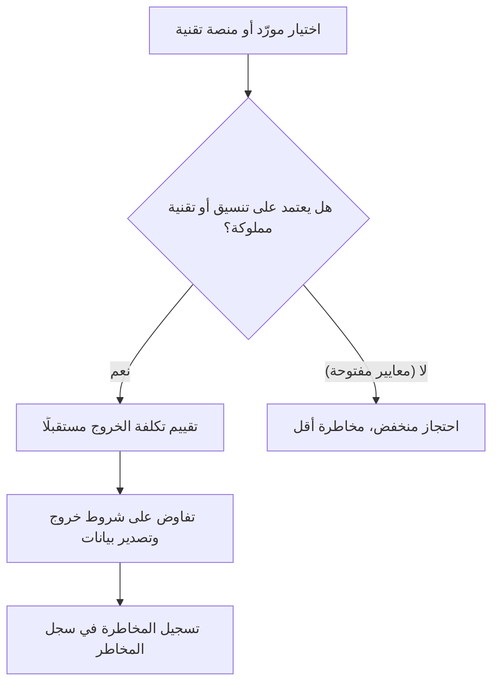

# الاحتجاز لدى المورّد (Vendor Lock-in)
> [!info] تعريف مختصر
> الاحتجاز لدى المورّد (Vendor Lock-in) هو الوضع الذي يصبح فيه التحوّل من مورّد أو منصة تقنية إلى بديل آخر مكلفًا جدًا أو معقدًا تقنيًا أو قانونيًا، بحيث يظل العميل "محتجزًا" لدى المورّد الحالي رغم رغبته في التغيير.

## الشرح العلمي والاحترافي
- يحدث الاحتجاز لدى المورّد عندما يبني المشروع اعتمادًا عميقًا على تقنية أو خدمة خاصة بمورّد واحد، مثل: تنسيق بيانات مملوك (Proprietary Format)، واجهات برمجية (APIs) غير قياسية، أو بنية تحتية سحابية بخدمات لا تتوفر لدى منافسين.
- أنواعه الشائعة:
  1. **احتجاز تقني (Technical Lock-in)**: صعوبة نقل الكود أو البيانات بسبب تقنيات خاصة.
  2. **احتجاز تعاقدي (Contractual Lock-in)**: عقود طويلة الأمد أو غرامات فسخ مرتفعة.
  3. **احتجاز معرفي (Knowledge Lock-in)**: اعتماد الفريق الكامل على خبرة نادرة متعلقة بمنتج واحد فقط.
- خطورته أنه يقلّل قدرة المؤسسة على التفاوض على الأسعار مستقبلًا، ويزيد كلفة أي ترقية أو تغيير استراتيجي، وهذا يُحسب مباشرة ضمن [[TCO]] عند تقييم أي حل تقني.
- الحل الوقائي الأساسي هو اعتماد معايير مفتوحة (Open Standards) وتصميم أنظمة قابلة للفصل (Modular)، إضافة إلى خطة خروج واضحة (Exit Strategy) موثّقة ضمن العقد منذ البداية.

## أين ومتى يُستخدم
- يُقيَّم عند اختيار أي مورّد تقني رئيسي: منصة سحابية، نظام إدارة محتوى، قاعدة بيانات مملوكة، أو أداة SaaS محورية في المنتج.
- يُراجَع ضمن مرحلة **تقييم المخاطر (Risk Assessment)** في بداية المشروع، ويُدرَج غالبًا في [[Risk Register]] كمخاطرة استراتيجية طويلة الأمد.
- مهم بشكل خاص في مشاريع البنية التحتية والمنصات التي يُتوقع أن تعمل لسنوات طويلة.

## مثال وسيناريو تطبيقي
> [!example]
> فريق تقني في شركة تجارة إلكترونية اختار قاعدة بيانات سحابية مملوكة تقدّم أداءً ممتازًا وسعرًا تمهيديًا منخفضًا في السنة الأولى. بعد عامين، أراد الفريق الانتقال إلى بديل أرخص، لكنه اكتشف أن:
> - تنسيق تخزين البيانات خاص بالمورّد ولا يمكن تصديره مباشرة لأي نظام آخر.
> - يلزم إعادة كتابة 40% من الكود الذي يعتمد على دوال خاصة بهذه المنصة فقط.
> - المورّد يفرض رسوم "نقل بيانات للخارج (Egress Fees)" مرتفعة تصل إلى 15,000 دولار لمرة واحدة.
> نتيجة لهذا الاحتجاز، اضطر الفريق للبقاء مع المورّد الحالي رغم ارتفاع أسعاره لاحقًا بنسبة 30%، لأن تكلفة الخروج فاقت التوفير المتوقع من التبديل. هذا الدرس دفع الشركة لاحقًا لاشتراط "قابلية التصدير الكاملة للبيانات" في كل عقد جديد.

## خطوات أو مخطّط
1. تقييم مدى اعتماد الحل المقترح على تقنيات أو تنسيقات مملوكة.
2. التفاوض على شروط خروج واضحة ورسوم نقل بيانات معقولة ضمن العقد.
3. تفضيل المعايير المفتوحة وواجهات برمجية قياسية عند توفرها.
4. تصميم البنية بطريقة معيارية (Modular) تسمح باستبدال جزء دون كامل النظام.
5. توثيق مخاطرة الاحتجاز ضمن سجل المخاطر ومتابعتها دوريًا.

## ⚠️ مفاهيم خاطئة شائعة
> [!warning]
> - الاعتقاد أن الاحتجاز لدى المورّد يقتصر على العقود القانونية فقط، بينما أخطر أنواعه تقني وناتج عن بنية الكود نفسها.
> - الظن أن اختيار موردين كبار ومعروفين يحمي تلقائيًا من الاحتجاز، رغم أن كبار الموردين غالبًا من أكثر من يستخدم تقنيات مملوكة.
> - تجاهل تقييم هذه المخاطرة لأن المشروع "لا يزال في بدايته"، مع أن قرارات التصميم المبكرة هي أكبر مصدر لاحتجاز لاحق يصعب تفكيكه.

## ❌ ممارسات خاطئة في المشاريع
> [!failure]
> - التوقيع على عقد طويل الأمد مع مورّد دون قراءة بنود الخروج أو رسوم نقل البيانات، فتُكتشف التكلفة الحقيقية فقط عند محاولة المغادرة.
> - بناء كل منطق العمل (Business Logic) مباشرة على ميزات خاصة بمورّد واحد دون طبقة تجريد (Abstraction Layer) تسمح باستبداله لاحقًا.
> - عدم تضمين مخاطرة الاحتجاز لدى المورّد ضمن [[Risk Register]] منذ بداية المشروع، فتُفاجأ الإدارة بها فقط عند الحاجة الفعلية للتبديل.

## 🔗 مصطلحات ومفاهيم ذات صلة
[[Outsourcing]], [[TCO]], [[Risk Register]], [[CapEx vs OpEx]], [[Standard Contractual Clauses]], [[Technical Debt]]
