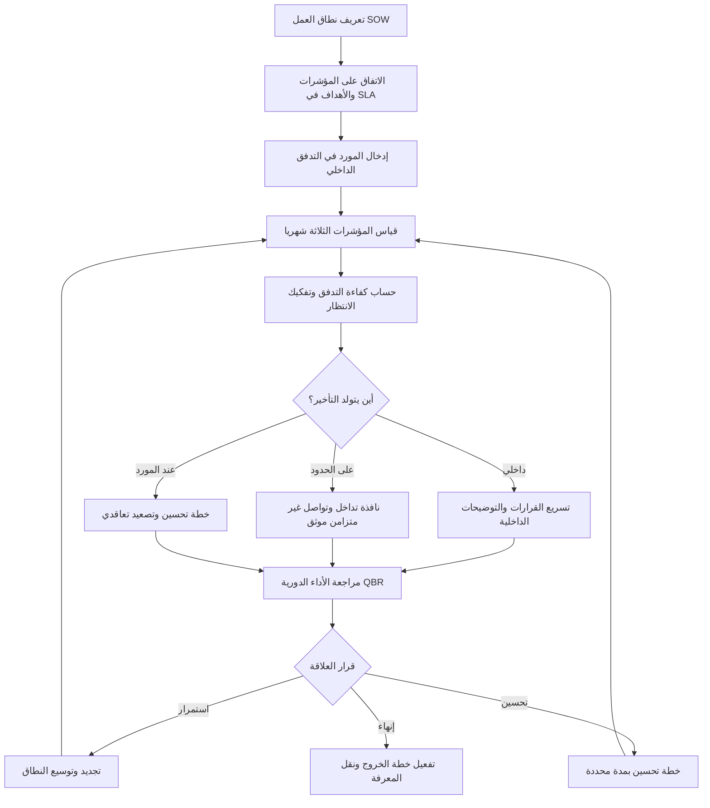

# إدارة المورّدين (Vendor Management)

> [!info] تعريف مختصر
> إدارة المورّدين (Vendor Management) هي ممارسة إدارة الأطراف الخارجية المشاركة في التسليم — شركات تطوير، مزوّدو خدمات، مقاولون من الباطن — **بالمؤشرات والقرارات لا بطلب التقارير**. جوهرها أن المورّد ليس صندوقًا أسود تُرسل إليه المتطلبات وتُنتظر مخرجاته، بل **جزء من تدفّق عملك الداخلي** يُقاس أداؤه بأرقام متفق عليها (زمن الاستجابة، معدّل الأخطاء، دقّة الالتزام بالمواعيد)، وتُتّخذ بناءً عليها قرارات تصعيد أو تعديل أو إنهاء.

## الشرح العلمي والاحترافي
- **من "طلب التقارير" إلى "الإدارة بالمؤشرات"**: النمط الشائع والفاشل هو أن يطلب مدير المشروع من المورّد تقريرًا أسبوعيًا يصف ما أنجزه. المشكلة أن التقرير يكتبه المورّد عن نفسه، بلغته، وبتعريفه لـ"مُنجَز"، فيتحوّل إلى تمرين في طمأنة العميل. البديل الاحترافي هو تعريف **مؤشرات موضوعية تُستخرج من أنظمة العمل نفسها** لا من سرد المورّد، ثم إدارة العلاقة بناءً عليها.
- **المؤشرات الثلاثة الأساسية** التي تكفي لإدارة أغلب المورّدين:
  1. **زمن الاستجابة (Response Time)**: كم يستغرق المورّد للردّ على طلب أو استفسار أو بلاغ عيب. الهدف النموذجي: **الاستجابة خلال 24 ساعة عمل** للبنود العادية، وأقل من 4 ساعات للحرجة. هذا المؤشر هو أسرع كاشف لتراجع اهتمام المورّد بحسابك.
  2. **معدّل الأخطاء / الجودة (Defect / Quality Rate)**: نسبة المخرجات المرفوضة أو المُعادة للتصحيح من إجمالي المسلَّم. الهدف النموذجي: **أقل من 10%**. تجاوزها المزمن يعني أن كل تسليم يستهلك دورة مراجعة إضافية، أي أن سرعتك المُعلنة وهمية.
  3. **دقّة الالتزام بالمواعيد (On-Time Delivery Accuracy)**: نسبة التسليمات التي وصلت في موعدها المتفق عليه. الهدف النموذجي: **90% فأعلى**. ما دون ذلك يجعل تخطيطك بلا معنى لأنك تبني جدولًا على وعود غير موثوقة.
- **المبدأ المحوري: أدخِل المورّد داخل تدفّقك الداخلي (Internal Flow)**. المورّد الذي يعمل خارج نظامك — لوحته عنده، مهامه عنده، تعريفه لـ"جاهز" عنده — يخلق **حدودًا معتمة** لا ترى ما يحدث داخلها. الممارسة الناضجة أن تُدخِل عمل المورّد في لوحة العمل نفسها التي يستخدمها فريقك الداخلي، بالحالات نفسها وتعريف الإنجاز نفسه ([[Definition of Done]]). عندها تصبح كل مهمة قابلة للتتبّع زمنيًا عبر المراحل.
- **قياس [[Flow Efficiency]] عبر الحدود**: بعد إدخال المورّد في التدفّق، احسب كفاءة التدفّق = (زمن العمل الفعلي ÷ إجمالي الزمن المنقضي). هذه الخطوة تقلب طبيعة النقاش جذريًا: بدل الجدل "المورّد بطيء / لا، العميل متأخر"، تُظهر الأرقام **أين يتولّد الانتظار فعلًا**. في كثير من الحالات يتبيّن أن أكبر مصدر تأخير ليس عمل المورّد بل **انتظار موافقة داخلية** أو غموض في المتطلبات من جهة العميل نفسه. لوم المورّد بلا قياس التدفّق هو تشخيص بلا فحص.
- **مخاطر الاعتماد على طرف خارجي** وعلاجها:
  - **فارق التوقيت (Time Zone Gap)**: فريق يعمل بفارق 6 ساعات يعني أن كل سؤال-جواب يستهلك يومًا كاملًا، فتتضخّم مدّة الدورة بلا زيادة في العمل. العلاج: تحديد **نافذة تداخل يومية** إلزامية (3–4 ساعات مشتركة)، وتحويل التواصل من متزامن إلى غير متزامن موثّق ([[Single Source of Truth]]).
  - **عدم التفرّغ (Shared Resources)**: المورّد يوزّع الشخص نفسه على ثلاثة عملاء، فتشتري "مورد" وتحصل على جزء منه. العلاج: اشتراط تفرّغ مُسمّى بنسبة محدّدة في [[SOW]]، وقياس الإنتاجية الفعلية لا الساعات المفوترة.
  - **احتكار المعرفة (Knowledge Monopoly)**: مع الوقت يصبح المورّد هو الوحيد الذي يفهم النظام، فتفقد القدرة على تغييره أو حتى التفاوض معه — وهي بداية [[Vendor Lock-in]]. العلاج: [[Knowledge Management]] منهجي — توثيق إلزامي كجزء من تعريف الإنجاز، مراجعات كود مشتركة، و**اشتراط استمرارية فريق داخلي** (شخص أو اثنان على الأقل من موظفيك يعملان جنبًا إلى جنب مع المورّد ويملكان معرفة كاملة بالحل).
- **الإطار التعاقدي والتقييمي**: [[SLA]] يحدّد المستويات المتعاقد عليها وعواقب الإخلال بها، بينما **بطاقة تقييم المورّد** ([[بطاقة تقييم المورّد (Vendor Scorecard)]]) تُحوّل المؤشرات إلى درجة دورية (ربع سنوية عادةً) تُبنى عليها قرارات التجديد والتوسّع والإنهاء. المؤشرات بلا بطاقة تقييم تبقى معلومات؛ والبطاقة هي ما يحوّلها إلى قرار.

## أين ومتى يُستخدم
- **في مشاريع الإسناد الخارجي (Outsourcing)** الكلي أو الجزئي لتطوير البرمجيات أو التشغيل أو الدعم.
- **في المشاريع متعددة المورّدين (Multi-vendor)**، حيث تصبح إدارة **الاعتماديات بين المورّدين** أصعب من إدارة كل مورّد على حدة — تأخّر مورّد التكامل يُعطّل مورّد التطبيق.
- **عند شراء أنظمة جاهزة مع خدمات تنفيذ** (ERP، CRM)، حيث تمتد العلاقة سنوات وتُصبح مخاطر الاحتكار المعرفي حقيقية.
- **في مرحلة التعاقد نفسها**: تُصاغ المؤشرات وأهدافها الرقمية **قبل التوقيع** داخل [[SOW]] و[[SLA]]، لأن إضافتها لاحقًا تفاوض من موقع ضعيف.
- **في المراجعات الدورية**: مراجعة تشغيلية أسبوعية مع فريق المورّد، ومراجعة أداء ربع سنوية (QBR) مع إدارته لعرض بطاقة التقييم واتخاذ قرارات العلاقة.
- **عند تدهور الأداء**: تفعيل [[Escalation Path]] المتفق عليه تعاقديًا، وتسجيل الأثر في [[RAID Log]] كخطر أو قضية بمالك وتاريخ.

## مثال وسيناريو تطبيقي
> [!example] **شركة تعاقدت مع مورّد تطوير خارجي (فارق توقيت 5 ساعات) لبناء وحدة تكامل، بعقد 9 أشهر وقيمة 640 ألف ريال. بعد 3 أشهر، الشكوى المتكرّرة من الفريق الداخلي: "المورّد بطيء جدًا".**
>
> **قبل القياس** كان الحوار انطباعيًا: العميل يرى تأخيرًا، والمورّد يردّ بأنه ينتظر توضيحات. أدخل مدير المشروع مهام المورّد في لوحة العمل الداخلية بالحالات نفسها، وقاس شهرًا كاملًا:
>
> | المؤشر | الهدف | الفعلي |
> |---|---|---|
> | دقّة الالتزام بالمواعيد | 90% | 68% |
> | معدّل الأخطاء (مخرجات مُعادة) | < 10% | 17% |
> | زمن الاستجابة للطلبات | 24 ساعة | 31 ساعة |
>
> ثم حسب [[Flow Efficiency]] لـ 24 مهمة: متوسط الزمن المنقضي للمهمة **11.5 يوم عمل**، منها **3.2 يوم عمل فعلي** فقط → كفاءة تدفّق **28%**. وعند تفكيك أيام الانتظار الـ 8.3:
> - **3.6 يوم** انتظار توضيح متطلبات من محلل الأعمال **الداخلي** (وليس من المورّد).
> - **2.1 يوم** انتظار موافقة داخلية على التصميم.
> - **1.8 يوم** فاقد فارق التوقيت (سؤال يُطرح آخر اليوم فيُجاب في اليوم التالي).
> - **0.8 يوم** انتظار داخل فريق المورّد.
>
> **الاكتشاف**: 69% من التأخير يتولّد **داخل المؤسسة نفسها**، لا عند المورّد. لو اكتُفي باللوم لضاع ربع سنة في نزاع عقيم.
>
> **الإجراءات المتخذة**: (1) نافذة تداخل يومية إلزامية 3 ساعات (11:00–14:00) لحسم الأسئلة في اليوم نفسه؛ (2) تفويض محلل أعمال متفرّغ 50% للردّ خلال 4 ساعات؛ (3) تفويض اعتماد التصاميم لمدير التسليم بدل انتظار اللجنة؛ (4) تشديد تعريف الإنجاز على المورّد لخفض معدّل الأخطاء، مع اشتراط توثيق كل وحدة كجزء من القبول؛ (5) تعيين مطوّرَين داخليَّين للعمل مع فريق المورّد لمنع احتكار المعرفة.
>
> **النتيجة بعد شهرين**: كفاءة التدفّق 51%، متوسط الزمن المنقضي 6.4 يوم، الالتزام بالمواعيد 87%، معدّل الأخطاء 9%، وزمن الاستجابة 19 ساعة — دون تغيير المورّد ودون زيادة تكلفة تُذكر.

## خطوات أو مخطّط
1. **تعريف نطاق العمل بدقّة** في [[SOW]]: المخرجات، معايير القبول، تعريف الإنجاز، ومتطلبات التوثيق.
2. **الاتفاق على المؤشرات وأهدافها الرقمية قبل التوقيع** وتضمينها في [[SLA]] مع عواقب الإخلال ومسار [[Escalation Path]].
3. **إدخال عمل المورّد في التدفّق الداخلي**: اللوحة نفسها، الحالات نفسها، تعريف الإنجاز نفسه.
4. **قياس المؤشرات الثلاثة شهريًا** من بيانات النظام لا من تقرير المورّد.
5. **حساب [[Flow Efficiency]] عبر الحدود** وتفكيك أزمنة الانتظار حسب مصدرها (داخلي / حدودي / عند المورّد).
6. **معالجة أكبر مصدر انتظار أولًا** أيًّا كان موقعه — حتى لو كان داخل مؤسستك.
7. **عقد مراجعة أداء دورية (QBR)** تُعرض فيها [[بطاقة تقييم المورّد (Vendor Scorecard)]] وتُتّخذ قرارات: استمرار، خطة تحسين، تخفيض نطاق، أو إنهاء.
8. **حماية المعرفة باستمرار**: توثيق إلزامي، فريق داخلي مرافق، وخطة خروج (Exit Plan) جاهزة منذ اليوم الأول.

## ⚠️ مفاهيم خاطئة شائعة
> [!warning]
> - **الظن بأن التعاقد ينقل المسؤولية**: يمكنك إسناد العمل، لكن **لا يمكنك إسناد المساءلة**. أمام الإدارة والعميل النهائي، أنت المسؤول عن النتيجة كاملة مهما كان المتسبب في الخلل.
> - **الاعتقاد بأن كثرة التقارير المطلوبة تعني إدارة أفضل**: طلب تقرير يومي من المورّد يستهلك وقته في الكتابة بدل التنفيذ، ويعطيك شعورًا بالسيطرة لا سيطرة فعلية. مؤشر واحد موضوعي أنفع من عشر صفحات سرد.
> - **افتراض أن التأخير سببه المورّد دائمًا**: كما يُظهر قياس كفاءة التدفّق، غالب الانتظار يتولّد عند حدود التسليم وفي دورات الموافقة الداخلية.
> - **الخلط بين السعر والتكلفة**: المورّد الأرخص بمعدّل أخطاء 25% أغلى فعليًا من الأعلى سعرًا بمعدّل 5%، لأن كل خطأ يستهلك وقت مراجعة داخلي وتأخيرًا في الجدول.
> - **اعتبار العلاقة مع المورّد لعبة صفرية**: الضغط الأقصى على الهامش يدفع المورّد إلى تعيين أقل الكفاءات على حسابك. العلاقة الناضجة تُدار كشراكة محكومة بمؤشرات، لا كصراع.
> - **الظن بأن [[SLA]] وحده يكفي**: العقد يحدّد ما يُعوَّض عند الإخلال، لكنه لا يمنع الإخلال. الوقاية تأتي من القياس المستمر والتصعيد المبكر.

## ❌ ممارسات خاطئة في المشاريع
> [!failure]
> - **إدارة المورّد بطلب التقارير بدل قياس المؤشرات**: يُنتج طمأنة زائفة وأرقامًا يكتبها الطرف المُقيَّم عن نفسه. الحل: استخراج زمن الاستجابة ومعدّل الأخطاء والالتزام بالمواعيد من نظام العمل مباشرة، ومقارنتها بأهداف رقمية متفق عليها مسبقًا.
> - **ترك المورّد يعمل خارج التدفّق الداخلي**: لوحة منفصلة وتعريف إنجاز مختلف يخلقان منطقة عمياء لا تُكتشف إلا عند التسليم. الحل: لوحة واحدة، حالات موحّدة، وتعريف إنجاز مشترك مُوثَّق في [[SOW]].
> - **الاعتماد على شخص واحد من طرف المورّد يعرف كل شيء**: مغادرته تُوقف المشروع، وبقاؤه يمنحه سلطة تفاوضية غير صحّية. الحل: اشتراط بديل مُدرَّب لكل دور حرج، وتوثيق إلزامي، وفريق داخلي مرافق يضمن الاستمرارية.
> - **عدم وجود خطة خروج منذ البداية**: حين تسوء العلاقة تكتشف أنك لا تملك الكود ولا الوثائق ولا حق الوصول، فتصبح رهينة [[Vendor Lock-in]]. الحل: تضمين ملكية المخرجات وحقوق الوصول وإجراءات نقل المعرفة في العقد منذ اليوم الأول.
> - **تجاهل فارق التوقيت في تخطيط الجدول**: تُبنى تقديرات على أن دورة السؤال-الجواب فورية، فينزلق الجدول تدريجيًا بلا سبب ظاهر. الحل: احتساب فاقد التزامن صراحة في التقدير، وفرض نافذة تداخل يومية، ونقل أكبر قدر من التواصل إلى شكل غير متزامن موثّق.
> - **تصعيد متأخّر ومبني على الانطباع**: الشكوى بعد أربعة أشهر بلا أدلة رقمية تُقابَل بالإنكار وتُفسد العلاقة. الحل: مسار تصعيد متدرّج ومتفق عليه تعاقديًا، يُفعَّل عند تجاوز عتبة مؤشر لشهرين متتاليين، ومدعوم ببيانات موثّقة.
> - **قياس الساعات المفوترة بدل القيمة المسلَّمة**: يكافئ المورّد على استهلاك الوقت لا على إنجاز النتيجة. الحل: ربط الدفعات بمخرجات مقبولة وفق معايير القبول، لا بعدد الساعات.

## 🔗 مصطلحات ومفاهيم ذات صلة
[[Outsourcing]] | [[بطاقة تقييم المورّد (Vendor Scorecard)]] | [[SLA]] | [[Vendor Lock-in]] | [[SOW]] | [[Flow Efficiency]] | [[Escalation Path]] | [[RAID Log]] | [[Single Source of Truth]] | [[Knowledge Management]] | [[Definition of Done]]
