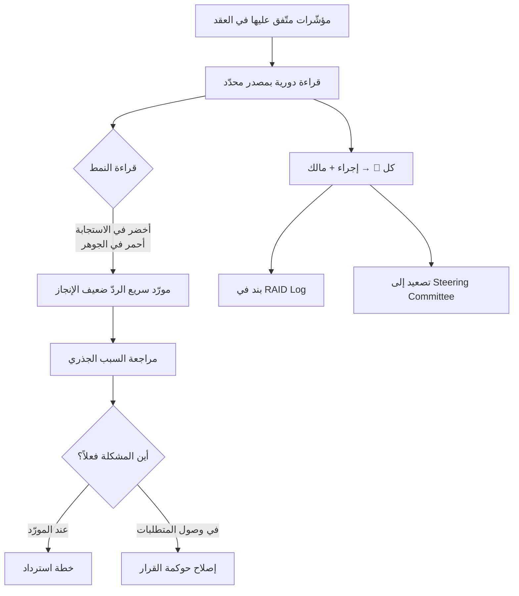

# بطاقة تقييم المورّد (Vendor Scorecard)

> [!info] تعريف مختصر
> **بطاقة تقييم المورّد** أداة تُدير علاقة المورّد **بالمؤشّرات لا بالانطباع**: مجموعة مقاييس لكل منها هدف متّفق عليه وقراءة حالية وحالة لونية وإجراء مقابل، تُحدَّث دورياً وتُعرض في لجنة التوجيه. وغرضها ليس التوثيق للمساءلة اللاحقة، بل **كشف نمط الأداء مبكّراً** — إذ إن أخطر أنواع المورّدين هو سريع الاستجابة ضعيف الإنجاز، وهو نوع لا تكشفه إلا الأرقام لأن انطباعه ممتاز.

## الشرح العلمي والاحترافي

- **جذر المشكلة — الانطباع خادع بنيوياً**: تقييم المورّد بالإحساس يعتمد على أكثر ما نلمسه: سرعة الردّ ونبرة التواصل. وهذان أرخص ما يستطيع المورّد تقديمه وأقلّهما ارتباطاً بجودة التسليم. فينشأ **انفصال منهجي** بين الانطباع والأداء.

- **المؤشّرات الستة وما تقيسه فعلاً**:
  | المؤشّر | ظاهره | ما يقيسه حقيقةً |
  |---|---|---|
  | `Response Time` | سرعة الردّ | الانضباط التواصلي — لا الجودة |
  | `Defect Rate` | جودة التسليم | إتقان التنفيذ |
  | `Commitment Accuracy` | الالتزام بالوعود | **واقعية تقديره لنفسه** |
  | **`Rework Rate`** | إعادة العمل | **جودة الفهم لا جودة العمل** |
  | `SLA Compliance` | الالتزام بالدعم | نضج عملياته |
  | **`Dependency Closure`** | إغلاق الاعتماديات | **أثره على تجميد فريقك أنت** |

- **لماذا `Rework Rate` يقيس «جودة الفهم»؟** إعادة العمل نادراً ما تنشأ من ضعف تنفيذي — بل من **بناء الشيء الخطأ بإتقان**. وارتفاعها علامة على خلل في التحليل أو في وصول المتطلبات أو في اعتمادها، لا في مهارة المطوّر. والأثر العملي مباشر: حين يرتفع، **لا تطلب من المورّد أن «يعمل بجودة أعلى»** — بل راجع كيف تصله المتطلبات ومن يعتمدها.

- **`Dependency Closure` — أخطر مؤشّر وأكثرها إغفالاً**: بقيّة المؤشّرات تقيس أداء المورّد على عمله هو؛ وهذا يقيس أثره **على عملك أنت**. فالاعتمادية المفتوحة (واجهة برمجية متأخّرة، اعتماد لم يصل) تُجمّد فريقك بالكامل بينما مؤشّرات المورّد الأخرى تبدو مقبولة. ويجب أن يُربَط دائماً ببند `Dependency` في [[RAID Log]].

- **النمط الأخطر — أخضر في الاستجابة وأحمر في الجوهر**: حين تقرأ `SLA Response` أفضل من الهدف بينما `Rework` و`Critical Bugs` حمراوان، فالترجمة: **مورّد سريع الردّ ضعيف الإنجاز**. وهو أشيع الأنماط وأخطرها لأنه يُنتج رضا شعورياً يحجب المشكلة. **ولولا الأرقام لكان تقييم هذا المورّد إيجابياً.**

- **العمود الذي يجعلها أداة لا تقريراً**: البطاقة التي تعرض الحالة دون إلزام بإجراء تخالف قاعدة المؤشّرات (أي مؤشّر لا يقود قراراً ليس مفيداً). فلكل لون أحمر إجراء مُسمّى: مراجعة السبب الجذري · تجميد الإصدار · خطة استرداد بموعد · تصعيد إلى [[Steering Committee]].

- **الحلّ البنيوي — إدخال المورّد في التدفّق**: البطاقة تقيس ولا تعالج. والعلاج الجذري أن تصير مهام المورّد **بنوداً في لوحتك** لا رسائل بريد متبادلة؛ لأن المورّد خارج التدفّق يُنتج انتظاراً وتسليمات متكرّرة، وهما أكبر مكوّني [[Time to Value]].

## أين ومتى يُستخدم
- **شهرياً** في [[Steering Committee]] — لا في الاجتماع الأسبوعي، لأن معالجتها تحتاج سلطة تعاقدية.
- عند **تجديد عقد أو توسيع نطاق** مع مورّد قائم.
- في **اختيار مورّد جديد**: بطاقة مشاريع سابقة أصدق من عرض تقديمي.
- عند **التصعيد التعاقدي**: الأرقام المتراكمة عبر أشهر هي الأساس الوحيد القابل للدفاع.
- كمصدر لبعض صفوف [[Early Warning Dashboard]] حين يكون التنفيذ عبر طرف خارجي.

## مثال وسيناريو تطبيقي
> [!example] مورّد ممتاز في الانطباع، متعثّر في الرقم
> | المؤشّر | الهدف | الحالي | الحالة |
> |---|---|---|---|
> | `SLA Response` | 24 ساعة | **18 ساعة** | 🟢 |
> | `On-Time Delivery` | 90% | 86% | 🟡 |
> | `UAT Pass Rate` | 85% | 81% | 🟡 |
> | **`Rework`** | < 15% | **22%** | 🔴 |
> | **`Critical Bugs`** | 0 | **2** | 🔴 |
> | **`Dependency Closure`** | 90% | **60%** | 🔴 |
>
> **الانطباع في الاجتماعات:** مورّد ممتاز — يردّ خلال 18 ساعة، ونبرته متعاونة، ولا يماطل.
>
> **قراءة البطاقة:** ثلاثة أحمر. وإعادة العمل عند 22% تعني أن **قرابة ربع ما يُبنى يُعاد**. وإغلاق الاعتماديات عند 60% يعني أن **40% من التزاماته المفتوحة تُجمّد فرقاً أخرى**.
>
> **الإجراءات المشتقّة:**
> | المؤشّر | الإجراء |
> |---|---|
> | `Rework` 22% | مراجعة السبب الجذري + مراجعة آلية تسليم المتطلبات واعتمادها |
> | `Critical Bugs` 2 | تجميد الإصدار حتى الإغلاق |
> | `Dependency Closure` 60% | تصعيد إلى لجنة التوجيه + جدول إغلاق بمواعيد |
>
> **الاكتشاف الأهمّ:** مراجعة السبب الجذري لإعادة العمل كشفت أن المتطلبات كانت تصل المورّد **قبل اعتمادها من العميل** — أي أن سبب 22% لم يكن عند المورّد أصلاً بل في حوكمة القرار لدى العميل. **البطاقة كشفت المشكلة عند المورّد، والتحليل نقلها إلى مكانها الصحيح.**

## خطوات أو مخطّط
1. اتّفق على المؤشّرات وأهدافها **في العقد** لا بعده.
2. حدّد مصدر بيانات كل مؤشّر ووتيرة قراءته.
3. أدرج `Dependency Closure` ولو لم يطلبه أحد.
4. أضِف عمود الإجراء الإلزامي لكل لون أحمر.
5. اقرأ **النمط** لا الصفوف: هل الأخضر في الاستجابة والأحمر في الجوهر؟
6. حوّل كل أحمر إلى بند في [[RAID Log]] بمالك و`Trigger`.
7. اعرضها في [[Steering Committee]] شهرياً — وشارك النتيجة مع المورّد نفسه.
8. عالج جذرياً بإدخال مهام المورّد في تدفّق عملك.

## ⚠️ مفاهيم خاطئة شائعة
> [!warning]
> - **الظنّ بأن سرعة الاستجابة مؤشّر جودة**: هي أرخص ما يقدّمه المورّد وأقلّها ارتباطاً بالتسليم.
> - **قراءة `Rework` كضعف مهارة**: هو ضعف **فهم** غالباً، وقد يكون سببه عندك لا عنده.
> - **اعتبار البطاقة أداة عقاب**: هي أداة إدارة علاقة؛ وتُشارَك مع المورّد لا تُخفى عنه.
> - **الاكتفاء بمؤشّرات أداء المورّد الذاتية**: أخطر أثر للمورّد يقع على **فريقك** عبر الاعتماديات المفتوحة.
> - **الظنّ بأن البطاقة تكفي**: هي قياس؛ والعلاج البنيوي إدخال المورّد في التدفّق.

## ❌ ممارسات خاطئة في المشاريع
> [!failure]
> - **بطاقة بلا عمود إجراء**: تتحوّل إلى أرشيف ألوان. الحلّ: إجراء إلزامي لكل أحمر.
> - **الاتّفاق على المؤشّرات بعد بدء العمل**: يجعلها موضع جدل بدل أن تكون معياراً. الحلّ: ضمّنها ملحقاً تعاقدياً.
> - **إغفال `Dependency Closure`**: يترك أخطر أثر بلا قياس. الحلّ: أدرجه واربطه بـ`Dependency` في [[RAID Log]].
> - **عدم تسجيل أحمر المورّد في `RAID`**: يجعل السجلّ لا يعكس اللوحات الأخرى. الحلّ: كل 🔴 في أي لوحة يهبط إلى `RAID`.
> - **عرضها على المورّد كاتّهام**: يُقابَل بالدفاع. الحلّ: اعرضها كأداة تحسين مشترك واسأل عن السبب قبل الحكم.
> - **قياس شهري بلا اتّجاه**: الرقم المنفرد أقلّ دلالة من اتّجاهه. الحلّ: أظهر قراءة الشهر السابق بجانب الحالية.

## 🔗 مصطلحات ومفاهيم ذات صلة
[[Vendor Management]] | [[RAID Log]] | [[Early Warning Dashboard]] | [[Steering Committee]] | [[SLA]] | [[Time to Value]] | [[18 - Vendor Scorecard]]
