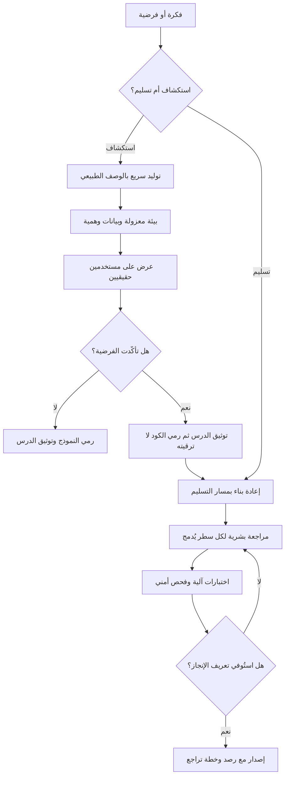

# البرمجة بالإحساس (Vibe Coding)

> [!info] تعريف مختصر
> أسلوب في إنتاج البرمجيات يصف فيه الإنسان **النتيجة المطلوبة بلغة طبيعية**، ويتولّى نموذج لغوي توليد الكود، ثم يحكم الإنسان على الناتج بتجريبه لا بقراءته: إن بدا يعمل قُبِل، وإن لم يعمل أُعيد وصف المشكلة بالعامّية ليولّد النموذج محاولة جديدة. الفارق الجوهري عن الاستعانة المعتادة بمساعد برمجي هو **التخلّي عن مراجعة الكود سطرًا سطرًا**؛ فالمطوّر هنا يتفاعل مع سلوك البرنامج لا مع بنيته، ويتراكم في المشروع كود لم يقرأه أحد ولا يعرف أحد لماذا كُتب على هذا النحو. المصطلح صاغه **أندريه كارباثي (Andrej Karpathy)** في فبراير 2025، وكان في أصله وصفًا **ساخرًا جزئيًّا** لطريقة عمل ممتعة وسريعة تصلح للمشاريع العابرة والتجارب الشخصية الصغيرة — لا وصفًا لمنهجية موصى بها لبناء أنظمة جادّة يعتمد عليها مستخدمون حقيقيون. وقد انتشر المصطلح بعد ذلك انتشارًا واسعًا حتى استُعمل كثيرًا بمعنى إيجابي مجرّد من هذا التحفّظ الأصلي.

## الشرح العلمي والاحترافي
- **الأصل والنسبة والتحفّظ المرافق**: نُسب المصطلح منذ نشأته إلى كارباثي (فبراير 2025)، ووُصف به أسلوب عمل يستسلم فيه المطوّر لتدفّق التوليد ويتعامل مع الكود كصندوق أسود. المهم في النسبة أن **التحفّظ كان جزءًا من الصياغة الأصلية لا إضافة لاحقة من النقّاد**: الأسلوب قُدِّم بوصفه مناسبًا لمشاريع رمي بعد الاستعمال (Throwaway Projects) ونماذج عطلة نهاية الأسبوع، لا لأنظمة إنتاج. أما ما تلا ذلك من استعمال المصطلح شعارًا تسويقيًّا أو منهجية عمل معتمدة فهو تحوّل في الاستعمال العام، لا امتداد للمعنى الأصلي.
- **قوّته الحقيقية: انهيار كلفة المحاولة الأولى**: القيمة الأوضح للأسلوب أنه يخفض كلفة الوصول من فكرة إلى شيء يمكن لمسه من أيام إلى ساعات. هذا يغيّر اقتصاديات الاستكشاف: يصير ممكنًا اختبار خمس فرضيات بدل واحدة، ورفض أربع منها بكلفة زهيدة — وهو مكسب حقيقي في مرحلة اكتشاف المنتج ([[Product Discovery]]) وفي بناء نماذج أوّلية للتحقّق من الطلب قبل الالتزام بالبناء.
- **مصدر خطره: انفصال سرعة الإنتاج عن سرعة الفهم**: كتابة الكود لم تكن يومًا العنق الحقيقي في المشاريع الجادّة؛ العنق هو الفهم والمراجعة والصيانة والتصحيح. حين تتسارع الكتابة عشرة أضعاف وتبقى قدرة الفريق على الفهم كما هي، لا يختفي العمل بل ينتقل إلى المستقبل بصيغة أثقل. هذه هي الآلية الدقيقة التي يتولّد بها [[Technical Debt]] هنا: ليس دَينًا اختاره الفريق بوعي مقابل سرعة، بل دَين **غير مرئي غير موثّق لم يوقّع عليه أحد**، لأن أحدًا لم يقرأ ما استُدين.
- **فرق حاسم بين المساعدة والاستسلام**: استخدام نموذج لتوليد كود ثم قراءته ومراجعته واختباره ليس برمجة بالإحساس، بل تطوير بمساعدة الذكاء الاصطناعي — وهو ممارسة مشروعة تمامًا في الإنتاج. الحدّ الفاصل هو **بقاء المسؤولية البشرية عن كل سطر يُدمَج**. حين يسقط هذا الشرط يتغيّر تصنيف المخاطرة كلّيًّا حتى لو تشابهت الأدوات.
- **ما يخفيه «إنه يعمل»**: التجريب اليدوي يكشف المسار السعيد ([[Happy Path]]) ويخفي ما عداه بشكل منهجي: الحالات الحدّية، والمُدخلات الخبيثة، وسلوك النظام تحت الحمل، والتعامل مع بيانات ناقصة، والثغرات الأمنية، والامتثال لأنظمة حماية البيانات ([[PDPL]]). فشل هذه الجوانب صامت بطبعه: لا يظهر عند التجريب، ويظهر عند الحادثة.
- **كلفة الصيانة تقع على غير من جناها**: من يبني بهذا الأسلوب يجني السرعة اليوم، ومن يرث النظام يدفع الثمن بعد أشهر — غالبًا شخص آخر أو فريق آخر. هذا الانفصال بين جانٍ للمنفعة ودافع للكلفة سبب رئيسي في تبنّي الأسلوب في مواضع غير مناسبة له، ويستدعي قرارًا تنظيميًّا صريحًا لا اجتهادًا فرديًّا ([[Governance]]).
- **الموضع الصحيح: أداة استكشاف لا أداة تسليم**: التوصيف المهني الرصين للأسلوب أنه ممتاز في **مرحلة الاستكشاف** — نموذج أوّلي للعرض، أداة داخلية لمرة واحدة، سكربت لمعالجة بيانات، تجربة لاختبار فرضية واجهة. ويصبح مكلفًا وخطرًا حين ينتقل الناتج نفسه إلى الإنتاج **دون إعادة كتابة أو مراجعة**. القاعدة العملية الأنفع: النموذج الأوّلي يُبنى ليُرمى، ورميه شرط في تعريف نجاحه.
- **العلاقة بجودة مخرجات النموذج**: الكود المولَّد عرضة لنفس الظاهرة التي تصيب النص المولَّد ([[Hallucination]]): استدعاء دالّة غير موجودة، أو استعمال مكتبة بواجهة قديمة، أو اختراع خيار إعداد لا وجود له. الفارق أن الخطأ في الكود قد لا يظهر عند التشغيل الأول بل عند حالة نادرة في الإنتاج، وقد يظهر أحيانًا كثغرة أمنية لا كعطل.

## أين ومتى يُستخدم
- **في بناء نماذج أوّلية للتحقّق من فكرة**: للوصول إلى شيء ملموس يُعرض على مستخدمين حقيقيين خلال أيام، بشرط أن يكون مصيره الرمي بعد أخذ الدرس ([[MVP]]).
- **في الأدوات الداخلية القصيرة العمر**: سكربت لتنظيف ملف، أو لوحة عرض لمرة واحدة، أو أداة يستخدمها ثلاثة أشخاص لأسبوعين — حيث كلفة الفشل منخفضة ومحصورة داخليًّا.
- **في استكشاف الخيارات التقنية**: توليد ثلاث محاولات لواجهة أو لمعالجة بيانات لمقارنتها عمليًّا بدل الجدل النظري في الاجتماعات.
- **في تمكين غير المبرمجين من التعبير عن المتطلّب**: قد يبني مدير المنتج نموذجًا يوضّح ما يريده أدقّ بكثير من صفحتي وصف نصّي في [[PRD]] — بشرط أن يبقى النموذج وسيلة تواصل لا مواصفة تسليم.
- **في ورش التصميم والاستكشاف السريع**: توليد بدائل قابلة للتفاعل خلال الجلسة نفسها بدل رسومات ثابتة.
- **حيث يجب أن يُمنع صراحةً**: كل ما يمسّ بيانات شخصية أو مالية، أو المصادقة والصلاحيات، أو التكاملات مع أنظمة خارجية ملزِمة، أو أي مكوّن يدخل في مسار إيراد — وهذا منع تكتبه سياسة مكتوبة لا ذوق فردي ([[Explicit Policies]]).

## مثال وسيناريو تطبيقي
> [!example] شركة ناشئة خليجية في اللوجستيات أرادت اختبار فكرة: لوحة تتيح لأصحاب المتاجر الصغيرة تتبّع شحناتهم عبر ثلاث شركات توصيل في مكان واحد. بنى مؤسّس الشركة — وهو غير مبرمج محترف — نسخة عاملة خلال أربعة أيام بالكامل عبر الوصف بالعامّية لنموذج لغوي: لوحة، وتسجيل دخول، وربط مع الشركات الثلاث، وتنبيهات. عرضها على 12 صاحب متجر فسجّل 9 منهم اهتمامًا واضحًا، ودفع 3 منهم مقدّمًا مقابل الاستخدام المبكّر. هذا **نجاح كامل للأسلوب في موضعه الصحيح**: تحقّق من الطلب بكلفة أربعة أيام بدل ثلاثة أشهر.
> الخطأ وقع في القرار التالي: بدل اعتبار النسخة نموذجًا مرميًّا، صدر قرار «إنها تعمل، لنضف عليها ونطلقها». خلال خمسة أشهر بلغ عدد المتاجر 140، ثم بدأت الأعراض بالتتابع: مفاتيح الوصول لشركات التوصيل مكتوبة نصًّا صريحًا داخل الملفات؛ ثلاث طرق مختلفة لحفظ نفس البيانات في ثلاثة مواضع تتعارض عند التعارض؛ لا اختبارات آلية إطلاقًا؛ ولا أحد — بما في ذلك المؤسّس — يستطيع شرح لماذا كُتب نصف الكود بهذه الطريقة.
> الحادثة الفاصلة: تاجر رأى شحنات تاجر آخر في لوحته بسبب خلط في تحديد هوية الجلسة. استغرق التشخيص 11 ساعة لأنه لم يوجد سجلّ ولا اختبار يمكن الاستناد إليه، ووُجدت أثناء التحقيق حالتان مشابهتان مرّتا سابقًا دون أن يبلّغ عنهما أحد. أُوقفت المنصّة يومين، وانسحب 17 متجرًا.
> **ما فعله الفريق بعدها**: توظيف مهندسة أولى، وإعادة كتابة طبقتي المصادقة والبيانات من الصفر خلال سبعة أسابيع، والإبقاء على الواجهة المولَّدة بعد مراجعتها. وتمّ اعتماد سياسة مكتوبة من ثلاثة بنود: **(١)** التوليد السريع مسموح ومشجَّع في مسار الاستكشاف، وناتجه يُوسم صراحةً بأنه نموذج مرميّ. **(٢)** لا يُدمج سطر واحد في الإنتاج دون قراءة بشرية ومراجعة أقران، مهما كان مصدره. **(٣)** المصادقة والصلاحيات والمدفوعات ومعالجة البيانات الشخصية مناطق ممنوعة على الكود غير المراجَع بلا استثناء.
> خلاصة الدرس كما صاغها المؤسّس داخليًّا: الأسلوب اختصر عليهم ثلاثة أشهر في بداية الطريق، ثم كلّفهم سبعة أسابيع وسمعة و17 عميلًا — لأنهم استعملوا أداة استكشاف في موضع أداة تسليم.

## خطوات أو مخطّط
1. صنّف العمل قبل البدء: استكشاف أم تسليم؟ والجواب يحدّد الأسلوب المسموح، لا سرعة التسليم المرغوبة.
2. في مسار الاستكشاف: حدّد صراحةً السؤال الذي يجيب عنه النموذج الأوّلي، وحدّد تاريخ رميه مسبقًا.
3. اعزل النموذج الأوّلي تقنيًّا: بيانات وهمية، وبيئة منفصلة، وبلا اتصال بأنظمة إنتاج أو بيانات حقيقية.
4. اجمع الدرس ووثّقه بوصفه معرفة — ما تعلّمناه عن المستخدم — لا بوصفه كودًا يُحتفظ به.
5. عند قرار الانتقال إلى الإنتاج: اعتبر النموذج مواصفة حيّة، وأعد بناء ما يمسّ الأمان والبيانات والمال من الصفر.
6. طبّق البوّابات المعتادة على كل ما يُدمج: مراجعة أقران، واختبارات آلية، وفحص أمني، ومطابقة تعريف الإنجاز ([[Definition of Done]]).
7. اكتب سياسة صريحة بالمناطق الممنوعة على الكود غير المراجَع، واجعلها جزءًا من اتفاق عمل الفريق ([[Team Working Agreement]]).
8. تتبّع الدَّين الناتج في سجلّ معلن بمالك وتاريخ سداد، ولا تتركه معرفة شفهية عند فرد.

## ⚠️ مفاهيم خاطئة شائعة
> [!warning]
> - **«المصطلح مدح لمنهجية جديدة»**: صياغته الأصلية (كارباثي، فبراير 2025) كانت وصفًا ساخرًا جزئيًّا لأسلوب ممتع يصلح لمشاريع عابرة، لا توصية بمنهجية إنتاج. استعماله شعارًا احترافيًّا استعمال لاحق يخالف السياق الذي وُلد فيه.
> - **«أي استخدام لمساعد برمجي هو برمجة بالإحساس»**: الحدّ الفاصل هو التخلّي عن قراءة الكود ومراجعته. التوليد ثم المراجعة ممارسة إنتاج مشروعة تمامًا؛ التوليد ثم القبول بمجرّد أن يعمل شيء آخر تمامًا.
> - **«ما دام يعمل فهو صحيح»**: التجريب اليدوي يغطّي المسار السعيد فقط. الأمان، والأداء تحت الحمل، والحالات الحدّية ([[Edge Cases]])، والامتثال — كلها لا تظهر في التجريب وتظهر في الحادثة.
> - **«الذكاء الاصطناعي ألغى الحاجة إلى المهندسين»**: نقل الأسلوب العنق من الكتابة إلى المراجعة والتصميم والمسؤولية. هذه المهارات صارت أندر وأثمن لا أقل لزومًا؛ فمن يراجع كودًا لم يكتبه يحتاج فهمًا أعمق ممن كتبه.
> - **«يمكن ترقية النموذج الأوّلي تدريجيًّا إلى إنتاج»**: نظريًّا ممكن، وعمليًّا نادر النجاح؛ لأن قرارات معمارية أساسية اتُّخذت عشوائيًّا في لحظة التوليد ولم يُقصد بها التحمّل. الترقية التدريجية عادةً أغلى من إعادة البناء الواعي.
> - **«الدَّين هنا كالدَّين التقني المعتاد»**: الدَّين التقني الكلاسيكي قرار واعٍ موثّق بمقايضة معروفة. هنا الدَّين غير معروف المقدار لأن أحدًا لم يقرأ ما استُدين — وهذا يجعله أصعب في التقدير والتخطيط للسداد.
> - **«الأسلوب يخصّ غير المبرمجين»**: المطوّرون المحترفون يمارسونه أيضًا تحت ضغط المواعيد، وقد يكون أثرهم أوسع لأن ناتجهم يصل إلى الإنتاج مباشرة بلا حواجز.

## ❌ ممارسات خاطئة في المشاريع
> [!failure]
> - **ترقية العرض التوضيحي إلى منتج بقرار إداري**: الخطأ أن يقول أحدهم «إنه يعمل، أطلقوه». لماذا يضرّ: يحوّل نموذجًا بُني ليُرمى إلى أساس يُبنى عليه سنوات، فتُدفع الكلفة أضعافًا بعد ذلك ([[Cost-of-Change Curve]]). الحل: افصل مسار الاستكشاف عن مسار التسليم فصلًا معلنًا، واجعل العرض التوضيحي موسومًا بأنه غير قابل للترقية.
> - **دمج كود مولَّد بلا مراجعة بشرية**: الخطأ الاكتفاء بنجاح التشغيل. لماذا يضرّ: تمرّ ثغرات أمنية واعتماديات غير موثوقة وأنماط متناقضة داخل نفس المشروع، وتُكتشف من حادثة لا من مراجعة. الحل: قاعدة غير قابلة للتفاوض — كل سطر يُدمج يقرؤه إنسان مسؤول عنه، ويُعامل كأنه كتبه بيده.
> - **بناء ما يمسّ البيانات الشخصية أو المدفوعات بهذا الأسلوب**: الخطأ اعتباره اختصارًا مقبولًا لأن الوقت ضيّق. لماذا يضرّ: يعرّض المؤسسة لمخالفة تنظيمية وغرامات وضرر سمعة يفوق كل ما وُفّر ([[PDPL]] و[[Controller vs Processor]]). الحل: منطقة ممنوعة منصوص عليها في سياسة مكتوبة ومفروضة ببوّابة في خطّ التسليم لا بالتذكير.
> - **غياب أي اختبارات آلية**: الخطأ الاعتماد على التجريب اليدوي لأن الكود «مؤقّت». لماذا يضرّ: أول تعديل بعد شهرين يكسر شيئًا لن يلاحظه أحد قبل العميل، ويصبح كل تغيير مخيفًا فتتباطأ التطويرات. الحل: اشترط حزمة اختبارات دنيا لأي كود يعبر إلى الإنتاج، أيًّا كان مصدره ([[Regression Testing]]).
> - **إخفاء الأسلوب عن الإدارة والعميل**: الخطأ عدم توضيح كيف بُني ما يُسلَّم. لماذا يضرّ: تُتّخذ قرارات استثمار وتعاقد على أساس نضج غير موجود، وتنكشف الحقيقة في أسوأ توقيت. الحل: صراحة في تقرير حالة المشروع ([[Project Health Report]]) عن طبيعة الأصل التقني ومستوى الدَّين فيه.
> - **قياس الإنتاجية بحجم الكود المنتَج**: الخطأ الاحتفاء بعدد الأسطر أو الميزات المولَّدة أسبوعيًّا. لماذا يضرّ: يكافئ التوليد ويعاقب المراجعة، فيتضخّم النظام دون أن تتحسّن النتيجة للمستخدم ([[Outcome vs Output]]). الحل: قِس الأثر — نسبة إعادة العمل ([[Rework Percentage]])، ومعدّل العيوب المتسرّبة ([[Escaped Defect Rate]])، وقيمة وصلت للمستخدم.
> - **ترك الدَّين بلا تسجيل ولا مالك**: الخطأ الاكتفاء بمعرفة شفهية أن «هذا الجزء هشّ». لماذا يضرّ: تختفي المعرفة بمغادرة الشخص، ويُفاجأ الفريق بها عند أول عطل. الحل: بند صريح في سجلّ الدَّين التقني ([[Technical Debt]]) بمالك وتقدير كلفة سداد وموعد مراجعة، ودخوله في ترتيب الأولويات كأي عمل آخر.

## 🔗 مصطلحات ومفاهيم ذات صلة
[[Technical Debt]] | [[Hallucination]] | [[Evals]] | [[Prompt Engineering]] | [[Graceful Degradation]] | [[MVP]] | [[Product Discovery]] | [[Definition of Done]] | [[Cost-of-Change Curve]] | [[Explicit Policies]] | [[Edge Cases]]
