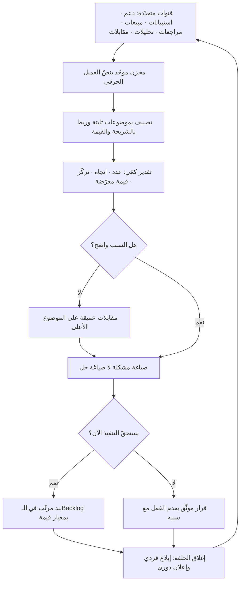

# صوت العميل (Voice of the Customer)

> [!info] تعريف مختصر
> ممارسة منهجية ومستمرّة لجمع ما يقوله العميل ويفعله عبر **كل القنوات** — مقابلات، تذاكر دعم، استبيانات، مراجعات المتاجر، مكالمات المبيعات، تحليلات الاستخدام، شكاوى وسائل التواصل — ثم تصنيفه وتوليفه وتحويله إلى **مُدخل قرار قابل للتنفيذ** في المنتج والخدمة والعمليات. الكلمة المفتاحية في التعريف ليست «الجمع» بل «التحويل»: برنامج صوت العميل الذي ينتهي بتقرير جميل لا يغيّر قرارًا واحدًا في الأولويات ليس برنامج VoC بل طقس تنظيمي. وهو يختلف عن قناة واحدة بعينها (كالاستبيان أو المقابلة) في أنه **نظام** يجمع بين مصادر متعدّدة متفاوتة في الدقّة والحجم، ويعالج تحيّزات كلٍّ منها بالمقارنة مع غيرها.

## الشرح العلمي والاحترافي
- **المنشأ**: المصطلح تبلور في أدبيات إدارة الجودة وتطوير المنتجات في الولايات المتحدة أواخر الثمانينيات، وارتبط منهجيًّا بمدخل **نشر وظيفة الجودة (Quality Function Deployment - QFD)** ذي الأصل الياباني، الذي يقوم على ترجمة متطلّبات العميل المعبَّر عنها بلغته إلى خصائص تصميمية قابلة للهندسة والقياس. الجوهر الذي بقي من ذلك الأصل: **لا تُترجم رغبة العميل إلى حلّ مباشرةً، بل مرّ بها عبر خطوة صريحة تفصل بين ما يريده وما سنبنيه.**
- **الفرق الجوهري بين «ما يقوله» و«ما يفعله»**: الأقوال (Attitudinal Data) تكشف الدوافع والمشاعر وتفسّر «لماذا»، لكنها عرضة للتحيّز والتبرير اللاحق. الأفعال (Behavioral Data) عبر [[Product Analytics]] تكشف «ماذا» بدقّة لكنها صامتة عن السبب. برنامج VoC الناضج **لا يختار بينهما بل يستخدم كلًّا منهما لتفسير الآخر**: تكشف الأرقام أين يحدث الانقطاع، وتشرح المقابلات لماذا.
- **تصنيف المصادر بحسب التحيّز**: كل قناة تحمل تحيّزًا معروفًا يجب تعويضه. **تذاكر الدعم** تمثّل من واجه مشكلة **وتكبّد عناء الإبلاغ** — أي أقلية شديدة الحماس أو الغضب. **الاستبيانات** تمثّل من لديه وقت للردّ. **مكالمات المبيعات** تمثّل من لم يشترِ بعد وقد يبالغ في المتطلّبات. **المراجعات العلنية** تنحاز إلى الطرفين المتطرّفين. **المنسحبون (Churned)** أغنى مصدر وأقلّه توفّرًا لأنهم غادروا ولا يردّون. والقاعدة العملية: أي استنتاج مبنيّ على قناة واحدة يجب أن يُفحص بقناة ثانية مختلفة التحيّز.
- **من الإشارة الخام إلى القرار — سلسلة أربع خطوات**: (١) **الالتقاط** بصيغة العميل نفسه لا بإعادة صياغة الموظف. (٢) **التصنيف** إلى موضوعات (Themes) بتصنيف ثابت متّفق عليه، لأن التصنيف الحرّ يجعل التجميع مستحيلًا. (٣) **التقدير الكمّي** — كم عميلًا؟ من أي شريحة؟ بأي قيمة؟ وما اتجاه التكرار عبر الزمن؟ (٤) **الربط بقرار** — بند في الـBacklog أو تغيير في العملية أو قرار صريح بعدم الفعل موثّق في [[Decision Log]]. غياب الخطوة الرابعة هو سبب موت معظم برامج VoC.
- **مبدأ «الشكوى تصف عرَضًا لا حلًّا»**: العميل خبير في ألمه ([[Pain Point]])، وليس بالضرورة خبيرًا في علاجه. طلب «أريد زرّ تصدير إلى إكسل» قد يكون الحلّ الحقيقي له تقريرًا آليًّا يُرسَل أسبوعيًّا. لذلك يقترن VoC عمليًّا بأطر تكشف المهمّة خلف الطلب مثل [[Jobs to be Done]]، وبأسلوب أسئلة يتجنّب المجاملة كما في [[The Mom Test]].
- **قاعدة الحجم مقابل العمق**: المصادر عالية الحجم ومنخفضة العمق (استبيانات، [[NPS]]، تحليلات) تجيب عن «كم» و«أين»، والمصادر منخفضة الحجم عميقة ([[User Interview]]، جلسات المشاهدة) تجيب عن «لماذا». الترتيب الأكفأ عادةً: استخدم الكمّي لتحديد الموضع، ثم انزل بالكيفي إلى ذلك الموضع بالضبط — لا العكس.
- **حلقة الإغلاق (Closing the Loop)**: ما يميّز البرنامج الناضج هو إبلاغ العميل بما تغيّر نتيجة ملاحظته. لهذا أثر مزدوج: يرفع جودة المساهمات المستقبلية وحجمها، ويحوّل الشاكي إلى مشارك. الإغلاق نوعان: **فردي** (الردّ على صاحب الملاحظة) و**جماعي** (إعلان دوري بما تغيّر). كلاهما ضروري، والثاني هو الأرخص والأكثر إهمالًا.
- **علاقته بالحوكمة والملكية**: المشكلة البنيوية الأشهر أن صوت العميل يصل مجزّأً إلى إدارات متفرّقة: الدعم يرى الأعطال، والمبيعات ترى الاعتراضات، والتسويق يرى المراجعات، ولا أحد يرى الصورة كاملة. البرنامج الناضج يوحّد المخزن ([[Single Source of Truth]]) ويحدّد مالكًا صريحًا ودورة مراجعة ثابتة.

## أين ومتى يُستخدم
- **في الاكتشاف المستمرّ وتحديد المشكلات**: كمصدر رئيسي لـ[[Continuous Discovery]] و[[Product Discovery]] وتغذية [[Opportunity Solution Tree]] بفرص حقيقية بدل افتراضات داخلية.
- **في ترتيب أولويات خارطة الطريق**: لتحويل الملاحظات إلى وزن قابل للمقارنة في نماذج مثل [[RICE Prioritization]] و[[WSJF]]، ولتمييز الأساسيات عن المُبهِجات عبر [[Kano Model]].
- **بعد الإطلاق وفي مرحلة الرعاية المكثّفة**: خلال [[Pilot Launch]] و[[Hypercare]] لالتقاط الإشارات المبكّرة سريعًا وتصحيح المسار قبل التوسّع.
- **في قياس الولاء والرضا وتفسيره**: [[NPS]] يعطي الرقم، وصوت العميل يعطي السبب — والرقم بلا سبب لا يُنتج قرارًا.
- **في تحسين الخدمة والعمليات لا المنتج فقط**: كثير من الألم مصدره إجراء داخلي (فوترة، تسليم، دعم)، ويظهر في [[UX vs CX]] و[[Value Stream Mapping]].
- **في التحقّق من السوق قبل الاستثمار الكبير**: ضمن [[Customer and Market Validation]] وقبل تثبيت نطاق [[MVP]] أو الالتزام بـ[[Go-to-Market]].

## مثال وسيناريو تطبيقي
> [!example] منصّة سعودية للتوصيل تخدم 2,300 مطعمًا شريكًا. كان [[NPS]] لدى الشركاء (لا المستهلكين) يتراجع من +22 إلى +4 خلال ثلاثة أرباع، والفريق يعزوه إلى «حساسية العمولة» لأن ذلك ما تكرّر في اجتماعات المبيعات.
> أُنشئ برنامج صوت عميل بمخزن موحّد يجمع خمس قنوات لثلاثة أشهر: 4,180 تذكرة دعم، 610 ردود استبيان مفتوح، 47 مكالمة مبيعات مسجّلة بموافقة، مراجعات المتجر، و18 مقابلة مطوّلة مع شركاء (منهم 6 انسحبوا فعلًا). صُنّفت كل إشارة بتصنيف ثابت من 14 موضوعًا، ورُبطت بشريحة الشريك وقيمته الشهرية.
> النتيجة قلبت الفرضية. موضوع «العمولة» جاء الأول في **مكالمات المبيعات** (61% من المكالمات) — وهو متوقّع لأن العمولة أسهل اعتراض يُقال في تفاوض. لكنه جاء السابع في تذاكر الدعم (4%). الموضوع الأول في التذاكر كان: **إلغاء الطلب بعد بدء التحضير** (31% من التذاكر)، والثاني **عدم وضوح موعد وصول المندوب** (18%). وفي مقابلات المنسحبين الستّة، ذكر خمسة السببين نفسيهما بعبارات متطابقة تقريبًا: «أطبخ الطلب ثم يُلغى فأخسر التكلفة وأخسر ثقة موظفي المطبخ».
> الأهم أن التقدير الكمّي كشف تركّزًا: 68% من إلغاءات ما بعد التحضير جاءت من 9% من المطاعم، وكلها ذات وقت تحضير يتجاوز 18 دقيقة. أي أن المشكلة ليست عامّة بل بنيوية في شريحة محدّدة.
> القرارات التي خرجت: (١) قفل الإلغاء من المستهلك بعد تأكيد المطعم بدء التحضير، مع تعويض جزئي إن أُلغي إداريًّا. (٢) عرض وقت تحضير متوقّع للمستهلك قبل التأكيد لتقليل الإلغاء الناتج عن المفاجأة. (٣) قرار **صريح بعدم تغيير العمولة**، موثّق في [[Decision Log]] مع سبب مكتوب ودليل مقابل، لإيقاف عودة النقاش كل شهر. (٤) رسالة إغلاق حلقة أُرسلت لكل من فتح تذكرة في الموضوع تُخبره بما تغيّر.
> بعد ربعين: تذاكر الإلغاء بعد التحضير انخفضت 54%، و[[NPS]] الشركاء ارتفع إلى +19، وانخفض انسحاب الشركاء في الشريحة المتضرّرة بمقدار الثلث. ولم تُخفَّض العمولة ريالًا واحدًا.

## خطوات أو مخطّط
1. حدّد **قرارات** تحتاج إلى إدخال العميل فيها (ترتيب أولويات، تحسين رحلة، قرار تسعير) — وابدأ من القرار لا من الجمع؛ فالجمع بلا قرار مُستهدَف ينتج أرشيفًا.
2. اجرد **القنوات المتاحة** وسجّل تحيّز كلٍّ منها صراحةً، وحدّد الفجوات (غالبًا: المنسحبون، والصامتون، وغير المستخدمين).
3. أنشئ **مخزنًا موحّدًا** واحدًا لكل الإشارات، مع حقول ثابتة: نص العميل الحرفي، القناة، الشريحة، التاريخ، الموضوع، القيمة التجارية.
4. ابنِ **تصنيف موضوعات ثابتًا** (10–20 موضوعًا) ودرّب من يصنّف عليه، وراجعه ربعيًّا بدل تعديله يوميًّا.
5. صنّف كل إشارة إلى **عرَض / سبب مفترض / حل مقترح**، ولا تدمج الثلاثة في بند واحد.
6. قدّر كمّيًّا: عدد العملاء المتأثّرين، اتجاه التكرار عبر الزمن، القيمة المعرّضة للخطر، والتركّز في شرائح محدّدة.
7. انزل بالكيفي إلى أعلى الموضوعات: [[User Interview]] بأسلوب [[The Mom Test]] لاستخراج السبب لا الرأي.
8. حوّل الموضوع إلى **صياغة مشكلة** ([[Problem Statement]]) ثم إلى بند مرتّب بمعيار قيمة معلن، أو إلى قرار موثّق بعدم الفعل.
9. أغلق الحلقة: أبلغ صاحب الملاحظة فردًا، وانشر ملخّصًا دوريًّا «ما تغيّر بسببكم».
10. قِس أثر البرنامج نفسه: كم قرارًا غيّره فعليًّا هذا الربع؟ وهو المؤشّر الوحيد الذي يفصل البرنامج الحيّ عن الميّت.

## ⚠️ مفاهيم خاطئة شائعة
> [!warning]
> - **اعتباره مرادفًا للاستبيان أو لمؤشّر [[NPS]]**: المؤشّر رقم واحد يقيس اتجاهًا، وصوت العميل نظام متعدّد المصادر يفسّره. الاكتفاء بالرقم يعطي إنذارًا بلا تشخيص، والتحرّك بناءً على الرقم وحده تخمين مكلف.
> - **الظنّ أن العميل يعرف ما يحتاجه ويطلبه بدقّة**: العميل خبير بألمه لا بحلّه. أخذ الطلب حرفيًّا يُنتج ميزات مبعثرة تحلّ أعراضًا لا أسبابًا، ويقود إلى [[Feature Creep]].
> - **معاملة كل الأصوات بوزن واحد**: صوت 3 عملاء يمثّلون 40% من الإيراد ليس كصوت 3 عملاء من شريحة تجريبية. الوزن يجب أن يُحسب بالشريحة والقيمة والاتجاه الاستراتيجي، لا بعدد الرؤوس.
> - **الخلط بين صوت العميل وصوت أعلى الأصوات**: من يشتكي أكثر ليس بالضرورة ممثّلًا للأغلبية. الأغلبية الصامتة تظهر في السلوك ([[Product Analytics]]) لا في التذاكر.
> - **افتراض أن كثرة التكرار تعني الأهمية**: تكرار طلب قد يعني ببساطة أن قناة واحدة نشطة. المعيار الأدقّ هو التقاطع: موضوع يظهر في قنوات مختلفة التحيّز في وقت واحد.
> - **جمع الصوت دون آلية للرفض**: البرنامج الذي لا يستطيع أن يقول «لن ننفّذ هذا ولهذا السبب» يتحوّل إلى قائمة أمنيات لا تنتهي، ويُفقد الفريق تركيزه الاستراتيجي ([[Non-Goals]]).
> - **الاعتقاد بأنه مسؤولية فريق المنتج وحده**: أخصب مصادر الصوت داخل الدعم والمبيعات والعمليات. حصره في فريق واحد يقطع الشركة عن ثلثي إشاراتها.

## ❌ ممارسات خاطئة في المشاريع
> [!failure]
> - **تشغيل استبيان دوري دون خطة تحرّك مسبقة**: الخطأ إرسال الاستبيان أولًا ثم التفكير فيما نفعل بالنتائج. لماذا يضرّ؟ لأن النتائج تصل بصيغة لا تدعم أي قرار، ويُستهلك رصيد صبر العملاء مجانًا، ثم تنخفض نسب الاستجابة في الجولات التالية. الحل: حدّد القرار المستهدف وصيغة النتيجة المطلوبة قبل صياغة سؤال واحد.
> - **إعادة صياغة كلام العميل بلغة داخلية عند التسجيل**: الخطأ أن يكتب موظف الدعم «العميل يريد تحسين الأداء» بدل النصّ الحرفي. لماذا يضرّ؟ لأن التفاصيل التي تحمل التشخيص تُمحى في أول خطوة، ويصبح التحليل تحليلًا لآراء الموظفين لا للعملاء. الحل: احفظ النصّ الحرفي إلزاميًّا، وضع التفسير في حقل منفصل.
> - **تجاهل المنسحبين وغير المستخدمين**: الخطأ الاكتفاء بمن هو نشط اليوم. لماذا يضرّ؟ لأن أخطر الإشارات عند من غادر ومن لم يبدأ أصلًا، وهم بالضبط من لا يظهر في أي قناة داخلية. الحل: اجعل مقابلة عدد ثابت من المنسحبين كل ربع التزامًا لا مبادرة.
> - **تحويل كل طلب عميل إلى بند في الـBacklog مباشرة**: الخطأ فتح تذكرة تطوير لكل ملاحظة. لماذا يضرّ؟ لأن الـBacklog ينتفخ بمئات البنود المتشابهة غير المرتّبة، فيفقد قدرته على توجيه العمل ويتحوّل الفريق إلى [[Feature Factory]]. الحل: جمّع الملاحظات في موضوعات، وحوّل الموضوع — لا الملاحظة — إلى [[Problem Statement]] مرتّب.
> - **عدم إغلاق الحلقة مع من ساهم**: الخطأ الجمع دون ردّ. لماذا يضرّ؟ لأن العميل يستنتج أن كلامه لا يُقرأ فيتوقّف عن المساهمة، فتجفّ القناة تدريجيًّا وتصير الشركة عمياء تظنّ نفسها هادئة. الحل: ردّ فردي على الملاحظات المؤثّرة، وإعلان دوري موجز بما تغيّر.
> - **السماح لأعلى صوت في الاجتماع بترجيح الأولوية**: الخطأ أن يحسم رأي مدير أو عميل كبير النقاش بلا بيانات. لماذا يضرّ؟ لأنه يُفرغ البرنامج من غرضه ويحوّله إلى غطاء لقرارات مُتّخذة سلفًا. الحل: اشترط عرض الدليل الكمّي والكيفي معًا في اجتماع الأولويات، ووثّق أساس القرار في [[Decision Log]].
> - **بناء البرنامج بلا مالك ولا دورة ثابتة**: الخطأ توزيع المسؤولية على «الجميع». لماذا يضرّ؟ لأن ما يملكه الجميع لا يملكه أحد، فيتوقّف البرنامج عند أول ضغط تشغيلي. الحل: مالك صريح، ودورة مراجعة شهرية ثابتة، ومؤشّر معلن لعدد القرارات المتأثّرة.

## 🔗 مصطلحات ومفاهيم ذات صلة
[[User Interview]] | [[CTQ]] | [[NPS]] | [[Pain Point]] | [[The Mom Test]] | [[Jobs to be Done]] | [[Kano Model]] | [[Continuous Discovery]] | [[Product Discovery]] | [[Product Analytics]] | [[Customer and Market Validation]] | [[Feedback Loop]] | [[UX vs CX]] | [[Opportunity Solution Tree]] | [[Problem Statement]] | [[Decision Log]] | [[Deliberate Practice]]
