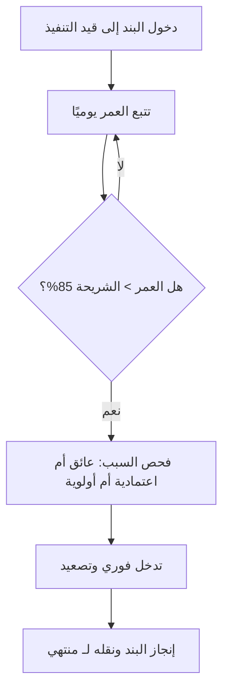

# تقادم العمل الجاري (WIP Aging)
> [!info] تعريف مختصر
> تقادم العمل الجاري (WIP Aging) هو مقياس يوضّح كم يومًا مضى على كل بند عمل لا يزال "قيد التنفيذ" ولم يصل بعد إلى حالة منتهي. يُستخدم لكشف البنود العالقة أو المتباطئة قبل أن تتحول إلى مشكلة كبيرة في التسليم.

## الشرح العلمي والاحترافي
- كل بند عمل (مهمة، قصة مستخدم، تذكرة) له "عمر" يبدأ من لحظة دخوله عمود "قيد التنفيذ" على لوح كانبان ([[03 - Kanban]]) وينتهي عند وصوله لعمود "منتهي".
- مقياس WIP Aging لا ينتظر انتهاء البند لحسابه (كما يفعل [[Cycle Time]])، بل يُحسب لحظيًا وباستمرار لكل بند لا يزال جاريًا: "منذ متى وهذا البند في هذا العمود؟"
- يُعرض عادة كرسم نقطي (Aging Chart) حيث يمثل كل عمود مرحلة من مراحل العمل، وكل نقطة بند عمل، وارتفاع النقطة هو عدد الأيام منذ بدء العمل عليه. كلما ارتفعت النقطة، طال بقاء البند دون إنجاز.
- يُقارَن عمر كل بند حاليًا بتوزيع أزمنة الدورة (Cycle Time) التاريخية للفريق؛ فإذا تجاوز بند عمر الشريحة المئوية 85 (انظر [[Percentiles and Median vs Average]]) التاريخية، يُعتبر "شاذًا" ويستحق تدخلًا فوريًا.
- الفائدة الجوهرية: يكشف [[Bottleneck]] أو [[Blocker]] وهو لا يزال يحدث الآن، بدل انتظار تقرير رجعي بعد انتهاء العمل. هذا يجعله أداة استباقية (Proactive) وليست تحليلية بأثر رجعي فقط.
- يرتبط مباشرة بقانون ليتل ([[Little's Law]]): كلما زاد عمر البنود الجارية دون إنجاز، ارتفع عدد العمل الجاري (WIP) الفعلي، فطال [[Lead Time]] لكل البنود اللاحقة أيضًا.

## أين ومتى يُستخدم
- في اجتماعات وقوف يومية ([[07 - Daily Standup]]) أو اجتماعات مراجعة تدفق كانبان الأسبوعية، لتحديد أي البنود يحتاج نقاشًا فوريًا بدل مرور عابر على كل بند.
- في فرق الدعم الفني وخدمات الإنتاج (Service Delivery) لمراقبة تذاكر عالقة قبل أن تنتهك اتفاقيات مستوى الخدمة ([[SLE]]).
- عند إدارة عدة مشاريع أو فرق كانبان، لمقارنة "صحة التدفق" بينها دون انتظار انتهاء العمل.
- يُستخدم جنبًا إلى جنب مع [[Control Chart]] و[[Cumulative Flow Diagram|مخطّط التدفّق التراكمي]] لتشخيص مشاكل التدفق بشكل شامل.

## مثال وسيناريو تطبيقي
> [!example]
> فريق تطوير في شركة "ميثاق" يدير لوح كانبان بأربعة أعمدة: قيد التحليل، قيد التطوير، قيد الاختبار، منتهي. متوسط زمن الدورة (Cycle Time) التاريخي للفريق هو 4 أيام، والشريحة المئوية 85 هي 9 أيام.
> في اجتماع الصباح، يفتح قائد الفريق مخطط تقادم العمل الجاري (Aging Chart) فيجد:
> - المهمة "تكامل بوابة الدفع" عمرها 11 يومًا في عمود "قيد الاختبار" — وهذا يتجاوز خط 9 أيام التحذيري.
> - يسأل الفريق فورًا: "لماذا لا تزال هنا؟" فيتضح أن بيئة الاختبار (Staging) معطّلة منذ 3 أيام، وهو [[Blocker]] لم يُصعَّد (Escalate).
> - يتخذ القرار: تصعيد المشكلة لفريق البنية التحتية فورًا بدل انتظار تقرير نهاية الأسبوع.
> النتيجة: بدل اكتشاف التأخير بعد أسبوعين عبر تقرير Cycle Time، اكتُشف العائق في نفس اليوم وحُلّ خلال ساعات.

## خطوات أو مخطّط
1. سجّل تاريخ/وقت دخول كل بند إلى عمود "قيد التنفيذ" (أو كل عمود فرعي إن أردت دقة أعلى).
2. احسب يوميًا: العمر الحالي = التاريخ الحالي - تاريخ الدخول، لكل بند لم يُنجَز بعد.
3. ارسم مخطط تقادم (نقطة لكل بند، أعمدة تمثل مراحل العمل، محور رأسي = عدد الأيام).
4. حدد خط تحذير عند الشريحة المئوية 85 من توزيع Cycle Time التاريخي.
5. في كل نقطة تجاوز، افحص السبب: عائق، اعتمادية، أولوية متضاربة، أو نقص مهارة.
6. تدخّل فورًا بدل الانتظار حتى ينتهي البند.

## ⚠️ مفاهيم خاطئة شائعة
> [!warning]
> - الخلط بين WIP Aging و[[Cycle Time]]: زمن الدورة يُقاس بعد الانتهاء، أما التقادم فيُقاس أثناء العمل الجاري وهو أداة استباقية.
> - الاعتقاد أن بندًا "قديمًا" في العمل الجاري يعني بالضرورة تقصيرًا من الشخص المسؤول؛ غالبًا السبب اعتمادية خارجية أو عائق تنظيمي لا علاقة له بالأداء الفردي.
> - تجاهل التقادم في البنود منخفضة الأولوية بحجة "ليست عاجلة"؛ حتى البنود العادية إذا تقادمت طويلًا ترفع WIP الكلي وتُبطئ كل شيء وفق [[Little's Law]].

## ❌ ممارسات خاطئة في المشاريع
> [!failure]
> - النظر إلى مخطط التقادم مرة واحدة في الشهر بدل مراجعته يوميًا أو أسبوعيًا؛ فيفقد قيمته الاستباقية ويتحول لتقرير رجعي عديم الفائدة. اجعله جزءًا ثابتًا من [[07 - Daily Standup]].
> - معاقبة الشخص المسؤول عن بند متقادم بدل معالجة السبب الجذري ([[Root Cause Analysis]])؛ هذا يخلق ثقافة إخفاء البنود العالقة بدل الإبلاغ عنها.
> - ترك بنود قديمة معلّقة دون أي إجراء لأسابيع بحجة "سنعود إليها"، ما يزيد [[WIP Limit]] الفعلي خفية ويُربك تدفق الفريق بالكامل.

## 🔗 مصطلحات ومفاهيم ذات صلة
[[Cycle Time]] | [[Lead Time]] | [[Little's Law]] | [[Bottleneck]] | [[Blocker]] | [[WIP Limit]] | [[Control Chart]] | [[Percentiles and Median vs Average]] | [[SLE]] | [[Throughput]] | [[03 - Kanban]] | [[Upstream vs Downstream Kanban]]
