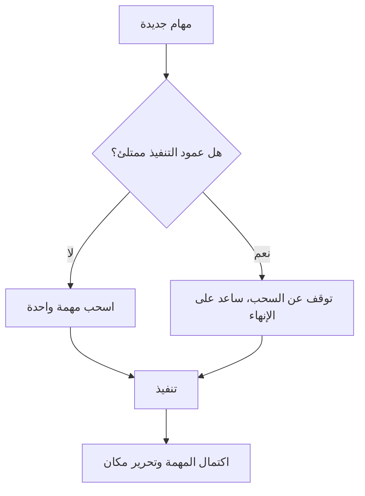

# حد العمل الجاري (WIP Limit)
> [!info] تعريف مختصر
> حد العمل الجاري (Work In Progress Limit) هو رقم أقصى محدَّد مسبقًا لعدد المهام المسموح بها في مرحلة معيّنة من لوحة كانبان (Kanban) في وقت واحد. الهدف منه منع تراكم العمل وتشتت الفريق.

## الشرح العلمي والاحترافي
- كل عمود في لوحة كانبان (مثل "قيد التنفيذ" أو "قيد المراجعة") يُعطى رقمًا أقصى من البطاقات المسموح وجودها فيه في الوقت نفسه.
- إذا امتلأ العمود، يُمنع سحب مهمة جديدة إليه حتى تخرج مهمة أخرى منه (وهذا ما يُسمى نظام السحب أو Pull System).
- السبب العلمي وراءه هو قانون ليتل (Little's Law): زمن الدورة (Cycle Time) يتناسب طرديًا مع عدد العناصر قيد التنفيذ، فكلما قلّ العمل الجاري قلّ زمن إنجاز كل عنصر.
- يجبر الفريق على "إنهاء العمل قبل بدء عمل جديد" (Stop Starting, Start Finishing)، فيقلّل من تبديل السياق (Context Switching) الذي يستهلك وقتًا وطاقة ذهنية.
- يكشف الاختناقات (Bottlenecks) بسرعة: عندما يمتلئ عمود ولا يتحرك، يصبح واضحًا أين تتعثّر العملية.

## أين ومتى يُستخدم
- يُستخدم بشكل أساسي في منهجية كانبان (Kanban) وفي هجين سكرمبان (Scrum-ban)، وأحيانًا داخل سباقات سكرم (Sprint) لضبط تعدد المهام.
- يُطبَّق منذ اليوم الأول لإنشاء لوحة المهام (Task Boards)، ويُعدَّل تدريجيًا مع نضج الفريق.
- يُستخدم عندما يُلاحَظ أن الفريق يبدأ مهامًا كثيرة لكن نادرًا ما يُنهيها.

## مثال وسيناريو تطبيقي
> [!example] فريق تطوير في شركة "بيانات الخليج" لديه عمود "قيد التطوير" بلا أي حد، فوجد المطورون أنفسهم يعملون على 6-7 مهام في الوقت نفسه، ولا شيء يُنجَز فعليًا لأسابيع. قرر قائد الفريق وضع حد WIP = 3 لعمود "قيد التطوير" (بعدد 3 مطورين). بعد أسبوعين، لاحظوا أن مهمة تكامل مع بوابة دفع خارجية عالقة منذ 5 أيام تمنع دخول مهام جديدة، فاجتمع الفريق فورًا لحل المشكلة بدلاً من تجاهلها، وتحسّن زمن التسليم الإجمالي بنسبة 30%.

## خطوات أو مخطّط
1. حدّد أعمدة اللوحة (Workflow Stages) التي تحتاج حدًا.
2. ابدأ برقم تقريبي (مثلًا عدد الأعضاء + 1) وطبّقه.
3. راقب حركة البطاقات وزمن الدورة لعدة أسابيع.
4. اضبط الرقم تصاعديًا أو تنازليًا بناءً على الملاحظة الفعلية (لا التخمين).
5. عند امتلاء العمود، أوقف سحب مهام جديدة وركّز الفريق على إنهاء ما هو موجود.

## ⚠️ مفاهيم خاطئة شائعة
> [!warning]
> - الاعتقاد أن حد العمل الجاري يقلّل الإنتاجية لأنه "يمنع الناس من العمل"؛ في الواقع هو يزيد الإنتاجية الفعلية عبر تقليل تبديل السياق وتسريع الإنجاز.
> - الخلط بينه وبين السعة (Capacity) الكلية للفريق؛ حد العمل الجاري خاص بعمود واحد من سير العمل، لا بكل المشروع.
> - وضع الحد مرة واحدة واعتباره ثابتًا للأبد دون مراجعته مع تغيّر حجم الفريق أو طبيعة العمل.

## ❌ ممارسات خاطئة في المشاريع
> [!failure]
> - تجاهل الحد عند الضغط ("فقط هذه المرة نسمح بمهمة زائدة")؛ هذا يُفرغ الأداة من فائدتها. الحل: التزم بالحد بصرامة، وإذا تكرر الضغط فراجع الحد نفسه رسميًا.
> - وضع حد مرتفع جدًا في البداية بحيث لا يُفعِّل أي تغيير سلوكي حقيقي؛ الحل: ابدأ بحد صارم نسبيًا ثم خفّفه تدريجيًا إذا لزم.
> - تجاهل سبب امتلاء العمود بدلاً من معالجته (اعتباره مجرد "قاعدة مزعجة")؛ الحل: اعتبر كل امتلاء إشارة لاختناق يستحق نقاشًا في الاجتماع اليومي.

## 🔗 مصطلحات ومفاهيم ذات صلة
[[Pull System]] | [[Bottleneck]] | [[Little's Law]] | [[Cycle Time]] | [[Throughput]] | [[WIP Aging]] | [[100 Percent Utilization Fallacy]] | [[03 - Kanban]] | [[16 - Task Boards]]

> [!tip] 💡 إثراء عملي — كورس الإنتاجية
> الحدّ بوصفه ضابطًا لـ[[Flow Load|حِمل التدفّق]]، ولماذا يُوضَع لكلّ عمود لا للوح: [[06 - مقاييس التدفّق الستة]] و[[07 - المجرى الأعلى والمجرى الأدنى]].
