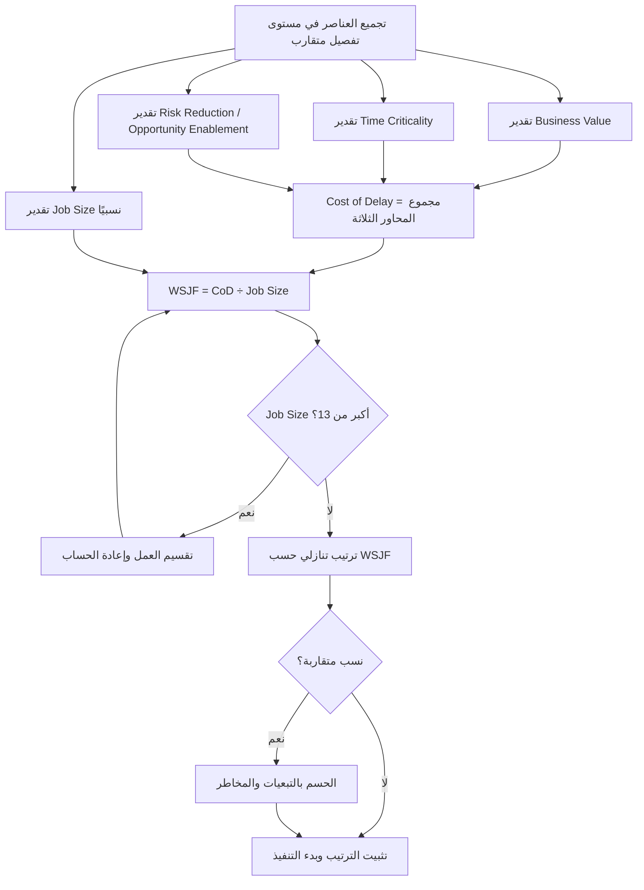

# الأقصر وزنًا أولًا (WSJF)

> [!info] تعريف مختصر
> WSJF اختصار لـ Weighted Shortest Job First، أي "الأقصر وزنًا أولًا". وهو أسلوب اقتصادي لترتيب أولويات العمل يقوم على معادلة واحدة: **WSJF = Cost of Delay ÷ Job Size**. الفكرة أن الأولوية لا تُمنح لما هو الأعلى قيمة وحده، ولا لما هو الأسرع تنفيذًا وحده، بل لما يحقق **أعلى قيمة لكل وحدة جهد**. النتيجة عملية وصادمة أحيانًا: أعلى تكلفة تأخير ليست بالضرورة أعلى أولوية.

## الشرح العلمي والاحترافي
- **المعادلة الأساسية**: `WSJF = Cost of Delay ÷ Job Size`. البسط يمثّل ما نخسره إن تأخّرنا، والمقام يمثّل ما ندفعه لإنجاز العمل. القسمة تحوّل مقارنة "ما الأهم؟" الغامضة إلى مقارنة "ما الأعلى عائدًا لكل وحدة جهد؟" القابلة للحساب.
- **تفكيك تكلفة التأخير** ([[Cost of Delay]]) إلى ثلاثة محاور تُقدَّر كلٌّ منها على حدة ثم تُجمع:
  - `Business Value` — القيمة التجارية أو المستخدمية المباشرة: إيراد متوقع، تقليل تكلفة، أو أثر على رضا العميل.
  - `Time Criticality` — حساسية الوقت: هل تتآكل القيمة إن تأخّرنا؟ هل هناك موسم أو منافس أو التزام تعاقدي أو تغيّر تنظيمي يجعل التأخير مكلفًا؟
  - `Risk Reduction / Opportunity Enablement` (اختصارًا RR/OE) — تقليل المخاطر أو فتح فرص: عمل قد لا يحمل قيمة مباشرة اليوم لكنه يزيل مخاطرة تقنية أو يمكّن سلسلة من الأعمال المستقبلية (مثل بناء بنية تحتية أو منصة تكامل).
- **تقدير حجم العمل** (`Job Size`، ويُسمّى في SAFe أحيانًا Job Duration) لا يُقاس بالساعات بل بحجم نسبي يراعي: درجة التكامل مع أنظمة أخرى، عدد الوحدات أو الفرق المشاركة، حجم التغيير المفروض على المستخدم (تدريب، تغيير سلوك، هجرة بيانات)، وحجم الاختبار والتحقق المطلوب.
- **استخدام سلسلة فيبوناتشي المعدّلة (1، 3، 5، 8، 13)** لتقدير كل محور. السبب رياضي: الفروق النسبية بين الأرقام تتّسع مع الحجم، فتعكس عدم اليقين المتزايد وتمنع الجدال العقيم حول الفرق بين 6 و7. ويُستحسن **تثبيت المرجع**: أعطِ العنصر الأصغر في كل عمود قيمة 1، ثم قدّر البقية نسبةً إليه ([[Relative Estimation]]).
- **الأصل والجذر النظري**: صاغ دونالد راينرتسن (Donald Reinertsen) المبدأ في أدبيات تدفّق تطوير المنتجات، وتبنّاه إطار [[SAFe]] كأداة الترتيب القياسية لمخزون البرنامج. جذره في **نظرية الطوابير** (Queueing Theory): عندما تتنافس مهام متعددة على مورد محدود، فإن ترتيبها تنازليًا حسب نسبة (تكلفة التأخير ÷ المدة) يُقلّل إجمالي تكلفة التأخير للنظام كله — وهي نتيجة مثبتة رياضيًا لا رأي إداري.
- **لماذا القسمة تحديدًا؟** لأن الأولوية بالقيمة وحدها تدفع الفرق إلى مشاريع ضخمة تحجز الطاقة شهورًا وتؤخّر عشرات الأعمال الصغيرة عالية العائد. القسمة على الحجم تُدخل "تكلفة الفرصة البديلة" في المعادلة تلقائيًا.
- **الطبيعة النسبية للنتيجة**: قيمة WSJF لا معنى لها منفردة (7.5 ليست "جيدة" أو "سيئة")؛ معناها الوحيد هو موقعها في الترتيب مقارنةً ببقية العناصر في الجلسة نفسها. لذلك يجب تقدير كل العناصر في جلسة واحدة وبالمرجع نفسه.

## أين ومتى يُستخدم
- في **ترتيب مخزون العمل** ([[13 - Backlog]]) على مستوى المزايا (Features) والملاحم (Epics)، لا على مستوى القصص الصغيرة اليومية — العائد من الحساب لا يبرّر كلفته للعناصر الصغيرة جدًا.
- في **جلسات تخطيط الربع أو الإصدار** (مثل PI Planning في SAFe) حيث تتنافس فرق ومنتجات مختلفة على طاقة تطوير محدودة.
- عند **الخلاف بين أصحاب المصلحة**: WSJF ينقل النقاش من "مشروعي أهم" إلى تقدير ثلاثة محاور محدّدة، ويجعل الخلاف قابلًا للحل بمناقشة الأرقام لا النوايا.
- عند **بناء خارطة الطريق** ([[15 - Roadmap]]) لتحديد ما يدخل الربع القادم وما يُؤجَّل، خصوصًا حين تكون الطاقة ثابتة والطلب أكبر منها بأضعاف.
- كأداة **مكمّلة** لأساليب أبسط مثل [[MoSCoW Prioritization]]: تُستخدم MoSCoW لتصنيف خشن، ثم WSJF لترتيب دقيق داخل فئة "Must" و"Should" المزدحمة.

## مثال وسيناريو تطبيقي
> [!example] فريق منتج في منصة تجارة إلكترونية أمامه أربع مزايا وطاقة ربع واحد فقط. قدّر الفريق كل محور بفيبوناتشي (1، 3، 5، 8، 13):
>
> | الميزة | Business Value | Time Criticality | RR/OE | CoD (المجموع) | Job Size | WSJF |
> |---|---|---|---|---|---|---|
> | A — إعادة بناء محرك الدفع | 13 | 8 | 13 | **34** | 13 | **2.6** |
> | B — الدفع بنقرة واحدة | 8 | 8 | 3 | **19** | 3 | **6.3** |
> | C — تكامل شركة الشحن الجديدة | 5 | 13 | 3 | **21** | 5 | **4.2** |
> | D — تحسين صفحة "من نحن" | 3 | 1 | 1 | **5** | 3 | **1.7** |
>
> **الترتيب الناتج**: B (6.3) ← C (4.2) ← A (2.6) ← D (1.7).
> **الدرس المحوري**: الميزة A هي **الأعلى تكلفة تأخير على الإطلاق (34)**، ومع ذلك جاءت في المرتبة الثالثة، لأن حجمها (13) يلتهم الربع كاملًا ويؤخّر B وC معًا. تنفيذ B ثم C أولًا يحقق قيمة تراكمية قدرها 40 نقطة تكلفة تأخير مُتجنَّبة بحجم إجمالي 8 فقط، بينما A وحدها تحقق 34 بحجم 13.
> **قرار الفريق**: بما أن `Job Size` للميزة A يساوي 13 (الحد الأقصى)، قسّمها الفريق إلى جزأين: A1 «طبقة تجريد مزوّدي الدفع» (CoD = 21، Size = 5 → WSJF = 4.2) وA2 «هجرة المزوّد القديم» (CoD = 13، Size = 8 → WSJF = 1.6). بذلك صعد الجزء الأكثر إلحاحًا من العمل إلى صدارة الترتيب بدل أن يظل محتجزًا خلف كتلة ضخمة. وعند تقارب A1 وC (كلاهما 4.2)، حُسم الترتيب لصالح A1 لأن C تعتمد عليها ([[Dependencies]]).

## خطوات أو مخطّط
1. اجمع العناصر المرشّحة في مستوى تفصيل متقارب (مزايا مع مزايا، لا ملاحم مع مهام).
2. قدّر `Business Value` لكل العناصر عمود بعمود — لا عنصرًا بعنصر — بعد تثبيت العنصر الأصغر عند 1.
3. كرّر التقدير لعمود `Time Criticality`، ثم لعمود `Risk Reduction / Opportunity Enablement`.
4. اجمع المحاور الثلاثة للحصول على `Cost of Delay` لكل عنصر.
5. قدّر `Job Size` بالطريقة النسبية نفسها مراعيًا التكامل وعدد الوحدات وأثر التغيير على المستخدم وحجم الاختبار.
6. احسب `WSJF = CoD ÷ Job Size` ورتّب تنازليًا: **الأعلى نسبة يُنفَّذ أولًا**.
7. طبّق قاعدة التقسيم: **إن كان `Job Size` أكبر من 13، قسّم العمل** إلى أجزاء أصغر وأعد حساب كل جزء — التقسيم وحده كثيرًا ما يقلب الترتيب.
8. عند تقارب النسب، احسم الترتيب بمعايير إضافية: التبعيات ([[Dependencies]])، توفّر المهارة، والمخاطرة التقنية.
9. أعد الحساب في كل دورة تخطيط: تكلفة التأخير متغيّرة بطبيعتها، وما كان منخفض الإلحاح قد يصبح حرجًا بعد شهر.

## ⚠️ مفاهيم خاطئة شائعة
> [!warning]
> - **الظن بأن الأعلى قيمة هو الأعلى أولوية**: هذا هو الخطأ الذي وُجد WSJF أصلًا لتصحيحه. عنصر بتكلفة تأخير 34 وحجم 13 أدنى أولوية من عنصر بتكلفة 19 وحجم 3.
> - **اعتبار الأرقام دقيقة أو مطلقة**: تقديرات فيبوناتشي نسبية بطبيعتها، والهدف منها ترتيب موثوق لا قياس مطلق. قيمة WSJF تساوي 6.3 لا تعني شيئًا خارج جدولها.
> - **الخلط بين `Job Size` والمدة الزمنية بالأيام**: الحجم تقدير جهد نسبي؛ ترجمته إلى تقويم تتم لاحقًا عبر السرعة ([[Velocity]]) لا داخل المعادلة.
> - **الاعتقاد بأن WSJF يُلغي الحكم الإداري**: المعادلة تُنظّم النقاش ولا تحسمه. القرارات الاستراتيجية طويلة الأمد والالتزامات التعاقدية تبقى خارج نطاقها.
> - **الظن بأنه يصلح لكل مستوى تفصيل**: تطبيقه على قصص صغيرة يهدر وقت الفريق في حسابات لا تغيّر الترتيب فعليًا.
> - **إهمال محور RR/OE**: كثير من الفرق تتجاهله، فتتوقف الأعمال التمكينية والبنية التحتية عن الظهور في الترتيب حتى تنفجر مشكلاتها لاحقًا.

## ❌ ممارسات خاطئة في المشاريع
> [!failure]
> - **تقدير محاور عنصر واحد كاملة قبل الانتقال للعنصر التالي**: يفقد الفريق المرجع النسبي فتتضخّم تقديرات العناصر الأولى. الحل: قدّر عمودًا واحدًا لكل العناصر دفعةً واحدة، وابدأ دائمًا بتثبيت الأصغر عند 1.
> - **ترك عناصر بحجم 13 أو أكثر دون تقسيم**: تحتجز هذه الكتل طاقة الفريق شهورًا وتؤخّر عشرات الأعمال عالية العائد. الحل: طبّق قاعدة "Job Size > 13 ← قسّم"، فالتقسيم يرفع أولوية الجزء الأكثر إلحاحًا فورًا.
> - **تلاعب أصحاب المصلحة بالأرقام لدفع مشاريعهم للأعلى**: تتحوّل الجلسة إلى مفاوضة سياسية بأرقام. الحل: أجرِ التقدير جماعيًا وعلنًا، واطلب تبريرًا لكل قفزة في فيبوناتشي، واحتفظ بسجل التقديرات للمراجعة اللاحقة.
> - **حساب WSJF مرة واحدة في بداية السنة والاعتماد عليه طوال العام**: تكلفة التأخير تتغيّر مع السوق والمنافسة والتنظيم. الحل: أعد الحساب في كل دورة تخطيط ربعية على الأقل.
> - **تجاهل التبعيات عند تقارب النسب**: تنفيذ عنصر عالي WSJF يعتمد على عنصر لم يُنفَّذ بعد يعني تعطّله في منتصف الطريق. الحل: افحص [[Dependencies]] قبل تثبيت الترتيب النهائي وقدّم المُمكِّن على المُعتمِد.
> - **استخدام WSJF كمبرر لرفض كل عمل تقني لا يحمل قيمة تجارية مباشرة**: يؤدي إلى تراكم الدين التقني حتى الانهيار. الحل: قدّر عمل البنية التحتية عبر محور RR/OE بصدق، فهذا المحور موجود في المعادلة لهذا الغرض تحديدًا.

## 🔗 مصطلحات ومفاهيم ذات صلة
[[Cost of Delay]] | [[MoSCoW Prioritization]] | [[12 - Story Points]] | [[Relative Estimation]] | [[15 - Roadmap]] | [[13 - Backlog]] | [[Quick Wins vs Big Bangs]] | [[Value Stream]] | [[Portfolio Optimization]]
