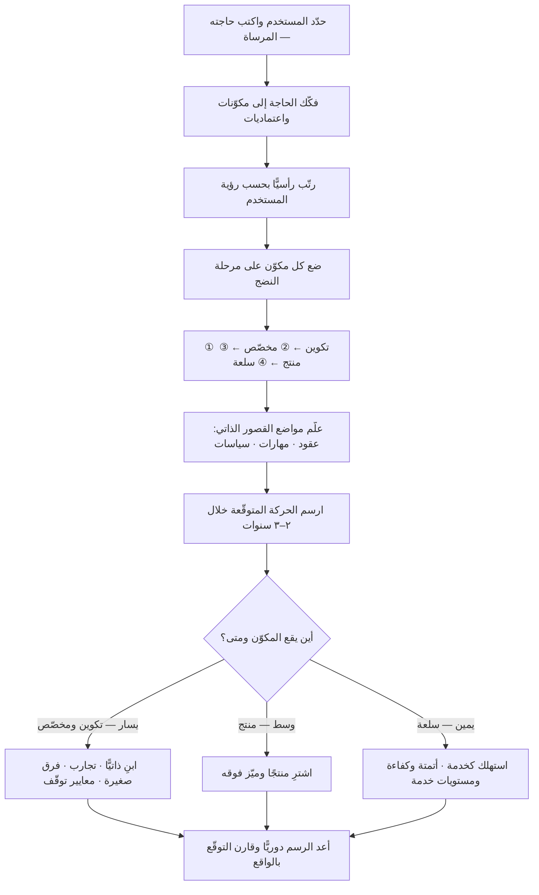

# خرائط واردلي (Wardley Mapping)

> [!info] تعريف مختصر
> أسلوب لرسم **خريطة بصرية للمشهد الاستراتيجي** يوضع فيها كل مكوّن من مكوّنات المنظّمة على محورين: محور رأسي هو **سلسلة القيمة** — أي مدى قرب المكوّن من حاجة المستخدم — ومحور أفقي هو **مرحلة النضج/التطوّر** التي يمرّ بها المكوّن (تكوين · مخصّص · منتج · سلعة). ما يميّزها عن كل أدوات الاستراتيجية الشائعة تقريبًا أنها **ليست لقطة لحالة بل تمثيل لحركة**: المكوّنات تنزلق حتمًا يمينًا مع الزمن، فتُقرأ الخريطة كتوقّع لما سيصير عليه المشهد لا كوصف لما هو عليه الآن. وهي في هذا المعنى الأداة النادرة التي تجعل السؤال «أين ستكون هذه القطعة بعد ثلاث سنوات؟» سؤالًا **قابلًا للرسم** لا للتخمين.

## الشرح العلمي والاحترافي
- **الأصل**: طوّر الأسلوب **سايمون واردلي (Simon Wardley)**، وقد بدأ تشكّله حوالي عام ٢٠٠٥ حين كان رئيسًا تنفيذيًّا لشركة برمجيات بريطانية اسمها Fotango، وهو يروي أن دافعه كان اكتشافه أنه لا يملك أي أساس عقلاني لقراراته الاستراتيجية سوى السرد والقصص. نشر الأسلوب لاحقًا سلسلة مقالات مطوّلة صارت كتابًا بعنوان *Wardley Maps*، وأتاح المادة كلها **برخصة مشاع إبداعي حرّة**، وعمل بعدها باحثًا في معهد لينكس. وشاع الأسلوب أوّلًا في أوساط الهندسة والحوسبة السحابية والقطاع الحكومي البريطاني قبل أن ينتشر أوسع.
- **الخصائص التي تجعلها «خريطة» فعلًا لا رسمًا بيانيًّا**: يشدّد واردلي على أن أغلب ما تسمّيه الشركات «خرائط استراتيجية» ليست خرائط بل صناديق وأسهم لا معنى لموقعها. الخريطة الحقيقية تستوفي شروطًا: أن يكون لها **مرساة** (Anchor) هي حاجة المستخدم، وأن يكون **الموقع** ذا معنى نسبةً إلى المرساة، وأن يكون لها **اتّساق** (المكوّنات تتحرّك بقواعد معلومة). لو حرّكت مربّعًا في مخطّط تنظيمي تقليدي فلن يتغيّر شيء في معناه؛ ولو حرّكته في خريطة واردلي لتغيّر المعنى كلّيًّا — وهذا هو الاختبار.
- **المحور الرأسي: سلسلة القيمة والرؤية**: في القمة توضع **حاجة المستخدم** (المرساة)، وتحتها المكوّنات التي تحقّقها، وتحت كل مكوّن ما يعتمد عليه، نزولًا إلى البنية التحتية. كلما نزلت قلّت **رؤية المستخدم** للمكوّن. المستخدم يرى «قدرتي على الحجز»، ولا يرى قاعدة البيانات ولا مركز البيانات — رغم أن انقطاعها يُسقط كل ما فوقها.
- **المحور الأفقي: مراحل التطوّر الأربع**:
  1. **التكوين (Genesis)**: الشيء جديد كليًّا، نادر، غير مفهوم، مكلف، عالي الفشل، ومصدر تمايز محتمل. يُدار بالتجريب لا بالخطط.
  2. **مخصّص البناء (Custom-Built)**: صار مفهومًا نسبيًّا، وتبنيه الشركات لنفسها كلٌّ على طريقتها، بلا معيار مشترك.
  3. **المنتج / الإيجار (Product / Rental)**: ظهرت منتجات جاهزة تُشترى أو تُستأجر، مع تمايز في الخصائص ومنافسة على الميزات.
  4. **السلعة / المرفق (Commodity / Utility)**: صار نمطيًّا وموحّدًا ويُستهلك كخدمة عامة بسعر منخفض وموثوقية عالية — كالكهرباء من الشبكة.
  والقاعدة الجوهرية: **ما يُستهلك بكثرة ويصبح مفهومًا يتحرّك يمينًا حتمًا** بفعل الطلب والمنافسة. الحركة اتجاه واحد في العموم، وسرعتها هي المتغيّر.
- **لماذا هذا المحور هو مصدر قوّتها**: لأن **أسلوب الإدارة الصحيح يختلف باختلاف مرحلة النضج للمكوّن نفسه**. المكوّن في مرحلة التكوين يُدار بفرق صغيرة وتجارب رخيصة ومعايير فشل معلنة؛ والمكوّن في مرحلة السلعة يُدار بالكفاءة والتوحيد وعقود مستوى الخدمة ([[SLA]]) والأتمتة. تطبيق أسلوب واحد على كل شيء — وهو ما تفعله أغلب المؤسسات — يقتل الابتكار في الطرف الأيسر ويهدر المال في الطرف الأيمن. وهذه الفكرة تتقاطع مباشرة مع [[Cynefin]]: يسار الخريطة مركّب، ويمينها واضح أو معقّد.
- **الحركة هي المخرَج الحقيقي**: بعد رسم الحالة الراهنة يُرسم عليها **أين ستتحرّك المكوّنات**، فتتولّد أسئلة استراتيجية لا تولّدها الأدوات الساكنة: ما الذي نبنيه بأنفسنا اليوم بينما سيصير سلعة رخيصة بعد سنتين فنكون قد أهدرنا عليه فرقًا كاملة؟ وما الذي يجب أن نبنيه بأنفسنا لأنه مصدر تمايزنا الوحيد؟ وأي مكوّن سيتحوّل إلى مرفق فيفتح فوقه موجة ابتكار جديدة نستطيع ركوبها؟ هذا النمط الأخير — **أن تسليع طبقة يشعل انفجارًا في الطبقة التي فوقها** — من أهم أنماط الخريطة عمليًّا.
- **القصور الذاتي (Inertia)**: تُعلَّم على الخريطة مواضع المقاومة للحركة: عقود قائمة، ومهارات فرق مبنية على التقنية القديمة، ونماذج إيراد تعتمد على الوضع الحالي، وسياسات داخلية. القصور الذاتي هو ما يجعل المنظّمة ترى التحوّل قادمًا ولا تتحرّك — والخريطة تجعله مرئيًّا وقابلًا للنقاش بدل أن يبقى شعورًا غامضًا.
- **الطبقات الثلاث في الأسلوب**: الخريطة نفسها هي الطبقة الأولى، وفوقها **أنماط مناخية** (Climatic Patterns) أي قواعد تسري على الجميع ولا يملك أحد إيقافها (مثل: كل شيء يتحرّك يمينًا؛ وتوفير مكوّن كسلعة يولّد ابتكارًا فوقه)، ثم **المبادئ العامة** (Doctrine) أي ممارسات صالحة في كل سياق (اعرف مستخدمك، واستخدم لغة مشتركة، وركّز على النتيجة)، ثم **أساليب اللعب** (Gameplay) أي تحرّكات سياقية تُختار بحسب الوضع.
- **موقعها بين الأدوات الأخرى**: [[SWOT]] تصنّف الحالة، و[[Porter's Five Forces]] تحلّل بنية الصناعة في لحظة، و[[Business Model Canvas]] تصف منطق العمل الحالي — وكلها ساكنة بدرجات. خريطة واردلي هي الأداة التي تضيف **البعد الزمني والموقع النسبي**، ولذلك تُستعمل مكمّلة لها لا بديلًا عنها.
- **قيودها الواقعية**: (١) **منحنى تعلّم حادّ** مقارنة بأدوات تُفهم في دقائق؛ (٢) **الذاتية في تحديد مرحلة النضج** — لا يوجد مقياس موضوعي دقيق لموضع مكوّن على المحور الأفقي، والتقدير يعتمد على الحكم المهني، وإن كانت مؤشّرات مثل تعدّد المزوّدين ووجود معايير موحّدة تساعد؛ (٣) **قلّة نسبية في الممارسين المتمكّنين** مقارنة بالأدوات الشائعة؛ (٤) **الإغراء بالدقّة الزائفة** إذ يبدو الرسم علميًّا أكثر مما هو في الحقيقة؛ (٥) قاعدة الأدلّة التجريبية على أثرها المؤسّسي محدودة، شأنها شأن أغلب أدوات الاستراتيجية.

## أين ومتى يُستخدم
- **في قرارات البناء مقابل الشراء**: أوضح استعمالاتها وأقواها. المكوّن في يمين الخريطة يُشترى ولا يُبنى، والمكوّن في يسارها لا يُشترى لأنه غير موجود أصلًا — والخطأ في هذا القرار مكلف على مستوى سنوات ([[TCO]] و[[Vendor Lock-in]]).
- **في تصميم بنية الفرق والتنظيم**: لتخصيص أنماط فرق مختلفة لمناطق مختلفة من الخريطة بدل نموذج واحد للجميع.
- **في تخطيط بنية المنتج والاعتماديات**: لكشف الاعتماد على مكوّن لن يصمد، ولإظهار العلاقات الخفيّة ([[Dependency]]).
- **في تحديث [[Product Strategy]] وتحديد أساس التمايز**: تجيب صراحةً عن سؤال «فيمَ نتميّز فعلًا؟» بإظهار أن أغلب ما نبنيه في الحقيقة سلعة يبنيها الجميع.
- **في تقييم موجة تقنية جديدة**: لتحديد أي طبقة تتسلّع الآن وأي طبقات ابتكار ستُفتح فوقها، ومتى يكون الدخول مبكّرًا جدًّا أو متأخّرًا جدًّا.
- **في مواءمة القيادة**: أثر جانبي معتبَر — رسم الخريطة جماعيًّا يجبر أطراف المؤسسة على لغة واحدة وتعريف واحد للمكوّنات، ويُظهر الخلافات المستترة ([[Single Source of Truth]]).

## مثال وسيناريو تطبيقي
> [!example] شركة لوجستية سعودية متوسّطة تدير أسطولًا وشبكة مستودعات، لديها فريق تقني من ٥٤ مهندسًا وميزانية تقنية سنوية ٢٨ مليون ريال. المشكلة المعلَنة: «التقنية تكلّف كثيرًا ولا تعطي ميزة».
> رُسمت خريطة واردلي في ورشتين، بمرساة واحدة: **حاجة العميل التاجر أن تصل شحنته في الوقت وأن يعرف مكانها**.
> ظهرت على الخريطة ٣١ مكوّنًا، وتبيّن التوزيع الآتي للجهد الهندسي:
> — **٢١ مهندسًا** يعملون على مكوّنات تقع في يمين الخريطة تمامًا: نظام محاسبة داخلي مبني ذاتيًّا منذ ٢٠١٤، وخدمة إشعارات رسائل نصية، وبنية خوادم في مركز بيانات مملوك، ونظام موارد بشرية. كل هذه مكوّنات **صارت سلعًا** تُشترى كخدمة بجزء يسير من كلفة صيانتها الداخلية، ولا يراها العميل ولا تمنح أي تمايز.
> — **٧ مهندسين** على أنظمة تشغيل تقع في منطقة «المنتج»: تتبّع، وإدارة مستودع — يوجد لها منتجات ناضجة في السوق.
> — **٦ مهندسين فقط** على المكوّن الوحيد الواقع في يسار الخريطة: **محرّك تخطيط المسارات والتحميل المشترك** المبني على بيانات تشغيلية لسبع سنوات لا يملكها أحد غيرهم — وهو المكوّن الوحيد المرتبط مباشرةً بالمرساة وبتمايزهم الحقيقي.
> ثم رُسمت **الحركة المتوقّعة خلال ٣ سنوات**: انزلاق التتبّع القياسي إلى منطقة السلعة بفعل انتشار معايير موحّدة؛ وانتقال أنظمة إدارة المستودعات من «منتج» إلى خدمة سحابية شبه سلعية.
> وعُلّم **القصور الذاتي** بوضوح: عقد صيانة مركز البيانات لثلاث سنوات متبقّية، وفريق كامل مهاراته مبنية على النظام المحاسبي القديم — وهذان بالضبط سبب بقاء الوضع لا القناعة الفنّية.
> القرارات: إحلال أربعة أنظمة داخلية بخدمات جاهزة على مدى ١٨ شهرًا مع خطة انتقال للفريق لا تسريحًا؛ ومضاعفة الاستثمار في محرّك المسارات من ٦ إلى ١٧ مهندسًا؛ وتجميد أي بناء ذاتي جديد في المنطقة اليمنى بقاعدة صريحة مكتوبة.
> النتيجة بعد ٢٠ شهرًا: انخفاض الإنفاق التقني إلى ٢٣ مليونًا رغم نمو حجم العمليات ٣٤٪، وتحسّن دقّة مواعيد التسليم من ٨١٪ إلى ٩٢٪. القيمة لم تأتِ من الخريطة بوصفها رسمًا، بل من أنها **جعلت سوء توزيع الجهد مرئيًّا في صفحة واحدة** بعد سنوات من الجدل اللفظي.

## خطوات أو مخطّط
1. حدّد المستخدم بدقّة واكتب **حاجته** لا رغبتك — هذه هي المرساة، وكل ما بعدها يُقاس نسبةً إليها.
2. فكّك الحاجة إلى المكوّنات التي تحقّقها، ثم فكّك كل مكوّن إلى ما يعتمد عليه، نزولًا حتى البنية التحتية.
3. رتّب المكوّنات رأسيًّا بحسب قربها من المستخدم (الرؤية)، لا بحسب أهميّتها في نظرك.
4. ضع كل مكوّن أفقيًّا على مرحلة نضجه، مستعينًا بمؤشّرات: هل هو نادر ومكلف وغير مفهوم؟ أم يبنيه كل واحد بطريقته؟ أم له منتجات جاهزة متعدّدة؟ أم صار خدمة موحّدة رخيصة موثوقة؟
5. راجع المواضع جماعيًّا وناقش الاختلافات — الخلاف على موضع مكوّن هو غالبًا أنفع لحظات الورشة.
6. علّم **القصور الذاتي**: العقود، والمهارات، والسياسات، ونماذج الإيراد التي تقاوم الحركة.
7. ارسم **الحركة المتوقّعة** بأسهم: أين سيكون كل مكوّن بعد ٢–٣ سنوات، وما مصدر الدفع (طلب، أو معايير، أو داخل جديد).
8. استخرج القرارات: ما نبنيه، وما نشتريه، وما نوقفه ([[Sunset and Deprecation]])، وأين نضاعف الاستثمار.
9. طابق أسلوب الإدارة مع الموضع: تجريب ومعايير توقّف في اليسار، وكفاءة وتوحيد ومستويات خدمة في اليمين.
10. أعد رسم الخريطة كل ٦–١٢ شهرًا أو عند حدث بنيوي، واحتفظ بالنسخ السابقة لتقييم جودة توقّعاتك.

## ⚠️ مفاهيم خاطئة شائعة
> [!warning]
> - **الظنّ بأن المحور الأفقي هو الزمن**: ليس زمنًا بل **مرحلة نضج**. الزمن يظهر في الخريطة بوصفه حركة المكوّنات على المحور، لا بوصفه المحور نفسه. الخلط هنا يُفسد قراءة الخريطة كلها.
> - **اعتبار اليسار «أفضل» واليمين «أسوأ»**: لا يوجد موضع مفضّل. القيمة في **مطابقة الأسلوب للموضع**. بقاء مكوّن سلعي في يمين الخريطة أمر صحّي تمامًا؛ الخطأ أن تديره كأنه ابتكار أو أن تبنيه بنفسك.
> - **الخلط بينها وبين المخطّطات المعمارية**: المخطّط المعماري يوضّح كيف تتصل المكوّنات تقنيًّا؛ والخريطة توضّح **موقعها الاستراتيجي واتجاه حركتها**. الأول لا يقول لك ماذا تشتري وماذا تبني.
> - **الظنّ بأن الحركة قد تكون في الاتجاهين**: القاعدة العامة أن المكوّنات تتحرّك يمينًا بفعل الطلب والمنافسة والفهم المتراكم، ولا تعود إلى اليسار. ما يبدو ارتدادًا هو غالبًا **مكوّن جديد** في مرحلة تكوين يحلّ محلّ القديم، لا رجوع القديم نفسه.
> - **افتراض دقّة موضوعية في تحديد المواضع**: تحديد مرحلة النضج حكم مهني لا قياس. والفائدة تأتي من **النقاش حول الخلاف** ومن الاتجاه العام، لا من دقّة السنتيمتر. من يجادل في موضع مكوّن بمقدار ملّيمترات يكون قد فقد الغرض.
> - **الظنّ بأنها أداة لفريق التقنية فقط**: تنطبق على أي سلسلة قيمة — عمليات، ومالية، ومبيعات، وتوظيف. شيوعها في الأوساط التقنية سبب تاريخي لا حدّ منهجي.

## ❌ ممارسات خاطئة في المشاريع
> [!failure]
> - **الرسم بلا مرساة واضحة**: الخطأ → البدء بمكوّنات النظام بدل حاجة المستخدم. لماذا يضرّ → يفقد المحور الرأسي معناه، فتصير الخريطة صناديق وأسهم لا تختلف عن أي رسم آخر. الحل → لا تضع مكوّنًا واحدًا قبل كتابة حاجة المستخدم في أعلى الصفحة.
> - **بناء ما هو سلعة بأيدي الفريق**: الخطأ → تطوير مكوّن داخلي في منطقة السلعة بحجّة «متطلّباتنا خاصة». لماذا يضرّ → يستنزف أفضل المهندسين في عمل بلا تمايز، وتتراكم كلفة صيانته سنة بعد سنة ([[Technical Debt]]). الحل → اجعل البناء الذاتي في المنطقة اليمنى قرارًا يتطلّب استثناءً موثّقًا وموافقة صريحة.
> - **إدارة الابتكار بأدوات التشغيل**: الخطأ → مطالبة مكوّن في مرحلة التكوين بخطّة سنوية وعائد استثمار مسبق و[[SLA]]. لماذا يضرّ → يقتل الاستكشاف لأن مقاييس الكفاءة غير قابلة للتحقّق في اللايقين. الحل → أطر حوكمة مختلفة لكل منطقة: سقف إنفاق ومعايير توقّف في اليسار، ومقاييس كفاءة وموثوقية في اليمين.
> - **تجاهل القصور الذاتي عند التخطيط**: الخطأ → إقرار خطّة تحوّل تصطدم بعقود سارية ومهارات قائمة ونماذج حوافز معاكسة. لماذا يضرّ → تتعثّر الخطّة لأسباب لم تُدرج في الحساب، فتُنسب إلى «مقاومة التغيير» بدل أن تُعالَج بنيويًّا. الحل → علّم القصور الذاتي على الخريطة صراحةً واجعل معالجته بندًا مموَّلًا في الخطّة ([[ADKAR Model]]).
> - **رسم الخريطة مرة واحدة وتعليقها على الجدار**: الخطأ → اعتبارها مخرَجًا نهائيًّا للورشة. لماذا يضرّ → الخريطة تفقد صلاحيتها بحركة المكوّنات، وهي الأداة التي تدّعي تحديدًا أنها تصوّر الحركة. الحل → دورة إعادة رسم منتظمة، مع مقارنة التوقّع السابق بما حدث فعلًا لتقييم جودة الحكم.
> - **الرسم فرديًّا في مكتب مغلق**: الخطأ → أن يرسمها مستشار أو مهندس واحد ويعرضها جاهزة. لماذا يضرّ → يُفقدها أهم فوائدها وهي بناء لغة ومواءمة مشتركة، ويجعل مواضع المكوّنات غير قابلة للنقاش. الحل → ارسمها في ورشة تضمّ التقنية والعمليات والمالية والمنتج، ووثّق نقاط الخلاف مع أسبابها.
> - **استخدامها لتبرير قرار تسريح أو تقليص**: الخطأ → تقديم الخريطة بوصفها دليلًا محايدًا على فائض الموظّفين. لماذا يضرّ → يفسد ثقة الفريق بالأداة ويجعل الجميع يتلاعب بمواضع المكوّنات لحماية نفسه، فتتحوّل إلى أداة سياسية. الحل → اقرن أي إحلال بخطة إعادة توجيه للمهارات، واجعل هدف الخريطة المعلَن هو إعادة توزيع الجهد نحو التمايز.

## 🔗 مصطلحات ومفاهيم ذات صلة
[[Cynefin]] | [[Porter's Five Forces]] | [[Business Model Canvas]] | [[SWOT]] | [[Product Strategy]] | [[Systems Thinking]] | [[Technical Debt]] | [[Vendor Lock-in]] | [[TCO]] | [[Sunset and Deprecation]] | [[Dependency]] | [[Product Maturity]]
