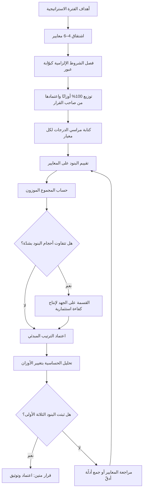

# التقييم الموزون متعدّد المعايير (Weighted Scoring)

> [!info] تعريف مختصر
> أسلوب لترتيب الأولويات يُقيَّم فيه كل بند مرشَّح على **مجموعة معايير معلَنة** (قيمة للعميل، أثر على الإيراد، توافق استراتيجي، خفض مخاطر، كلفة…)، ولكل معيار **وزن نسبي** يعبّر عن أهميته، ومجموع الأوزان يساوي ١٠٠٪. النتيجة النهائية لكل بند = مجموع (درجة المعيار × وزنه). قوّته الحقيقية ليست في الرقم الناتج، بل في أنه يُجبر المنظّمة على **التصريح علنًا بما تعتبره مهمًّا وبأيّ نسبة** — فيتحوّل الخلاف من مشاجرة حول البنود إلى نقاش قابل للحسم حول المعايير والأوزان، وهو نقاش يُدار مرّة واحدة كل ربع بدل تكراره في كل اجتماع.

## الشرح العلمي والاحترافي
- **الجذر المنهجي**: الأسلوب فرع مبسَّط عمليًّا من عائلة أوسع في بحوث العمليات تُعرف بـ**اتخاذ القرار متعدّد المعايير (Multi-Criteria Decision Analysis – MCDA)**، وهي حقل أكاديمي مستقرّ يعالج مسألة المفاضلة حين تتعدّد الأهداف المتعارضة ولا يوجد مقياس واحد يجمعها. الطرائق الأكاديمية فيه (مثل التحليل الهرمي للقرارات، أو نماذج المنفعة متعدّدة السمات) تفرض إجراءات صارمة لاشتقاق الأوزان وفحص اتّساقها؛ أما الصيغة الشائعة في إدارة المنتجات فهي تبسيط عملي لها يتنازل عن الصرامة مقابل السرعة.
- **الجمع لا الضرب — ولهذا نتيجة مهمّة**: بخلاف [[ICE Scoring]] الذي يضرب العوامل فيُسقط البند إذا انهار أحدها، فإن التقييم الموزون **يجمع**، ما يعني أن التفوّق الشديد في معيار واحد يمكن أن يعوّض ضعفًا في معيار آخر. هذه خاصيّة تُسمّى **التعويضية (Compensatory)**، وهي مفيدة حين تكون المعايير قابلة للمقايضة فعلًا، وخطرة حين يكون أحد المعايير شرطًا لا يُقايَض (كالامتثال التنظيمي أو الأمان). العلاج المعتاد: إخراج الشروط غير القابلة للمقايضة من الجدول ووضعها **بوّابة عبور (Gate)** قبل التقييم — يمرّ البند أو يسقط، ولا يُعوَّض.
- **اشتقاق الأوزان من الاستراتيجية هو جوهر الأداة**: الأوزان ليست ذوقًا، بل يجب أن تكون **ترجمة عددية لأهداف الفترة المعلَنة**. المسار العملي: ابدأ من أهداف الشركة للفترة (أهداف [[OKR]] أو [[North Star Metric]]) → اشتقّ من كل هدف معيارًا يقيس مساهمة البند فيه → وزّع ١٠٠ نقطة على المعايير بحسب أولوية الأهداف نفسها. فإن كان هدف السنة هو الاحتفاظ لا الاكتساب، وجب أن يحمل معيار «أثر على الاحتفاظ» وزنًا يفوق «جذب مستخدمين جدد» بفارق ملموس — وإلا فالأوزان تناقض الاستراتيجية المعلنة، وهو أشيع أعراض الخلل في هذه الأداة. الاختبار الحاسم: **إذا تغيّرت استراتيجية الشركة ولم تتغيّر الأوزان، فالأوزان ليست مشتقّة من الاستراتيجية أصلًا.**
- **طرائق عملية لتوزيع الأوزان**: (أ) **توزيع ١٠٠ نقطة** بين المعايير من كل مشارك ثم أخذ الوسيط لا المتوسّط، لأن الوسيط أقلّ تأثّرًا بالمواقف المتطرّفة. (ب) **المقارنة الثنائية**: قارن كل معيارين ("أيّهما أهم لهذا الربع؟") واحسب الأوزان من عدد الانتصارات — أبطأ لكنه يكشف التناقضات، إذ قد يفضّل شخص أ على ب وب على ج ثم ج على أ. (ج) **الترتيب ثم التحويل**: رتّب المعايير ثم أسنِد أوزانًا تنازلية بنمط ثابت. المهم في الطرائق الثلاث أن **الأوزان تُقرّ من صاحب القرار الاستراتيجي ([[Sponsor]]) أو [[Steering Committee]] لا من فريق التنفيذ وحده**، لأنها تعبير عن الاستراتيجية لا عن التفضيل الفني.
- **مقياس الدرجات ومشكلة عدم التجانس**: لكل بند تُعطى درجة على كل معيار بمقياس موحّد (١–٥ أو ١–١٠). المشكلة المنهجية أن المعايير قد تكون مختلفة الطبيعة تمامًا — بعضها نقدي (زيادة إيراد بالريال) وبعضها نوعي (توافق مع رؤية المنتج). جمعها يفترض ضمنًا أن الدرجة ٤ في معيار تساوي الدرجة ٤ في معيار آخر، وهو افتراض غير مضمون. المعالجة العملية: **مراسٍ مكتوبة (Anchors)** تعرّف كل درجة بلغة ملموسة لكل معيار على حدة، مثل: «٥ = أثر متوقّع يتجاوز مليون ريال سنويًّا».
- **الكلفة: داخل الجدول أم خارجه؟** ثمّة مدرستان. الأولى تُدخل الكلفة كمعيار سالب الاتجاه (كلفة أعلى = درجة أقل) — أبسط لكنه يخلط القيمة بالاستثمار. والثانية تحسب **درجة القيمة فقط ثم تقسمها على الجهد** لتنتج مؤشّر كفاءة استثمارية، وهي أقرب في منطقها إلى [[WSJF]] وإلى مقام الجهد في [[RICE Prioritization]]، وتُفضَّل حين تتفاوت البنود تفاوتًا كبيرًا في الحجم.
- **تحليل الحساسية — الفحص الذي يهمله الجميع**: بعد إنتاج الترتيب، غيّر وزنًا واحدًا بمقدار ١٠ نقاط وأعد الحساب. إن انقلب الترتيب رأسًا على عقب فالنتيجة هشّة ولا تصلح أساسًا لقرار كبير؛ وإن بقيت البنود الثلاثة الأولى ثابتة رغم التغيير، فالقرار **متين (Robust)** ويمكن الدفاع عنه أمام أي معترض. هذا الفحص وحده يفصل بين استخدام ناضج للأداة واستخدام تجميلي.
- **ما الذي تحلّه الأداة فعلًا**: تحلّ مشكلة **الحوكمة والشفافية** أكثر مما تحلّ مشكلة الدقّة. في بيئة متعدّدة أصحاب المصلحة ([[Stakeholder Map]])، الخلاف الحقيقي ليس على حساب الأرقام بل على شرعية القرار. حين تكون المعايير والأوزان معلَنة ومُقرّة مسبقًا، يفقد الاعتراض المتأخّر أساسه: من يريد رفع بنده عليه أن يجادل في المعايير — وهو نقاش استراتيجي مشروع — لا أن يمارس ضغطًا شخصيًّا.

## أين ومتى يُستخدم
- **في اختيار المشاريع على مستوى المحفظة**: حين تتنافس مبادرات من إدارات مختلفة على ميزانية واحدة، ويكون لكل إدارة مقياس نجاح مختلف لا يجمعها رقم واحد.
- **في تقييم الموردين واختيار الأنظمة الجاهزة**: أحد أكثر استعمالاته رسوخًا وقِدَمًا؛ تُقيَّم العروض على معايير (السعر، التغطية الوظيفية، الدعم، خطر [[Vendor Lock-in]]، الامتثال) بأوزان معلَنة — ويرتبط مباشرة بـ[[Vendor Management]] و[[Fit-Gap Analysis]].
- **في ترتيب بنود الـ Backlog الكبيرة (Epics)**: حين تكون البنود ضخمة ومتباينة، ولا يكفيها فرز سريع كـ[[ICE Scoring]] لأن أثرها يمسّ أهدافًا متعدّدة في آن.
- **في القرارات التي تحتاج أثرًا موثّقًا للتدقيق أو للجهات التنظيمية**: يوفّر الجدول سجلًّا يوضّح كيف اتُّخذ القرار ولماذا، ويُحفظ ضمن [[Decision Log]] و[[Organizational Process Assets]].
- **عند بناء [[Business Case]] لمبادرة كبيرة**: لعرض المفاضلة بين خيارات الحل الممكنة على معايير الشركة نفسها، لا على الكلفة وحدها.
- **في نزع فتيل الصراع بين أصحاب المصلحة**: حين يتحوّل ترتيب الأولويات إلى صراع نفوذ، تنقل الأداة النقاش من «بندي مقابل بندك» إلى «ما الذي يستحقّه هذا الهدف من وزن هذا الربع؟».

## مثال وسيناريو تطبيقي
> [!example] بنك خليجي متوسّط الحجم أمامه ٩ مبادرات رقمية لعام كامل، وسعة تنفيذ تكفي ٤ منها فقط. كان الترتيب في السنوات الماضية يُحسم في اجتماع واحد يغلب فيه صوت الإدارة الأعلى صراحةً، ما ولّد استياءً متكرّرًا. قرّرت اللجنة التوجيهية اعتماد تقييم موزون.
> **الخطوة الأولى — اشتقاق المعايير من الاستراتيجية**: كانت أهداف السنة المعلنة ثلاثة: خفض تكلفة الخدمة، رفع الاحتفاظ بعملاء الشرائح العليا، والامتثال لمتطلّبات حماية البيانات ([[PDPL]]). فاشتُقّت المعايير مباشرة منها:
>
> | المعيار | الوزن | مرساة الدرجة 5 |
> |---|---|---|
> | خفض التكلفة التشغيلية | 30% | توفير يفوق ٢ مليون ريال سنويًّا |
> | أثر على الاحتفاظ بالشريحة العليا | 30% | تحسّن متوقّع يفوق 3 نقاط مئوية |
> | تقليص مخاطر الامتثال | 20% | يُغلق فجوة تنظيمية مرصودة |
> | جاهزية التنفيذ وقلّة التبعيّات | 20% | لا تبعيّة على أنظمة خارجية |
>
> ولوحظ عمدًا **غياب معيار «جذب عملاء جدد»**، وهو قرار استراتيجي صريح لا سهو — إذ كان عام تثبيت لا توسّع. الامتثال الأمني الإلزامي أُخرج من الجدول ووُضع **بوّابة عبور**: أي مبادرة لا تستوفيه تُستبعد قبل التقييم ولا تُعوَّض بدرجات عالية في غيره.
> **النتيجة**: مبادرة «تجديد تطبيق الأفراد» — المفضّلة إعلاميًّا — حصلت على ٣٫٤ من ٥، بينما تفوّقت عليها «أتمتة توثيق العميل ([[KYC]])» بـ٤٫٢ لأنها جمعت خفض تكلفة عاليًا (٥) مع إغلاق فجوة امتثال (٥)، رغم درجتها المتوسّطة في الاحتفاظ (٢).
> **تحليل الحساسية**: عند خفض وزن التكلفة إلى ٢٠٪ ورفع الاحتفاظ إلى ٤٠٪، تبادلت المبادرتان الرابعة والخامسة موقعيهما، لكن المبادرات الثلاث الأولى لم تتغيّر — فأُبلغت اللجنة أن القرار متين في قمّته وهشّ في ذيله، واعتُمدت الثلاث الأولى بثقة وأُخضعت الرابعة لنقاش إضافي.
> **الأثر التنظيمي الأهم** لم يكن الترتيب نفسه: حين اعترض مدير إحدى الإدارات على استبعاد مبادرته، لم يعد الاعتراض قابلًا للصياغة كخلاف شخصي، بل تحوّل إلى سؤال واضح: «هل يستحقّ اكتساب العملاء الجدد وزنًا هذا العام؟» — نوقش أمام اللجنة، ورُفض بقرار معلَن ومُوثَّق، وانتهى الجدل عند حدّه.

## خطوات أو مخطّط
1. اجمع البنود المرشَّحة كاملةً بمستوى وضوح متقارب، حتى لا يُظلم بند لأن وصفه أضعف لا لأن قيمته أقل.
2. اشتقّ **٤–٦ معايير** من أهداف الفترة المعلنة. أقلّ من أربعة يفقد التمييز، وأكثر من ستّة يُنتج أوزانًا متقاربة تلغي أثر بعضها.
3. افصل **الشروط غير القابلة للمقايضة** (امتثال، أمان، التزام تعاقدي) واجعلها بوّابة عبور سابقة للتقييم لا معايير موزونة.
4. وزّع ١٠٠٪ على المعايير بطريقة معلَنة (توزيع نقاط أو مقارنة ثنائية)، وخذ الوسيط عند اختلاف المشاركين.
5. اكتب **مرساة لغوية لكل درجة في كل معيار** — هذه أكثر خطوة تُهمَل وأكثرها أثرًا في جودة النتيجة.
6. اعتمد الأوزان رسميًّا من صاحب القرار الاستراتيجي **قبل** رؤية أي درجات للبنود، منعًا للهندسة العكسية.
7. قيّم كل بند على كل معيار، ويفضَّل أن يقيّم شخصان مستقلّان ويُناقَش الاختلاف فوق درجتين.
8. احسب المجموع الموزون، ثم — إن تفاوتت الأحجام بشدّة — اقسمه على تقدير الجهد لتحصل على كفاءة استثمارية لا قيمة مطلقة.
9. أجرِ **تحليل حساسية**: غيّر أهم وزنين صعودًا وهبوطًا وارصد ثبات القمّة.
10. وثّق الجدول والأوزان والمبرّرات في [[Decision Log]]، وأعد النظر في الأوزان عند كل تغيّر استراتيجي أو مرّة كل ربع على الأكثر.

## ⚠️ مفاهيم خاطئة شائعة
> [!warning]
> - **الظنّ بأن الأداة تُنتج قرارًا موضوعيًّا**: الموضوعية هنا إجرائية لا معرفية. الأرقام مشتقّة من أحكام بشرية، لكن الأداة تجعل تلك الأحكام **معلَنة وقابلة للمساءلة** — وهذه قيمتها، لا الدقّة الحسابية.
> - **اعتبار الأوزان ثابتة**: الأوزان تعبير عن استراتيجية فترة محدّدة. إبقاؤها سنتين بلا مراجعة يعني أن الترتيب يخدم استراتيجية منتهية الصلاحية.
> - **الخلط بينه وبين [[RICE Prioritization]]**: صيغة RICE ثابتة العوامل ومصمَّمة لمنتج رقمي بمقياس مستخدمين، بينما التقييم الموزون **يُفصَّل بالكامل** على معايير المنظّمة، ويصلح لقرارات لا علاقة لها بالمستخدمين كاختيار مورّد أو موقع.
> - **افتراض أن زيادة عدد المعايير تزيد الدقّة**: كلما زادت المعايير تقاربت الأوزان وتقاربت النتائج النهائية، فيصبح كل البنود في المنطقة الوسطى ويختفي التمييز تمامًا. القاعدة العملية: معايير قليلة ذات أوزان متباينة تميّز أكثر من معايير كثيرة متساوية.
> - **معاملة فروق الكسور العشرية كفروق حقيقية**: بند بـ٤٫١ وآخر بـ٤٫٠ متساويان عمليًّا في حدود دقّة الأداة. تعامل مع النتائج كطبقات لا كترتيب حاسم، وافصل بين المتقاربين بمعيار كيفي أو بحسابات كلفة التأخير.
> - **الظنّ بأن المعايير التي لم تُدرَج تُحسب ضمنيًّا**: ما لا يُدرَج لا يُحتسب إطلاقًا. غياب معيار «الدين التقني» مثلًا يعني بنية تحتية لن تُموَّل أبدًا مهما تدهورت.

## ❌ ممارسات خاطئة في المشاريع
> [!failure]
> - **الخطأ: تحديد الأوزان بعد رؤية درجات البنود.** لماذا يضرّ: يفتح باب الهندسة العكسية، فتُضبط الأوزان حتى يفوز البند المرغوب سلفًا وتضيع كل قيمة الأداة. الحل: اعتماد الأوزان وتوثيقها بتاريخ **قبل** بدء تقييم أي بند، ومنع تعديلها داخل الدورة نفسها.
> - **الخطأ: توزيع أوزان متقاربة (٢٠٪ لكل معيار) تجنّبًا للخلاف.** لماذا يضرّ: يُخفي الخلاف بدل حلّه، ويُنتج ترتيبًا لا يعبّر عن أي أولوية استراتيجية. الحل: افرض تباينًا صريحًا — كأن يكون أعلى معيار ضعف أدناه على الأقل — واجعل هذا التباين هو موضوع النقاش الحقيقي.
> - **الخطأ: إدراج معيار إلزامي (امتثال أو أمان) ضمن الأوزان القابلة للتعويض.** لماذا يضرّ: يسمح لبند يخالف التنظيم بالفوز لتفوّقه في معايير أخرى، وهو خطأ حوكمي جسيم قد يكلّف الشركة قانونيًّا. الحل: بوّابة عبور ثنائية (يمرّ / لا يمرّ) قبل الجدول.
> - **الخطأ: تقييم البنود بشخص واحد هو صاحب اقتراحها.** لماذا يضرّ: يُدخل [[Confirmation Bias]] مباشرة في الأرقام، ويجعل الترتيب انعكاسًا لحماس أصحاب البنود لا لقيمتها. الحل: تقييم مزدوج مستقلّ، ومناقشة كل اختلاف يتجاوز درجتين، مع تدوين سبب كل درجة.
> - **الخطأ: القفز إلى الترتيب دون تحليل حساسية.** لماذا يضرّ: يُبنى قرار استثماري كبير على نتيجة قد تنقلب بتغيير وزن واحد بنقاط قليلة، فينهار عند أول اعتراض جادّ. الحل: اعرض دائمًا سيناريوهين بديلين للأوزان، وميّز ما ثبت عمّا تذبذب.
> - **الخطأ: تجاهل الجهد والحجم عند مقارنة بنود متفاوتة جدًّا.** لماذا يضرّ: تفوز المبادرات الضخمة دائمًا لأن قيمتها المطلقة أكبر، فتُستهلك سعة السنة في مشروعين ويُحرم الباقي. الحل: احسب القيمة لكل وحدة جهد، وافحص النتيجة مقابل منطق [[Cost of Delay]].
> - **الخطأ: بناء الجدول ثم عدم استخدامه في التخطيط الفعلي.** لماذا يضرّ: يُنتج طقسًا إداريًّا مكلفًا بلا أثر، ويعلّم الفريق أن العملية شكلية فيتوقّف عن بذل الجهد فيها. الحل: اربط الترتيب مباشرةً بالسعة المخصَّصة وبأفق [[Now-Next-Later Roadmap]]، وأعلن صراحةً ما استُبعد بوصفه [[Non-Goals]].

## 🔗 مصطلحات ومفاهيم ذات صلة
[[RICE Prioritization]] | [[ICE Scoring]] | [[WSJF]] | [[MoSCoW Prioritization]] | [[Kano Model]] | [[Opportunity Scoring]] | [[Buy-a-Feature]] | [[Now-Next-Later Roadmap]] | [[Decision Log]] | [[Steering Committee]] | [[Business Case]] | [[Vendor Management]]
