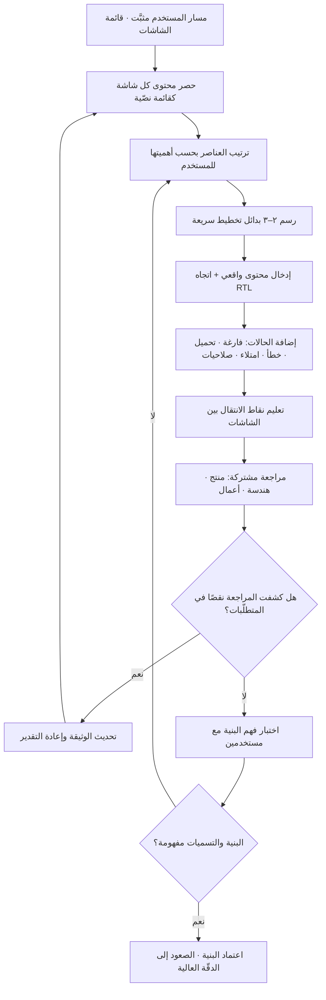

# الإطار السلكي (Wireframe)

> [!info] تعريف مختصر
> تمثيل بصري منخفض الدقّة لواجهة أو شاشة، يُظهر **البنية والتسلسل الهرمي وأماكن العناصر ووظائفها** ويحذف عمدًا كل ما يتعلّق بالهوية البصرية: الألوان، والخطوط النهائية، والصور الحقيقية، والظلال، والحركة. تُرسم فيه المستطيلات بدل الصور، وخطوط رمادية بدل النصوص الثانوية، وأسماء وظيفية بدل النسخ التسويقية. وهدفه ليس «رسم الشاشة بسرعة» بل **عزل نوع واحد من القرارات** — ماذا يوجد على الشاشة، وما أهميته النسبية، وماذا يفعل — لكي تُناقَش هذه القرارات دون أن يزيحها الجدل حول اللون أو صورة الغلاف. الانخفاض المتعمّد في الدقّة أداة تركيز، لا نقصًا في الجهد.

## الشرح العلمي والاحترافي
- **موقعه في سلّم دقّة التصميم (Fidelity Ladder)**: التصميم يتدرّج عادة عبر مستويات متزايدة الالتزام: **الرسم اليدوي السريع (Sketch)** لتوليد بدائل كثيرة بأقل كلفة → **الإطار السلكي (Wireframe)** لتثبيت البنية والمحتوى والتسلسل → **النموذج البصري عالي الدقّة (Mockup / Hi-Fi)** لتثبيت الهوية البصرية والحالات التفصيلية → **[[Prototype|النموذج الأولي التفاعلي]]** لاختبار السلوك والانتقالات مع مستخدمين حقيقيين. كل مستوى يجيب عن سؤال مختلف، والصعود قبل حسم سؤال المستوى الأدنى هو مصدر أغلب الهدر في مرحلة التصميم.
- **القرار الذي يُتّخذ بالإطار السلكي تحديدًا**: أربعة أسئلة لا خامس لها. **ما العناصر الموجودة على الشاشة؟** (المحتوى والوظائف). **ما ترتيب أهميتها؟** (التسلسل البصري: ما الذي تراه العين أولًا). **أين تقع؟** (التخطيط والتجميع المنطقي). **إلى أين تقود؟** (نقاط الانتقال ضمن [[User Flow|مسار المستخدم]]). فإن كان السؤال المطروح في الاجتماع غير هذه الأربعة، فالإطار السلكي ليس الأداة الصحيحة له.
- **لماذا الانخفاض المتعمّد في الدقّة مفيد منهجيًّا**: التصميم عالي الدقّة يستدعي من المراجعين تعليقات عن السطح («اللون داكن»، «الخط صغير»)، ويولّد لدى أصحاب المصلحة انطباعًا بأن العمل شبه مكتمل فيقاومون التغيير الجوهري. الإطار السلكي — لأنه يبدو ناقصًا عمدًا — يدعو صراحةً إلى النقد البنيوي، ويجعل الاعتراض على ترتيب الشاشة كلها أرخص نفسيًّا وعمليًّا. هذا أثر معروف عمليًّا: **مستوى إتقان العرض يحدّد نوع التعليقات التي تتلقّاها**.
- **علاقته بمنحنى كلفة التغيير**: نقل عنصر في إطار سلكي يكلّف دقائق؛ نقله بعد التطوير يكلّف دورة كاملة من التصميم والبرمجة والاختبار وربما الترحيل. الإطار السلكي أداة صريحة لدفع القرارات إلى اليسار على [[Cost-of-Change Curve|منحنى كلفة التغيير]]، وهو التطبيق العملي لمنطق [[Shift-Left and Shift-Right|الإزاحة إلى اليسار]] في طبقة التصميم.
- **الإطار السلكي وثيقة محتوى قبل أن يكون وثيقة تصميم**: أثمن ما يفرضه هو مواجهة سؤال «ما النص الفعلي هنا؟» مبكّرًا. استخدام نصّ حشو (Lorem Ipsum) يُفرغ التمرين من نصف قيمته، لأن الحقيقة البنيوية تظهر عند كتابة عنوان حقيقي بطول حقيقي. وفي السياق العربي تحديدًا يُضاف بُعد حاسم: اتجاه القراءة من اليمين إلى اليسار ([[RTL]]) يعكس التسلسل البصري ومواضع أزرار الإجراء والرجوع، وطول النص العربي يختلف عن الإنجليزي بنسبة معتبرة. إطار سلكي رُسم بذهنية LTR ثم «قُلب» لاحقًا يُنتج واجهة تبدو مترجَمة لا مصمَّمة.
- **يجب أن يشمل الحالات لا الحالة المثالية وحدها**: الإطار السلكي المهني يغطّي **الحالة الفارغة** (لا بيانات بعد)، وحالة **التحميل**، وحالة **الخطأ**، وحالة **الامتلاء المفرط** (قائمة بـ500 عنصر)، وحالة **الصلاحيات الناقصة**. الاكتفاء بشاشة [[Happy Path|المسار السعيد]] يؤجّل نصف القرارات إلى مرحلة البرمجة حيث تُتّخذ ارتجالًا من المطوّر، وهو مصدر شائع لتناقضات التجربة و[[Edge Cases|الحالات الحديّة]] غير المعالَجة.
- **ليس مرادفًا لخريطة الموقع ولا لمخطّط المسار**: خريطة الموقع تصف بنية المعلومات على مستوى النظام كله؛ ومخطّط المسار يصف تسلسل الخطوات؛ والإطار السلكي يصف **شاشة واحدة بعينها**. الثلاثة يعملون معًا: المسار يحدّد الشاشات المطلوبة، والإطار السلكي يفصّل كل شاشة.
- **مخرَج تعاقدي في المشاريع الخدمية**: في مشاريع التنفيذ لعميل خارجي يُستخدم الإطار السلكي غالبًا كمخرَج قابل للاعتماد ([[Sign-off]]) في نهاية مرحلة التصميم البنيوي، لأنه يثبّت النطاق قبل الاستثمار في الهوية البصرية. وهنا خطر مهني معروف: اعتماد العميل للإطار السلكي على أنه «التصميم النهائي» ثم مفاجأته بالمظهر البصري لاحقًا. العلاج هو التصريح المكتوب في الوثيقة نفسها بأنها تُقرّ البنية لا المظهر.

## أين ومتى يُستخدم
- **بعد تثبيت [[User Flow|مسار المستخدم]] ومباشرة قبل التصميم البصري**: المسار يقول كم شاشة ولماذا، والإطار السلكي يقول ماذا في كل شاشة.
- **في تحويل [[PRD|وثيقة متطلّبات المنتج]] إلى شيء ملموس**: كثير من الغموض في المتطلّبات لا ينكشف إلّا حين تُحاول رسمه، فيصير الإطار السلكي أداة كشف نواقص المتطلّبات لا تنفيذها فقط.
- **في تقدير الجهد الهندسي مبكّرًا**: المطوّرون يقدّرون بدقّة أعلى بكثير أمام إطار سلكي يعرض الحالات، مقارنة بوصف نصّي، وهو ما يقلّص [[Estimation Variance|تباين التقديرات]].
- **في اختبار قابلية الاستخدام المبكّر**: يمكن اختبار فهم البنية والتسميات مع 5 مستخدمين على إطار سلكي ورقي أو مرتبط بروابط بسيطة قبل كتابة سطر برمجي.
- **في حسم الخلافات بين أصحاب المصلحة حول الأولوية داخل الشاشة**: النقاش حول «ماذا يظهر أولًا» يصير ملموسًا حين يُرى، ويتحوّل من رأي إلى مقايضة مرئية.
- **في تحديد نطاق [[MVP]] وما يقع [[Out of Scope|خارج النطاق]]**: شطب عنصر من إطار سلكي أسهل وأصدق من شطب سطر من وثيقة.
- **كمدخل لتجربة [[AB Testing|اختبار A/B]] لاحقة**: حين ينتج عن المرحلة بديلان بنيويان معقولان، يُحسم الخلاف بينهما بالتجربة على المستخدمين بدل الجدل.

## مثال وسيناريو تطبيقي
> [!example] جهة حكومية سعودية تطوّر خدمة إلكترونية لتجديد رخصة نشاط تجاري. الوثيقة المكتوبة وصفت الخدمة في 14 صفحة، وقُدِّر الجهد الهندسي بـ**6 أسابيع**. قبل البدء طلب مدير المنتج جلستين لرسم إطار سلكي لكل شاشة في المسار، بالعربية ومن اليمين إلى اليسار، مع تغطية إلزامية للحالات غير السعيدة.
> **ما انكشف أثناء الرسم — ولم يكن في الوثيقة إطلاقًا**:
> ① **شاشة اختيار المنشأة**: الوثيقة افترضت منشأة واحدة لكل مستخدم. عند رسم حالة «المستخدم مالك لـ12 منشأة» ظهرت الحاجة إلى بحث وتصفية وترتيب — شاشة كاملة غير مقدَّرة.
> ② **الحالة الفارغة**: ماذا يُعرض لمن لا يملك أي منشأة مسجّلة؟ لم يكن لها جواب، والقرار الذي اتُّخذ (رسالة إرشادية + رابط لخدمة التسجيل) وفّر لاحقًا فيضًا متوقّعًا من تذاكر الدعم.
> ③ **حالة الرخصة المنتهية منذ أكثر من سنة**: تتطلّب مسارًا مختلفًا فيه غرامة ومرفقات إضافية — ثلاث شاشات لم تكن في التقدير.
> ④ **موضع زرّ «التالي»**: في الاتجاه من اليمين إلى اليسار يقع زرّ التقدّم في الجهة اليسرى؛ الإطار السلكي الأول رُسم بالعادة الإنجليزية فوُضع يمينًا، فصُحّح قبل أن يترسّخ في عشرين شاشة.
> ⑤ **طول النص**: عنوان الحقل الرسمي «رقم السجل التجاري الموحّد للمنشأة» لم يتّسع في العمود المقترح، ففُرض تغيير في التخطيط ما كان ليظهر مع نصّ حشو.
> **النتيجة**: ارتفع التقدير من 6 إلى **9 أسابيع** — وهذا هو المكسب لا الخسارة، لأن الأسابيع الثلاثة كانت موجودة في الواقع ومخفيّة في التقدير. استغرقت الجلستان يومين، وحُسمت فيهما قرارات كانت ستُتّخذ ارتجالًا من ثلاثة مطوّرين مختلفين بثلاثة أنماط متناقضة. واعتُمد الإطار السلكي رسميًّا مع عبارة صريحة في رأسه: «هذا المستند يعتمد **البنية والمحتوى**، ولا يمثّل الهوية البصرية النهائية».

## خطوات أو مخطّط
1. تثبيت المسار المستهدف أولًا: ما المهمّة التي يؤدّيها المستخدم؟ وما الشاشات التي يمرّ بها؟
2. حصر محتوى كل شاشة كقائمة نصّية قبل الرسم: ما العناصر والحقول والإجراءات المطلوبة فعلًا؟
3. ترتيب العناصر بحسب الأهمية للمستخدم — لا بحسب أهميتها للجهة الداخلية.
4. رسم بدائل سريعة متعدّدة لتخطيط الشاشة (٢–٣ على الأقل) قبل التعلّق بأولها.
5. استخدام محتوى واقعي: نصوص حقيقية بأطوالها الحقيقية، وأرقام واقعية، وباتجاه القراءة الصحيح ([[RTL]]) في الواجهات العربية.
6. إضافة الحالات غير السعيدة إلزاميًّا: فارغة، تحميل، خطأ، امتلاء مفرط، صلاحية ناقصة.
7. تعليم نقاط الانتقال: أي عنصر يقود إلى أي شاشة، وما الذي يحدث عند الرفض أو الرجوع.
8. مراجعة مشتركة مع الهندسة والأعمال، والاستماع تحديدًا لما يكشف نقصًا في المتطلّبات لا لما يعلّق على الشكل.
9. اختبار فهم البنية والتسميات مع عدد صغير من المستخدمين الحقيقيين قبل الصعود إلى الدقّة العالية.
10. الاعتماد المكتوب للبنية، مع تصريح واضح بأن المظهر البصري يُعتمد في مرحلة لاحقة.

## ⚠️ مفاهيم خاطئة شائعة
> [!warning]
> - **«الإطار السلكي مجرّد تصميم قبيح أو غير مكتمل»**: انخفاض الدقّة اختيار منهجي لعزل قرارات البنية عن قرارات المظهر، لا كسل ولا نقص مهارة. **التصحيح**: اذكر صراحةً في العرض السؤال الذي يجيب عنه المستند، وارفض التعليقات الخارجة عنه إلى مرحلتها.
> - **«يمكن تخطّيه والذهاب مباشرة إلى التصميم عالي الدقّة»**: ممكن في شاشة بسيطة أو تعديل صغير، لكنه في المسارات المركّبة ينقل قرارات البنية إلى مرحلة تكلفة التغيير فيها أعلى بكثير، ويحوّل النقاش إلى المظهر. **التصحيح**: اربط القرار بحجم المخاطرة: كلّما زاد عدد الشاشات والحالات، زادت جدوى المرور بالإطار السلكي.
> - **«الإطار السلكي هو النموذج الأولي»**: [[Prototype|النموذج الأولي]] يُختبر به **السلوك والتفاعل** مع مستخدم، والإطار السلكي يُحسم به **المحتوى والبنية**. **التصحيح**: استخدم كلًّا منهما لسؤاله؛ ويمكن ربط أطر سلكية بروابط بسيطة لاختبار الفهم دون ادّعاء أنها نموذج تفاعلي كامل.
> - **«نصّ الحشو كافٍ في هذه المرحلة»**: نصّ الحشو يخفي أخطر المشكلات: طول العناوين الحقيقية، وضيق الحقول، وغموض التسميات. **التصحيح**: استعمل نصوصًا حقيقية أو أقرب ما يكون إليها طولًا ولغةً واتجاهًا.
> - **«يكفي رسم الشاشة في حالتها المثالية»**: أغلب تعقيد المنتج يسكن في الحالات غير السعيدة، وتأجيلها يعني تركها لاجتهاد فردي وقت البرمجة. **التصحيح**: اجعل الحالات الخمس بندًا إلزاميًّا في قائمة مراجعة اعتماد أي إطار سلكي.
> - **«الإطار السلكي مهمّة المصمّم وحده»**: أثمن مخرجاته تنشأ من الحوار مع الهندسة والأعمال والدعم، ورسمه منفردًا يفقده وظيفته ككاشف للنواقص. **التصحيح**: أدرْه كجلسة مشتركة قصيرة، ووثّق القرارات التي انبثقت عنه في [[Decision Log|سجلّ القرارات]].
> - **«اعتماد الإطار السلكي يعني تجميد التصميم»**: هو يجمّد البنية لا المظهر، وقد يظهر في اختبار قابلية الاستخدام لاحقًا ما يستدعي مراجعة البنية نفسها. **التصحيح**: اذكر مدى الاعتماد ونطاقه صراحةً في وثيقة [[Sign-off|الاعتماد]].

## ❌ ممارسات خاطئة في المشاريع
> [!failure]
> - **الخطأ: عرض الإطار السلكي على أصحاب المصلحة دون شرح مستوى الدقّة المقصود** → **لماذا يضرّ**: تتحوّل الجلسة إلى نقاش عن الألوان والخطوط الغائبة أصلًا، فيُهدر الوقت وتخرج القرارات البنيوية بلا حسم، وقد ينزعج العميل ظنًّا أن هذا هو المنتج النهائي → **الحل**: افتتح كل عرض بجملة تحدّد السؤال المطروح وما هو مؤجَّل عمدًا، واكتبها في رأس المستند نفسه.
> - **الخطأ: الاكتفاء بشاشات المسار السعيد** → **لماذا يضرّ**: تُترك الحالات الفارغة والأخطاء لاجتهاد المطوّر أثناء البرمجة، فتتناقض الرسائل بين الشاشات ويرتفع حجم تذاكر الدعم بعد الإطلاق → **الحل**: اجعل تغطية الحالات الخمس شرطًا في [[Definition of Ready|تعريف الجاهزية]] لأي شاشة تدخل التطوير.
> - **الخطأ: رسم واجهات عربية بذهنية LTR ثم قلبها آليًّا في النهاية** → **لماذا يضرّ**: ينتج تسلسل بصري معكوس ومواضع أزرار مربكة ومساحات لا تتّسع للنص العربي، وتصحيحه بعد ترسّخه في عشرات الشاشات مكلف جدًّا → **الحل**: ارسم من اليوم الأول باتجاه [[RTL]] الصحيح ونصوص عربية حقيقية، واعتبر ذلك جزءًا من [[Internationalization|التدويل]] لا لمسة نهائية.
> - **الخطأ: القفز إلى الدقّة العالية قبل حسم البنية** → **لماذا يضرّ**: يستثمر الفريق ساعات في صقل شاشة قد تُلغى بالكامل، ويصير التراجع عنها مكلفًا نفسيًّا وتنظيميًّا بعد أن رآها الجميع «جاهزة» → **الحل**: اجعل الصعود في سلّم الدقّة مشروطًا بحسم أسئلة المستوى الأدنى، وثبّت ذلك كبوّابة في عملية التصميم.
> - **الخطأ: عدم إشراك الهندسة في مراجعة الإطار السلكي** → **لماذا يضرّ**: تُعتمد بنية مكلفة تقنيًّا أو مستحيلة على البنية القائمة، فيُكتشف ذلك بعد الاعتماد ويُعاد التصميم بضغط زمني → **الحل**: أشرك مهندسًا في الجلسة نفسها، واطلب تقديرًا تقريبيًّا لكل بديل تخطيط قبل الاختيار.
> - **الخطأ: معاملة الإطار السلكي كمخرَج يُؤرشَف بعد الاعتماد** → **لماذا يضرّ**: يتباعد عن المنتج الفعلي خلال أسابيع فيصير مضلّلًا لمن يرجع إليه لاحقًا، ويُبنى على معلومة قديمة → **الحل**: إمّا تحديثه مع التغييرات، أو الإعلان صراحةً عن انتهاء صلاحيته وتحويل مصدر الحقيقة إلى المنتج الحيّ.
> - **الخطأ: رسم بديل واحد فقط والدفاع عنه** → **لماذا يضرّ**: يحرم الفريق من مقارنة حقيقية ويحوّل النقاش إلى موقف شخصي بدل مقايضة موضوعية → **الحل**: اشترط عرض بديلين على الأقل مع ذكر المقايضة بينهما، واحسم بالمعيار المتّفق عليه لا بالذوق.
> - **الخطأ: استخدامه لتجميد النطاق مع عميل دون تصريح بحدود الاعتماد** → **لماذا يضرّ**: ينشأ خلاف تعاقدي لاحق حين يرى العميل التصميم البصري ويعتبره تغييرًا غير متّفق عليه → **الحل**: اكتب في وثيقة الاعتماد ما الذي يُقرّه هذا المستند بالضبط وما الذي يبقى مفتوحًا للمرحلة التالية.

## 🔗 مصطلحات ومفاهيم ذات صلة
[[User Flow]] | [[Prototype]] | [[AB Testing]] | [[Retention]] | [[PRD]] | [[User Journey Map]] | [[RTL]] | [[Internationalization]] | [[Edge Cases]] | [[Happy Path]] | [[Cost-of-Change Curve]] | [[Definition of Ready]] | [[Sign-off]] | [[MVP]] | [[Estimation Variance]]
