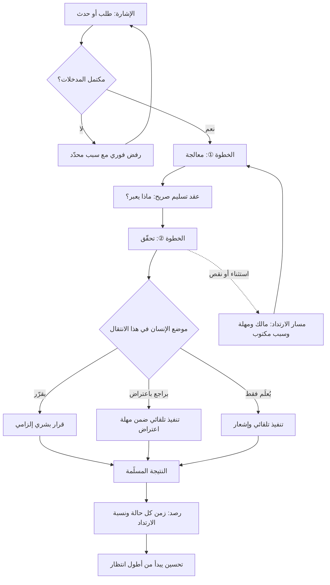

# سير العمل (Workflow)

> [!info] تعريف مختصر
> السلسلة المحدّدة من الخطوات التي تتحوّل بها **إشارة** — طلب عميل، بلاغ خلل، فكرة، حدث في نظام — إلى **نتيجة** ذات قيمة، مع تحديد صريح لثلاثة أشياء عند كل حدّ بين خطوتين: ما الذي يعبر (المخرَج المسلَّم بصيغته وحقوله)، ومتى يُسمح له بالعبور (معايير القبول)، ومن يملك الخطوة التالية. وقيمة الوصف الجيّد لسير العمل ليست في التوثيق، بل في أن **الحدود بين الخطوات** — لا الخطوات نفسها — هي حيث يضيع أغلب الوقت وتنشأ أغلب الأخطاء. ويكتمل الوصف بتحديد مواضع وقوف الإنسان: أين يقرّر، وأين يراجع، وأين لا يتدخّل أصلًا.

## الشرح العلمي والاحترافي
- **الفرق بين سير العمل والعملية والإجراء**: تُستعمل الكلمات الثلاث تبادليًّا فتضيع الدقّة. **العملية (Process)** توصيف على مستوى أعلى لغرض متكرّر وحدوده ومالكه. و**سير العمل (Workflow)** هو التسلسل التنفيذي الفعلي للخطوات والانتقالات داخل تلك العملية. و**الإجراء ([[SOP]])** هو التعليمات التفصيلية لأداء خطوة واحدة. الالتباس عملي الأثر: فريق يشكو من «عملية سيّئة» بينما الخلل في انتقال واحد، وفريق يكتب إجراءات مفصّلة بينما مشكلته أن الخطوات نفسها مرتّبة ترتيبًا خاطئًا.
- **وحدة التحليل هي الحدّ (Handoff) لا الخطوة**: أظهرت أدبيات التدفّق أن نسبة زمن الانتظار من زمن الدورة الكلّي تفوق عادةً زمن العمل الفعلي بمراحل — وهو ما يقيسه مؤشّر [[Flow Efficiency]]. الوقت لا يُهدَر غالبًا داخل الخطوة، بل بين الخطوات: في الطوابير، وفي الانتظار على قرار، وفي إعادة السؤال عن معلومة ناقصة. لذلك فإن أول تحسين مجدٍ لأي سير عمل هو **جعل عقد التسليم بين كل خطوتين صريحًا**: ما الحقول المطلوبة؟ ما الذي يجعل المدخل مرفوضًا؟ هذا هو الدور الحقيقي لـ[[Definition of Ready]] و[[Definition of Done]].
- **التمييز بين المسار السعيد والمسارات البديلة**: كل سير عمل حقيقي يتكوّن من مسار رئيسي ([[Happy Path]]) ومن **مسارات استثناء** هي التي تستهلك الجهد فعلًا: الرفض، والإرجاع، والتصعيد، والإلغاء، والحالات المعلّقة في انتظار طرف خارجي. الوصف الذي يرسم المسار السعيد وحده يبدو أنيقًا ويصف أقلّ من نصف الواقع، ولذلك تنهار الأتمتة المبنية عليه عند أول حالة غير نمطية ([[Edge Cases]]).
- **الدفع مقابل السحب**: يُصمَّم سير العمل إمّا **بالدفع (Push)** حيث تُلقي كل خطوة مخرجاتها على التالية بمجرّد انتهائها، أو **بالسحب ([[Pull System]])** حيث لا تُسحب مهمّة جديدة إلا عند توفّر سعة فعلية. الدفع يبدو أسرع محلّيًّا لكنه يبني مخزونًا من العمل غير المكتمل يطيل زمن الدورة كما تصف [[Little's Law]]، ويخفي الاختناق الحقيقي. ولهذا يُقترن تصميم سير العمل عادةً بـ[[WIP Limit]].
- **الحالة والانتقال والملكية**: كل عنصر عمل يوجد في **حالة (State)** واحدة في أي لحظة، وينتقل بين الحالات بشروط. وسير عمل سليم يستوفي ثلاثة شروط شكلية: لكل حالة **مالك واحد** مسؤول عن تحريكها (وإلّا صارت الحالة مقبرة)، ولكل انتقال **شرط مكتوب** (وإلّا صار الانتقال اجتهادًا شخصيًّا)، ولا توجد حالة **بلا مخرج** غير الحالات النهائية. أشهر أعطاب الفرق حالة اسمها «قيد الانتظار» بلا مالك ولا مهلة، تتراكم فيها المهام إلى ما لا نهاية — وهو ما يكشفه [[WIP Aging]].
- **موضع الإنسان قرار تصميمي صريح**: في كل انتقال يوجد أحد ثلاثة أوضاع: الإنسان **يقرّر** (لا يتحرّك شيء دون قراره)، أو **يراجع** (يتحرّك تلقائيًّا لكن يمكنه الاعتراض خلال مهلة)، أو **يُعلَم** فقط. الخطأ الشائع أن تُوضع مراجعة بشرية في كل انتقال «احتياطًا»، فتتحوّل إلى ختم شكلي يبطئ ولا يحمي. والقاعدة العملية: كثّف الإنسان حيث الخطأ مكلف أو غير قابل للتراجع، وأزحه حيث يمكن التراجع بسهولة — وهذا هو جوهر تصميم [[Human in the Loop]].
- **قابلية الرصد شرط للتحسين**: سير عمل لا يُسجّل توقيت دخول كل حالة وخروجها لا يمكن قياسه، ومن ثمّ لا يمكن تحسينه إلا بالحدس. الحد الأدنى المطلوب: طابع زمني لكل انتقال، وهوية من نفّذه، وسبب مكتوب لكل ارتداد إلى الخلف. من هذه البيانات وحدها يُشتقّ [[Cycle Time]] و[[Lead Time]] و[[Throughput]] ونسبة [[Rework Percentage]].
- **سير العمل هو الطبقة التي يدخل منها الذكاء الاصطناعي**: لا يُدخَل النموذج إلى مؤسّسة دفعةً واحدة، بل يُسنَد إليه **انتقال أو خطوة بعينها** ضمن سير عمل موصوف. ولذلك فإن غياب وصف دقيق لسير العمل هو أكثر ما يعطّل مشاريع الأتمتة الذكية: لا يمكن أن تُسند خطوة لم يُتّفق على مدخلها ومخرجها ومعيار قبولها. وحين يتعدّد الوكلاء، يصير تصميم التسليم بينهم مسألة [[AI Orchestration]] بالقواعد نفسها تمامًا.

## أين ومتى يُستخدم
- **عند بناء لوحة كانبان أو تصميم مراحل التسليم**: إذ تعكس أعمدة اللوحة سير العمل الحقيقي لا الهيكل التنظيمي، وتُوصَف بطاقاتها وفق [[Kanban Card Structure]] وسياساتها وفق [[Explicit Policies]].
- **في تشخيص بطء التسليم**: لتحديد أين يقف العمل فعلًا بدل تقدير من يعمل ببطء، وهي المقدّمة الضرورية لتحليل [[Bottleneck]] و[[Theory of Constraints]].
- **في تصميم الأتمتة وقرارات الإسناد للأنظمة**: لأن الأتمتة تُطبَّق على انتقال موصوف، والانتقال غير الموصوف يُؤتمَت بافتراضات ضمنية تنكشف في الإنتاج.
- **عند دمج فريقين أو استقبال عمل من جهة خارجية**: حيث يكون الخلاف عادة على تعريف «جاهز» و«منتهٍ»، لا على الكفاءة — وهو ما يُحسم بعقد تسليم مكتوب.
- **في إدارة الطلبات العاجلة والاستثناءات**: بتعريف مسار [[Expedite Class]] بشروط دخول صارمة، بدل ترك كل طلب عاجل يخترق السير الطبيعي.
- **في التسليم للتشغيل بعد الإطلاق**: إذ يحتاج [[Hypercare]] و[[Closure vs Handover]] إلى سير عمل واضح للبلاغات: من يستقبل، وما معيار التصعيد، ومن يملك القرار في [[Hotfix]].
- **في توثيق المعرفة التشغيلية**: لأن سير العمل الموصوف هو الهيكل الذي تُعلَّق عليه معرفة المؤسّسة ضمن [[Knowledge Management]]، فتصير المعرفة موضعية قابلة للاسترجاع بدل كونها كتلة عامة.

## مثال وسيناريو تطبيقي
> [!example] جهة حكومية في الشارقة تقدّم خدمة إصدار تصريح تشغيل للمنشآت الصغيرة. المعلَن أن الخدمة تُنجَز خلال 5 أيام عمل، والواقع أن الوسيط الفعلي 21 يومًا و90% من الطلبات تُنجَز خلال 47 يومًا.
> **الوصف الأولي للسير**: استلام ← فحص فنّي ← فحص وقاية ← اعتماد ← إصدار. خمس خطوات تبدو بسيطة، ومجموع زمن العمل الفعلي فيها — بقياس الفريق — نحو 6 ساعات ونصف فقط. أي أن كفاءة التدفّق أقل من 4%.
> **ما كشفه الرصد على الحدود**: 62% من الطلبات ارتدّت مرّة واحدة على الأقل من «الفحص الفنّي» إلى «الاستلام» بسبب نقص مرفق، ومتوسّط زمن الارتداد الواحد 6 أيام لأن التواصل مع مقدّم الطلب يتمّ بالبريد بلا مهلة محدّدة. كذلك وُجدت حالة غير موثّقة اسمها «معلّق — بانتظار الوقاية»، لا مالك لها ولا مهلة، تراكم فيها 148 طلبًا أقدمها عمره 96 يومًا. وتبيّن أن خطوة «الاعتماد» كانت توقيعًا لا يفحص شيئًا في 97% من الحالات، لأن المعتمِد لا يملك معلومة إضافية عمّا فحصه الفنّيان.
> **إعادة التصميم**: ① نقل التحقّق من اكتمال المرفقات إلى **لحظة التقديم** عبر قائمة إلزامية آلية — أي نقل الرفض من بعد ستة أيام إلى الثانية الأولى. ② تشغيل الفحص الفنّي وفحص الوقاية **بالتوازي** بدل التتابع، بعد التأكّد من عدم وجود اعتماد بينهما. ③ إلغاء خطوة «الاعتماد» بوصفها مراجعة، وتحويلها إلى تدقيق لاحق على عيّنة 10% — أي إزاحة الإنسان من حيث لا يضيف، مع إبقاء المساءلة. ④ إعطاء كل حالة انتظار مالكًا ومهلة قصوى 3 أيام، مع تصعيد تلقائي بعدها.
> **النتيجة بعد أربعة أشهر**: الوسيط 4 أيام، والشريحة التسعينية 11 يومًا، ونسبة الارتداد 9%. ولم يُوظَّف أحد ولم يُشترَ نظام جديد؛ التغيير كله وقع على **الحدود بين الخطوات وعلى موضع الإنسان**، لا على سرعة أحد.

## خطوات أو مخطّط
1. حدّد الإشارة التي تبدأ السير (ما الحدث بالضبط؟) والنتيجة التي تنهيه (ما الذي يجعله منتهيًا بلا نزاع؟).
2. ارسم الخطوات كما تُنفَّذ فعلًا، بمشاهدة حالات حقيقية من طرفها إلى طرفها، لا بجمعها من أقوال المسؤولين.
3. لكل حدّ بين خطوتين، اكتب عقد التسليم: ما الذي يعبر بالضبط؟ بأي صيغة؟ وما شرط قبوله؟
4. أضف المسارات البديلة: الرفض، الإرجاع، التصعيد، الإلغاء، الانتظار على طرف خارجي.
5. حدّد لكل حالة مالكًا واحدًا ومهلة قصوى وسلوكًا عند تجاوزها.
6. حدّد موضع الإنسان في كل انتقال: يقرّر، أم يراجع باعتراض، أم يُعلَم فقط — وبرّر كل «يقرّر» بكلفة الخطأ لا بالعادة.
7. فعّل الرصد: طابع زمني لكل انتقال، وسبب مكتوب لكل ارتداد.
8. قِس زمن الانتظار مقابل زمن العمل، وابدأ التحسين من أطول انتظار لا من أبطأ خطوة.
9. اختبر التصميم على حالات استثنائية سابقة معروفة قبل اعتماده.
10. راجع السير دوريًّا بمنهج [[Kaizen]]، فالسير الذي لا يُراجَع يتراكم فيه الاستثناء حتى يصير هو القاعدة.

## ⚠️ مفاهيم خاطئة شائعة
> [!warning]
> - **الخلط بين سير العمل والهيكل التنظيمي**: تُرسم الخطوات على شكل الأقسام لا على شكل رحلة العمل، فتظهر خطوات وُجدت لأسباب إدارية بحتة. سير العمل يُرسم من منظور **عنصر العمل** وهو ينتقل، لا من منظور من يعمل عليه.
> - **اعتبار الخريطة الموثّقة هي الواقع**: الوثيقة المعتمدة تصف ما اتُّفق عليه قبل سنتين، والواقع تراكمت فيه استثناءات وطرق التفاف. التحسين يبدأ من **السير كما يُنفَّذ**، ووصفه لا يُجمع من الاجتماعات بل من الميدان.
> - **الظنّ بأن مزيدًا من الخطوات يعني ضبطًا أفضل**: كل خطوة إضافية تضيف طابورًا وتسليمًا واحتمال ارتداد. الضبط يأتي من وضوح معايير القبول ومن التدقيق على عيّنة، لا من تكثيف التوقيعات.
> - **افتراض أن أتمتة سير عمل رديء تحسّنه**: الأتمتة تضاعف سرعة ما هو قائم، فإن كان قائمًا رديئًا أنتجت رداءة أسرع وأصعب في التتبّع. رتّب السير أولًا ثم أتمِته.
> - **معاملة سير العمل كوثيقة تُكتب مرّة**: هو سياسة حيّة تتغيّر بتغيّر الحجم والقيود والأدوات، وتحتاج مالكًا ومراجعة دورية كأي أصل تشغيلي.
> - **الخلط بين خريطة سير العمل وخريطة تدفّق القيمة**: [[Value Stream Mapping]] تنظر إلى المنظومة كاملة من الطلب إلى النقد وتُعنى بالزمن والقيمة المضافة عبر الجهات، بينما خريطة سير العمل تفصّل الحالات والانتقالات وقواعدها. الأولى للتشخيص الاستراتيجي، والثانية للتشغيل — واستبدال إحداهما بالأخرى يفقدك أحد المستويين.

## ❌ ممارسات خاطئة في المشاريع
> [!failure]
> - **توثيق المسار السعيد وحده**: تُرسم الحالة المثالية وتُترك الاستثناءات لاجتهاد المنفّذين. لماذا يضرّ: الاستثناءات هي أغلب العمل الفعلي، ومعالجتها بالاجتهاد تُنتج تباينًا هائلًا في المخرجات وزمن غير متوقّع. الحل: اكتب مسارات الرفض والتصعيد والانتظار صراحةً، وضع لها مالكًا ومهلة.
> - **ترك حالة «معلَّق» بلا مالك ولا مهلة**: تُنشأ حالة انتظار عامة تُلقى فيها كل مهمّة متعثّرة. لماذا يضرّ: تتحوّل إلى مقبرة عمل مخفيّ يشوّه كل المقاييس، ويكتشفها العميل قبل الفريق. الحل: كل حالة انتظار لها مالك ومهلة وسلوك تصعيد تلقائي، ويُرصد عمرها عبر [[WIP Aging]].
> - **إضافة مراجعة بشرية عند كل انتقال احتياطًا**: يُشترط توقيع في كل خطوة خوفًا من الخطأ. لماذا يضرّ: يخلق طوابير عند المراجعين، ويحوّل المراجعة إلى ختم آلي بلا فحص حقيقي، فتُدفع الكلفة دون الحصول على الحماية. الحل: ضع المراجعة حيث الخطأ مكلف أو غير قابل للتراجع، واستبدلها في غير ذلك بتدقيق لاحق على عيّنة.
> - **السماح للطلبات العاجلة باختراق السير بلا قاعدة**: كل طلب من جهة نافذة يقفز إلى المقدّمة. لماذا يضرّ: يُدمّر القدرة على التنبّؤ ويجعل الأولوية دالّة على النفوذ لا على القيمة، ثم يصبح كل شيء عاجلًا فلا يبقى عاجل. الحل: عرّف مسار استعجال بحصّة قصوى وشروط دخول مكتوبة، واجعل استهلاكها مرئيًّا.
> - **تسليم عمل ناقص المدخلات إلى الخطوة التالية**: يُدفع العمل للأمام لإغلاق مهمّة الخطوة الحالية. لماذا يضرّ: ينقل الكلفة إلى الأسفل مضاعفة، لأن اكتشاف النقص لاحقًا أغلى بكثير من منعه ابتداءً ([[Shift-Left and Shift-Right]]). الحل: اجعل معيار الجاهزية شرط دخول لا شرط خروج، وامنح الخطوة التالية حقّ الرفض الفوري.
> - **قياس إنتاجية الأفراد داخل الخطوات بدل قياس التدفّق**: يُقاس كل موظّف بعدد المهام التي أنجزها. لماذا يضرّ: يدفع الجميع لبدء مهام كثيرة وإنهاء قليلة، فيرتفع العمل الجارٍ ويطول زمن الدورة للنظام كله. الحل: اجعل المقاييس الأساسية على مستوى السير: زمن الدورة، والإنتاجية الكلّية، وكفاءة التدفّق.
> - **أتمتة انتقال قبل الاتفاق على معيار قبوله**: يُسنَد الانتقال إلى نظام أو نموذج ذكي بينما تعريف «مقبول» ما يزال ضمنيًّا. لماذا يضرّ: يُخرج النظام نتائج تبدو صحيحة ولا أحد يملك مرجعًا للحكم عليها، فتتراكم أخطاء صامتة. الحل: اكتب معيار القبول واختبره يدويًّا على حالات سابقة معروفة النتيجة قبل الأتمتة.

## 🔗 مصطلحات ومفاهيم ذات صلة
[[Systems Thinking]] | [[AI-Native]] | [[Knowledge Management]] | [[Context Engineering]] | [[Flow Efficiency]] | [[Cycle Time]] | [[Lead Time]] | [[WIP Limit]] | [[Pull System]] | [[Definition of Ready]] | [[Definition of Done]] | [[Human in the Loop]] | [[Value Stream Mapping]] | [[Bottleneck]] | [[Explicit Policies]] | [[SOP]]
