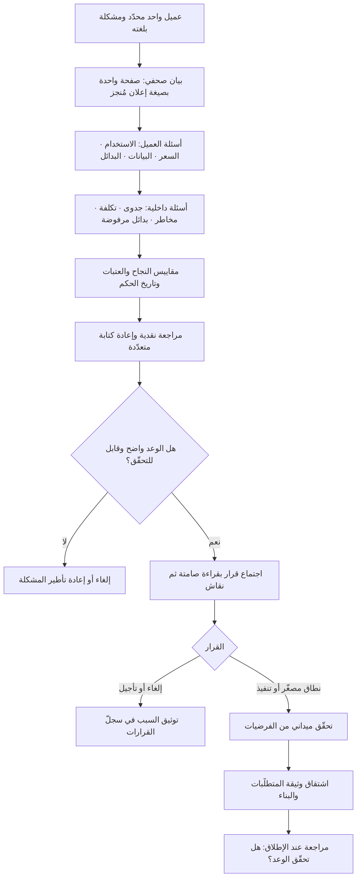

# العمل بالعكس (Working Backwards)

> [!info] تعريف مختصر
> آلية عمل منشورة علنًا تُنسب إلى شركة **أمازون**، ومفادها أن أي مبادرة تبدأ من **العميل ولحظة الإعلان عنها** ثم تعود إلى الوراء نحو التنفيذ، لا العكس. أداتها المركزية وثيقة تُكتب **قبل بناء أي شيء** تتألّف من جزأين: **بيان صحفي (Press Release)** بصيغة إعلان حقيقي موجّه للعميل يصف المنتج كما لو أُطلق اليوم، و**قائمة أسئلة شائعة (FAQ)** تعالج ما سيسأله العميل وما سيسأله الداخل من أسئلة صعبة عن الجدوى والتكلفة والمخاطر والقياس. وتُختصر عادةً بـ**PR/FAQ**. المنطق وراءها بسيط وقاسٍ: إن عجزت عن كتابة إعلان مقنع وواضح لهذا المنتج **قبل** بنائه، فالغالب أنك ستعجز عن بيعه بعد أن تنفق عليه أشهرًا — وكلفة اكتشاف ذلك على ورقة أرخص بمراتب من اكتشافه بعد الإطلاق.

## الشرح العلمي والاحترافي
- **قلب اتجاه التفكير**: الطريقة السائدة تبدأ من القدرات المتاحة («لدينا هذه التقنية وهذا الفريق، ماذا نستطيع أن نبني؟») ثم تبحث عن عميل يناسبها. العمل بالعكس يبدأ من **التجربة النهائية للعميل والقيمة المُعلَنة له**، ثم يشتقّ منها ما يلزم من بناء وقدرات — وقد ينتهي إلى أن الفجوة كبيرة فيُلغى المشروع. هذا القلب هو مصدر قيمته: يجعل الإلغاء يحدث في الأسبوع الأول لا في الشهر التاسع.
- **البيان الصحفي بصيغة الماضي المُنجَز**: يُكتب في صفحة واحدة تقريبًا، بلغة العميل لا بلغة الشركة، وبمكوّنات ثابتة: عنوان يفهمه العميل، جملة تلخّص المنتج، وصف المشكلة كما يعيشها العميل، وصف الحل، ثم أثر ملموس يوصف من زاوية العميل. والقيد الأصعب هو **منع المصطلحات الداخلية والتقنية**؛ فالاضطرار إلى الشرح بلغة بسيطة يكشف فورًا الأفكار التي تبدو ذكية داخليًّا ولا معنى لها خارجيًّا.
- **الأسئلة الشائعة هي الجزء الأثقل والأهم**: البيان الصحفي جذّاب، لكن الاختبار الحقيقي في قسم الأسئلة، وينقسم عادةً إلى: **أسئلة العميل** (كيف أستخدمه؟ بكم؟ ماذا لو لم يعجبني؟ ماذا يحدث لبياناتي؟) و**الأسئلة الداخلية** (ما حجم السوق؟ ما التقديرات وعلامَ بُنيت؟ ما البدائل التي رُفضت ولماذا؟ ما أخطر ما قد يفشل؟ ما المقاييس التي سنحكم بها؟ ما المتطلّبات النظامية؟). ونضج الوثيقة يُقاس بجرأة الأسئلة التي واجهتها لا بجمال إجاباتها.
- **آلية لا وثيقة**: المخرَج المكتوب وسيلة؛ القيمة الحقيقية في **العملية**: دورات مراجعة متعدّدة، ونقد صريح من زملاء ومن أصحاب اختصاص، وإعادة كتابة قد تتجاوز عشر مسوّدات. الفرق الجادّة تعتبر أن الوثيقة التي مرّت بمراجعة واحدة لم تُختبر بعد. ومن هذه الزاوية هي آلية **تفكير جماعي منضبط** أكثر منها قالبًا يُملأ.
- **ثقافة السرد المكتوب بدل الشرائح**: يرتبط الأسلوب بممارسة معلنة في أمازون تقوم على تقديم **مستندات سردية مكتوبة** بدل عروض الشرائح، وعلى بدء الاجتماع بقراءة صامتة للمستند ثم النقاش. الأساس المنطقي المعلن لذلك أن الجملة الكاملة تُجبر الكاتب على إظهار الترابط المنطقي، بينما النقطة المختصرة في شريحة تُخفي الثغرات وتنقل عبء الفهم إلى المتحدّث. والقراءة الصامتة تضمن أن الجميع بدأ من المعلومة نفسها لا من انطباع العرض.
- **موقعها من وثائق المتطلّبات التقليدية**: ليست بديلًا عن [[PRD]] بل **تسبقه**. البيان والأسئلة يحسمان: **لمن؟ ولماذا؟ وهل يستحقّ؟** أما وثيقة المتطلّبات فتفصّل **ماذا وكيف** بعد أن يُعتمد المبدأ. الفرق الجوهري في الجمهور والغرض: PR/FAQ موجّهة لقرار **الاستثمار من عدمه** ومكتوبة بلغة العميل، و[[PRD]] موجّهة لفريق التنفيذ ومكتوبة بلغة النظام. وهي كذلك تختلف عن [[BRD]] الذي يركّز على الاحتياج التجاري والمبرّر المالي داخليًّا.
- **ما تعالجه من أعطال تنظيمية**: (١) **مشاريع بلا عميل واضح** — يستحيل كتابة بيان صحفي بلا تحديد لمن يخاطبه. (٢) **القرارات المبنية على حماس العرض التقديمي** — السرد المكتوب يفضح الثغرات. (٣) **اكتشاف الاعتراضات متأخّرًا** — الأسئلة الصعبة تُطرح في اليوم الأول لا في مراجعة ما قبل الإطلاق. (٤) **اختلاف الفهم بين الفرق** — الوثيقة تصير مرجعًا واحدًا يقلّل تضارب التفسير، تطبيقًا لمنطق [[Single Source of Truth]].
- **حدودها الحقيقية**: الوثيقة تختبر **وضوح الفكرة وتماسكها**، لا **صحّة فرضياتها**. بيان صحفي بديع قد يصف منتجًا لا يريده أحد؛ الكتابة الجيدة قد تُقنع الغرفة بفكرة خاطئة. ولهذا تُقرن دائمًا بأدلّة من العملاء: مقابلات، بيانات استخدام، تجارب طلب مثل [[Fake Door Test]]. ومن يكتفي بها وحدها يكون قد استبدل رأيًا مصقولًا برأي خام، لا أكثر.
- **قابليتها للنقل إلى سياقات أخرى**: الآلية منشورة علنًا وتبنّتها مؤسسات كثيرة خارج أمازون، لكن نقلها يفشل غالبًا حين يُنقل **القالب دون الثقافة المصاحبة**: الوقت المخصّص للكتابة، وشرعية النقد الصريح للوثيقة، والاستعداد المؤسسي لإلغاء فكرة بعد كتابة بيانها. بلا هذه الثلاثة تتحوّل الوثيقة إلى نموذج بيروقراطي إضافي يُملأ بعد اتخاذ القرار.

## أين ومتى يُستخدم
- **قبل اعتماد مبادرة كبيرة أو خط منتج جديد**: كمدخل لقرار [[Go or No-Go Decision]] مبني على وضوح القيمة لا على حماس المقترح.
- **في مرحلة تأطير الفكرة**: كخطوة تسبق [[Product Discovery]] العميق لتحديد ما الذي يستحقّ أن يُبحث أصلًا.
- **في مواءمة أصحاب المصلحة المتعدّدين**: كمرجع واحد يقلّل تباين الفهم بين الفرق الظاهرة في [[Stakeholder Map]] ويخدم [[Alignment]].
- **كمدخل لوثيقة المتطلّبات**: بحيث تبدأ [[PRD]] من قيمة محسومة لا من قائمة ميزات مقترحة.
- **في اختبار جدّية الفكرة قبل التمويل**: بوصفها اختبارًا رخيصًا يسبق أي تجربة مكلفة ضمن منطق [[Lean Startup]].
- **في ضبط توسّع المنتج**: لأن اشتراط بيان صحفي مقنع لكل إضافة كبيرة حاجز فعّال أمام [[Feature Creep]].
- **في تحديد مقاييس النجاح مبكّرًا**: إذ يفرض قسم الأسئلة تحديد المقياس الحاكم قبل البناء، فيتّصل مباشرة بـ[[North Star Metric]] و[[Product Analytics]].
- **في توثيق قرار الرفض**: فالوثيقة التي انتهت إلى الإلغاء تُحفظ في [[Decision Log]] وتوفّر إعادة النقاش نفسه بعد عام.

## مثال وسيناريو تطبيقي
> [!example] شركة تأمين سعودية متوسطة الحجم. اقترح فريق التحوّل الرقمي بناء "محفظة صحّية رقمية" تجمع وثائق التأمين والمطالبات ومواعيد المستشفيات في تطبيق واحد. التقدير الأولي: 9 أشهر و2.3 مليون ريال. كانت الفكرة قد عُرضت في 18 شريحة وحازت حماسًا عامًّا في اللجنة.
> طُلب من الفريق كتابة PR/FAQ قبل الاعتماد. استغرقت الوثيقة 3 أسابيع و**سبع مسوّدات**.
> **المسوّدة الأولى** انهارت عند سؤال بسيط في المراجعة: من العميل بالضبط؟ فقد كان البيان مكتوبًا لثلاث شرائح متناقضة معًا (الموظّف المؤمَّن عليه، ومسؤول الموارد البشرية في الشركة المشتركة، ومقدّم الرعاية). أُعيدت الكتابة لشريحة واحدة: الموظّف المؤمَّن عليه.
> **البيان في صيغته النهائية** بلغة العميل: «اليوم أصبح بإمكانك معرفة ما تغطّيه وثيقتك **قبل** أن تدخل العيادة، لا بعد أن تصلك الفاتورة». وهذه الجملة وحدها غيّرت تصوّر المشروع: المشكلة ليست تشتّت الوثائق كما افترض العنوان الأول، بل **عدم اليقين بشأن التغطية قبل الصرف**.
> **قسم الأسئلة كشف الأثقل**، وثلاثة أسئلة قلبت المشروع:
> - «ما مصدر بيانات التغطية اللحظية؟» — تبيّن أن 60% من الشبكة الطبية لا توفّر تكاملًا لحظيًّا، وأن الوعد الأساسي في البيان **غير قابل للتنفيذ** لأكثر من نصف الحالات.
> - «كيف نعالج البيانات الصحّية وفق [[PDPL]] وما الأساس النظامي؟» — استدعى مراجعة قانونية كاملة لم تكن في الخطة أصلًا.
> - «ما المقياس الذي يحكم بالنجاح بعد 6 أشهر؟» — لم يكن للفريق جواب، فصيغ لاحقًا: نسبة المستخدمين الذين يتحقّقون من التغطية قبل زيارة طبّية خلال 90 يومًا.
> **القرار**: لم يُعتمد المشروع بصيغته الأصلية ولم يُلغَ. نُفّذ بدلًا منه نطاق مصغّر جدًّا: خدمة تحقّق من التغطية لأكثر 12 إجراءً طبيًّا شيوعًا لدى المستشفيات الأربعة المتكاملة فعلًا، بكلفة 380 ألف ريال وفي 10 أسابيع، مع اختبار الطلب أولًا عبر إشعار مبسّط لعيّنة من المؤمَّن عليهم.
> **الأثر التراكمي**: ثلاثة أسابيع من الكتابة والنقد وفّرت على الأرجح إنفاقًا يقارب مليوني ريال على منتج كان وعده الأساسي غير قابل للتحقّق تقنيًّا. ولاحقًا اعتمدت الشركة القاعدة لكل مبادرة تتجاوز 500 ألف ريال، وأنشأت أرشيفًا للوثائق المرفوضة بأسبابها — فصار الأرشيف مرجعًا يمنع إعادة اقتراح الأفكار نفسها كل عام.

## خطوات أو مخطّط
1. تحديد **عميل واحد** محدّد والمشكلة التي يعيشها بلغته هو، ورفض تعدّد الشرائح في وثيقة واحدة.
2. كتابة البيان الصحفي في صفحة واحدة بصيغة إعلان مُنجز، بلا مصطلحات داخلية ولا لغة تقنية.
3. كتابة أسئلة **العميل**: كيف أستخدمه؟ بكم؟ ماذا عن بياناتي؟ ما البديل إن لم يعجبني؟
4. كتابة الأسئلة **الداخلية** الصعبة: الجدوى، التكلفة، الاعتماديات، أخطر ما قد يفشل، البدائل المرفوضة وسبب رفضها.
5. تحديد **مقاييس النجاح وعتباتها** وتاريخ الحكم، صراحةً داخل الوثيقة لا في مستند لاحق.
6. مراجعة نقدية مع زملاء ومختصّين خارج الفريق، بتكليف صريح بالبحث عن الثغرات لا بالمجاملة.
7. إعادة الكتابة عدّة مرات؛ إن لم تتغيّر الوثيقة جوهريًّا بين المسوّدات فالمراجعة كانت شكلية.
8. عقد اجتماع القرار بقراءة صامتة أولًا ثم نقاش، لا بعرض تقديمي يقوده صاحب الفكرة.
9. اتخاذ قرار صريح: تنفيذ، أو تنفيذ بنطاق مصغّر، أو تأجيل بشرط دليل، أو إلغاء — وتوثيقه بسببه.
10. عند الاعتماد: اشتقاق [[PRD]] من الوثيقة، وتشغيل تحقّق ميداني من الفرضيات لا الاكتفاء بجودة الكتابة.
11. مراجعة البيان الصحفي عند الإطلاق الفعلي: هل ما بُني يفي بما وُعد به في الصفحة الأولى؟

## ⚠️ مفاهيم خاطئة شائعة
> [!warning]
> - **«إنها تمرين كتابة تسويقي»**: البيان الصحفي أداة **تفكير** لا مادّة إعلانية. اختباره الحقيقي أن يكشف غموض الفكرة، وكثير من الوثائق الجيدة تنتهي بقرار إلغاء — وهذا نجاحها لا فشلها.
> - **«الوثيقة هي الآلية»**: القالب هو الجزء الأسهل نقلًا والأقل قيمة. القيمة في دورات المراجعة والنقد الصريح والاستعداد للإلغاء؛ نسخ القالب بلا هذه العناصر ينتج بيروقراطية إضافية.
> - **«تُغني عن أبحاث العملاء والتجارب»**: تختبر **وضوح الفكرة وتماسكها المنطقي**، لا **صدق فرضياتها**. الكتابة البارعة قد تُقنع الغرفة بفكرة خاطئة؛ فاقرنها بأدلّة ميدانية دائمًا.
> - **«هي بديل عن وثيقة المتطلّبات»**: تسبقها ولا تحلّ محلّها. الأولى تحسم "لمن ولماذا وهل يستحقّ"، و[[PRD]] تحسم "ماذا وكيف" لفريق التنفيذ.
> - **«تُكتب مرة واحدة في جلسة»**: الوثيقة التي لم تتغيّر بين المسوّدات لم تُراجَع فعلًا. الإعادة المتكرّرة هي ما ينضج الفكرة، وهي أكثر ما يُختصر عند النقل.
> - **«تصلح لكل حجم من العمل»**: تطبيقها على تحسينات صغيرة أو إصلاحات يُنتج عبئًا لا عائد له. تُحجز للمبادرات ذات الالتزام الكبير أو عدم اليقين العالي.
> - **«الأسئلة الشائعة قسم شكلي للتغطية»**: هو القسم الذي يُسقط المشاريع فعلًا. وثيقة بأسئلة سهلة كلّها معناها أن المُراجعين لم يقوموا بعملهم.
> - **«اعتماد الوثيقة يعني اعتماد التنفيذ»**: الاعتماد يعني أن الفكرة تستحقّ **الاستثمار في التحقّق منها**، وقد تسقط عند أول تجربة ميدانية — وهذا مسار سليم لا انتكاسة.

## ❌ ممارسات خاطئة في المشاريع
> [!failure]
> - **الخطأ: كتابة الوثيقة بعد اتخاذ القرار لتبريره** → **لماذا يضرّ**: يُفرغ الآلية من وظيفتها بالكامل ويحوّلها إلى غطاء إجرائي، ويتعلّم الفريق أن المراجعة مسرحية → **الحل**: اشترط أن تسبق الوثيقة أي التزام بموارد، وأن يكون الإلغاء نتيجة واردة ومحتفى بها.
> - **الخطأ: مخاطبة عدّة شرائح متناقضة في بيان واحد** → **لماذا يضرّ**: ينتج وعدًا عامًّا لا يخصّ أحدًا، ويُخفي أن الفريق لم يحسم لمن يبني → **الحل**: بيان واحد لعميل واحد؛ وإن تعدّدت الشرائح فوثائق منفصلة أو قرار صريح بالبدء بواحدة.
> - **الخطأ: كتابة البيان بلغة تقنية ومصطلحات داخلية** → **لماذا يضرّ**: تُخفي المصطلحات غموض الفكرة وتمنع اكتشاف أنها غير مفهومة خارج الغرفة → **الحل**: اشترط أن يفهم البيانَ شخصٌ من خارج القطاع من قراءة واحدة، واختبر ذلك فعليًّا.
> - **الخطأ: تجنّب الأسئلة الصعبة في قسم الأسئلة الشائعة** → **لماذا يضرّ**: تُؤجَّل الاعتراضات القاتلة إلى ما بعد الإنفاق، حين يصير التراجع مكلفًا سياسيًّا وماليًّا → **الحل**: كلّف مراجعًا صراحةً بدور الناقد، واشترط إدراج «أخطر ما قد يفشل» بوصفه بندًا إلزاميًّا.
> - **الخطأ: إغفال تحديد مقياس النجاح وعتبته وتاريخ الحكم** → **لماذا يضرّ**: يُطلق المنتج بلا معيار، فيُعلن نجاحه دائمًا بأثر رجعي وتستمر الميزات الفاشلة إلى الأبد → **الحل**: اجعل المقياس والعتبة وتاريخ المراجعة حقولًا إلزامية، وتابعها عبر [[Product Analytics]].
> - **الخطأ: عرض الوثيقة كشرائح تقديمية يقودها صاحب الفكرة** → **لماذا يضرّ**: يعيد إنتاج المشكلة التي جاءت الآلية لحلّها، فيغلب الحضورُ الشخصي على تماسك المنطق → **الحل**: قراءة صامتة في بداية الاجتماع، ثم نقاش يبدأ بالاعتراضات لا بالعرض.
> - **الخطأ: الاكتفاء بجودة الوثيقة كدليل على صحّة الفكرة** → **لماذا يضرّ**: يُستبدل الدليل بالبلاغة، ويُبنى منتج متماسك منطقيًّا لا يريده أحد → **الحل**: أتبع الاعتماد بتحقّق ميداني رخيص (مقابلات، تجربة طلب، نطاق مصغّر) قبل الالتزام الكامل.
> - **الخطأ: عدم أرشفة الوثائق المرفوضة وأسباب رفضها** → **لماذا يضرّ**: تُعاد الفكرة نفسها كل عام ويُعاد النقاش من الصفر بلا ذاكرة مؤسسية → **الحل**: احفظ الوثائق المرفوضة مع سبب الرفض وشرط إعادة النظر في [[Decision Log]].

## 🔗 مصطلحات ومفاهيم ذات صلة
[[PRD]] | [[BRD]] | [[Business Case]] | [[Go or No-Go Decision]] | [[Product Discovery]] | [[Single Source of Truth]] | [[Decision Log]] | [[Stakeholder Map]] | [[North Star Metric]] | [[MVP]] | [[Lean Startup]] | [[Product Principles]] | [[Fake Door Test]] | [[Feature Creep]]
