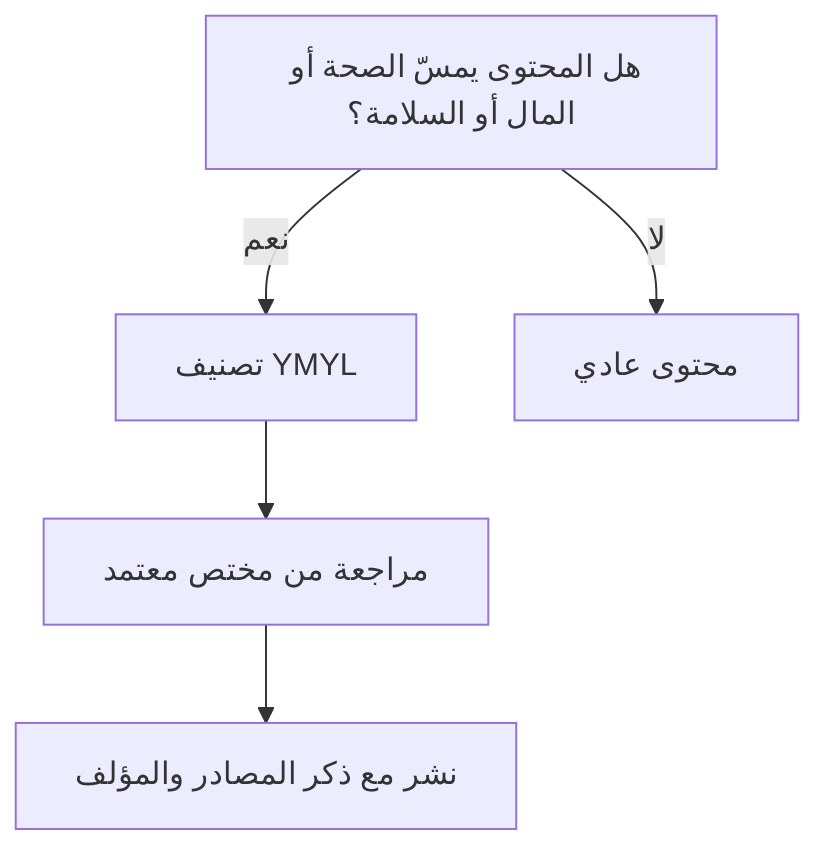

# مواقع تمسّ المال أو الصحة (YMYL)
> [!info] تعريف مختصر
> اختصار لعبارة "Your Money or Your Life"، وهو تصنيف تستخدمه Google لأي محتوى قد يؤثّر بشكل مباشر على صحة الشخص، أو استقراره المالي، أو سلامته، أو سعادته. تخضع هذه المواقع لمعايير جودة ومصداقية أعلى بكثير من المحتوى العادي.

## الشرح العلمي والاحترافي
- يشمل مصطلح YMYL مجالات مثل: الطب والصحة، الاستشارات المالية والاستثمار، القانون، السلامة، الأخبار الجادة، والمواضيع المدنية أو الحكومية المهمة.
- Google يطبّق على هذه المواقع معايير أعلى من مبدأ E-E-A-T (الخبرة، الكفاءة، السلطة، الموثوقية - Experience, Expertise, Authoritativeness, Trustworthiness) لأن الخطأ في المعلومة هنا قد يضرّ القارئ فعليًا (مثل نصيحة طبية خاطئة أو معلومة مالية مضلِّلة).
- في سياق إدارة المشاريع، يعني هذا أن أي مشروع محتوى أو منتج رقمي يقع ضمن هذه الفئات (تطبيق صحي، منصة استثمار، موقع استشارات قانونية) يحتاج عمليات مراجعة إضافية: مراجعة من مختصين معتمدين، توثيق المصادر، وذكر هوية الكاتب بوضوح.
- تجاهل معايير YMYL قد يؤدي إلى عقوبات في الترتيب أو فقدان ثقة المستخدم، وفي بعض الحالات مسؤولية قانونية.

## أين ومتى يُستخدم
- في مشاريع بناء مواقع أو تطبيقات في قطاعات الصحة، المال، القانون، أو السلامة العامة.
- في مرحلة التخطيط لمحتوى المشروع (Content Planning)، لتحديد ما إذا كانت هناك حاجة لمراجع متخصصين (Subject Matter Experts).
- عند إجراء تدقيق جودة المحتوى (Content Audit) أو مراجعات الامتثال (Compliance Review) قبل الإطلاق.
- في فرق تحسين محركات البحث (SEO) عند تقييم مخاطر الترتيب لمواقع حسّاسة.

## مثال وسيناريو تطبيقي
> [!example] سيناريو ملموس
> فريق "صحّتي" يبني تطبيقًا يقدّم نصائح غذائية للمستخدمين. أثناء تخطيط المشروع، يكتشف مدير المنتج أن المحتوى يقع ضمن فئة YMYL لأنه يمسّ صحة المستخدمين مباشرة. بناءً على ذلك، يُضاف إلى خطة المشروع بند إلزامي: كل مقال يجب أن يراجعه أخصائي تغذية معتمد قبل النشر، ويجب ذكر اسمه ومؤهلاته في نهاية كل صفحة. كما تُضاف صفحة "من نحن" توضّح فريق الأطباء المشرفين. هذا القرار يزيد وقت الإنتاج بنسبة 20%، لكنه يحمي التطبيق من عقوبات محركات البحث ويبني ثقة المستخدمين.

## خطوات أو مخطّط
1. تحديد ما إذا كان مشروع المحتوى أو المنتج يقع ضمن فئة YMYL (صحة، مال، قانون، سلامة).
2. إن كان كذلك، إضافة خطوة مراجعة إلزامية من مختص معتمد إلى دورة إنتاج المحتوى.
3. توثيق مصادر كل معلومة (Citations) وربطها بمراجع موثوقة.
4. إظهار هوية الكاتب والمراجع بوضوح على الصفحة.
5. مراجعة المحتوى دوريًا لتحديث أي معلومة أصبحت قديمة أو غير دقيقة.

## ⚠️ مفاهيم خاطئة شائعة
> [!warning]
> - الاعتقاد بأن YMYL عقوبة تُفرض تلقائيًا من Google؛ في الحقيقة هو تصنيف يرفع سقف التوقعات على جودة المحتوى، وليس عقوبة بحد ذاته.
> - الخلط بين YMYL و E-E-A-T؛ الأول تصنيف لنوع الموضوع، والثاني معيار تقييم يُطبَّق بشكل أكثر صرامة على مواضيع YMYL تحديدًا.
> - الظن أن هذا المصطلح يخص فرق SEO فقط، بينما هو مسؤولية مشتركة بين المحتوى والمنتج والقانون في أي مشروع رقمي حساس.

## ❌ ممارسات خاطئة في المشاريع
> [!failure]
> - نشر محتوى طبي أو مالي دون مراجعة مختص، اعتمادًا فقط على كاتب محتوى عام. الحل: إلزام مراجعة الخبراء ضمن تعريف الإنجاز (Definition of Done) لهذا النوع من المحتوى.
> - عدم ذكر مصادر المعلومات أو تاريخ آخر تحديث، مما يقلّل الثقة والمصداقية. الحل: إضافة قسم مراجع وتاريخ مراجعة في كل صفحة.
> - تجاهل التقييم عند تغيير نوع المشروع (مثلًا إضافة ميزة استشارات مالية لتطبيق عام)، فيبقى المشروع يُدار بمعايير الجودة القديمة الأقل صرامة. الحل: إعادة تقييم تصنيف YMYL عند كل تغيير جوهري في نطاق المنتج.

## 🔗 مصطلحات ومفاهيم ذات صلة
[[Hub and Spoke Content Model]] | [[AI Overviews]] | [[GEO]] | [[PDPL]] | [[Quality Assurance]] | [[20 - Quality Management]]
