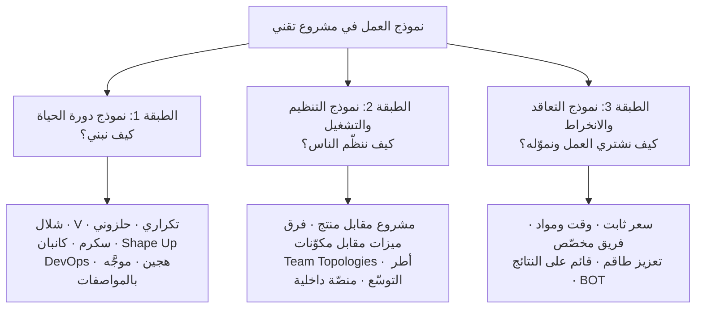
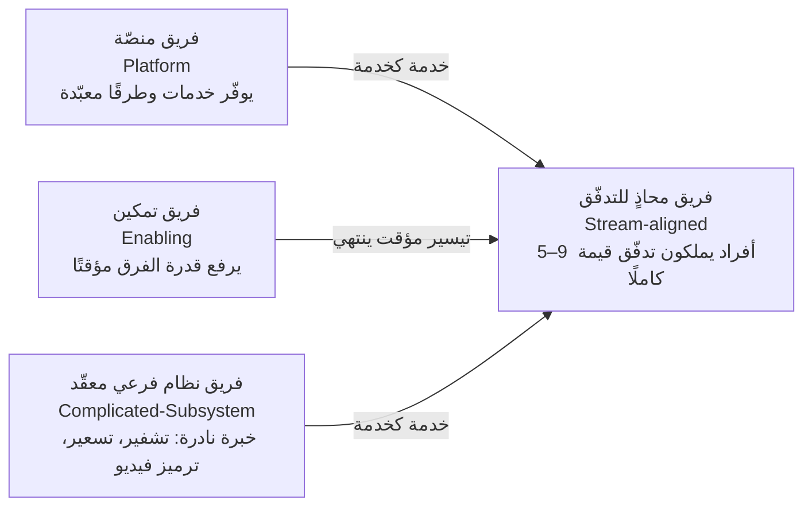
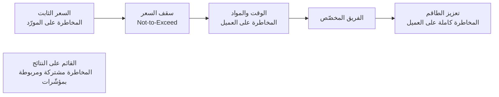
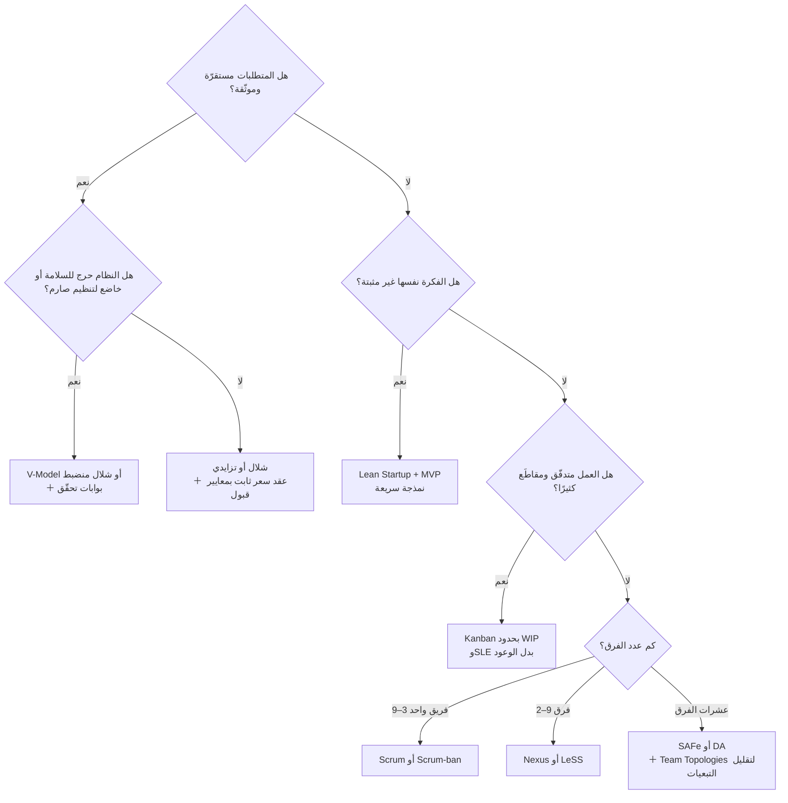

# نماذج العمل في المشاريع التقنية

> [!abstract] ماذا ستتعلّم هنا
> - لماذا يختلط على الناس مصطلح **«نموذج العمل»**، وما **الطبقات الثلاث** التي يجب فصلها.
> - **كل نموذج دورة حياة** من الشلال إلى **التطوير الموجَّه بالمواصفات (Spec-Driven)** المعاصر: فكرته · متى يصلح · متى يفشل · مؤشّرات اختياره.
> - **نماذج التنظيم والتشغيل**: نموذج المشروع مقابل نموذج المنتج · Team Topologies · أطر التوسّع (SAFe · LeSS · Nexus · Scrum@Scale · DA) · هندسة المنصّات.
> - **نماذج التعاقد**: السعر الثابت · الوقت والمواد · الفريق المخصّص · تعزيز الطاقم · القائم على النتائج — ومن يتحمّل المخاطرة في كلٍّ منها.
> - **إطار اختيار عملي**: 12 عاملًا، مصفوفة قرار، وشجرة قرار، ومقاطعة حسب حجم الفكرة/المشروع/الفريق/المؤسسة.
> - سيناريوهات · قرارات تفاعلية · مفاهيم وممارسات خاطئة · أسئلة تفكير ناقد بإطار إجابة · أسئلة مقابلات.
>
> 🔗 هذه وثيقة **مرجعية** تعلو المنهجيات الأربع ([[01 - Agile|أجايل]] · [[02 - Scrum|سكرم]] · [[03 - Kanban|كانبان]] · [[04 - Waterfall|الشلال]]) وتضعها في خريطة واحدة.

---

## 🧭 أولًا: فُكّ الالتباس — «نموذج العمل» ثلاث طبقات لا طبقة واحدة

حين يسأل أحدهم *«ما نموذج العمل عندكم؟»* قد يقصد ثلاثة أشياء مختلفة تمامًا. الخلط بينها هو سبب أغلب النقاشات العقيمة في الاجتماعات:

> [!warning] القاعدة الذهبية
> الطبقات **مستقلّة نسبيًّا وقابلة للخلط**. يمكن أن تعمل بـ**سكرم** (طبقة 1) داخل **مؤسسة مصفوفية** (طبقة 2) بعقد **سعر ثابت** (طبقة 3) — وهذا تحديدًا **أخطر تركيب شائع** في السوق العربي، لأن السعر الثابت يقفل النطاق بينما سكرم يفترض تغيّره. أغلب النزاعات مع المورّدين تولد من هنا، لا من «سوء النية».

---

## 🏗️ الطبقة الأولى: نماذج دورة الحياة (كيف نبني؟)

### 1) نموذج الشلال (Waterfall)

> [!info] الفكرة
> مراحل **متتابعة مقفلة**: متطلبات ← تصميم ← بناء ← اختبار ← نشر ← صيانة. لا تبدأ مرحلة قبل اعتماد سابقتها، ويُسلَّم المنتج **مرة واحدة** في النهاية.

| البند | التفصيل |
| --- | --- |
| **يصلح حين** | المتطلبات **مستقرّة وموثّقة**، التقنية معروفة، العقد يفرض نطاقًا وسعرًا مقفلين، جهة رقابية تطلب توثيقًا مرحليًّا |
| **يفشل حين** | عدم يقين في المتطلبات، حاجة لتغذية راجعة مبكرة، سوق متحرّك — لأن أول لقاء حقيقي بين المستخدم والمنتج يقع **بعد إنفاق الميزانية كاملة** |
| **مقياس نجاحه** | الالتزام بالخطة والجدول والميزانية (الالتزام لا التكيّف) |
| **الخطر الأكبر** | «شلال الاكتشاف المتأخّر»: خطأ متطلبات يُكتشف في الاختبار يكلّف أضعاف كلفته لو اكتُشف في التحليل |

- 📖 تفصيل كامل: [[04 - Waterfall|نموذج الشلال]].

### 2) النموذج الحرف V (V-Model)

شلال **مطويّ على شكل V**: كل مرحلة تحليل/تصميم على اليسار يقابلها **مستوى اختبار** على اليمين (متطلبات ↔ اختبار قبول · تصميم نظام ↔ اختبار تكامل · تصميم وحدة ↔ اختبار وحدة).

- **يصلح حين:** أنظمة **حرجة للسلامة** أو خاضعة لتنظيم صارم (طبّي، طيران، أنظمة مدمجة، دفاع) حيث **إثبات التحقّق (Verification & Validation)** مطلب تعاقدي.
- **يفشل حين:** منتج رقمي تجاري سريع التغيّر — تكلفة إعادة التوثيق تفوق قيمتها.
- **ميزته الحقيقية:** يجبرك على تعريف **[[Definition of Done|معيار الإنجاز]]** ومعايير القبول **قبل** كتابة سطر واحد.

### 3) النموذج التزايدي والتكراري (Incremental / Iterative)

> [!note] فرق يخلط فيه الجميع
> - **التزايدي (Incremental):** تبني المنتج **قطعًا كاملة الوظيفة** واحدة تلو الأخرى (شاشة الدخول جاهزة ومسلَّمة، ثم شاشة الطلبات…). كل قطعة **نهائية**.
> - **التكراري (Iterative):** تبني **نسخة أوّلية من الكل** ثم تُحسّنها دورة بعد دورة (رسم تخطيطي → نموذج → منتج مصقول).
> - **الرشيق الحديث = الاثنان معًا:** تزايدي في التسليم، تكراري في التحسين.

- **يصلح حين:** تريد قيمة مبكرة في يد المستخدم مع بقاء الهيكل العام واضحًا. هو أساس فكرة [[MVP]].
- **يفشل حين:** المعمارية تحتاج قرارًا شاملًا مبكرًا (مثلًا نظام مصرفي أساسي) فتنتهي بإعادة بناء متكرّر.

### 4) النموذج الحلزوني (Spiral)

دورات متكرّرة **محورها المخاطرة**: كل لفّة = تحديد أهداف → **تحليل مخاطر** → تطوير نموذج/جزء → تقييم وتخطيط اللفّة التالية. صاغه Barry Boehm، وهو أول من جعل **إدارة المخاطر محرّك دورة الحياة** لا نشاطًا جانبيًّا.

- **يصلح حين:** مشاريع **كبيرة، مكلفة، عالية المخاطر** وغامضة تقنيًّا (بحث وتطوير، أنظمة ضخمة طويلة الأمد).
- **يفشل حين:** مشروع صغير — كلفة تحليل المخاطر في كل لفّة تفوق المشروع نفسه.
- 🔗 يتقاطع مع [[19 - Risk Management|إدارة المخاطر]] و[[Risk Register|سجل المخاطر]].

### 5) التطوير السريع والنمذجة (RAD / Prototyping)

بناء **نماذج عاملة سريعة** يجرّبها المستخدم مبكرًا، مع اعتماد مكثّف على مكوّنات جاهزة ومنصّات منخفضة/عديمة الكود.

- **يصلح حين:** فريق صغير خبير، مستخدم متاح ومتفاعل، أفق زمني قصير (2–3 أشهر)، والغرض **التحقّق من الفكرة** لا بناء نظام معمّر.
- **يفشل حين:** يتحوّل النموذج إلى منتج إنتاجي بلا إعادة بناء — وهذا أشهر مصدر لـ**الدين التقني** في الشركات الناشئة.

### 6) عائلة أجايل (Agile) — مظلّة لا منهجية

[[01 - Agile|أجايل]] **قيم ومبادئ** (بيان 2001)، وتحتها أطر تنفيذ:

| الإطار | إيقاعه | يصلح لـ | إشارة إنذار |
| --- | --- | --- | --- |
| **[[02 - Scrum\|Scrum]]** | سبرنتات ثابتة 1–4 أسابيع، أدوار وأحداث محدّدة | عمل **مشروعي متغيّر** بفريق 3–9 أفراد ومالك منتج متفرّغ | لا مالك منتج حقيقي → يتحوّل لـ«مسرح سكرم» |
| **[[03 - Kanban\|Kanban]]** | **تدفّق مستمر** بلا سبرنتات، [[WIP Limit\|حدود عمل جارٍ]]، سحب | عمل **متدفّق وغير متجانس**: دعم، صيانة، عمليات، فرق تُقاطَع كثيرًا | لوحة بلا حدود WIP = لوحة مهام لا كانبان |
| **[[Scrum-ban\|Scrum-ban]]** | إيقاع سكرم + تدفّق وحدود كانبان | فرق تريد الانضباط دون طقوس زائدة، أو انتقال تدريجي | استخدامه ذريعة لإلغاء الاسترجاع |
| **XP (البرمجة القصوى)** | دورات قصيرة جدًّا + ممارسات هندسية | جودة تقنية عالية: TDD، برمجة ثنائية، تكامل مستمر، إعادة هيكلة | تبنّي الإدارة دون الممارسات الهندسية |

> [!tip] الحقيقة العملية 2025
> تقرير **State of Agile** الثامن عشر (2025) يشير إلى أن نحو **74%** من المؤسسات تستخدم **نماذج هجينة/مخلوطة** لا إطارًا واحدًا نقيًّا؛ و**Scrum** يبقى الأكثر انتشارًا، بينما ينمو **Kanban** بثبات. أي أن «النقاء المنهجي» استثناء لا قاعدة.

### 7) لين وبدء التشغيل الرشيق (Lean / Lean Startup)

- **Lean** (من تويوتا): تعظيم القيمة بتقليل **الهدر** ([[DOWNTIME]]) وتحسين **التدفّق** عبر [[Value Stream Mapping|خريطة تدفّق القيمة]] و[[Kaizen|التحسين المستمر]].
- **Lean Startup** (Eric Ries): دورة **ابنِ ← قِس ← تعلّم** حول [[MVP]]، وقرار دوري: **استمر أم غيّر المسار (Pivot)**.
- **يصلح حين:** **الفكرة نفسها غير مؤكّدة**؛ السؤال ليس «كيف نبنيه؟» بل «هل يستحق أن يُبنى؟».
- **يفشل حين:** تُطبَّق على مشروع بمتطلبات تعاقدية ثابتة — لا يوجد ما «تتعلّمه»، الجهة طلبت شيئًا محدّدًا.
- 🔗 تعمّق: [[8.1 Lean - الهدر والقيمة]] · [[8.2 Lean - خريطة تدفق القيمة و Kaizen]].

### 8) Shape Up (نموذج Basecamp)

> [!info] الفكرة
> **لا سبرنتات ولا نقاط قصة ولا Backlog متراكم.** بدلًا منها: **دورة ستّة أسابيع** + أسبوعان «تهدئة (Cool-down)». قبل الدورة تُصاغ الفكرة (**Shaping**) بمستوى تجريد متوسّط مع **حدّ زمني مقطوع (Appetite)**، ثم تجتمع **طاولة الرهان (Betting Table)** لتقرّر على ماذا نراهن هذه الدورة. الفريق (غالبًا مطوّر أو اثنان + مصمّم) يملك **صلاحية تقليص النطاق** ليسلّم داخل الستة أسابيع.

| البند | التفصيل |
| --- | --- |
| **المقايضة الجوهرية** | سكرم = **تكرار متواتر بطقوس**؛ Shape Up = **تنفيذ مركَّز بأقل عملية ممكنة** |
| **يصلح حين** | شركة **منتج** بفريق **صغير وناضج جدًّا**، وصول مباشر للقيادة، ثقة عالية، وأفق يُنجَز في ستة أسابيع |
| **يفشل حين** | فريق مبتدئ (لا يجيد تقليص النطاق)، عمل خدمي متقطّع، أو مؤسسة تحتاج تنبّؤًا شهريًّا |
| **نقده الأشهر** | طاولة الرهان قد تنزلق إلى **رأي أعلى الرواتب (HiPPO)** إن غاب الانضباط بالبيانات |

- **الأعمار المناسبة:** صُمِّم لشركات في نطاق عشرات إلى بضع مئات من الموظفين، بفرق **2–3 أفراد للرهان الواحد**.

### 9) نماذج التدفّق المستمر: DevOps / التسليم المستمر

> [!info] الفكرة
> ليست «منهجية تخطيط» بل **نموذج تشغيل هندسي**: فرع رئيسي واحد (Trunk-based)، تكامل مستمر، **دفعات صغيرة جدًّا**، نشر آلي، مراقبة، وإطفاء المشكلات بالتغذية الراجعة من الإنتاج. الوحدة ليست «السبرنت» بل **التغيير الواحد**.

- **مقاييسه (DORA):** تكرار النشر · مهلة التغيير · معدّل فشل التغيير · زمن الاستعادة — وأضاف **تقرير DORA 2025** مقياس **معدّل إعادة العمل (Rework Rate)** وشبه-مقياس **الموثوقية**.
- **خلاصة DORA 2025 التي تهمّ مدير المشروع:** الذكاء الاصطناعي **مُضخِّم لا حلّ**؛ يرفع الإنتاجية للفرق ذات الأساس المتين، ويضاعف الفوضى للفرق المتعثّرة (زيادة في عدم الاستقرار وإعادة العمل). كما أن **~90%** من المؤسسات باتت تملك **منصّة داخلية**، وجودة المنصّة هي ما يحدّد هل يُترجَم الذكاء الاصطناعي إلى مكسب فعلي.
- **يصلح حين:** منتج **حيّ** ذو مستخدمين مستمرّين وبنية تحتية سحابية.
- **يفشل حين:** لا اختبارات آلية ولا مراقبة — النشر السريع حينها **يسرّع الأعطال** لا القيمة.

### 10) النماذج الهجينة (Hybrid / Water-Scrum-Fall)

الواقع الأكثر شيوعًا في المؤسسات: **بوابات وتخطيط ومالية على مستوى الشلال**، و**تنفيذ رشيق داخل الفرق**، و**نشر بأسلوب DevOps**.

- **يصلح حين:** مؤسسة كبيرة/حكومية بميزانيات سنوية وحوكمة صارمة، لكن تريد سرعة داخل الفرق.
- **يفشل حين:** يصبح الهجين **ذريعة** — طقوس رشيقة فوق عقلية أوامر وتحكّم، فتحصد كلفة الاثنين وفائدة لا أحد.
- **علامة الهجين الصحّي:** الحوكمة تتحكّم في **ماذا ولماذا وكم**، والفريق يتحكّم في **كيف ومتى بالتفصيل**.

### 11) النموذج المعاصر (2026): التطوير الموجَّه بالمواصفات و**دورة الحياة الأصلية للذكاء الاصطناعي**

> [!info] لماذا ظهر؟
> حين صار توليد الكود رخيصًا وسريعًا بالوكلاء الذكيّين، انتقل عنق الزجاجة من **كتابة الكود** إلى **تحديد النيّة بدقّة والتحقّق منها**. الجواب الناشئ: **Spec-Driven Development (SDD)** — جعل **المواصفة المنظَّمة** هي **مصدر الحقيقة الواحد**، والكود **ناتجًا مولَّدًا قابلًا للتحقّق منها**.

**دورته:** حدّد النيّة ← أزل الغموض ← خطّط بالقيود ← نفّذ بمساعدة الوكلاء ← **تحقّق مقابل المواصفة**.

| البند | التفصيل |
| --- | --- |
| **يصلح حين** | فريق يستعمل وكلاء بكثافة، ويملك اختبارات آلية وبوابات مراجعة صارمة |
| **يفشل حين** | يُستعمل كغطاء لـ«البرمجة بالإحساس (Vibe Coding)» بلا مواصفة ولا اختبار → دين تقني بسرعة قياسية |
| **أثره على الإدارة** | دور مدير المشروع ينتقل من **توزيع المهام** إلى **تصميم الحوكمة**: من يُقرّر؟ إنسان أم وكيل؟ وتحت أي شروط وأي نقاط تحقّق؟ |

> [!warning] احذر الضجيج
> الادعاءات المتداولة عن «تسارع 30–100 ضعفًا» **تسويقية بالأساس**، بينما القياس المستقلّ (DORA 2025) يُظهر **زيادة في الإنتاجية مصحوبة بزيادة في عدم الاستقرار وإعادة العمل**. تعامل مع هذا النموذج كاتجاه جادّ يحتاج ضوابط، لا كبديل جاهز يُلغي الهندسة.

---

### 📊 جدول المقارنة الشامل — الطبقة الأولى

| النموذج | وحدة العمل | يتحمّل التغيير؟ | حجم الفريق المناسب | أفضل حالة استخدام | أسوأ حالة |
| --- | --- | --- | --- | --- | --- |
| **الشلال** | مرحلة | ضعيف جدًّا | أي حجم (بتوثيق ثقيل) | نطاق مقفل + امتثال | منتج مبتكر غامض |
| **V-Model** | مرحلة + اختبار مقابل | ضعيف | متوسّط–كبير | أنظمة حرجة للسلامة | تطبيق تجاري متغيّر |
| **التزايدي/التكراري** | زيادة (Increment) | جيّد | صغير–متوسّط | قيمة مبكرة تدريجية | نظام يحتاج معمارية شاملة مسبقًا |
| **الحلزوني** | لفّة مخاطر | ممتاز | متوسّط–كبير | مشروع ضخم عالي المخاطر | مشروع صغير |
| **RAD/النمذجة** | نموذج أوّلي | ممتاز | صغير جدًّا | التحقّق من فكرة | نظام إنتاجي معمّر |
| **Scrum** | سبرنت | ممتاز (بين السبرنتات) | 3–9 | منتج متغيّر بمالك منتج متفرّغ | عمل يُقاطَع يوميًّا |
| **Kanban** | عنصر عمل | ممتاز (فوري) | أي حجم | دعم/عمليات/تدفّق غير متجانس | حاجة لالتزام دوري صارم |
| **Shape Up** | رهان 6 أسابيع | متوسّط (داخل الدورة مقفل) | 2–3 للرهان | شركة منتج بفريق ناضج | فريق مبتدئ أو خدمي |
| **DevOps/التدفّق** | تغيير واحد | ممتاز | أي حجم | منتج حيّ سحابي | بلا أتمتة اختبار ومراقبة |
| **الهجين** | حسب المستوى | جيّد | كبير | مؤسسة بحوكمة + فرق سريعة | حين يصبح شكلًا بلا جوهر |
| **موجَّه بالمواصفات** | مواصفة قابلة للتحقّق | جيّد جدًّا | صغير–متوسّط | فرق كثيفة استخدام الوكلاء | بلا اختبارات ولا بوابات |

---

## 🏢 الطبقة الثانية: نماذج التنظيم والتشغيل (كيف ننظّم الناس؟)

### أ) نموذج المشروع مقابل نموذج المنتج — أهم تحوّل إداري في العقد الأخير

| البُعد | نموذج المشروع (Project) | نموذج المنتج (Product Operating Model) |
| --- | --- | --- |
| **الوحدة** | مشروع له بداية ونهاية | منتج/تدفّق قيمة مستمرّ |
| **الفريق** | يُشكَّل ثم **يُحلّ** | **ثابت ومستقرّ** حول المنتج |
| **التمويل** | ميزانية مشروع لمرّة واحدة | تمويل **سعة الفريق** بشكل دوري |
| **مقياس النجاح** | تسليم النطاق في الوقت والميزانية (**المُخرَج**) | تحسّن قابل للقياس في سلوك المستخدم والأعمال (**الأثر**) |
| **القرار** | «نفّذ ما في الخطة» | «اكتشف ثم قرّر ماذا يستحق البناء» |

> [!quote] من الكتب
> يعرّف **Marty Cagan** في *Transformed* «نموذج تشغيل المنتج» بأنه الطريقة الجوهرية التي تقرّر بها الشركة **ماذا تبني، وكيف تبنيه، وكيف تُوصله للسوق** — وجوهره **الأثر (Outcomes) لا المُخرَجات (Outputs)**. وينبّه إلى أن التحوّل ذاته **يجب ألّا يُدار كمشروع** بل كمنتج له عملاء داخليون وتكرارات. وفي *Project to Product* يضيف **Mik Kersten** أن تمويل «تدفّقات القيمة» بدل المشاريع هو ما يكسر دوّامة إعادة تشكيل الفرق كل ربع.

- **يصلح حين:** لديك منتج **حيّ ومستمرّ** له مستخدمون وقياس.
- **لا يصلح حين:** العمل فعلًا **مشروع منتهٍ** (ترحيل نظام، تركيب بنية، تنفيذ لطرف ثالث بعقد) — فرض نموذج المنتج هنا تكلّف بلا عائد.

### ب) فرق الميزات مقابل فرق المكوّنات

- **فريق مكوّنات (Component):** فريق الواجهة، فريق الخلفية، فريق قواعد البيانات. → كل ميزة تحتاج **تنسيق ثلاثة فرق** = طوابير انتظار و[[Bottleneck|اختناقات]].
- **فريق ميزات/متعدّد الوظائف (Feature/Cross-functional):** يملك الميزة **من الفكرة إلى الإنتاج**. → تدفّق أسرع، لكنه يتطلّب مهارات أوسع وملكية كود مشتركة.
- **القاعدة:** كلّما زادت **التبعيات بين الفرق** لإنجاز ميزة واحدة، ساء التدفّق مهما حسّنت المنهجية. هذا تطبيق مباشر لـ[[Theory of Constraints|نظرية القيود]].

### ج) Team Topologies — تصميم المؤسسة لتدفّق سريع

نموذج **Skelton & Pais** يختصر كل الأشكال التنظيمية إلى **أربعة أنواع فرق** و**ثلاثة أنماط تفاعل**، ومحوره مفهوم **الحِمل الإدراكي (Cognitive Load)**: الفريق لا يستطيع امتلاك أكثر ممّا يسع دماغه الجمعي.

- **أنماط التفاعل الثلاثة:** **تعاون (Collaboration)** مؤقّت بطبيعته · **خدمة كخدمة (X-as-a-Service)** هو الوضع المستقرّ · **تيسير (Facilitating)** ينتهي ذاتيًّا.
- **إرشاد 2025 من المؤلّفَين:** التعاون **مؤقّت بالتصميم**، والتيسير **ذاتي الانتهاء** — ولكل منهما **معايير دخول وخروج معلنة**. أي «تعاون دائم» بين فريقين هو في الحقيقة **حدود فرق مرسومة خطأ**.
- **متى تحتاجه؟** حين يتجاوز عدد المهندسين ~**40–50** وتبدأ التبعيات تلتهم الوقت.

### د) نموذج Spotify (وحقيقته)

Squads · Tribes · Chapters · Guilds. انتشر بجنون كنموذج جاهز — بينما **Spotify نفسها لم تعتبره إطارًا** بل **لقطة زمنية** لتجربتها، وقد تجاوزته لاحقًا.

> [!failure] الدرس
> نسخ الهيكل التنظيمي لشركة أخرى **لا ينقل ثقافتها**. الأسماء (قبيلة، فصيل) هي أسهل ما يُنسخ وأقلّ ما ينفع.

### هـ) أطر التوسّع (Scaling) — أيّها لأي حجم؟

| الإطار | عدد الفرق النموذجي | فلسفته | ثقل العملية | يناسب |
| --- | --- | --- | --- | --- |
| **Scrum of Scrums** | 2–4 | تنسيق بسيط بممثّلين | خفيف جدًّا | أوّل خطوة توسّع |
| **Nexus** | 3–9 فرق على منتج واحد | سكرم + أدنى إضافة تنسيقية (فريق تكامل) | خفيف | من يريد البقاء قريبًا من سكرم |
| **LeSS / LeSS Huge** | 2–8 فرق (وLeSS Huge لآلاف) | **سكرم واحد**: Backlog واحد، مالك منتج واحد، سبرنت واحد؛ **بلا أدوار جديدة** | خفيف بالتصميم/**صعب ثقافيًّا** | من يريد تبسيطًا حقيقيًّا لا طبقات |
| **Scrum@Scale** | مرن (كسوري) | تكرار بنية سكرم فراكتاليًّا + فريق تنفيذي فاعل | متوسّط | من يريد توسيع سكرم بحرفيّته |
| **SAFe** | عشرات إلى مئات الفرق | تنسيق مؤسسي مهيكل (ART · PI Planning · محفظة) | **ثقيل** | مؤسسة كبيرة تحتاج مواءمة بين الأعمال والهندسة والمالية |
| **Disciplined Agile (DA)** | مرن | **صندوق أدوات**: اختر الممارسة حسب السياق | متوسّط–يتطلّب خبرة | مؤسسة ناضجة تكره الوصفات الجاهزة |
| **FAST** | مرن (قبيلة مفتوحة) | تجميع مفتوح وإعادة تشكيل الفرق كل بضعة أيام | خفيف جدًّا/تجريبي | ثقافة عالية النضج والثقة |

> [!warning] قبل أن توسّع
> **التوسّع ليس هدفًا، بل ضريبة.** القاعدة العملية: *«لا توسّع قبل أن تُتقن فريقًا واحدًا»*. أغلب مآسي SAFe سببها تركيب إطار مؤسسي فوق فرق لا تُتقن أساسيات [[Definition of Done|معيار الإنجاز]] ولا الاختبار الآلي. والسؤال الأول دائمًا: **هل نستطيع تقليل التبعيات بدل إدارتها؟**

### و) هندسة المنصّات (Platform Engineering) — نموذج الطبقة الثانية الصاعد

بدل أن يكافح كل فريق مع البنية التحتية، يبني **فريق منصّة** «طريقًا معبّدًا (Paved Road)»: قوالب، خطوط نشر، رصد، أمن — كخدمة ذاتية.

- **الدليل:** ~**90%** من المؤسسات لديها منصّة داخلية و**~75%** لديها فريق منصّة مخصّص (DORA 2025)، والمنصّات **عالية الجودة** هي التي تُترجم الذكاء الاصطناعي إلى مكسب حقيقي؛ المنصّات الرديئة **لا أثر لها**.
- **متى تبدأ؟** حين تجد **ثلاثة فرق فأكثر** تحلّ المشكلة نفسها بثلاث طرق مختلفة.

### ز) الهياكل التنظيمية الكلاسيكية (PMBOK) — لأنها لا تزال تحكم صلاحيتك

| الهيكل | سلطة مدير المشروع | الواقع اليومي |
| --- | --- | --- |
| **وظيفي (Functional)** | ضعيفة جدًّا | المدير الوظيفي يملك الموارد؛ أنت **منسّق** |
| **مصفوفي ضعيف** | محدودة | تتفاوض على كل ساعة عمل |
| **مصفوفي متوازن** | مشتركة | ازدواج تبعية للموظف = صراع أولويات |
| **مصفوفي قوي** | عالية | لديك فريق شبه متفرّغ |
| **مشروعي (Projectized)** | كاملة | الفريق يتبعك بالكامل، لكن **إعادة التوزيع** بعد المشروع مشكلة |

> [!tip] لماذا هذا مهم؟
> كثير من «فشل أجايل» ليس فشل منهجية، بل **تعارض بين منهجية تفترض فريقًا متفرّغًا وهيكل وظيفي يمنع التفرّغ**. اقرأ هيكلك قبل أن تختار نموذجك.

---

## 📑 الطبقة الثالثة: نماذج التعاقد والانخراط (كيف نشتري العمل؟)

| النموذج | كيف يُدفع | من يتحمّل مخاطرة النطاق | يصلح حين | فخّه الأكبر |
| --- | --- | --- | --- | --- |
| **السعر الثابت (Fixed Price)** | مبلغ مقطوع لنطاق محدّد | **المورّد** | نطاق **مستقرّ وموثّق** ومشروع قصير، وتحتاج يقينًا ماليًّا | المورّد يحمي هامشه بـ**رفض كل تغيير** أو بخفض الجودة؛ ويتطلّب [[SOW\|كرّاسة عمل]] ومعايير قبول دقيقة وإلا انتهى بنزاع |
| **سقف السعر (T&M with Cap)** | ساعات فعلية بحدّ أقصى | مشتركة | تريد مرونة مع سقف مالي | يتحوّل عمليًّا لسعر ثابت قرب السقف |
| **الوقت والمواد (T&M)** | ساعات × سعر | **العميل** | متطلبات متطوّرة وتعقيد عالٍ | يتطلّب **إدارة نشطة**؛ بلا متابعة يصبح نزيفًا |
| **الفريق المخصّص (Dedicated Team)** | تكلفة شهرية للفريق | العميل (يدير الأولويات) | عمل **مستمرّ طويل الأمد** يبرّر فريقًا ثابتًا | بلا عمل كافٍ = دفع مقابل خمول |
| **تعزيز الطاقم (Staff Augmentation)** | لكل فرد/شهر | العميل بالكامل | نقص مهارة محدّد ومؤقّت | لا أحد مسؤول عن **النتيجة**، فقط عن الحضور |
| **القائم على النتائج (Outcome-based)** | مربوط بمؤشّرات/[[SLA\|اتفاقية مستوى خدمة]] | مشتركة | مشترون ناضجون + مؤشّرات قابلة للقياس بلا جدال | تعريف رديء للمؤشّر يفتح باب التلاعب |
| **BOT (ابنِ–شغّل–انقل)** | مراحل | متدرّجة | دخول سوق جديد أو بناء فريق داخلي مستقبلًا | تكلفة النقل تُنسى دائمًا |

> [!danger] الدرس من [[عافية - دراسة حالة|دراسة حالة عافية]]
> المشروع بدأ **بعرض تسويقي بلا [[SOW]] ولا معايير قبول** — وهو **لا نموذج تعاقد أصلًا**. النتيجة: نطاق قابل للتأويل، جدول وهمي، ومسؤولية قانونية غامضة. تعلّم: **اختيار نموذج التعاقد قرار إدارة مخاطر، لا إجراء مشتريات.** راجع [[معايير القبول (Acceptance Criteria)]] و[[بطاقة تقييم المورّد (Vendor Scorecard)]].

> [!warning] التركيب المستحيل
> **سعر ثابت + نطاق مفتوح + جدول مقفل** = الثلاثية القاتلة. لا يمكن تثبيت الثلاثة معًا؛ اختر اثنين وحرّر الثالث.

---

## 🎯 كيف تختار؟ إطار الاثني عشر عاملًا

> [!abstract] القاعدة الحاكمة
> **لا يوجد نموذج «أفضل»، بل نموذج «أنسب لدرجة عدم اليقين وكلفة الخطأ عندك».** والمعادلة الذهنية:
> **كلّما زاد عدم اليقين ← قصّر حلقة التغذية الراجعة. وكلّما زادت كلفة الخطأ ← كثّف بوابات التحقّق.**

| # | العامل | إن كان منخفضًا/صغيرًا | إن كان عاليًا/كبيرًا |
| --- | --- | --- | --- |
| 1 | **وضوح المتطلبات** | شلال / V-Model | Scrum · Lean Startup · نمذجة |
| 2 | **كلفة الخطأ (سلامة/مال/سمعة)** | تدفّق مستمر ونشر يومي | V-Model · حلزوني · بوابات [[Go or No-Go Decision\|Go/No-Go]] |
| 3 | **حجم الفريق** | 2–3: Shape Up أو كانبان بسيط · 3–9: Scrum | 10–50: Nexus/LeSS · 50+: SAFe/DA + Team Topologies |
| 4 | **حجم المؤسسة وحوكمتها** | ناشئة: أخفّ نموذج ممكن | مؤسسة/حكومة: هجين + بوابات + توثيق |
| 5 | **نضج الفكرة** | فكرة غير مثبتة: [[MVP]] + Lean Startup | منتج ناضج: تدفّق + قياس |
| 6 | **طبيعة العمل** | مشروعي بحدود: Scrum | متدفّق ومقاطَع (دعم/عمليات): Kanban |
| 7 | **توفّر العميل/مالك المنتج** | غائب: قلّل اعتمادك على سكرم | متفرّغ: سكرم يعمل بأفضل حالاته |
| 8 | **التوزّع الجغرافي والزمني** | فريق واحد بمكان: أي نموذج | موزّع عبر مناطق: تدفّق + توثيق غير متزامن > اجتماعات |
| 9 | **الامتثال والتنظيم** | لا قيود | V-Model/هجين + أثر تدقيقي (مثال: [[PDPL]]) |
| 10 | **نضج الأتمتة (اختبار/نشر)** | ضعيف: لا تنشر يوميًّا | قوي: DevOps/تسليم مستمر |
| 11 | **نموذج التمويل** | ميزانية مشروع مرّة واحدة | تمويل سعة مستمرّ ← نموذج المنتج |
| 12 | **درجة استخدام وكلاء الذكاء الاصطناعي** | منخفض: أطر تقليدية | مرتفع: مواصفات + بوابات مراجعة صارمة |

### 🧠 عدسة إضافية: إطار Cynefin — صنّف مشكلتك قبل منهجيتك

| نوع السياق | وصفه | الاستجابة | النموذج المناسب |
| --- | --- | --- | --- |
| **واضح (Clear)** | علاقة سبب-أثر بديهية، أفضل ممارسة معروفة | صنّف ← استجب | شلال · [[SOP\|إجراءات تشغيل قياسية]] · أتمتة |
| **معقّد (Complicated)** | يحتاج خبيرًا لكن قابل للتحليل | حلّل ← استجب | V-Model · حلزوني · تخطيط تفصيلي |
| **متشابك (Complex)** | السبب يُفهم **بأثر رجعي فقط** | جرّب ← استشعر ← استجب | Agile · Lean Startup · تجارب صغيرة |
| **فوضوي (Chaotic)** | لا نمط، أزمة | تصرّف ← استشعر ← استجب | إدارة أزمة · [[دليل الاستجابة للحوادث (Incident Runbook)\|Runbook]] · [[Expedite Class\|فئة استعجال]] |

> [!tip] لماذا هذه العدسة قوية؟
> لأنها تشرح **لماذا تفشل نفس المنهجية في مكان وتنجح في آخر**: تطبيق أجايل على مشكلة «واضحة» = هدر طقوس؛ وتطبيق شلال على مشكلة «متشابكة» = خطة جميلة تنهار عند أول لقاء بالواقع. ومنطق **مصفوفة Stacey** مشابه: كلّما ابتعدت عن الاتفاق على *ماذا* واليقين بـ*كيف*، ازدادت حاجتك للتجريب لا للتخطيط.

### 🌳 شجرة قرار سريعة

### 🧩 مقاطعة سريعة حسب حالتك

> [!example]- 🚀 شركة ناشئة (3–8 أفراد) تبني فكرة جديدة
> **دورة الحياة:** Lean Startup + [[MVP]]، تنفيذ بـ**كانبان خفيف** أو **Shape Up** إن كان الفريق ناضجًا. لا تُثقل بسكرم كامل الطقوس.
> **التنظيم:** فريق واحد متعدّد الوظائف، بلا أدوار شكلية. **التعاقد:** لا ينطبق (بناء داخلي) أو تعزيز طاقم لمهارة ناقصة.
> **الخطر:** الوقوع في حبّ النموذج الأوّلي وشحنه للإنتاج.

> [!example]- 🏢 شركة متوسّطة (30–80 مهندسًا) بمنتج SaaS قائم
> **دورة الحياة:** سكرم أو سكرم-بان + **DevOps/تسليم مستمر**. **التنظيم:** انتقال إلى **نموذج المنتج** + **Team Topologies** (فرق محاذية للتدفّق + فريق منصّة ناشئ) + **Nexus/LeSS** إن تعدّدت الفرق على منتج واحد.
> **المقاييس:** DORA + [[Cycle Time|زمن الدورة]] + مؤشّرات أثر ([[OKR]]).
> **الخطر:** تراكم التبعيات بين فرق المكوّنات.

> [!example]- 🏛️ جهة حكومية/مؤسسة كبيرة بمشروع نظام أساسي
> **دورة الحياة:** **هجين** — بوابات وحوكمة وميزانية سنوية على المستوى الأعلى، تنفيذ رشيق داخل الفرق، وتوثيق يكفي للتدقيق والامتثال.
> **التنظيم:** SAFe أو DA إن كان عدد الفرق كبيرًا، مع **حملة صريحة لتقليل التبعيات** لا مجرّد إدارتها.
> **التعاقد:** سعر ثابت لمكوّنات محدّدة + T&M/فريق مخصّص للتطوير المتطوّر. اربط الدفعات بـ**مراحل ومعايير قبول** لا بتواريخ.

> [!example]- 🧑‍💻 وكالة/شركة خدمات تنفّذ لعميل خارجي
> **دورة الحياة:** تزايدي مع تسليمات مرحلية ومعايير قبول موثّقة.
> **التعاقد:** إن أصرّ العميل على سعر ثابت، اشترط **نطاقًا مقفلًا + عملية طلب تغيير رسمية**؛ وإلا فـ**سقف سعر** أو فريق مخصّص.
> **الخطر:** [[Scope Creep|تضخّم النطاق]] بلا آلية تغيير = خسارة الهامش وتسميم العلاقة.

> [!example]- 🛠️ فريق دعم/صيانة/عمليات
> **دورة الحياة:** **كانبان** بلا نقاش: [[WIP Limit|حدود عمل جارٍ]] · فئات خدمة · [[Replenishment|تجديد]] دوري · [[SLE|توقّع مستوى الخدمة]] بدل وعود التسليم.
> **الخطر:** فرض سبرنتات على عمل لا يمكن التزامه مسبقًا → فشل التزام أسبوعي متكرّر يقتل معنويات الفريق.

---

## 🎬 سيناريوهات من الواقع

> [!success] سيناريو ناجح — النموذج الصحيح في المكان الصحيح
> جهة تبني **بوابة دفع** خاضعة لتدقيق أمني ومالي. اختار الفريق **هجينًا**: تحليل ومواصفات ومعايير قبول بأسلوب V-Model للمكوّن المالي الحرج (مع اختبار انحداري وأمني موثّق)، وتنفيذًا رشيقًا بكانبان للوحة الإدارية غير الحرجة، ونشرًا آليًّا مع بوابة [[Go or No-Go Decision|Go/No-Go]].
> **النتيجة:** اجتاز التدقيق من أول محاولة، وبقيت اللوحة الإدارية سريعة التطوّر. **الدرس:** النموذج يُختار **لكل مكوّن حسب كلفة خطئه**، لا للمشروع ككتلة واحدة.

> [!failure] سيناريو فاشل — «سكرم» فوق عقد سعر ثابت
> شركة وقّعت عقد **سعر ثابت** بنطاق مكتوب في **عرض تسويقي**، ثم أدارت التنفيذ بـ**سكرم** بسبرنتات ومراجعات.
> ما حدث: كل مراجعة سبرنت ولّدت ملاحظات وتغييرات، والمورّد رفضها لأنها «خارج النطاق»، والعميل اعتبر الرفض تنصّلًا. تحوّلت مراجعة السبرنت من **حلقة تعلّم** إلى **جلسة تفاوض قانوني**.
> **الدرس:** تناقض الطبقة الثالثة مع الأولى يُفسد الاثنتين. المرونة تحتاج **عقدًا يسمح بها** ([[Scope Creep|تضخّم النطاق]] مقابل تغيير النطاق المُدار).

> [!failure] سيناريو فاشل — توسّع سابق لأوانه
> مؤسسة بـ **4 فرق** تبنّت SAFe كاملًا: تخطيط PI ربع سنوي، أدوار جديدة، لوحات محفظة. لكن الفرق لم تكن تملك **اختبارًا آليًّا** ولا [[Definition of Done|معيار إنجاز]] موحّدًا.
> النتيجة: طقوس ضخمة، وسرعة أقلّ من قبل، وإحباط عام سُمّي «فشل أجايل».
> **الدرس:** الإطار المؤسسي **يضاعف** ما لديك — إن كان لديك انضباط ضاعفه، وإن كانت لديك فوضى ضاعفها. (نفس منطق **الذكاء الاصطناعي كمُضخِّم** في DORA 2025.)

---

## 🕹️ قرارات تفاعلية — ماذا تفعل أنت؟

> [!question]- **القرار 1:** عميل يطلب «سعرًا ثابتًا لمشروع لم تُحدَّد متطلباته بعد». ماذا تفعل؟
> **الخيار الأفضل:** اقترح **تقسيمًا على مرحلتين**: عقد صغير بسعر ثابت لـ**مرحلة اكتشاف/تحليل** تُنتج [[Software Requirements Specification|مواصفات]] ومعايير قبول ونطاقًا مقفلًا، ثم عقدًا ثانيًا بسعر ثابت مبنيًّا عليها.
> **لماذا:** أنت لا ترفض طلبه، بل **تجعل تحقيقه ممكنًا**. تسعير المجهول = إمّا مبالغة تخسر بها العقد، أو تفاؤل تخسر به المشروع.

> [!question]- **القرار 2:** فريقك يفشل في التزام السبرنت **كل** سبرنت بسبب طلبات دعم عاجلة. هل تزيد الانضباط أم تغيّر النموذج؟
> **الخيار الأفضل:** غيّر النموذج → **كانبان** أو **Scrum-ban** بحدود WIP وفئة [[Expedite Class|استعجال]] معلنة، واستبدل وعد السبرنت بـ[[SLE|توقّع مستوى خدمة]] احتمالي.
> **لماذا:** حين يكون **تدفّق الوارد غير قابل للتنبّؤ بنيويًّا**، فالفشل ليس في انضباط الفريق بل في **مطابقة النموذج لطبيعة العمل**. زيادة الضغط هنا تعاقب الفريق على مشكلة نظام.

> [!question]- **القرار 3:** مديرك يريد تبنّي SAFe لأن «منافسنا تبنّاه». عندك 3 فرق. ماذا تقول؟
> **الخيار الأفضل:** اعرض بدائل أخفّ (Nexus/LeSS) مع **معايير قياس** متفق عليها: زمن الدورة، عدد التبعيات بين الفرق، تكرار النشر. اقترح **تجربة ربع واحد** ثم قياس.
> **لماذا:** SAFe مصمَّم لعشرات الفرق؛ تطبيقه على ثلاثة يُدخل تكلفة تنسيق بلا مشكلة تنسيق. وتحويل النقاش من **رأي إلى قياس** هو ما ينقذك من حرب أطر.

> [!question]- **القرار 4:** فريقك يستعمل وكلاء ذكاء اصطناعي بكثافة، والسرعة ارتفعت لكن الأعطال ارتفعت معها. ماذا تغيّر أولًا؟
> **الخيار الأفضل:** **الحوكمة والبوابات قبل السرعة**: مواصفة مكتوبة لكل تغيير جوهري، اختبارات آلية إلزامية، مراجعة بشرية على نقاط محدّدة، وقياس **معدّل إعادة العمل** لا الإنتاجية وحدها.
> **لماذا:** DORA 2025 أظهرت أن ارتفاع الإنتاجية بالذكاء الاصطناعي يصحبه ارتفاع في عدم الاستقرار وإعادة العمل — فمن يقيس المُخرَج فقط يظنّ نفسه أسرع وهو يراكم تكلفة مؤجّلة.

---

## ❌ مفاهيم خاطئة شائعة

> [!danger]- «أجايل يعني بلا تخطيط وبلا توثيق»
> **خطأ.** أجايل يعني **تخطيطًا مستمرًّا بدل تخطيط لمرّة واحدة**، و**توثيقًا كافيًا وحيًّا** بدل توثيق شامل ميّت. البيان يقول «نُقدّر البرمجية العاملة **أكثر من** التوثيق الشامل» — لا «بدل التوثيق».

> [!danger]- «الشلال نموذج فاشل قديم»
> **خطأ.** الشلال **مناسب حين تكون شروطه متحقّقة** (متطلبات مستقرّة، امتثال، نطاق مقفل). المشكلة ليست في الشلال بل في **تطبيقه على مشكلات متشابكة**. وحتى Royce، الذي يُنسب إليه، حذّر أصلًا من صيغته المتتابعة النقيّة.

> [!danger]- «الهجين حلّ وسط للجبناء»
> **خطأ.** الهجين هو **الواقع السائد** (نحو 74% من المؤسسات، State of Agile 2025؛ وPMI رصد قفزة كبيرة في استخدام الأساليب الهجينة). الاحترافية هي **الاختيار الواعي لكل طبقة**، لا التمسّك بنقاء منهجي أكاديمي.

> [!danger]- «تغيير الإطار سيحلّ مشكلاتنا»
> **خطأ.** الإطار لا يصلح: غياب مالك منتج، أو انعدام الاختبار الآلي، أو ثقافة خوف، أو تبعيات تنظيمية. هذه مشكلات **بنيوية**؛ الإطار الجديد يعيد تغليفها بأسماء جديدة فقط.

> [!danger]- «نموذج المنتج يعني إلغاء إدارة المشاريع»
> **خطأ.** يعني **نقل مركز الثقل** من إدارة نطاق مؤقّت إلى إدارة الأثر والتدفّق والمخاطر عبر الزمن. تبقى الحوكمة والمخاطر والتواصل والامتثال — بل تزداد أهميّة.

> [!danger]- «الذكاء الاصطناعي سيُلغي الحاجة للمنهجيات»
> **خطأ.** يزيدها إلحاحًا: كلّما رخُص إنتاج الكود، ارتفعت قيمة **تحديد النيّة، وترتيب الأولويات، والتحقّق، والحوكمة** — وهذه صميم عمل مدير المشروع.

---

## ⚠️ ممارسات خاطئة (وما البديل)

| الممارسة الخاطئة | لماذا هي خاطئة | البديل |
| --- | --- | --- |
| اختيار النموذج **بناءً على الشهادة** التي يحملها المدير | القرار يتبع سيرة المدير لا سياق المشروع | صنّف المشكلة (Cynefin) ثم اختر |
| **قفل النطاق والزمن والسعر** معًا | مستحيل رياضيًّا | حرّر متغيّرًا واحدًا صراحة |
| نسخ نموذج شركة أخرى حرفيًّا | ينقل الشكل لا الشروط الثقافية | استعر **المبادئ**، صمّم **التفاصيل** لسياقك |
| **التوسّع قبل إتقان فريق واحد** | يضخّم الفوضى | أتقن التدفّق والجودة أولًا ثم وسّع |
| تغيير النموذج كل ربع سنة | يمنع أي منهجية من إظهار أثرها | اثبت دورة كاملة على الأقل + قِس |
| **كانبان بلا حدود WIP** | تصبح لوحة عرض لا نظام سحب | ضع حدودًا وراقب الطوابير و[[Bottleneck\|الاختناقات]] |
| **سكرم بلا مالك منتج فعلي** | لا مصدر قرار للأولويات | عيّن مالكًا مخوّلًا أو انتقل لكانبان |
| توحيد نموذج واحد على **كل** الفرق قسرًا | فرق الدعم والمنتج والبحث لها طبائع مختلفة | وحّد **المقاييس واللغة**، لا الطقوس |
| عدم توثيق **قرار اختيار النموذج** | يُعاد النقاش نفسه كل ستة أشهر | وثّقه كـ[[سجل قرار معماري (ADR)\|قرار موثّق]] بسياقه وبدائله |
| قياس **المُخرَج** (عدد الميزات) لا الأثر | يكافئ النشاط لا القيمة | مؤشّرات نتائج ([[OKR]]) + مقاييس تدفّق |

---

## 🤔 أسئلة تفكير ناقد (بإطار إجابة)

> [!question]- **س1:** مؤسسة تعمل بالشلال منذ 15 عامًا وتريد التحوّل للرشيق. من أين تبدأ ولماذا؟
> **إطار الإجابة (4 خطوات):**
> 1. **شخّص قبل أن تصف:** أين يضيع الوقت فعلًا؟ (خريطة تدفّق قيمة تكشف أن أغلب الزمن **انتظار** لا عمل).
> 2. **ابدأ بفريق واحد ومنتج واحد** كمنطقة تجريب محمية، بمقاييس أساس (زمن دورة، تكرار نشر، جودة).
> 3. **عالج الشروط الممكِّنة** لا الطقوس: مالك منتج مخوّل، اختبار آلي، تعريف إنجاز، تقليل التبعيات.
> 4. **وسّع بالنتائج لا بالتعميم الإداري**، ووثّق كل تحوّل. وتذكّر أن التحوّل **يُدار كمنتج** لا كمشروع له تاريخ انتهاء.

> [!question]- **س2:** لماذا قد يكون «الأسرع» في التسليم هو **الأبطأ** في تحقيق القيمة؟
> **إطار الإجابة:** فرّق بين **المُخرَج** و**الأثر**. الفريق قد يشحن 40 ميزة لا يستخدمها أحد (هدر «إنتاج زائد» في [[DOWNTIME|منظور Lean]]). ثم أضف بُعد **الاستقرار**: سرعة بلا جودة تولّد إعادة عمل وأعطالًا تلتهم السرعة نفسها (شاهد DORA 2025). الخلاصة: القيمة = سرعة × صواب الاتجاه × استقرار.

> [!question]- **س3:** متى يكون **إبطاء** الفريق قرارًا صحيحًا؟
> **إطار الإجابة:** حين تكون **كلفة الخطأ** أعلى من كلفة التأخير: مكوّن مالي/صحي/أمني، أو تغيير غير قابل للتراجع (ترحيل بيانات)، أو ديون تقنية تجعل كل تسليم جديد يزيد الهشاشة. المقارنة الصحيحة هي **[[Cost of Delay|تكلفة التأخير]] مقابل تكلفة الفشل**، لا «السرعة دائمًا فضيلة».

> [!question]- **س4:** هل يمكن أن تكون **الطبقات الثلاث متناقضة** عن قصد ويظلّ ذلك صحّيًّا؟
> **إطار الإجابة:** نعم، بشرط أن يكون التناقض **معلنًا ومُدارًا**. مثال: عقد سعر ثابت (طبقة 3) مع تنفيذ رشيق (طبقة 1) يعمل **إذا** وُجدت آلية طلب تغيير رسمية ومعايير قبول واضحة و«رصيد نطاق» متفق عليه للتبديل (ميزة مقابل ميزة). التناقض الخفي فقط هو القاتل.

---

## 💼 من أسئلة المقابلات (بصيغة STAR)

> [!question]- «كيف تختار المنهجية المناسبة لمشروع جديد؟»
> **الإطار:** لا تُجب باسم منهجية. أجب بـ**عملية**: (1) أصنّف المشكلة — هل هي واضحة/معقّدة/متشابكة؟ (2) أقيس عدم يقين المتطلبات وكلفة الخطأ. (3) أنظر لحجم الفريق وعدد الفرق والتبعيات. (4) أفحص القيود: العقد، الامتثال، توفّر مالك المنتج، نضج الأتمتة. (5) أختار **تركيبًا** عبر الطبقات الثلاث وأوثّقه بقرار مكتوب ومعايير مراجعة بعد ربع.

> [!question]- «حدّثني عن مرّة غيّرت فيها منهجية العمل — ماذا حدث؟» (STAR)
> **S:** فريق تسليم يخدم منتجًا حيًّا مع طلبات دعم عاجلة يومية.
> **T:** التزام السبرنت يفشل باستمرار وثقة أصحاب المصلحة تتآكل.
> **A:** قِستُ مصدر المقاطعات لأسبوعين (كانت ~45% من السعة)، ثم انتقلتُ إلى **Scrum-ban**: حدود WIP، فئة استعجال معلنة بسقف، تجديد أسبوعي للأولويات، واستبدال وعد السبرنت بـ**SLE**: «85% من العناصر تنتهي خلال 9 أيام».
> **R:** انخفض زمن الدورة، وتوقّف «فشل السبرنت» كحدث متكرّر، وتحوّل النقاش مع أصحاب المصلحة من الاعتذار إلى **الاحتمالات**.

> [!question]- «ما رأيك في SAFe؟» — سؤال فخّ
> **الإطار:** لا تتحمّس ولا تسخر. قل: SAFe **أداة تنسيق لمقياس معيّن**؛ قيمته تظهر مع عشرات الفرق التي تحتاج مواءمة مع الأعمال والمالية، وتكلفته تظهر مع فرق قليلة. ثم اقلب السؤال لمعيار: **ما المشكلة التي نحاول حلّها؟ هل هي تبعيات؟ إذن نسأل أولًا: هل نستطيع تقليلها بدل إدارتها؟**

> [!question]- «كيف يغيّر الذكاء الاصطناعي دورك كمدير مشروع؟»
> **الإطار:** ينقل ثقلي من **تنسيق التنفيذ** إلى **تصميم الحوكمة والتحقّق**: من يُقرّر (إنسان أم وكيل)، بأي مواصفة، وبأي بوابة مراجعة، وبأي مقياس. وأستشهد بأن الأدلة تظهر مكسبًا في السرعة مصحوبًا بمخاطر استقرار وإعادة عمل — فمهمّتي أن أجني الأولى وأحتوي الثانية.

---

## ⏱️ توثيق القرار — لا تدع اختيارك يذوب

| البند | التفصيل |
| --- | --- |
| **من يُقرّر** | مدير المشروع/قائد التسليم يقترح · الراعي وقائد الهندسة يعتمدان |
| **المدة** | نصف يوم لمشروع صغير · 1–2 يوم لمشروع مؤسسي (يشمل ورشة تصنيف المشكلة) |
| **المخرَج** | صفحة واحدة: السياق · الخيارات المدروسة · القرار · العواقب · **متى نعيد النظر** |
| **الصيغة** | قرار موثّق بأسلوب [[سجل قرار معماري (ADR)|ADR]] داخل مستودع المشروع (Markdown يُراجَع مع الكود) |
| **المراجعة** | بعد **ربع سنة** أو عند تغيّر جوهري (تضاعف الفريق، تغيّر العقد، دخول تنظيم جديد) |

---

## 🎯 خلاصة في 60 ثانية

1. **افصل الطبقات الثلاث**: كيف نبني · كيف ننظّم · كيف نتعاقد. أغلب النزاعات تناقضٌ بينها.
2. **صنّف المشكلة قبل المنهجية**: واضحة → إجراءات · معقّدة → تحليل وبوابات · متشابكة → تجريب ودورات قصيرة.
3. **عدم اليقين يحدّد طول الحلقة، وكلفة الخطأ تحدّد كثافة البوابات.**
4. **الحجم يحدّد التوسّع لا العكس**: فريق واحد → سكرم/كانبان · بضعة فرق → Nexus/LeSS · عشرات → SAFe/DA + تقليل التبعيات.
5. **الهجين هو القاعدة** (~74%)، والاحتراف في وعي الخلط لا في نقاء الإطار.
6. **العقد جزء من المنهجية**: سعر ثابت + نطاق مفتوح = نزاع مضمون.
7. **الإطار مُضخِّم**: يضاعف انضباطك أو فوضاك — تمامًا كالذكاء الاصطناعي.
8. **وثّق قرارك وحدّد متى تعيد النظر فيه.**

---

## 📚 مصادر

> [!info] كتب مرجعية
> - *Shape Up* — Ryan Singer / Basecamp (دورات الستة أسابيع، طاولة الرهان).
> - *Team Topologies* — Matthew Skelton & Manuel Pais (أنواع الفرق وأنماط التفاعل والحِمل الإدراكي).
> - *Transformed: Moving to the Product Operating Model* — Marty Cagan / SVPG.
> - *Project to Product* — Mik Kersten (تمويل تدفّقات القيمة بدل المشاريع).
> - *Accelerate* و*State of DevOps* — Forsgren, Humble, Kim (مقاييس DORA).
> - *The Principles of Product Development Flow* — Donald Reinertsen ([[Cost of Delay|تكلفة التأخير]] وحجم الدفعة).
> - *Kanban* — David J. Anderson · *The Lean Startup* — Eric Ries · *Continuous Delivery* — Humble & Farley.
> - *PMBOK Guide 7th Edition* — PMI (مبادئ وأنظمة تسليم القيمة) · *The Scrum Guide 2020*.
> - *Large-Scale Scrum (LeSS)* — Craig Larman & Bas Vodde.

> [!info] مصادر ويب (2025–2026)
> - [Basecamp — Shape Up: The Betting Table](https://basecamp.com/shapeup/2.2-chapter-08)
> - [Team Topologies — Key Concepts](https://teamtopologies.com/key-concepts)
> - [SVPG — The Product Operating Model](https://www.svpg.com/the-product-operating-model/)
> - [DORA 2025 — أبرز الخلاصات (Faros)](https://www.faros.ai/blog/key-takeaways-from-the-dora-report-2025)
> - [Splunk — State of DevOps 2025 Review](https://www.splunk.com/en_us/blog/learn/state-of-devops.html)
> - [Toptal — مقارنة أطر التوسّع](https://www.toptal.com/project-managers/agile/agile-scaling-frameworks-compared)
> - [Toptal — Waterfall vs DAD vs SAFe vs LeSS vs Scrum@Scale](https://www.toptal.com/project-managers/agile/project-management-blueprint-part-2-agile-waterfall-hybrid)
> - [Microsoft Developer — Spec-Driven Development](https://developer.microsoft.com/blog/spec-driven-development-ai-native-engineering/)
> - [Devoteam — Spec-Driven Development in 2026](https://www.devoteam.com/expert-view/spec-driven-development-2026/)
> - [18th State of Agile Report 2025 — أبرز النتائج](https://pawelrola.com/18th-state-of-agile-report-2025-10-key-insights-shaping-modern-agile-organizations/)
> - [نماذج الانخراط والتسعير 2026](https://www.outsourceaccelerator.com/articles/software-development-pricing-and-engagement-models/)

---

## 🔗 ربط

- **المنهجيات:** [[01 - Agile]] · [[02 - Scrum]] · [[03 - Kanban]] · [[04 - Waterfall]]
- **المرجع العام:** [[مدير المشاريع البرمجية الحديث]]
- **دراسة حالة:** [[عافية - دراسة حالة]] — ماذا يحدث حين لا يوجد نموذج أصلًا
- **وثائق مكمّلة:** [[ميثاق المشروع (Project Charter)]] · [[معايير القبول (Acceptance Criteria)]] · [[سجل قرار معماري (ADR)]] · [[اتفاقية مستوى الخدمة (SLA)]]
- **ورش إثرائية:** [[ورشة كانبان العملية]] · [[8.1 Lean - الهدر والقيمة]] · [[12.1 كانبان والتدفق - WIP ونظرية القيود]]
- **المعجم:** [[معجم المصطلحات]]
